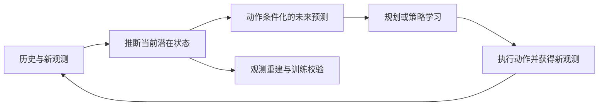

# 具身智能世界模型

世界模型把观测历史和动作转成对未来的预测。在具身智能中，预测需要服务动作选择、规划或策略学习。[[a-comprehensive-survey-on-world-models-for-embodied-ai|世界模型综述]] 用这一目标组织模型；静态场景表示、视频生成和机器人策略仍应按具体角色区分。

## 数学结构

机器人通常只能看到部分真实状态。令 $o_t$ 为观测，$a_t$ 为动作，$s_t$ 为不可完全观测的真实状态，$z_t$ 为学得的潜在状态，$\theta$ 与 $\phi$ 分别为生成模型和推断模型参数。典型潜在状态模型包含：

$$
\begin{aligned}
\text{动力学先验：}&\quad p_\theta(z_t\mid z_{t-1},a_{t-1}),\\
\text{近似滤波后验：}&\quad q_\phi(z_t\mid z_{t-1},a_{t-1},o_t),\\
\text{观测解码：}&\quad p_\theta(o_t\mid z_t).
\end{aligned}
$$

先验在没有未来观测时推进状态；后验结合新观测修正状态；解码器要求状态保留可解释观测的信息。$q_\phi$ 是近似后验，不是已经精确求出的贝叶斯后验。完整联合分布、证据下界（ELBO）和推导见 [[LatentStateSpaceModels|潜在状态空间模型]]。综述中的框架不是所有世界模型都必须采用的唯一结构。

## 直觉

学习时有真实观测，可以不断校正潜在状态；想象未来时没有这些观测，只能依赖模型自己的预测。这解释了为什么重建当前帧很好，不代表多步预测可靠。ELBO 的重建项保留观测信息，KL 项约束推断与动力学预测的一致性；具体权重的最优选择需要方法来源和实验支持。[[a-comprehensive-survey-on-world-models-for-embodied-ai|具身世界模型综述]]

```mermaid
flowchart LR
  A[历史与新观测] --> B[推断当前潜在状态]
  B --> C[动作条件化的未来预测]
  C --> D[规划或策略学习]
  B --> E[观测重建与训练校验]
  D --> F[执行动作并获得新观测]
  F --> A
```

图表达决策循环，不表示每个模型都显式执行在线规划。怎样生成未来、用什么状态表示，见 [[WorldModelTaxonomy|世界模型分类体系]]。

## 未来怎样进入决策

| 角色 | 未来预测如何被使用 | 当前证据 |
| --- | --- | --- |
| 在线规划 | 测试时预测候选动作的奖励或目标距离，再搜索并执行 | [[planet-learning-latent-dynamics|PlaNet]]、[[td-mpc2-scalable-robust-world-models|TD-MPC2]]、[[VisualGoalPlanning|DINO-WM 与 V-JEPA 2-AC]] |
| 想象策略学习 | 模型在训练时生成轨迹，演员和价值评估器学习；执行时直接出动作 | [[dreamerv3-mastering-diverse-control|DreamerV3]]、[[ImaginedPolicyLearning|算法机制]] |
| 视觉子目标生成器 | 将未来目标图像放进策略上下文 | [[pi07-steerable-generalist-robotic-foundation-model|π0.7]] |
| 动力学与动作预训练 | 用未来表示训练共享模型或动作表示 | [[lda-1b-scaling-latent-dynamics-action-model|LDA-1B]]、[[InverseDynamicsModels|Seer 与 DeFI]] |
| 学习仿真与策略评估 | 对给定策略动作预测观测，用于评估或策略后训练 | [[worldecho-worldsync-action-following|WorldEcho／WorldSync 的评测与限制]] |

这些角色可以组合，但不能互相替代证据。想象策略在执行时没有候选搜索；视觉目标规划不必学习逆动力学；视频仿真也未必提供物理引擎的接触力、状态回滚和硬约束接口。先确定模型在 [[RoboticsSimulationLoop|仿真与控制循环]] 中替代哪一步，再判断它是否足够准确。

### 规划和想象学习

[[ModelPredictiveControl|MPC]] 把计算留在每次决策：滚动预测、优化一段动作、执行首步并重规划。PlaNet 学奖励而不用价值网络；TD-MPC2 用短时域和终端价值；DINO-WM 与 V-JEPA 2-AC 用视觉特征距离指定目标。相比之下，[[ImaginedPolicyLearning|DreamerV3]] 用想象轨迹反复训练策略，将动作偏好压进参数。计算位置、训练信号和更换任务的接口因此不同，不能仅凭都预测未来就直接排成一个排行榜。

### 视觉子目标

π0.7 将当前观测 $o_t$、子任务语言 $\hat\ell_t$ 和元数据 $m$ 条件化为多视角视觉子目标 $g^\star$：

$$
g^\star\sim p_\psi(g^\star\mid o_t,\hat\ell_t,m).
$$

$\psi$ 为生成器参数。子目标进入 [[RobotContextConditioning|策略上下文]]，再由 [[VisionLanguageActionModels|VLA]] 预测动作；生成器本身不直接输出机器人控制量。评估要检查加入目标后是否改善闭环任务，而不只看图像。[[pi07-steerable-generalist-robotic-foundation-model|π0.7 论文]]

### 潜在动力学预训练

LDA-1B 在 DINO 视觉潜在空间联合建模未来表示与动作，并按数据类型分配策略、正向动力学、逆动力学和视觉预测目标。高质量示范、低质量轨迹与无动作视频承担不同作用；“更多数据”因此不等于“更多行为克隆样本”。机制见 [[LatentDynamicsActionModels|潜在动力学动作模型]]、[[RobotLearningObjectives|机器人学习目标：示范、回报与动力学]]，证据见 [[lda-1b-scaling-latent-dynamics-action-model|LDA-1B 论文]]。

## 失效情形

综述支持的风险包括多步误差累积、物理一致性不足、实时推理成本、不同任务数据与评测协议难以对齐，以及空间表示的细节／计算取舍。LDA-1B 另把冻结 DINO 视觉特征列为局限；不能据此假定其表示已覆盖触觉和力状态。[[a-comprehensive-survey-on-world-models-for-embodied-ai|具身世界模型综述]]、[[lda-1b-scaling-latent-dynamics-action-model|LDA-1B 论文]]

像素指标无法单独验证动作可控性和任务收益。WorldEcho 的近期预印本进一步显示，专家演示上的预测可能掩盖非专家动作的忽略与视觉崩坏；其结果受查询分布和训练预算限制，不是所有模型失效的普遍定理。如何拆开测量见 [[WorldModelEvaluation|世界模型评估]]。

## 实践含义

阅读一个新方法，先写清“观测什么、条件化什么动作、预测什么、未来怎样影响决策”。如果准备做 MPC，再检查候选动作预测与规划时限；如果做策略预训练，再检查目标路由、数据标签和动作落地。这是基于当前分类的阅读方法，不是模型效果保证。

学习顺序与小实验见 [[world-models-learning-path|世界模型学习路径]]；研究缺口集中在 [[research-questions|研究问题]]。
