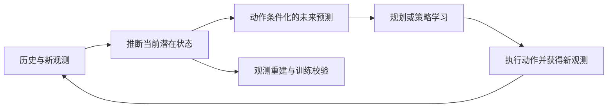

# 具身智能世界模型

世界模型学习环境的状态或观测如何变化；面向控制时，关键问题是预测是否以动作作为条件、又怎样服务动作选择、规划或策略学习。文献也把不接收动作的视频预测器称为世界模型，因此名称本身不能证明模型可用于模拟任意候选动作。[[a-comprehensive-survey-on-world-models-for-embodied-ai|世界模型综述]] 用这一目标组织模型；静态场景表示、视频生成和机器人策略仍应按具体角色区分。

## 数学结构

机器人通常只能看到部分真实状态。令 $o_t$ 为观测，$a_t$ 为动作，$s_t$ 为不可完全观测的真实状态，$z_t$ 为学得的潜在状态，$\theta$ 与 $\phi$ 分别为生成模型和推断模型参数。典型潜在状态模型包含：

$$
\begin{aligned}
\text{动力学先验：}&\quad p_\theta(z_t\mid z_{t-1},a_{t-1}),\\
\text{近似滤波后验：}&\quad q_\phi(z_t\mid z_{t-1},a_{t-1},o_t),\\
\text{观测解码：}&\quad p_\theta(o_t\mid z_t).
\end{aligned}
$$

先验在没有未来观测时推进状态；后验结合新观测修正状态；解码器要求状态保留可解释观测的信息。$q_\phi$ 是近似后验，不是已经精确求出的贝叶斯后验。完整联合分布、证据下界（ELBO）和推导见 [[LatentStateSpaceModels|潜在状态空间模型]]。综述中的框架不是所有世界模型都必须采用的唯一结构。

## 直觉

学习时有真实观测，可以不断校正潜在状态；想象未来时没有这些观测，只能依赖模型自己的预测。这解释了为什么重建当前帧很好，不代表多步预测可靠。ELBO 的重建项保留观测信息，KL 项约束推断与动力学预测的一致性；具体权重的最优选择需要方法来源和实验支持。[[a-comprehensive-survey-on-world-models-for-embodied-ai|具身世界模型综述]]

```mermaid
flowchart LR
  A[历史与新观测] --> B[推断当前潜在状态]
  B --> C[动作条件化的未来预测]
  C --> D[规划或策略学习]
  B --> E[观测重建与训练校验]
  D --> F[执行动作并获得新观测]
  F --> A
```

图表达决策循环，不表示每个模型都显式执行在线规划。怎样生成未来、用什么状态表示，见 [[WorldModelTaxonomy|世界模型分类体系]]。

**隐藏状态的教学例子。** 两个外观相同的杯子，一个空、一个装满水；单帧图像可能给出相近表示，同一个推力却产生不同运动。如果潜在状态只保存外观，转移模型会面对无法区分的两种后果。历史中“推过一次后移动多少”可以帮助推断重量相关信息，因此后验更新需要新观测；但没有足够激励或传感信息时，历史也无法保证辨识。

这个例子解释了为什么潜在状态应近似保留预测所需的信息，而非仅把当前图像压缩得漂亮；它是部分可观测机制的教学说明，不是综述单独做过的杯子实验。状态估计与模型假设见 [[LatentStateSpaceModels|潜在状态空间模型]]，实验如何区分感知和任务能力见 [[WorldModelEvaluation|世界模型评估]]。

## 未来怎样进入决策

预测模型与控制器之间主要有几种接口。在线规划在执行时比较候选动作的预测后果；想象策略学习在训练时用模型轨迹更新策略；未来条件策略把预测表示或视觉子目标输入动作网络；动力学辅助学习只把未来预测作为训练信号。它们可以组合，但不能互相替代效果证据。[[planet-learning-latent-dynamics|PlaNet]]、[[dreamerv3-mastering-diverse-control|DreamerV3]]、[[lda-1b-scaling-latent-dynamics-action-model|LDA-1B]]

机制分别见 [[ModelPredictiveControl|模型预测控制]]、[[ImaginedPolicyLearning|想象策略学习]]、[[VisualGoalPlanning|视觉目标规划]]、[[InverseDynamicsModels|逆动力学模型]]。具体算法比较集中在 [[topics/world-model-decision|世界模型决策专题]] 与 [[topics/future-conditioned-action|未来条件动作学习专题]]。

例如子目标生成可写成：

$$
g^\star\sim p_\psi(g^\star\mid o_t,\hat\ell_t,m),\qquad
A_t\sim\pi_\theta(A_t\mid O_t,g^\star,C_t).
$$

$o_t$ 是当前观测，$O_t$ 是历史，$\hat\ell_t$ 是子任务语言，$m$ 是元数据，$g^\star$ 是生成的目标图像，$C_t$ 是其他上下文，$A_t$ 是动作块；$\psi,\theta$ 分别为生成器和策略参数。该接口先生成期望结果再交给策略，不包含候选动作条件，因此不能据此声称生成器完成了物理前向模拟。π0.7 的实例见 [[pi07-steerable-generalist-robotic-foundation-model|来源页]]、[[RobotContextConditioning|上下文条件化]]。

若用视频模型替代仿真器，还必须检验策略动作是否真正影响预测、长时闭环是否稳定；它未必具备接触力、状态回滚和硬约束等物理引擎接口。[[worldecho-worldsync-action-following|WorldEcho／WorldSync]]、[[RoboticsSimulationLoop|仿真与控制循环]]

## 失效情形

综述支持的风险包括多步误差累积、物理一致性不足、实时推理成本、不同任务数据与评测协议难以对齐，以及空间表示的细节／计算取舍。LDA-1B 另把冻结 DINO 视觉特征列为局限；不能据此假定其表示已覆盖触觉和力状态。[[a-comprehensive-survey-on-world-models-for-embodied-ai|具身世界模型综述]]、[[lda-1b-scaling-latent-dynamics-action-model|LDA-1B 论文]]

像素指标无法单独验证动作可控性和任务收益。WorldEcho 的近期预印本进一步显示，专家演示上的预测可能掩盖非专家动作的忽略与视觉崩坏；其结果受查询分布和训练预算限制，不是所有模型失效的普遍定理。如何拆开测量见 [[WorldModelEvaluation|世界模型评估]]。

## 实践含义

阅读一个新方法，先写清“观测什么、条件化什么动作、预测什么、未来怎样影响决策”。如果准备做 MPC，再检查候选动作预测与规划时限；如果做策略预训练，再检查目标路由、数据标签和动作落地。这是基于当前分类的阅读方法，不是模型效果保证。

学习顺序与小实验见 [[world-models-learning-path|世界模型学习路径]]；研究缺口集中在 [[research-questions|研究问题]]。

## 研究归属

[[topics/world-models-and-representations|世界模型与表征]] · [[topics/planning-and-control|规划与控制]] · [[topics/robot-policy-learning|机器人策略学习]] · [[topics/world-model-decision|世界模型如何用于决策]] · [[topics/future-conditioned-action|未来预测怎样帮助动作学习]]。
