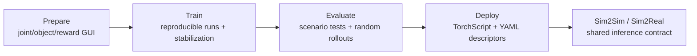

# AGILE

AGILE（A Generic Isaac-Lab based Engine）是一个 open-source humanoid RL workflow layer，构建在 Isaac Lab 与 RSL-RL 之上，用来把 robot/task configuration、training stabilization、evaluation metrics 和 deployment export 统一到同一个 lifecycle。它对应的 source 是 [[agile-a-comprehensive-workflow-for-humanoid-loco-manipulation-learning|AGILE: A Comprehensive Workflow for Humanoid Loco-Manipulation Learning]]，代码发布在 https://github.com/nvidia-isaac/WBC-AGILE。

AGILE 的重要性不在于替代 PPO、Isaac Lab 或 MuJoCo，而在于把容易出错的边界条件变成显式 contract。Joint axis、reward term、object contact、observation order、history buffer 和 action scaling 都是 humanoid RL 中常见的 silent failure sources；AGILE 用 pre-training GUIs、git/config snapshot、deterministic evaluation 和 descriptor-driven export 来减少这些错误进入 hardware trial。

## 组成

- Prepare：Joint Position GUI、Object Manipulation GUI、Reward Visualizer，用于训练前检查 robot model 与 MDP。
- Train：基于 RSL-RL 的 training loop、cloud/local runs、W&B logging、Docker orchestration、scaled-dict sweeps 和可开关 stabilization modules。
- Evaluate：Isaac Lab 与 MuJoCo 中共享 deterministic scenario tests、stochastic rollouts、RMS acceleration、jerk、joint-limit violations 和 HTML reports。
- Deploy：TorchScript policy 与 YAML I/O descriptor 记录 joint names、observation ordering、history buffers、action scaling，并支撑 Python/C++ inference。

## Evidence Boundary

Source 支持 AGILE 在 Unitree G1 与 Booster T1 上覆盖 locomotion、height control、stand-up、motion imitation 和 loco-manipulation/VLA simulation case。更广泛的 hardware families、perception-driven manipulation、running/stair climbing 和 quantitative real-world tracking metrics 仍是开放问题。

相关页面：[[HumanoidRLWorkflow]]、[[SimulationRealityGap]]、[[TaskGeneralistPolicyEvaluation]]、[[VisionLanguageActionModels]]、[[MuJoCo]]、[[NVIDIA]]。
