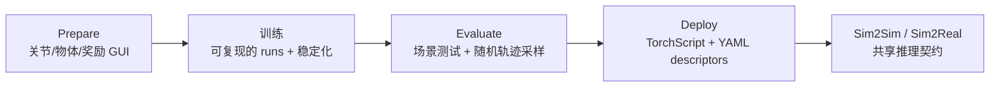

# AGILE

AGILE（A Generic Isaac-Lab 基于引擎）是一个开源人形机器人 RL 工作流层，构建在 Isaac Lab 与 RSL-RL 之上，用来把机器人/任务配置、训练稳定化、评估指标和部署导出统一到同一个生命周期。它对应的来源是 [[agile-a-comprehensive-workflow-for-humanoid-loco-manipulation-learning|AGILE: A Comprehensive Workflow for Humanoid Loco-Manipulation Learning]]，代码发布在 https://github.com/nvidia-isaac/WBC-AGILE。

AGILE 的重要性不在于替代 PPO、Isaac Lab 或 MuJoCo，而在于把容易出错的边界条件变成显式契约。关节轴、奖励 term、物体接触、观测顺序、历史缓冲区和动作规模扩展都是人形机器人 RL 中常见的静默失败来源；AGILE 用 pre-训练 GUIs、git/配置快照、确定性评估和描述文件驱动的导出来减少这些错误进入硬件试验。

## 组成

- Prepare：关节位置 GUI、物体操作 GUI、奖励可视化工具，用于训练前检查机器人模型与 MDP。
- 训练：基于 RSL-RL 的训练循环、点云或局部运行、W&B 日志记录、Docker 编排、缩放参数字典扫描和可开关的稳定化模块。
- Evaluate：Isaac Lab 与 MuJoCo 中共享确定性场景测试、随机轨迹采样、RMS 加速度、加加速度、关节限制 violations 和 HTML 报告。
- Deploy：TorchScript 策略与 YAML I/O 描述文件记录关节名称、观测顺序、历史缓冲区、动作规模扩展，并支撑 Python/C++ 推理。

## 证据边界

来源支持 AGILE 在 Unitree G1 与 Booster T1 上覆盖移动、height 控制、stand-up、运动模仿和移动操作/VLA 仿真情形。更广泛的硬件族、感知驱动的操作、running/stair climbing 和定量现实世界跟踪指标仍是开放问题。

相关页面：[[HumanoidRLWorkflow]]、[[SimulationRealityGap]]、[[TaskGeneralistPolicyEvaluation]]、[[VisionLanguageActionModels]]、[[MuJoCo]]、[[NVIDIA]]。
