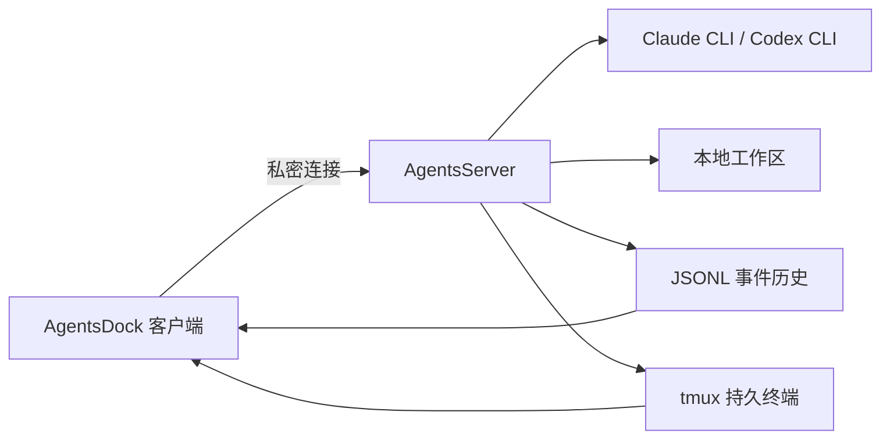

# AgentsDock

AgentsDock 是 [[AgentsServer]] 的配套客户端，提供多聊天与文件夹、队列和定时任务、富 Markdown/代码渲染、内联媒体、下载与拖出、代码审查、搜索、通知和每聊天持久终端。它本身不是云端服务：聊天体验在客户端，但实际执行发生在用户自己的 AgentsServer 主机上。

## 产品边界

- 客户端平台：macOS、iPhone、iPad、Linux；GitHub Releases 中还有 Windows 桌面安装包。
- Android 目前有独立 beta APK 发布线（`android-v0.1.1-beta.*`），尚未进入最新桌面/移动主版本。
- AgentsDock 通过私有 HTTP/WebSocket 连接本机或 Tailscale 网络内的 AgentsServer。
- 官方源码不在 `AgentsDock-Releases` 仓库中，该仓库只承载签名发布物与更新元数据。

## 工作方式

AgentsDock 通过 `/api` 管理会话、消息、文件、任务和终端，并通过 `/ws/sessions/{session_id}` 接收实时事件。它不直接持有 Claude/Codex 的 provider token；认证边界由 AgentsServer 的 bearer token 与 per-turn 权限文件共同控制。

## 实践含义

- 对个人开发者：可以把 Claude/Codex 工作流从终端搬到图形客户端，同时保持代码、文件和进程在本地。
- 对机器人/具身工作流：AgentsDock 可以作为本地 agent 开发控制台，结合 tmux 查看训练/仿真进程，并用定时任务把重复的仓库维护自动化。
- 对远程使用：推荐 Tailscale 而非公网暴露端口；移动端与桌面端共用同一个 AgentsServer token。

## 限制

- 当前知识库的来源主要是官方 README 与发布资产列表，不包含客户端源码。
- Android 发布线仍停留在 0.1.1 beta，能力与最新桌面版可能不同步。
- 没有第三方聊天服务作为执行依赖，但远程访问、认证和更新链路仍需按官方安全说明维护。

## 关联

- [[AgentsServer]] - 自托管执行后端。
- [[agentsdock-releases]] - AgentsDock 发布仓库来源页。
- [[agentsserver]] - AgentsServer 官方 README 来源页。
- [[Galbot]] - 用户当前在 Galbot 主机上安装 AgentsServer 的上下文。
