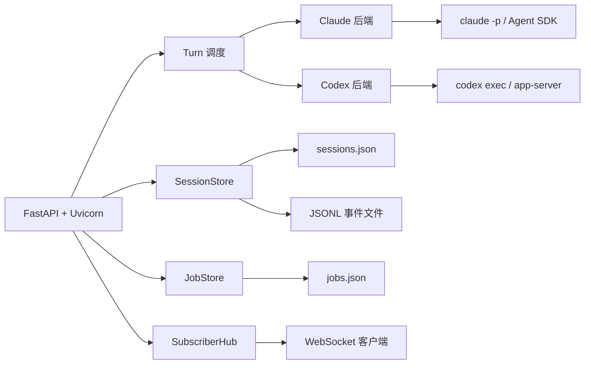

# AgentsServer

AgentsServer 是 AgentsDock 的自托管执行后端。它运行在拥有 Claude Code、Codex CLI、工作区和进程权限的机器上，把官方 CLI 包装成持久化、可远程访问、可自动化的 HTTP/WebSocket 服务。

## 核心职责

- 创建和恢复 Claude/Codex 聊天会话。
- 启动、排队、停止和 fork 每个聊天 turn。
- 把 Claude/Codex 事件标准化成 JSONL 历史，并通过 WebSocket 实时推送。
- 管理上传文件、生成产物、代码 diff、全历史搜索和每聊天工作区。
- 运行定时/循环任务，带主机负载与内存保护。
- 为每个聊天维护一个持久 tmux 终端。
- 提供签名托管更新、服务重启和 Team Hub 预览。

## 实现要点

- 技术栈：Python 3.10+、FastAPI、Uvicorn、Pydantic、`claude-agent-sdk`、`croniter`、SQLite。
- Claude 后端有两种路径：`claude -p` 兼容路径和基于 Agent SDK 的持久化交互路径。
- Codex 后端也有两种路径：`codex exec` JSONL 解析和 `codex app-server` JSON-RPC 多路复用。
- 每个 live provider turn 会获得私有的聊天作用域 Jobs/Publish/Cross-chat 权限，而不是继承主服务器 token。
- 状态默认保存在 `~/.agentsdock`，包括会话 JSON、事件 JSONL、文件、任务、搜索索引和 Team Hub 数据。

## 安装与运维

- 推荐安装：`git clone https://github.com/ZhengyiLuo/AgentsServer.git && cd AgentsServer && ./install.sh`
- 不需要 sudo，创建用户级 systemd/launchd 服务。
- 默认端口 `7850`，默认绑定 `0.0.0.0`。
- 安装完成会打印 `AGENTSDOCK_SETUP_RESULT`，包含 server URL、access token、service 和版本。
- 远程设备连接使用 `http://<tailscale-ip>:7850` 或局域网 IP，并配置同一个 token。
- 托管更新从 `AgentsDock-Releases` 下载，校验 Ed25519 签名和 SHA-256。

## 实践含义

- AgentsServer 适合作为个人/团队的本地 Agent 执行网关，把 Claude/Codex 能力开放给桌面和移动客户端。
- 定时任务可以用于自动维护知识库、运行测试、生成报告等重复工作。
- 由于执行发生在本机，私有代码和文件不需要上传到第三方聊天服务。
- 配合 Tailscale 可以形成私有远程开发环境，但不要直接把 `7850` 暴露到公网。

## 限制

- 不包含 Claude/Codex 模型本身；模型、认证和 provider 侧存储仍来自本机 CLI 配置。
- tmux 是可选依赖，缺失时只影响持久终端、tmux-pane 检查和托管更新中的自重启能力。
- Team Hub 仍是 preview，agent dispatch 和 wake-up 尚不可用。

## 关联

- [[AgentsDock]] - AgentsServer 的客户端前端。
- [[agentsserver]] - AgentsServer 官方 README 来源页。
- [[agentsdock-releases]] - AgentsDock 发布仓库来源页。
- [[Galbot]] - 用户安装 AgentsServer 的 Galbot 主机上下文。
