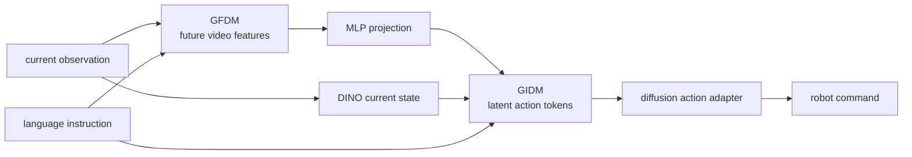

# DeFI

DeFI（Decoupled Forward and Inverse dynamics pretraining）是 [[disentangled-robot-learning-via-separate-forward-and-inverse-dynamics-pretraining|Disentangled Robot Learning via Separate Forward and Inverse Dynamics Pretraining]] 提出的 robot learning framework。它的核心不是把 video prediction、latent action 和 robot control 混在一个 VLA objective 中一起学，而是先分别预训练 visual forward dynamics 与 [[InverseDynamicsModels|inverse dynamics]]，再在 downstream robot data 上耦合微调。

## 模型结构

DeFI 有三个主要模块。GFDM 用 Stable Video Diffusion 作为 visual forward dynamics backbone，输入 current observation 与 instruction，输出 future video representations。GIDM 用 DINOv2 current/future features、T5 instruction embedding、spatial-temporal Transformer 和 VQ-VAE codebook，把 video transition 压成 discrete latent action tokens。Action adapter 是 diffusion transformer，把 GIDM 的 latent actions 转成 7D executable robot commands。

## Evidence from Source

在 CALVIN ABC-D multi-view benchmark 上，DeFI average task length 为 4.51；在 SimplerEnv-Fractal Google Robot visual matching 上平均成功率为 51.2%；在 real-world Franka Panda 8-task evaluation 上平均成功率为 81.3%。Ablation 显示 GIDM pretraining、VQ-VAE discretization 和 human video pretraining 都有正贡献：GIDM architecture 比 MLP/Transformer inverse model 更强，full decoupled pretraining 比只预训练其中一个 branch 更强。

论文同时给出 failure boundary：200 个 CALVIN failure 中 62% 来自 forward dynamics，例如 contact-rich 或 cluttered scenes 中 future hallucination；38% 来自 inverse dynamics，即 future prediction 准确但 latent-to-action inference 错误。

相关页面：[[InverseDynamicsModels]]、[[LatentDynamicsActionModels]]、[[VisionLanguageActionModels]]、[[WorldModelsForEmbodiedAI]]、[[SimulationRealityGap]]。
