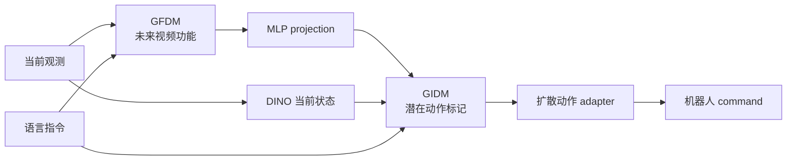

# DeFI

DeFI（解耦的正向与逆动力学预训练）是 [[disentangled-robot-learning-via-separate-forward-and-inverse-dynamics-pretraining|Disentangled Robot Learning via Separate Forward and Inverse Dynamics Pretraining]] 提出的机器人学习框架。它的核心不是把视频预测、潜在动作和机器人控制混在一个 VLA 目标中一起学，而是先分别预训练视觉正向动力学与 [[InverseDynamicsModels|逆动力学]]，再在下游机器人数据上耦合微调。

## 模型结构

DeFI 有三个主要模块。GFDM 用稳定的视频扩散作为视觉正向动力学主干网络，输入当前观测与指令，输出未来视频表征。GIDM 用 DINOv2 当前/未来特征、T5 指令嵌入、空间时间 Transformer 和 VQ-VAE 码本，把视频转移压成 discrete 潜在动作标记。动作 adapter 是扩散 transformer，把 GIDM 的潜在动作转成 7D 可执行的机器人命令。

```mermaid
flowchart LR
  O["当前观测"] --> G["GFDM<br/>未来视频功能"]
  L["语言指令"] --> G
  G --> P["MLP projection"]
  O --> D["DINO 当前状态"]
  P --> I["GIDM<br/>潜在动作标记"]
  D --> I
  L --> I
  I --> A["扩散动作 adapter"]
  A --> R["机器人 command"]
```

## 来源证据

在 CALVIN ABC-D 多视角基准上，DeFI 平均任务长度为 4.51；在 SimplerEnv-Fractal Google 机器人视觉匹配上平均成功率为 51.2%；在现实世界 Franka Panda 8-任务评估上平均成功率为 81.3%。消融显示 GIDM 预训练、VQ-VAE 离散化和人类视频预训练都有正贡献：GIDM 架构比 MLP/Transformer 逆模型更强，完整解耦的预训练比只预训练其中一个分支更强。

论文同时给出失败边界：200 个 CALVIN 失败中，62% 来自正向动力学，例如复杂接触或杂乱场景中对未来的错误想象；38% 来自逆动力学，即未来预测准确，但从潜在表征推断动作时出错。

相关页面：[[InverseDynamicsModels]]、[[LatentDynamicsActionModels]]、[[VisionLanguageActionModels]]、[[WorldModelsForEmbodiedAI]]、[[SimulationRealityGap]]。
