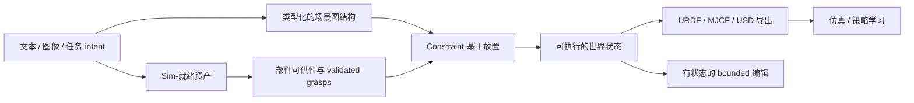

# EmbodiedGen

EmbodiedGen 是时域长度 Robotics 主导的生成式仿真基础设施与三维世界引擎。[[embodiedgen-towards-a-generative-3d-world-engine-for-embodied-intelligence|V1]] 以可用于仿真的资产工具包为中心，把图像/文本到三维、纹理、关节化物体、全景场景、物理属性恢复与 URDF 打包组合起来；[[embodiedgen-v2-an-agentic-simulation-ready-3d-world-engine-for-embodied-ai|V2]] 把核心单位升级为可执行的任务世界，用统一表示连接物体与场景语义、可供性、基于约束的布局、多房间生成、有状态自然语言编辑、跨仿真器导出与策略学习。

它不是物理引擎，也不是预测未来观测的学得的世界模型。它位于 [[RoboticsSimulationInfrastructure|仿真基础设施]] 的制作/compilation 层：把生成式模型输出、VLM 语义、几何处理和确定性求解器编译成物理后端可以消费的产物。其最重要的设计边界是“生成”与“验证”分离：LLM/VLM 提供 open-vocabulary 语义与候选属性，网格处理、碰撞分解、放置约束、抓取执行和仿真器沉降提供可执行性关卡。

## V1 到 V2

| 维度 | V1 | V2 |
| --- | --- | --- |
| 核心产物 | 资产 / 全景图场景 | 类型化的, 持久的任务世界 |
| 3D 后端 | 主要使用 TRELLIS | TRELLIS / SAM3D / Hunyuan3D 等可插拔的后端 |
| 碰撞 | geometry/watertight 检查 | 视觉/碰撞分离、CoACD、定量消融 |
| Interaction | 关节化的生成 | 部件语义、graspability、validated 6-DoF grasps |
| 布局 | 任务分解与交互式示例 | 显式场景图结构、BFS、支持/IoU/可达性、沉降 |
| 规模 | 单一房间全景图背景 | 多房间拓扑、traversability、可寻址的 instances |
| 编辑 | 单一-shot 生成 | 智能体–技能–harness 与原子性状态更新 |
| 证据 | 资产 QA 与定性 applications | 资产/世界/可供性消融实验与配套策略研究 |

## 实践含义

- 适合研究 open-vocabulary 资产生成、场景制作 automation、仿真数据规模扩展、环境 curriculum 与仿真到现实迁移基础设施。
- 不应把 VLM-estimated 物理属性当作真实测量，也不应把跨格式导出当作跨引擎动力学等价性。
- 评估 EmbodiedGen 时要分层报告资产验收、碰撞行为、可供性 yield、世界验收、生成成本、策略 trainability 与真实机器人迁移，不能用单一视觉指标代表全部。

相关页面：[[SimulationReady3DWorldGeneration]]、[[AgenticSceneTaskGeneration]]、[[CollisionGeometryForRobotSimulation]]、[[SimulationRealityGap]]、[[embodiedgen-v1-v2-learning-map]]。
