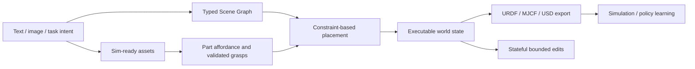

# EmbodiedGen

EmbodiedGen 是 Horizon Robotics 主导的 generative simulation infrastructure / 3D world engine。[[embodiedgen-towards-a-generative-3d-world-engine-for-embodied-intelligence|V1]] 以 sim-ready asset toolkit 为中心，把 image/text-to-3D、texture、articulated object、panorama scene、physical property recovery 与 URDF packaging 组合起来；[[embodiedgen-v2-an-agentic-simulation-ready-3d-world-engine-for-embodied-ai|V2]] 把中心单位升级为 executable task world，用统一 representation 连接 object/scene semantics、affordance、constraint-based layout、multi-room generation、stateful natural-language editing、cross-simulator export 与 policy learning。

它不是 physics engine，也不是预测未来 observation 的 learned world model。它位于 [[RoboticsSimulationInfrastructure|simulation infrastructure]] 的 authoring/compilation layer：把生成式模型输出、VLM semantics、geometry processing 和 deterministic solvers 编译成 physics backends 可以消费的 artifacts。其最重要的 design boundary 是“生成”与“验证”分离：LLM/VLM 提供 open-vocabulary semantics 与候选属性，mesh processing、collision decomposition、placement constraints、grasp execution 和 simulator settling 提供可执行性 gates。

## V1 到 V2

| 维度 | V1 | V2 |
| --- | --- | --- |
| 核心 artifact | asset / panorama scene | typed, persistent task world |
| 3D backend | 主要使用 TRELLIS | TRELLIS / SAM3D / Hunyuan3D 等 pluggable backends |
| Collision | geometry/watertight checks | visual/collision separation、CoACD、quantitative ablation |
| Interaction | articulated generation | part semantics、graspability、validated 6-DoF grasps |
| Layout | task decomposition 与 interactive examples | explicit Scene Graph、BFS、support/IoU/reachability、settling |
| Scale | single-room panorama background | multi-room topology、traversability、addressable instances |
| Editing | single-shot generation | agent–skill–harness 与 atomic state updates |
| Evidence | asset QA 与 qualitative applications | asset/world/affordance ablations 与 companion policy studies |

## 实践含义

- 适合研究 open-vocabulary asset generation、scene authoring automation、simulation data scaling、environment curriculum 与 sim-to-real infrastructure。
- 不应把 VLM-estimated physical properties 当作真实测量，也不应把 cross-format export 当作 cross-engine dynamics equivalence。
- 评估 EmbodiedGen 时要分层报告 asset acceptance、collision behavior、affordance yield、world acceptance、generation cost、policy trainability 与 real-robot transfer，不能用单一 visual metric 代表全部。

相关页面：[[SimulationReady3DWorldGeneration]]、[[AgenticSceneTaskGeneration]]、[[CollisionGeometryForRobotSimulation]]、[[SimulationRealityGap]]、[[embodiedgen-v1-v2-learning-map]]。
