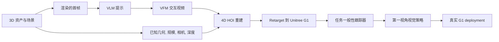

# GRAIL

GRAIL 是 "Generating 人形机器人移动操作从 3D 资产与视频先验" 中提出的人形机器人数据生成框架。它的目标是在不重建物理 scenes、不 teleoperate 机器人的情况下，从 3D 资产、仿真器就绪场景设置和视频基础模型先验生成机器人兼容的 4D 人类物体交互轨迹，再 retarget 到 Unitree G1 并训练通用任务跟踪器与第一视角视觉策略。

GRAIL 的关键不是直接让 VFM 生成机器人视频，而是先建立已知指标世界：物体几何、相机参数、指标规模、环境深度和机器人-proportioned 人类 character 都已知；VFM 只提供交互先验。随后系统做物体跟踪、人类运动估计和交互感知优化，把生成的视频约束回这个已知三维世界，降低深度歧义和形态 mismatch。

## 证据边界

当前知识库对 GRAIL 的覆盖范围来自 arXiv PDF v1。来源支持其流程结构、损失项、运行时 breakdown、失败过滤、训练细节、基准比较和 Unitree G1 现实世界成功比率。项目主页、代码、数据集发布和独立 replication 尚未收录；因此本页不把 GRAIL 的来源特有的成功直接推广成跨平台结论。

相关页面：[[grail-generating-humanoid-loco-manipulation-from-3d-assets-and-video-priors]]、[[AssetConditionedHOIGeneration]]、[[VisualSimToReal]]、[[SimulationRealityGap]]、[[TaskGeneralistPolicyEvaluation]]、[[NVIDIA]]。
