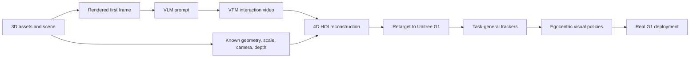

# GRAIL

GRAIL 是 "Generating Humanoid Loco-Manipulation from 3D Assets and Video Priors" 中提出的 humanoid data-generation framework。它的目标是在不重建 physical scenes、不 teleoperate robot 的情况下，从 3D assets、simulator-ready scene setup 和 video foundation model priors 生成 robot-compatible 4D human-object interaction trajectories，再 retarget 到 Unitree G1 并训练 task-general trackers 与 egocentric visual policies。

GRAIL 的关键不是直接让 VFM 生成 robot videos，而是先建立 known metric world：object geometry、camera parameters、metric scale、environment depth 和 robot-proportioned human character 都已知；VFM 只提供 interaction prior。随后系统做 object tracking、human motion estimation 和 interaction-aware optimization，把 generated video 约束回这个 known 3D world，降低 depth ambiguity 和 morphology mismatch。

## Evidence Boundary

当前 wiki 对 GRAIL 的 coverage 来自 arXiv PDF v1。Source 支持其 pipeline structure、losses、runtime breakdown、failure filtering、training details、benchmark comparisons 和 Unitree G1 real-world success rates。Project page、code、dataset release 和 independent replication 尚未 ingest；因此本页不把 GRAIL 的 source-specific success 直接推广成跨平台结论。

相关页面：[[grail-generating-humanoid-loco-manipulation-from-3d-assets-and-video-priors]]、[[AssetConditionedHOIGeneration]]、[[VisualSimToReal]]、[[SimulationRealityGap]]、[[TaskGeneralistPolicyEvaluation]]、[[NVIDIA]]。
