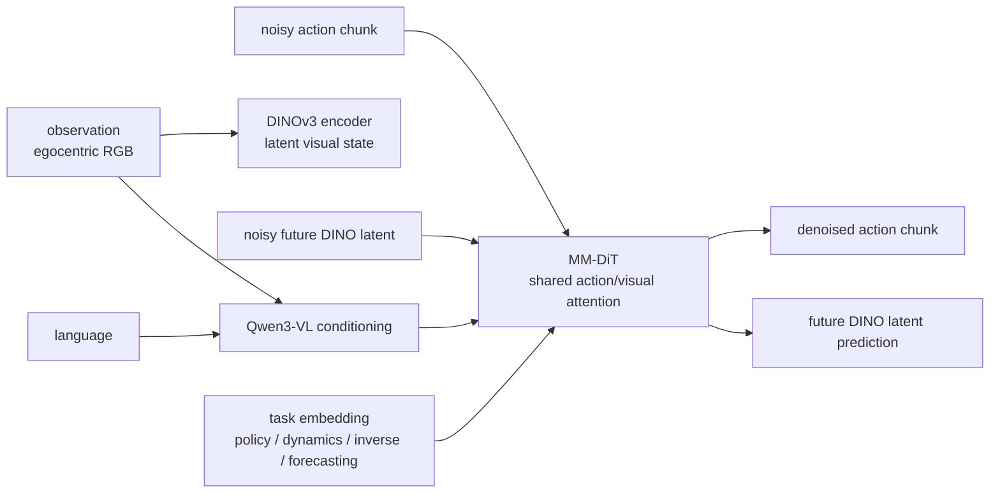

# LDA-1B

LDA-1B 是 [[lda-1b-scaling-latent-dynamics-action-model|LDA-1B: Scaling Latent Dynamics Action Model via Universal Embodied Data Ingestion]] 提出的 dynamics-centric robot foundation model。它把 policy learning、forward dynamics、inverse dynamics 和 visual forecasting 统一进一个 [[LatentDynamicsActionModels|Latent Dynamics Action Model]]，目标是在 heterogeneous embodied data 上学习可迁移的 interaction dynamics，而不是只做 expert behavior cloning。

## 模型结构

LDA-1B 的输入包含 current observation、language instruction、task/objective embedding 和 diffusion timestep。Observation/language 由 Qwen3-VL 编成 conditioning tokens；future visual state 用 DINOv3-ViT-s feature grid 表示；action chunk 和 future DINO latents 一起进入 MM-DiT（Multi-Modal Diffusion Transformer）做 denoising。模型保留 action/visual modality-specific projections 与 FFN，同时共享 self-attention，让 action tokens 和 visual tokens 可以交换 dynamics information。

论文有两个 parameter 口径：Fig. 1 把 LDA-1B 称为 1.6B-parameter model；Table I 的 trainable parameter 栏写 1B，并说明不计 frozen components。Pretraining 时 Qwen3-VL 和 DINO encoder frozen，MM-DiT 与 action encoder/decoder 被训练；finetuning 时 VLM 可以 unfreeze 做 target task adaptation。

## Evidence from Source

在 RoboCasa-GR1 benchmark 上，LDA-1B average success 为 55.4%，高于 GR00T-N1.6 47.6%、StarVLA 47.8%、reproduced GR00T-EI subset 51.3% 和 UWM-1B 19.3%。Ablation 强调 DINO latent 是关键：VAE latent + MM-DiT 的 UWM 为 20.0%，LDA-1B 为 55.4%。

Real-world experiments 使用 [[Galbot]] G1 与 Unitree G1。论文报告在 simple pick-and-place 上 LDA-1B 达到 80%-90% success；在 Clean the Rubbish 这种 long-horizon task 上 LDA-1B 为 35%，GR00T 和 π0.5 为 0%；在 Flip Bread high-DoF dexterous task 上 LDA-1B 为 90%，π0.5 为 10%。

相关页面：[[EI30K]]、[[LatentDynamicsActionModels]]、[[WorldModelsForEmbodiedAI]]、[[VisionLanguageActionModels]]、[[Galbot]]。
