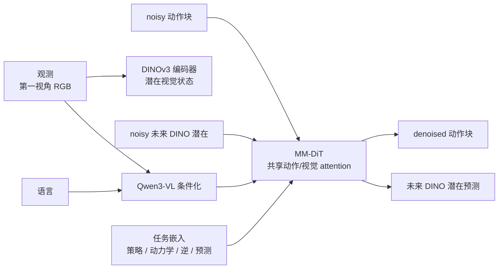

# LDA-1B

LDA-1B 是 [[lda-1b-scaling-latent-dynamics-action-model|LDA-1B: Scaling Latent Dynamics Action Model via Universal Embodied Data Ingestion]] 提出的动力学中心化机器人基础模型。它把策略学习、正向动力学、逆动力学和视觉预测统一进一个 [[LatentDynamicsActionModels|Latent 动力学动作模型]]，目标是在异构具身数据上学习可迁移的交互动力学，而不是只做专家行为克隆。

## 模型结构

LDA-1B 的输入包含当前观测、语言指令、任务/目标嵌入和扩散时间步。观测/语言由 Qwen3-VL 编成条件化标记；未来视觉状态用 DINOv3-ViT-s 特征 grid 表示；动作 chunk 和未来 DINO latents 一起进入 MM-DiT（多-Modal 扩散 Transformer）做 denoising。模型保留动作/视觉 modality-特定的 projections 与 FFN，同时共享 self-attention，让动作标记和视觉标记可以交换动力学信息。

论文有两个参数口径：Fig. 1 把 LDA-1B 称为 1.6B-参数模型；表格 I 的 trainable 参数栏写 1B，并说明不计冻结的组件。预训练时 Qwen3-VL 和 DINO 编码器冻结的，MM-DiT 与动作编码器/解码器被训练；finetuning 时 VLM 可以 unfreeze 做目标任务 adaptation。

```mermaid
flowchart LR
  O["观测<br/>第一视角 RGB"] --> V["Qwen3-VL 条件化"]
  L["语言"] --> V
  O --> D["DINOv3 编码器<br/>潜在视觉状态"]
  A["noisy 动作块"] --> M["MM-DiT<br/>共享动作/视觉 attention"]
  Z["noisy 未来 DINO 潜在"] --> M
  V --> M
  T["任务嵌入<br/>策略 / 动力学 / 逆 / 预测"] --> M
  M --> AO["denoised 动作块"]
  M --> ZO["未来 DINO 潜在预测"]
```

## 来源证据

在 RoboCasa-GR1 基准上，LDA-1B 平均成功为 55.4%，高于 GR00T-N1.6 47.6%、StarVLA 47.8%、reproduced GR00T-EI subset 51.3% 和 UWM-1B 19.3%。消融强调 DINO 潜在是关键：VAE 潜在 + MM-DiT 的 UWM 为 20.0%，LDA-1B 为 55.4%。

现实世界实验使用 [[Galbot]] G1 与 Unitree G1。论文报告在简单 pick-与-place 上 LDA-1B 达到 80%-90% 成功；在 Clean the Rubbish 这种长时域任务上 LDA-1B 为 35%，GR00T 和 π0.5 为 0%；在 Flip Bread 高-DoF 灵巧任务上 LDA-1B 为 90%，π0.5 为 10%。

相关页面：[[EI30K]]、[[LatentDynamicsActionModels]]、[[WorldModelsForEmbodiedAI]]、[[VisionLanguageActionModels]]、[[Galbot]]。
