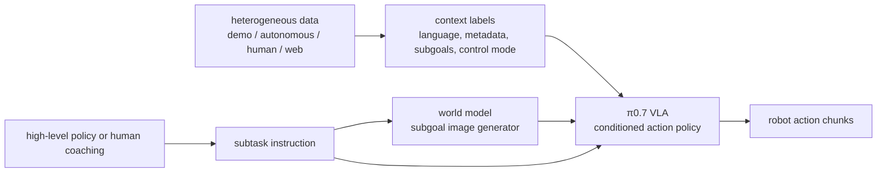

# π0.7

π0.7 是 [[PhysicalIntelligence|Physical Intelligence]] 在 [[pi07-steerable-generalist-robotic-foundation-model|π0.7: a Steerable Generalist Robotic Foundation Model with Emergent Capabilities]] 中提出的 steerable generalist robot foundation model。它属于 [[VisionLanguageActionModels|VLA（vision-language-action model）]] family：输入 multi-view observations、proprioception history 与 prompt/context，输出 continuous robot action chunks。

## 模型结构

π0.7 约 5B parameters：一个 4B Gemma3 VLM backbone，一个 MEM-style video history encoder，以及一个 860M-parameter flow-matching action expert。Observation $o_t=[I_t^1,\dots,I_t^n,q_t]$ 由最多四个 camera views 和 robot joint configuration $q_t$ 组成；action expert 预测 50-step action chunk $a_{t:t+H}$，runtime 只执行其中 $H'$ 个 steps 并持续异步刷新。

π0.7 的关键不是只换 backbone，而是扩展 context $C_t$：task instruction、subtask instruction、generated subgoal images、episode metadata 与 control mode 都可以进入 prompt。Training 时随机 dropout 这些 components，因此 test time 可以只给 language，也可以加 metadata、visual subgoals 或 human coaching。

## 机制角色

π0.7 把 large mixed robot dataset 的问题改写成 conditional modeling 问题。Failures、low-quality demonstrations、RL-trained policy rollouts、人类 egocentric video 和 web data 都可能有用，但前提是 context 让 model 知道当前 trajectory 是快/慢、好/坏、有/无 mistake、joint/ee control，以及 near-future visual state 应该是什么。

## Evidence from Source

论文报告 π0.7 在 dexterous in-distribution tasks 上可以 out-of-the-box 接近 task-specific specialists；在 unseen kitchens/bedrooms 中提升 instruction following；在 bimanual UR5e 上展示 cross-embodiment laundry folding；并能通过 language coaching 学习未收集 action demonstrations 的 appliance tasks。

这些 claims 需要按 source-specific evidence 使用：paper 的实验规模很大，但模型 weights、full data、independent reproduction 和 public benchmarks 并未在本 source 中提供。

相关页面：[[RobotContextConditioning]]、[[VisionLanguageActionModels]]、[[CompositionalGeneralizationInRobotics]]、[[WorldModelsForEmbodiedAI]]。
