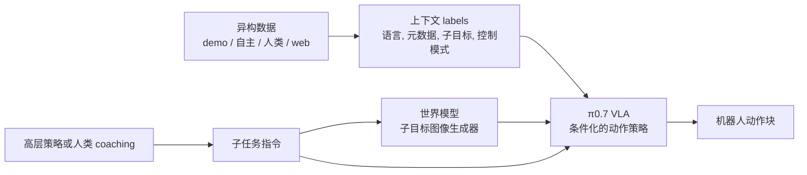

# π0.7

π0.7 是 [[PhysicalIntelligence|Physical Intelligence]] 在 [[pi07-steerable-generalist-robotic-foundation-model|π0.7: a Steerable Generalist Robotic Foundation Model with Emergent Capabilities]] 中提出的 steerable 通用型机器人基础模型。它属于 [[VisionLanguageActionModels|VLA（视觉语言动作模型）]] 族：输入多视角观测、本体感知历史与提示/上下文，输出 continuous 机器人动作 chunks。

## 模型结构

π0.7 约 5B 参数：一个 4B Gemma3 VLM 主干网络，一个 MEM-风格视频历史编码器，以及一个 860M-参数流程-匹配动作专家。观测 $o_t=[I_t^1,\dots,I_t^n,q_t]$ 由最多四个相机视图和机器人关节配置 $q_t$ 组成；动作专家预测 50-步骤动作 chunk $a_{t:t+H}$，运行时只执行其中 $H'$ 个步骤并持续异步刷新。

π0.7 的关键不是只换主干网络，而是扩展上下文 $C_t$：任务指令、子任务指令、生成的子目标图像、回合元数据与控制模式都可以进入提示。训练时随机 dropout 这些组件，因此测试时可以只给语言，也可以加元数据、视觉子目标或人类 coaching。

## 机制角色

π0.7 把大规模混合机器人数据集的问题改写成条件建模问题。失败、低质量示范、RL-trained 策略轨迹采样、人类第一视角视频和 web 数据都可能有用，但前提是上下文让模型知道当前轨迹是快/慢、好/坏、有/无错误、关节/ee 控制，以及 near-未来视觉状态应该是什么。

```mermaid
flowchart LR
  A["异构数据<br/>demo / 自主 / 人类 / web"] --> B["上下文 labels<br/>语言, 元数据, 子目标, 控制模式"]
  B --> C["π0.7 VLA<br/>条件化的动作策略"]
  D["高层策略或人类 coaching"] --> E["子任务指令"]
  E --> F["世界模型<br/>子目标图像生成器"]
  F --> C
  E --> C
  C --> G["机器人动作块"]
```

## 来源证据

论文报告 π0.7 在灵巧分布内任务上可以 out-的-the-盒体接近任务特定的 specialists；在未见的 kitchens/bedrooms 中提升指令 following；在 bimanual UR5e 上展示跨机器人形态 laundry folding；并能通过语言 coaching 学习未收集动作示范的 appliance 任务。

这些主张需要按来源特有的证据使用：论文的实验规模很大，但模型 weights、完整数据、独立 reproduction 和公开基准并未在本来源中提供。

相关页面：[[RobotContextConditioning]]、[[VisionLanguageActionModels]]、[[CompositionalGeneralizationInRobotics]]、[[WorldModelsForEmbodiedAI]]。
