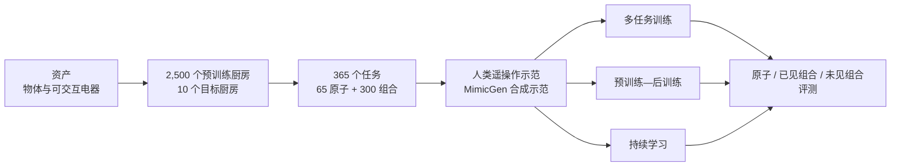

# RoboCasa365

RoboCasa365 是面向家庭厨房移动操作的仿真框架、机器人示范数据集和训练—评测基准。它建立在 RoboCasa、RoboSuite 与 [[MuJoCo]] 之上，不是一种单独的策略模型；其主要价值是把资产、场景、任务、数据和评测放进同一套可复现实验系统，用来研究通用机器人策略怎样从大量任务与环境中学习。

## 关键结构

- 任务：365 个厨房任务，覆盖 60 类活动；65 个原子任务，300 个组合任务，其中 220 个需要移动操作。
- 场景：50 种布局与 50 种风格组合出 2,500 个预训练厨房；另有 10 个目标厨房。
- 数据：612 小时人类示范与 1,615 小时 MimicGen 合成示范；每条数据包含语言指令、本体状态、三个相机视角和动作。
- 机器人：Franka Panda 机械臂与 Omron 全向移动底盘；12 维动作空间，20 Hz 控制。
- 评测：比较 Diffusion Policy、π0、π0.5 和 GR00T N1.5，并研究数据量、任务/场景多样性、训练阶段、持续学习、输入扰动和仿真加真实数据训练。

## 研究意义

RoboCasa365 为 [[RobotLearningDataComposition|机器人学习数据构成]] 提供了受控证据：扩大任务覆盖和场景覆盖能改善下游泛化，但加入数量更大的混合质量合成数据不保证提高成功率。它也为 [[CompositionalGeneralizationInRobotics|组合泛化]] 暴露了清晰差距：原子任务明显容易，已见组合任务困难，未见组合任务更困难；长时域错误累积仍是当前 VLA 策略的主要瓶颈。

与 [[RoboLab]] 相比，RoboCasa365 更强调“生成训练数据 + 训练策略 + 系统评测”的一体化规模实验；RoboLab 更强调对现成策略做语言、物体、场景与扰动诊断。两者都属于 [[TaskGeneralistPolicyEvaluation|通用任务策略评估]]，但测量目的不同。

## 证据边界

论文证据主要来自发布方在 RoboCasa365 上的实验。真实验证只有四个固定任务，且使用真实示范、相机对齐和仿真—真实联合微调；因此不能把仿真成功率或这组真实结果直接外推到开放家庭环境、不同机器人形态或纯仿真零样本部署。框架目前也集中于厨房、刚体和视觉操作，不能代表可变形物体、触觉、精细力控制与完整家庭场景。
