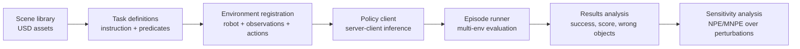

# RoboLab

RoboLab 是 [[NVIDIA]] 发布的 high-fidelity simulation benchmark/platform，用于分析 task-generalist robot policies 的 manipulation generalization、language grounding、robustness 和 environment sensitivity。它不是一个单一 model，而是一套 task library + Isaac Lab environment generation + policy client + results analysis framework。

RoboLab 的关键设计是 separation of concerns：task file 只描述 scene、instruction、termination/subtask logic 和 contact objects；environment registration 再选择 robot embodiment、camera layout、lighting/background、action space 和 observation schema；policy 作为外部 server 接入。这使同一 benchmark 可以比较不同 [[VisionLanguageActionModels|VLA policies]]，也可以测试 same task 在不同 embodiment 或 observation setup 下的表现。

RoboLab-120 的 evaluation target 不是训练一个 policy，而是暴露 policy gaps。官方 project page 报告，π0.5 在 default instructions 下 overall success 为 23.3%，complex tasks default success 为 11.7%，而其他 evaluated policies 更低。Paper 还用 6 个 selected simple tasks 做 real/sim verification：π0.5 与 π0-FAST 的 real/sim success trend 接近，但 π0 是 outlier。这些结果把当前 robot foundation models 的问题具体化为 wrong-object grasps、language specificity sensitivity、visual/geometric bias、controlled perturbation sensitivity 和 policy-specific sim-to-real mismatch。

## 实践含义

- 对 robot policy work：RoboLab 提供一种比单任务 demo 更可诊断的 evaluation harness，可以按 task attributes、instruction variants 和 wrong-object errors 分解失败。
- 对 simulation work：RoboLab 把 [[SimulationRealityGap|sim-to-real]] 问题从“仿真是否真实”转成“哪些 perturbations 会显著改变 policy outcome”。
- 对 dataset/model work：DROID-style real-world data training 并不自动带来 robust task generalization；RoboLab 通过低 overlap tasks 与 language variants 检验 dataset coverage。

## 限制

RoboLab 的 evidence 仍主要是 official paper/project/repo。Benchmark leaderboard 还未成熟，community submissions 尚未开放；paper 自身也限制 scope 到 rigid-body tabletop scenes，不充分覆盖 deformables、force-control-heavy contact skills 和 complex frictional dynamics。因此当前更适合作为 methodology 与 diagnostic benchmark 来理解，而不是作为长期稳定 ranking。
