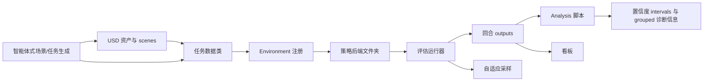

# RoboLab

RoboLab 是 [[NVIDIA]] 发布的高保真度仿真基准/平台，用于分析任务通用型机器人策略的操作泛化、语言语义落地、鲁棒性和环境敏感性。它不是一个单一模型，而是一套任务库 + Isaac Lab 环境生成 + 策略后端 + 评估运行器 + 分析/看板框架。2026-06 代码仓库更新显示 RoboLab 正从论文产物扩展为更完整的局部基准平台：策略后端文件夹、自适应采样、置信区间报告、看板、诊断测试和智能体式场景/任务生成都成为代码仓库设计表面。

```mermaid
flowchart LR
  A[USD 资产与 scenes] --> B[任务数据类]
  B --> C[Environment 注册]
  C --> D[策略后端文件夹]
  D --> E[评估运行器]
  E --> F[回合 outputs]
  F --> G[Analysis 脚本]
  F --> H[看板]
  E --> I[自适应采样]
  G --> J[置信度 intervals 与 grouped 诊断信息]
  K[智能体式场景/任务生成] --> A
  K --> B
```

RoboLab 的关键设计是关注点分离：任务文件只描述场景、指令、终止/子任务逻辑和接触物体；环境注册再选择机器人形态、相机布局、光照/背景、动作空间和观测结构规范；策略作为外部服务接入，并通过各后端的客户端与运行脚本统一进入评估运行器。这使同一基准既能比较不同 [[VisionLanguageActionModels|VLA 策略]] 和世界动作模型，也能测试同一任务在不同机器人形态、观测设置或受控扰动下的表现。

RoboLab-120 的评估目标不是训练一个策略，而是暴露策略 gaps。官方项目主页报告，π0.5 在默认指令下总体成功为 23.3%，复杂的任务默认成功为 11.7%，而其他 evaluated 策略更低。论文还用 6 个 selected 简单任务做真实/仿真验证：π0.5 与 π0-快速的真实/仿真成功趋势接近，但 π0 是 outlier。这些结果把当前机器人基础模型的问题具体化为 wrong-物体 grasps、语言 specificity 敏感性、视觉/几何偏差、受控的 perturbation 敏感性和策略特定的仿真到现实迁移 mismatch。

## 实践含义

- 对机器人策略工作：RoboLab 提供一种比单任务 demo 更可诊断的评估 harness，可以按任务属性、指令变体、wrong-物体误差、轨迹指标、置信区间和看板回合重放分解失败。
- 对仿真工作：RoboLab 把 [[SimulationRealityGap|仿真到现实迁移]] 问题从“仿真是否真实”转成“哪些 perturbations 会显著改变策略 outcome”，并用 [[SimulationSensitivityAnalysis|敏感性 analysis]] 与 [[SimulationBenchmarkReportingPipeline|报告流程]] 保留诊断证据。
- 对数据集/模型工作：DROID-风格现实世界数据训练并不自动带来 robust 任务泛化；RoboLab 通过低重叠任务、语言变体、策略后端 adapters 和自适应回合采样检验数据集覆盖范围。
- 对基准制作：RoboLab 的 `/robolab-scenegen` 与 `/robolab-taskgen` 把场景/任务扩展写成 [[AgenticSceneTaskGeneration|LLM 辅助的制作流程]]，但生成的任务仍需要判定条件、元数据和仿真验证约束。

## 限制

RoboLab 的证据仍主要是官方论文/项目/代码仓库。Leaderboard 与 community submissions 的长期治理仍在演化；论文自身也限制范围到刚性机体 tabletop scenes，不充分覆盖 deformables、力控制-密集型接触技能和复杂的摩擦动力学。因此当前更适合作为 methodology 与诊断基准来理解，而不是作为长期稳定 ranking。代码仓库更新中大量资产 `_wip` removal 属于 curation churn，不应直接解读为基准 capability 的理论变化。
