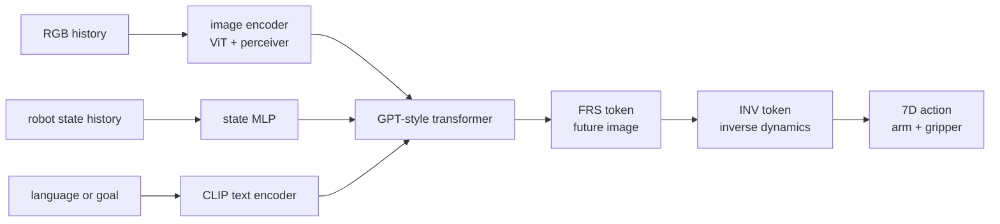

# Seer

Seer 是 [[predictive-inverse-dynamics-models-are-scalable-learners-for-robotic-manipulation|Predictive Inverse Dynamics Models are Scalable Learners for Robotic Manipulation]] 中实现的 end-to-end PIDM（Predictive Inverse Dynamics Model）。它把 conditional visual foresight 和 [[InverseDynamicsModels|inverse dynamics prediction]] 放进同一个 Transformer policy：用 [FRS] token 预测 future RGB image，用 [INV] token 在 attend 到 [FRS] 的基础上预测 intermediate action sequence。

## 模型结构

Seer 输入 language instruction、multi-view RGB images 和 robot state。Image 由 MAE-pretrained ViT 编码并经 Perceiver Resampler 压缩；language 用 CLIP ViT-B/32 text encoder；robot state 用 MLP。GPT-2-style Transformer backbone 中的 [FRS] token 负责 future image latent，[INV] token 负责 action latent，并通过 unidirectional attention attend 到 [FRS]。

## Evidence from Source

LIBERO-LONG 中，Seer 平均成功率为 87.7%；CALVIN ABC-D 中，Seer-Large average length 为 4.28。Real-world Franka tasks 中，Seer 平均成功率/score 为 78.4% / 39.5，高于 scratch、MVP、MPI 和 OpenVLA baselines。Ablation 显示 $L_{\mathrm{fore}}$ 与 $L_{\mathrm{inv}}$ 同时用于 pretraining/finetuning 优于只做 future image prediction 或 vanilla BC。

相关页面：[[InverseDynamicsModels]]、[[VisionLanguageActionModels]]、[[LatentDynamicsActionModels]]、[[DeFI]]、[[WorldModelsForEmbodiedAI]]。
