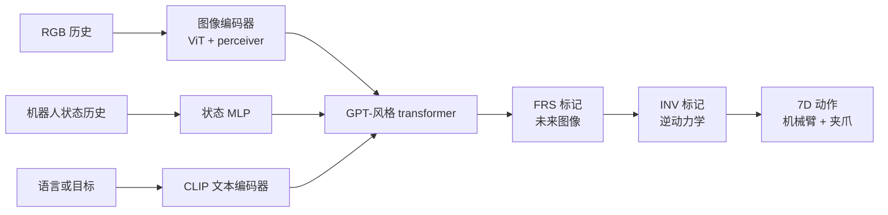

# Seer

Seer 是 [[predictive-inverse-dynamics-models-are-scalable-learners-for-robotic-manipulation|Predictive Inverse Dynamics Models are Scalable Learners for Robotic Manipulation]] 中实现的端到端 PIDM（预测式逆动力学模型）。它把条件视觉前瞻预测和 [[InverseDynamicsModels|逆动力学预测]] 放进同一个 Transformer 策略：用 [FRS] 标记预测未来 RGB 图像，用 [INV] 标记在关注到 [FRS] 的基础上预测中间动作序列。

## 模型结构

Seer 输入语言指令、多视角 RGB 图像和机器人状态。图像由 MAE-pretrained ViT 编码并经 Perceiver Resampler 压缩；语言用截断 ViT-B/32 文本编码器；机器人状态用 MLP。GPT-2-风格 Transformer 主干网络中的 [FRS] 标记负责未来图像潜在，[INV] 标记负责动作潜在，并通过 unidirectional attention 关注到 [FRS]。

```mermaid
flowchart LR
  O["RGB 历史"] --> E["图像编码器<br/>ViT + perceiver"]
  S["机器人状态历史"] --> M["状态 MLP"]
  L["语言或目标"] --> T["CLIP 文本编码器"]
  E --> B["GPT-风格 transformer"]
  M --> B
  T --> B
  B --> F["FRS 标记<br/>未来图像"]
  F --> I["INV 标记<br/>逆动力学"]
  I --> A["7D 动作<br/>机械臂 + 夹爪"]
```

## 来源证据

LIBERO-LONG 中，Seer 平均成功率为 87.7%；CALVIN ABC-D 中，Seer-大规模平均长度为 4.28。现实世界 Franka 任务中，Seer 平均成功率/得分为 78.4% / 39.5，高于 scratch、MVP、MPI 和 OpenVLA 基线。消融显示 $L_{\mathrm{fore}}$ 与 $L_{\mathrm{inv}}$ 同时用于预训练/finetuning 优于只做未来图像预测或 vanilla BC。

相关页面：[[InverseDynamicsModels]]、[[VisionLanguageActionModels]]、[[LatentDynamicsActionModels]]、[[DeFI]]、[[WorldModelsForEmbodiedAI]]。
