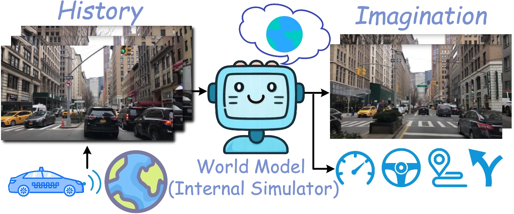
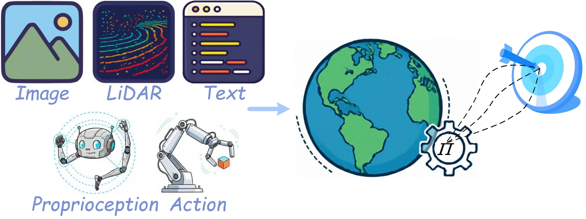
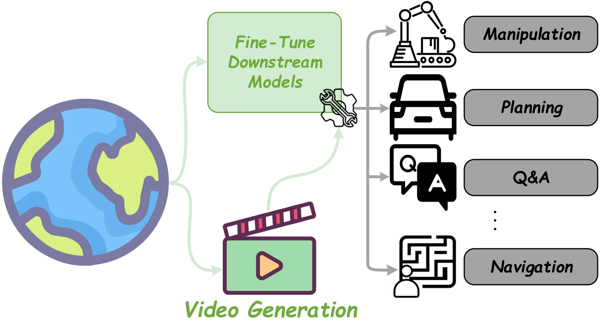

# 具身世界模型综述：分类、评估与比较边界

## 一屏概览

**研究问题。** 从潜在动力学、视频生成到三维场景预测，哪些系统被称为世界模型，它们怎样帮助具身智能，又应当怎样评估？

**主要贡献。** 综述按功能、时间预测方式、空间表示三个维度组织文献，并汇总数据资源、评估指标与若干基准结果。它提供检索地图和比较问题，**没有提出新控制算法，也没有在统一训练条件下重新实验或消融这些方法**。（§1、3–5，表 I–VIII）

**结论范围。** 论文支持“世界模型不能只用生成画质衡量，必须联系状态预测和任务效用”的评估框架。表格来自不同原论文；分辨率、输入、监督、任务集合与训练预算不同，不能读成统一排行榜。

原文：[arXiv](https://arxiv.org/abs/2510.16732) · [全文 HTML](https://ar5iv.labs.arxiv.org/html/2510.16732)。本页完整阅读归档 HTML 及阅读缓存。元数据沿用原登记日期 `2025-11-29`，但 HTML 页脚显示生成于 2025-11-05，未显示明确版本号；因此本次仅核验本地快照，不据登记日期声称读到了某个更新版本。

## 世界模型的共同问题与一种数学实现

论文把世界模型理解为学习环境变化、支持预测和决策的内部模型。但覆盖范围较宽：既包括接收动作并为控制服务的动力学，也包括尚未具备动作接口的视频或表征模型。**“能预测视频”与“能预测我采取某个动作的后果”是不同能力。**（§1、3）

原文图1子图：世界模型核心概念。[查看原始来源](https://arxiv.org/pdf/2510.16732)

在部分可观测环境中，真实状态 $s_t$ 通常不可直接访问；智能体获得观测 $o_t$ 并执行动作 $a_t$。一种做法是用潜在状态 $z_t$ 汇总相关历史，学习：

$$
p_\theta(z_t\mid z_{t-1},a_{t-1}),\qquad
q_\phi(z_t\mid z_{t-1},a_{t-1},o_t),\qquad
p_\theta(o_t\mid z_t).
$$

三项依次是预测先验、看到新观测后的后验更新、观测解码器。假设 $z_t$ 足够表达与未来有关的历史，模型才能在没有新观测时递推想象。训练时后验可以利用真实观测校正潜在状态，执行想象时则只能依赖先验；这种差异是长时预测误差的重要来源。（§2.2；具体机制见 [[LatentStateSpaceModels|潜在状态空间模型]]）

§2.2 用证据下界把“解释观测”和“预测潜在转移”联系起来：重建项保留与观测有关的信息，KL 项约束有观测时的推断与无观测时的预测相容。完整联合分布、初始状态项和逐步条件期望的推导集中在 [[LatentStateSpaceModels|潜在状态空间模型]]。这适用于相应的潜变量生成模型，**不是所有世界模型必须采用的训练目标**；联合嵌入预测、直接特征回归和 [[FlowMatching|流匹配]] 是不同选择。

## 三个分类维度应怎样使用

| 维度 | 原文分类 | 阅读时应追问 |
| --- | --- | --- |
| 功能 | 决策耦合／通用模型 | 是否输入动作？怎样连接策略、规划或价值估计？ |
| 时间 | 序列模拟与推理／整体差异预测（原文 Global Difference Prediction） | 是逐步递推还是联合预测多个未来位置？训练因子分解和执行方式是否一致？ |
| 空间 | 全局向量／特征令牌序列／空间潜在网格／分解式可渲染表示 | 哪些空间结构被保留？是否需要几何监督、相机信息或渲染？ |

原文图1子图：世界模型与决策。[查看原始来源](https://arxiv.org/pdf/2510.16732)

原文图1子图：通用世界模型。[查看原始来源](https://arxiv.org/pdf/2510.16732)

分类来自 §3、表 I。“整体差异预测”是该综述的组织术语；本库不把它当成跨文献统一定义。一个模型可以联合训练未来片段、再滚动执行；令牌也可以是连续特征，不能看到 Transformer 或 token 就推断使用离散码本。

例如，表 I 把 Dreamer／PlaNet 归到决策耦合、序列预测、全局潜在向量；DINO-WM 被归到决策耦合、序列预测、空间潜在网格。分类有助于定位阅读，**具体模型的输入、损失和控制接口仍以该模型原论文为准**。机制词汇见 [[WorldModelTaxonomy|世界模型分类]]，整体关系见 [[WorldModelsForEmbodiedAI|具身世界模型]]。

**怎样把分类用于一个具体问题。** 以“机器人从不同位置推杯子”为教学例子：若模型输入候选末端动作、输出未来状态，就可以进一步问能否用它比较动作；若模型只根据“杯子移到右侧”的文字生成图像，则它提供期望结果，动作可行性还需其他模块处理。前者可用全局向量，也可用图像块网格；后者同样可以逐帧生成或整段生成。这样分别记录用途、时间和空间三个轴，比把“用了 Transformer”当成算法类别更有解释力。例子是基于 §3 的分类练习，不是综述里的新实验。

## 评估：画面、状态与任务不是同一件事

§4.1 将资源区分为仿真平台、交互式基准、离线数据和真实硬件；这四类资源提供的证据不同。只在固定离线轨迹上预测准确，不等于闭环控制时能处理自己造成的新状态。

| 评估层次 | 综述涉及的指标 | 能支持什么，以及不能替代什么 |
| --- | --- | --- |
| 感知／生成 | FID、FVD、PSNR、SSIM、LPIPS、VBench | 衡量特征分布、重建或视频质量；FID／FVD 不是物理一致性证明 |
| 状态／几何 | mIoU、mAP、ADE／FDE、Chamfer 距离 | 衡量占据、检测、轨迹或几何误差；要核对坐标、时域、类别和监督 |
| 任务／控制 | 成功率、累计奖励、样本效率、碰撞率 | 衡量指定协议中的任务效用；要核对闭环、重试、计时和成功定义 |

表中的解释依据 §4.2。FID 比较 Inception 特征分布，FVD 使用视频特征；即便分数好，也不能单独证明接触、质量或摩擦推演正确。成功率也必须回到各论文协议，不能把连续任务长度、进度分数和完成事件比例合并。详见 [[WorldModelEvaluation|World Model 评测]]。

## 原文比较表的可比性审查

本文没有自己的新实验或消融。下面审查的是其二次汇总表格的证据条件。

| 原文位置 | 汇总对象 | 需要保留的条件 |
| --- | --- | --- |
| §5.1，表 IV | nuScenes 视频生成的 FID／FVD | 图像分辨率和生成设定不同；不能由某个最小数值推出总体最优 |
| §5.2，表 V | Occ3D-nuScenes：约 2 秒历史预测 3 秒未来占据 | 占据／相机输入不同；辅助监督不同；真实自车轨迹与预测轨迹不同 |
| §5.3，表 VI | DeepMind Control 的累计奖励 | 训练交互预算约 50 万至 500 万不等，任务数约 3 至 20 不等；部分值据曲线估读 |
| §5.3，表 VII | RLBench 操作任务 | 示范数量、图像大小、深度输入及任务集合不同；不同任务集合的平均值不可直接排序 |
| §5.4，表 VIII | nuScenes 规划轨迹误差与碰撞指标 | 基于既定历史的开环预测；不能自动转成真实驾驶的闭环安全结论 |

**原文内部不一致。** §5.2 文字称使用真实自车轨迹的 COME 在平均 mIoU 和各时域 IoU 都最佳；但表 V 中 COME-O（GT）平均 mIoU 为 34.23、平均 IoU 为 44.13，而 DTT-O 为 30.85、74.58。DTT-O 的 1／2／3 秒 IoU 也均高于该 COME-O 行。因此只能保留表中分指标结果，不能沿用“两个指标全面最佳”的文字结论；这里已核对原始 HTML 表格，冲突不是 Markdown 提取造成的。

## 局限与我们的解释

**论文自己提出的问题。** §6 讨论数据与评估尚不统一、计算与控制延迟、长时一致性、记忆和真实环境迁移。它们是综述归纳的挑战与研究方向，不是同一实验中验证过的因果结论。

**本页证据边界。** 本次完整复核这份综述，没有顺带完整核验其每一篇参考文献。表 I 的分类、表 III 的资源统计和表 IV–VIII 的结果都应理解为综述转述；需要用某一方法支撑具体技术判断时，应回到对应来源页。

**我们的解释。** 这篇论文最适合用来检查阅读是否遗漏“控制接口、表示、时间结构、评价条件”四类问题。它不足以给出一条从视觉生成规模直接推到机器人可靠性的证据链。仿真迁移和物理一致性的进一步机制分别见 [[SimulationRealityGap|仿真现实差距]]、[[DifferentiablePhysics|Differentiable Physics]]；文献线索见 [[awesome-world-models|世界模型资料索引]]，该索引本身不能代替原文证据。

## 研究归属

[[topics/world-models-and-representations|World Models]] · [[topics/evaluation-and-transfer|评测与 Sim-to-Real]] · [[topics/world-model-evaluation|World Model 评测]]。
