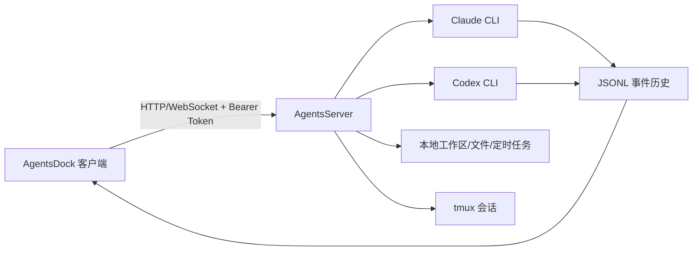

## 摘要

`ZhengyiLuo/AgentsServer` 是 AgentsDock 的自托管执行后端。它运行在拥有工作区、Claude Code 安装和 Codex CLI 的机器上，对外暴露经过认证的 HTTP/WebSocket API，并把 Claude/Codex 的标准化事件、文件、视频、上传、定时任务、进程检查和持久 tmux 终端流式传给 AgentsDock 客户端。

官方 README 明确：AgentsServer 不打包 Claude 或 Codex，而是调用本机已安装的 CLI 工具；私有项目文件不会通过第三方聊天服务转发。

来源网址: https://github.com/ZhengyiLuo/AgentsServer

## 核心主张

- AgentsServer 是本地/自托管后端，AgentsDock 是前端客户端。
- 支持 Claude 与 Codex 两种后端，通过本机 CLI 执行。
- 事件流以 JSONL 历史落盘，并通过 WebSocket 实时推送。
- 支持持久聊天、队列 turn、停止、fork、上下文摘要、历史导入、定时任务、文件/视频产物、进程检查与每聊天持久 tmux 终端。
- 安装不依赖 sudo，使用 `uv` 建立用户级服务；Linux 使用 systemd user service，macOS 使用 LaunchAgent。
- 远程访问推荐 Tailscale，不推荐把默认 `7850` 端口直接暴露公网。
- 托管更新从 AgentsDock-Releases 下载发布包，校验 Ed25519 签名与 SHA-256。
- Team Hub 是同一进程内的预览能力，拥有独立凭据与授权边界。

## 关键引文

- "AgentsServer is the self-hosted execution backend for AgentsDock."
- "AgentsServer does not bundle Claude or Codex. It shells out to the CLI tools that are already installed on the agent host."
- "Do not expose port 7850 directly to the public internet."

## 设计面分解

## 关联

- [[AgentsDock]] - AgentsServer 对应的前端客户端实体。
- [[AgentsServer]] - 自托管执行后端实体页。
- [[agentsdock-releases]] - AgentsDock 桌面发布仓库来源页。

## 开放问题

- Android 客户端是否会跟进到 AgentsServer 的完整能力，例如持久 tmux、定时任务与 Team Hub？
- Team Hub 从 preview 走向正式版后，是否仍保持与 AgentsServer bearer 完全分离的授权边界？
