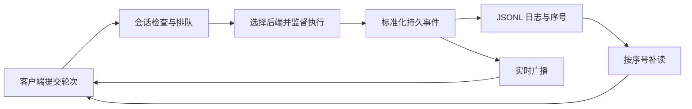

# AgentsServer：把远程会话接到本机智能体执行环境

AgentsServer 是 AgentsDock 的自托管后端：客户端负责呈现会话，服务器持有工作区、会话状态与已安装的智能体工具，并管理每轮请求的接收、执行和事件记录。它不是把聊天界面直接连到一个模型 HTTP 接口；模型访问、工具执行和账户认证仍由所选后端及其配置承担。[官方仓库](https://github.com/ZhengyiLuo/AgentsServer)

官方仓库配图。[查看原始来源](https://raw.githubusercontent.com/ZhengyiLuo/AgentsServer/bcb250eb5fab8678d41dc23489427f013305b57d/assets/agentsdock-preview.png)

本页从原先的 README 摘要补充为**固定提交的部分源码核查**。代码版本是 [`bcb250eb5fab8678d41dc23489427f013305b57d`](https://github.com/ZhengyiLuo/AgentsServer/tree/bcb250eb5fab8678d41dc23489427f013305b57d)，读取于 2026-10-04；它不一定已进入正式发布。原登记 `raw/agentsserver-version.txt` 的 `0.1.26-beta.2` 只对应旧快照，不能拿来标记本次代码。

## 模块怎样分工

| 层 | 责任 | 本次核查依据 |
| --- | --- | --- |
| AgentsDock 客户端 | 提交请求，补读与显示事件，展示文件和终端 | 服务端接口与 README；没有运行客户端 |
| 请求与会话管理 | 校验会话状态；同一会话的生命周期加锁；忙时排队 | `agent_server.py` 的 `post_turn`、`start_turn`、`_start_turn_locked` |
| 后端分派 | 按会话后端选择执行器，由监督任务管理生命周期 | 同文件 72389–72469 行，覆盖 Codex、Cursor、OpenCode、Claude 分支 |
| 持久事件层 | 为事件分配序号、追加 JSONL、更新会话元数据，再发布客户端安全投影 | 同文件 `append_event`，16701–16783 行 |
| 实时订阅层 | 先补齐离线事件，再接入实时广播；限制连接与慢客户端等待 | 同文件 `session_events`、事件中心的 `broadcast` |
| 共享会话实时视图 | 仅对最近查看的会话维护增量读取器与版本通知 | `interactive_chat_runtime.py`，本次完整读取 |

原 README 列出的定时任务、文件、tmux 和更新功能并不因此全部获得实现核验；本轮重点是会话执行与事件传输，不把功能清单当作已运行的验收记录。

## 一次请求从提交到客户端显示

以“分析当前工作区的一个文件”为教学请求，以下按固定提交的实际函数调用整理，不是运行测试：

1. 客户端向 `POST /api/sessions/{session_id}/turns` 提交结构化轮次请求。`post_turn` 调用 `start_turn`；后者等待队列恢复，取得会话生命周期锁，再进入 `_start_turn_locked`。不存在或已归档的会话被拒绝。（70978–71112、88551–88580 行）
2. 若该会话已有执行、已有更早排队请求或正在停止清理，默认排队；否则保留忙状态。这里“请求已接受”与“后端已经开始生成”是两件事。（71599–71680 行）
3. 接收流程准备本轮标识、提示、文件和执行环境，再选择后端执行器。Codex 分支还根据 `CODEX_TRANSPORT` 选择 `exec` 或 app-server；需要交互批准／问题的调用不会任意退回无法表达同等交互语义的 `exec`。（70916–70975、72389–72469 行）
4. 可持久化事件经 `append_event` 写成带 `seq`、`id`、`session_id`、`type`、`ts` 的 JSONL 行，再更新索引／会话元数据和广播。较大的工具输出会被限制长度并标注截断，不能把事件历史当成每次工具输出的逐字全量备份。（16701–16783 行）
5. 客户端通过 WebSocket `/api/sessions/{session_id}/events?after=<序号>` 恢复订阅。服务端先完成鉴权，取得日志序号边界并补读；若补读期间又追加事件，再补到新的边界。仅在锁内确认没有缺口时注册实时订阅，避免“历史读完到订阅生效之间”丢掉消息。（93894–93989 行）

```mermaid
flowchart LR
  C["客户端提交轮次"] --> A["会话检查与排队"]
  A --> R["选择后端并监督执行"]
  R --> E["标准化持久事件"]
  E --> J["JSONL 日志与序号"]
  E --> W["实时广播"]
  J --> H["按序号补读"]
  H --> C
  W --> C
```

这是按代码重画的教学示意。历史补读与实时推送走不同路径，但用同一事件序号衔接；“每个事件都只到达一次”仍不是本次静态阅读验证过的端到端保证。

## 为什么共享视图不会在每次事件上重新读全量历史

`InteractiveChatLiveState` 将最近查看的会话存入有上限的有序缓存，默认最多 16 项。`notify` 只查找已有条目、增加代数并唤醒等待者，不在事件广播路径读盘或发出网络请求；真正的读取在 `load` 中进行，同一读取器有锁保护。没有等待者且没有持锁的旧条目才可被淘汰。（`interactive_chat_runtime.py` 24–86 行）

每份视图带 `identity:generation` 形式的版本。读取前先记录版本，若读取过程中出现新事件，随后的 `wait` 会发现版本已变化并立即返回，因此关闭“首次快照到开始等待”之间的窗口。历史导入／修复会要求重建读取器；原生视图还可以更换 identity，避免把已修复的旧前缀错误合并进客户端现有内容。（同文件 39–65、88–139 行）

**教学例子。** 用户打开共享会话，读取版本 `r:5`；读取尚未结束时新事件把版本推进到 `r:6`。客户端拿着 `r:5` 请求等待时，无须等下一条消息才知道画面已过期。这解释版本通知的用途，不声称本轮做过并发压测。

## 配置与能力范围

本次 README 要求主机预先安装并认证所用智能体工具，提到 Claude Code、Codex、Cursor、OpenCode，且明确可用性取决于服务器版本、客户端和已安装工具。默认服务端口通常是 7850；客户端配置服务器 URL 和访问令牌。它还区分服务器总内存与每次启动的可用内存检查：普通轮次默认要求 2 GiB 可用，定时任务为 4 GiB。这些是该提交文档的约定，未在本机安装验证。[固定版本 README](https://github.com/ZhengyiLuo/AgentsServer/blob/bcb250eb5fab8678d41dc23489427f013305b57d/README.md)

“工作区位于自托管机器”不表示所选模型一定在本地推理，也不证明所有工作区内容都不会发给模型提供方；需要另看执行后端与模型请求配置。本页不沿用旧摘要中可能造成这一误解的隐私概括。

## 快照与复核范围

| 归档 | 本次实际阅读 |
| --- | --- |
| `raw/agentsserver-readme.md`、`raw/agentsserver-version.txt` | 保留原登记证据；本轮不把旧文档 API 当成当前接口 |
| `raw/agentsserver-readme-md-2026-10-04-d17732b96ff8.md` | 新提交 README 全文 |
| `raw/agentsserver-agent-server-py-2026-10-04-ac01b8da041c.py` | 上述请求接收、分派、事件追加、广播和订阅片段；**未全文审阅约 9.5 万行文件** |
| `raw/agentsserver-interactive-chat-runtime-py-2026-10-04-685cac3b1dfa.py` | 全文；缓存为 `graph/extracts/agentsserver-interactive-chat-runtime-py-2026-10-04-685cac3b1dfa.md` |

源码行号均固定到上述提交。[请求入口](https://github.com/ZhengyiLuo/AgentsServer/blob/bcb250eb5fab8678d41dc23489427f013305b57d/agent_server.py#L88551)、[事件追加](https://github.com/ZhengyiLuo/AgentsServer/blob/bcb250eb5fab8678d41dc23489427f013305b57d/agent_server.py#L16701)、[补读与订阅](https://github.com/ZhengyiLuo/AgentsServer/blob/bcb250eb5fab8678d41dc23489427f013305b57d/agent_server.py#L93894)、[共享视图实现](https://github.com/ZhengyiLuo/AgentsServer/blob/bcb250eb5fab8678d41dc23489427f013305b57d/interactive_chat_runtime.py)。请求片段的 UTF-8 阅读缓存为 `graph/extracts/agentsserver-request-events-bcb250eb.md`，保留原行号；一般提取器对大文件误判 ASCII 后，改用显式 UTF-8 解码，未修改证据。

没有执行安装脚本、启动第三方服务或运行后端测试；没有完整审阅认证、Team Hub、工作区文件权限和更新校验实现。旧文档中的签名／散列校验描述不能替代本轮未做的安全或发布验证。[[agentsdock-releases|发布分发仓库]] 与运行请求的服务器也承担不同职责。

关联：[[sources/agentsdock-releases|AgentsDock 客户端]]、AgentsServer 共享枢纽、[[topics/agent-execution|Agent Systems]]。

## 研究归属

[[topics/agent-execution|Agent Systems]]。
