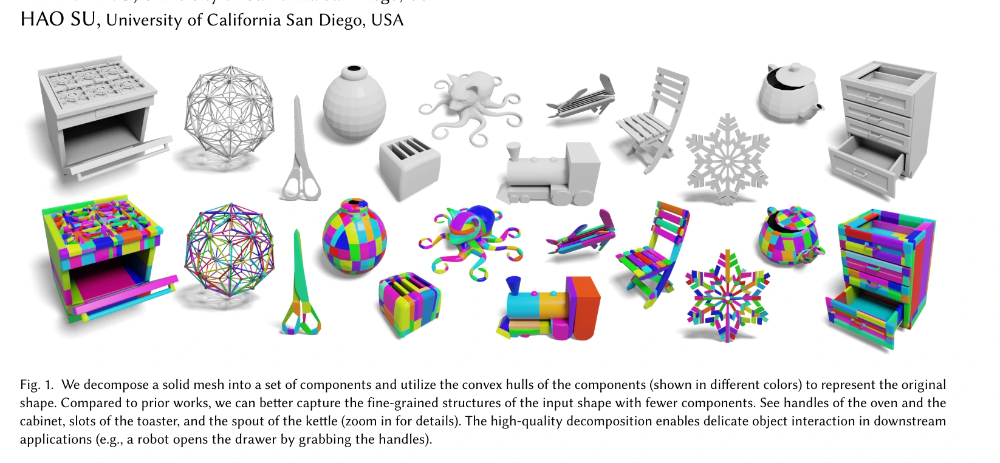
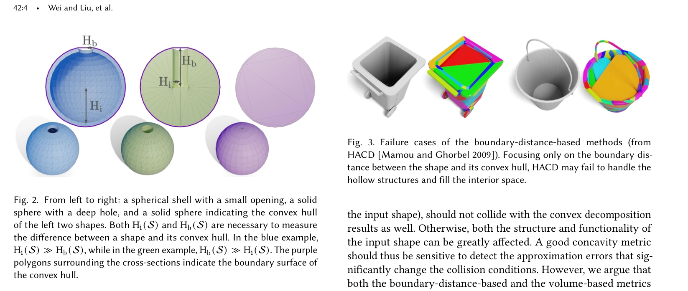
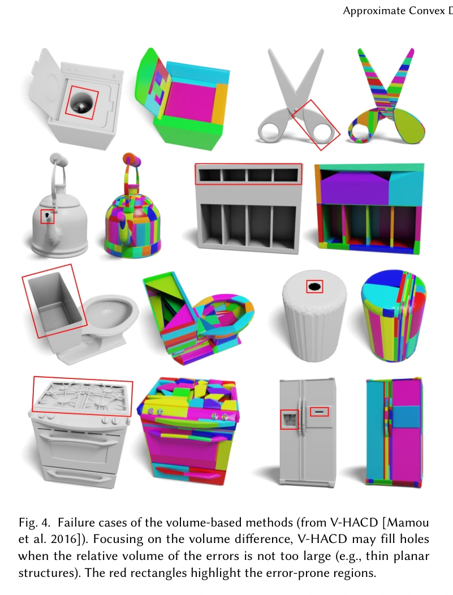
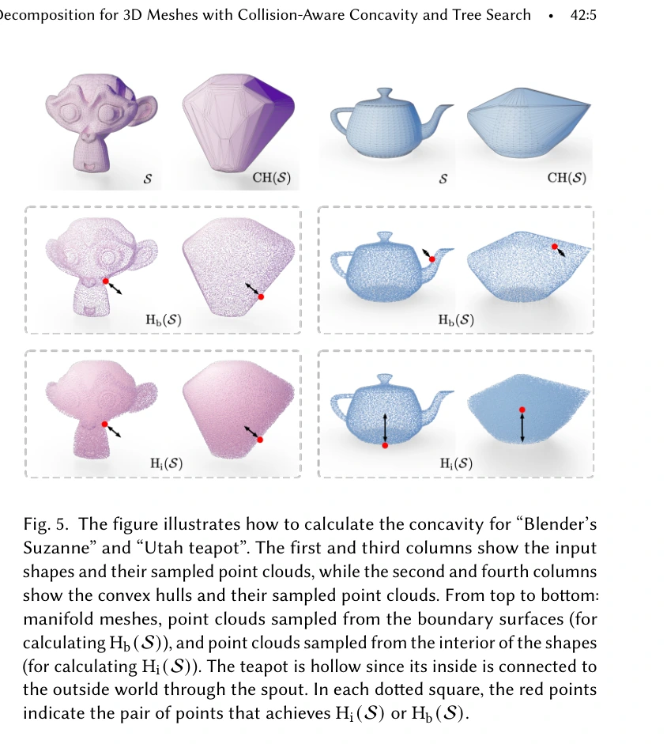
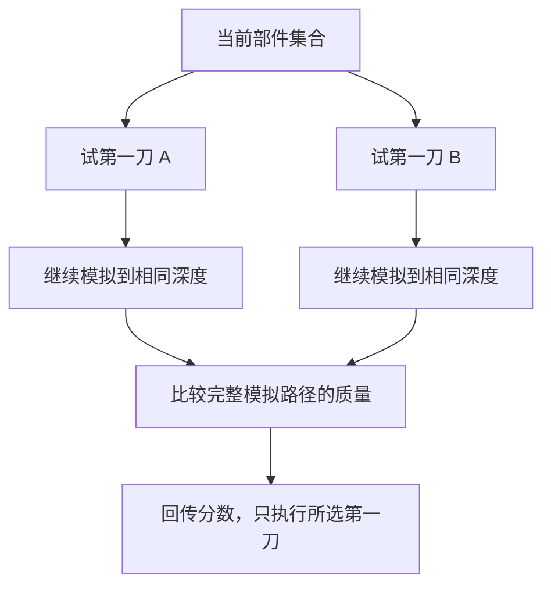
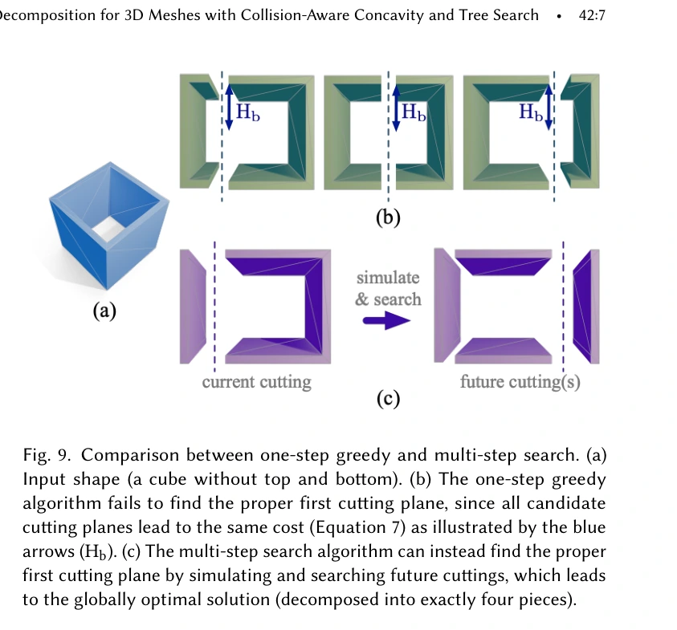
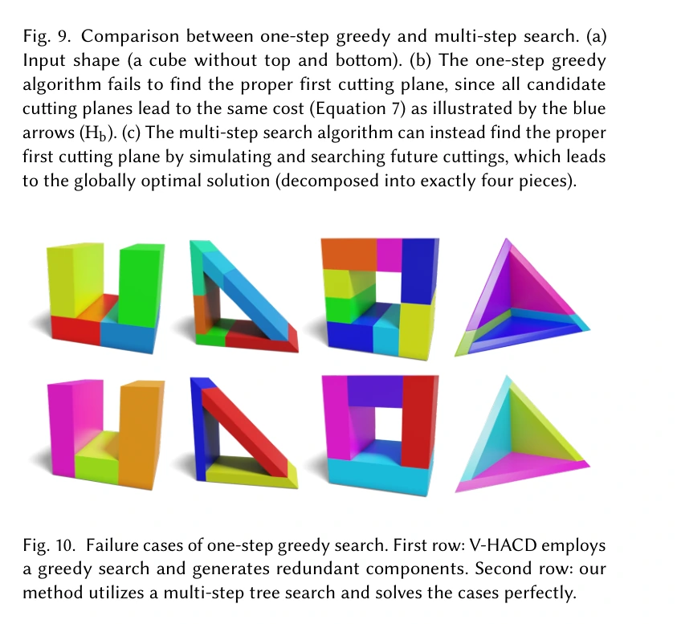
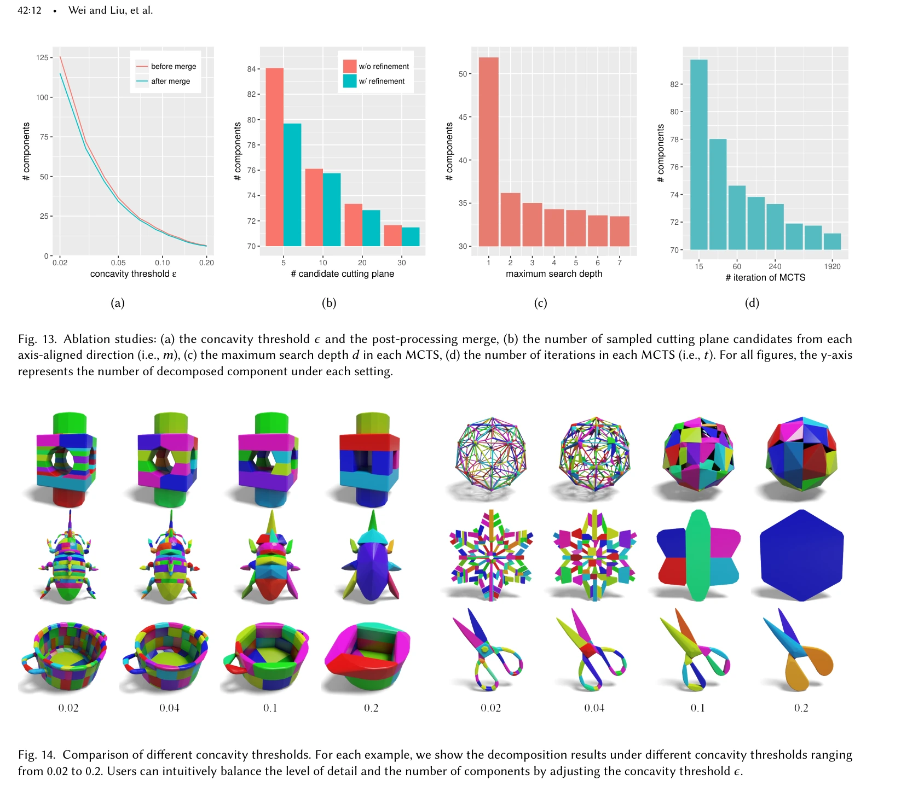
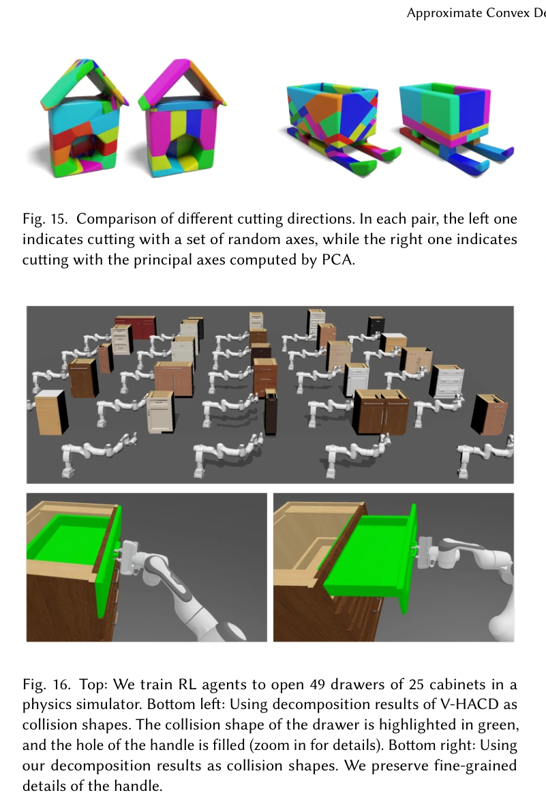

# CoACD：保留碰撞相关凹陷的凸分解

## 一屏概览

**研究问题。** 把网格变成少量凸碰撞体时，怎样避免把把手孔、壶嘴、插槽等功能性空隙填满，同时控制分解数量？

原文图 1；PDF 第 1 页。[查看原始来源](https://arxiv.org/pdf/2205.02961#page=1)

**核心贡献。** 将边界误差与内部占用误差结合成碰撞感知凹度；直接用平面切割实体网格；用蒙特卡洛树搜索（MCTS）考察多步切割，而不只挑当前收益最大的切面。[原文第 4–6 节](https://arxiv.org/abs/2205.02961)

**关键结果。** 在作者设置下，相近或更低凹度对应的组件数减少；SAPIEN 抽屉实验中，能成功训练出开抽屉策略的抽屉比例从 49% 增至 80%。**这不是同一策略单次执行的成功率**：49 个抽屉分别训练，每个抽屉最多 5 次训练尝试，有一次打开就计为成功。[第 7.3 节、表 3](https://arxiv.org/abs/2205.02961)

**版本。** 完整复核 18 页归档 PDF：arXiv:2205.02961v1，首页日期 2022-05-05；稿内发表信息为 ACM TOG 41(4)、Article 42、2022 年 7 月。因此元数据中的 2022-07-01 是发表月份记录，不能当成该 arXiv 版本的发布日期。

## 方法：误差、表示与搜索分别改变什么

### 目标与输入假设

给定表示实体 $S$ 的二维流形闭合网格，将其切成内部不交的部件 $S_i$，以各自凸包 $\operatorname{CH}(S_i)$ 作为最终近似。目标是在每个部件凹度不超过阈值 $\epsilon$ 时尽量减少部件数量。非水密或非流形输入需先转为实体网格，这一步本身可能改变原几何。[第 3 节、算法 1](https://arxiv.org/abs/2205.02961)

### 为什么需要同时检查边界与内部

记 $H(A,B)$ 为两个点集的 Hausdorff 距离，即两个方向“到另一集合最近距离”的最大值。原文分别从 $S$ 和其凸包的边界与内部采样，定义 $H_b(S)$ 和 $H_i(S)$，并使用：

$$
C(S)=\max\{H_b(S),H_i(S)\}.
$$

边界距离能发现深孔被封住；内部距离能发现薄壳的巨大空腔被填实。只看体积差时，小体积但任务关键的薄孔或槽可能不够显著；只看边界时，又可能漏掉内部占用错误。图 2–5 和式（1）–（4）分别给出反例与定义。指标取最坏误差，而不是平均视觉相似度。

原文图 2、3；PDF 第 4 页。[查看原始来源](https://arxiv.org/pdf/2205.02961#page=4)

原文图 4；PDF 第 5 页。[查看原始来源](https://arxiv.org/pdf/2205.02961#page=5)

原文图 5；PDF 第 5 页。[查看原始来源](https://arxiv.org/pdf/2205.02961#page=5)

直接密集采样内部很贵，因此使用与多填体积等体积的球半径：

$$
R_v(S)=\left[\frac{3\bigl(\operatorname{Vol}(\operatorname{CH}(S))-\operatorname{Vol}(S)\bigr)}{4\pi}\right]^{1/3},
\qquad\widetilde C(S)=\max\{H_b(S),kR_v(S)\}.
$$

$\operatorname{Vol}$ 表示体积，$k<1$ 是经验校准系数，默认 $k=0.3$。这个立方根把体积差转换成长度量纲。第 4.2 节定理及附录 A 给出 $\sqrt2\max(H_b,R_v)\ge\max(H_b,H_i)$ 的界，但证明假设采样覆盖全部点；**它不能直接充当有限采样、再乘 $k=0.3$ 后的严格误差保证**。附录 E 对 13,536 个 PartNet-Mobility 部件进行经验检查，超过 94% 满足绝对差不超过 0.02 或相对比值处于 0.8–1.2。

### 直接切网格与多步搜索

第 5 节把穿过切面的三角形拆开，并用约束 Delaunay 三角剖分封闭切口。切分阶段的两侧几何被平面分开，因此其凸包内部不相交；这比按三角面聚类产生锯齿分界更容易控制。该结论针对切分构造，不能无条件延伸到任意后处理合并。

第 6 节从三个正交方向各采样 $m$ 个候选平面，可选先做 PCA 对齐。搜索节点代表一组当前部件，每次切凹度最高的部件。MCTS 用上置信界平衡探索与已有优解；未展开的后续步骤由简单贪心切割补到深度 $d$，按沿途最坏凹度的平均下降评分。它只真正执行本轮选出的第一个切面，再重复求解。

原文的搜索评分可概括为：

$$
Q(P_{1:d})=-\frac1d\sum_{i=1}^{d}\max_{j\le i+1}C(S_{ij}),
$$

其中 $P_{1:d}$ 是候选切面序列，$S_{ij}$ 是第 $i$ 次切割后的第 $j$ 个部件。**搜索内部为速度主要使用 $R_v$，最终是否继续切割用 $\max(H_b,kR_v)$**，不能把两种计算混写为每个节点都完整评估双 Hausdorff 距离。[第 6.4–6.5 节、式（9）](https://arxiv.org/abs/2205.02961)

最后局部细化平面位置，尝试合并仍满足阈值的相邻部件。默认 $m=20$、搜索迭代数 500、深度 $d=4$；附录 C 说明默认包含合并。MCTS 增加前瞻，不构成全局最优证明。

### 多步搜索究竟多看了什么

原文第 6.3–6.4 节的树节点表示**一组当前部件**，不是某个孤立的平面。每次动作切开其中凹度最大的部件；深度为 $d$ 的搜索用补齐模拟使候选最后都拥有 $d+1$ 个部件，再比较分解质量。这样不会拿“两块的误差”和“五块的误差”直接决定第一刀。树策略在已知好分支与访问较少的分支间探索，最终只执行选定路径的第一刀，之后在新的部件上重新搜索。

下图按上述机制重画，用于说明信息流：

**教学解释。** 对有多个凹槽的物体，一刀可能仍留下另一个同样深的槽，所以“最大凹度”几乎没降；但它可能已经让下一刀把两个槽分别隔离。只奖励第一刀立即下降的贪心策略看不到这件事。图 9–10 与第 6.2 节用具体几何说明这种短视；这里的凹槽叙述帮助理解为何需要前瞻，不是增加一项新实验。搜索深度有限、候选受方向限制，因而“看得更远”仍不同于全局最优保证。

原文图 9；PDF 第 7 页。[查看原始来源](https://arxiv.org/pdf/2205.02961#page=7)

原文图 10；PDF 第 7 页。[查看原始来源](https://arxiv.org/pdf/2205.02961#page=7)

## 实验、消融与可比性

第 7.1 节使用 61 个 V-HACD 数据集模型与 2,346 个 PartNet-Mobility 物体，关节物体逐部件分解。与 HACD／V-HACD 比较时，先取得基线输出的凹度，再作为 CoACD 的阈值，因此侧重相近质量下的部件数；与 Animation 比较时匹配部件数量，再看凹度。不同表块中的 CoACD 数字对应不同配对设置，不能直接合成一个排行榜。

| 证据 | 主要结果 | 解释与边界 |
| --- | --- | --- |
| 表 1，V-HACD 数据集，与 V-HACD 配对 | 部件数 60.2→29.8，凹度 0.067→0.044；耗时 192.1→201.9 秒 | 质量／部件数改进，不是该设置下预处理更快 |
| 表 1，PartNet-Mobility，与 V-HACD 配对 | 部件数 44.6→20.1，凹度 0.055→0.052；耗时 206.0→253.4 秒 | 保持更低凹度所需部件较少，时间略增 |
| 表 2，固定凹度阈值 0.05 | 单步贪心 49.9 个、271.7 秒；多步搜索 34.5 个、229.8 秒 | 搜索次数增加不等于总耗时一定增加：少切几轮及简化评分有收益 |
| 图 13–15、附录 D | 更小阈值通常增加部件；深度从 1 到 2 收益突出；更多候选和迭代通常改善分解但耗时增加 | 参数与切割方向仍影响结果；没有通用最佳预算 |
| 第 7.3 节、表 3、图 16 | SAPIEN 中 25 个柜子、49 个抽屉；每次 SAC 训练 $10^6$ 步，最多 5 次尝试；成功抽屉比例 49%→80% | 支持把手孔的碰撞几何会改变该训练任务可达性；未报告真实机器人迁移或跨引擎结果 |

原文图 13、14；PDF 第 12 页。[查看原始来源](https://arxiv.org/pdf/2205.02961#page=12)

原文图 15、16；PDF 第 13 页。[查看原始来源](https://arxiv.org/pdf/2205.02961#page=13)

除 Animation 由其作者在另一台机器运行外，论文说明比较方法使用单 CPU 线程；Animation 的时间不能直接作为同机比较。作者将抽屉改进解释为更容易形成形状闭合抓握，并观察到 V-HACD 填孔后夹爪易滑脱；这是该实验的机制解释，未逐一分离所有接触因素。

## 局限与我们的解释

**原文指出的局限。** 有限正交候选、搜索深度与算力预算限制最优性；PCA／切割方向影响结果；作者提出并行化、更智能切面与自适应阈值作为后续方向。输入预处理和有限采样仍属于算法假设的一部分。

**跨来源边界。** [[visacd-visibility-based-gpu-accelerated-approximate-convex-decomposition|VisACD]] 在其设置下报告 CoACD 合并可能产生相交凸包，因而关闭合并进行比较。因此“CoACD 保证无相交”应限定到平面切分结构与所用后处理，而不是覆盖所有版本和配置。

**我们的解释。** 这篇论文最有价值的证据链是“碰撞空隙被改变 → 抓握方式受影响 → 策略训练结果变化”。它没有证明凸包越少、凹度越低就一定训练越快；端到端还取决于碰撞检测、接触点和求解器。比较具体资产时，应同时保留孔隙、生成参数和目标引擎中的任务表现。

相关基础：[[ApproximateConvexDecomposition|近似凸分解]]、[[CollisionGeometryForRobotSimulation|机器人仿真的碰撞几何]]、[[SimulationRealityGap|仿真—现实差距]]。实现细节和参数接口另见 [[coacd-repository|CoACD 仓库来源]]；共享入口为 [[CoACD|CoACD]] 与 [[VHACD|V-HACD]]。

## 研究归属

[[topics/physics-simulation|物理仿真]] · [[topics/collision-geometry|碰撞几何如何兼顾精度与计算]]。
