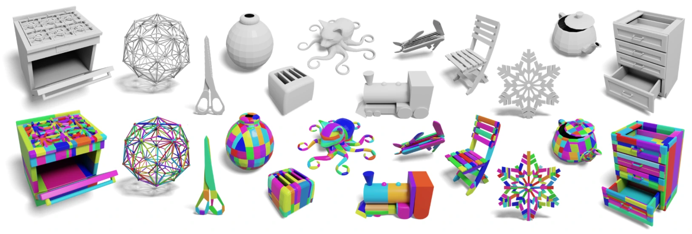
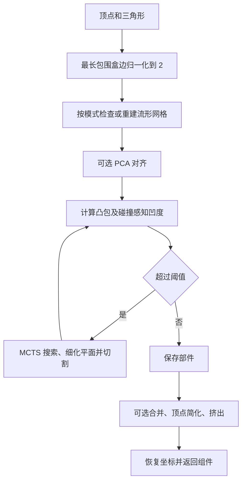

# CoACD：从网格到可用碰撞组件的实现

## 一屏概览

这个项目实现 [[coacd-approximate-convex-decomposition|CoACD 论文]] 的平面切割与树搜索，并提供 Python、C++ 和引擎集成入口。核心输出是**一组独立凸组件的顶点与三角形**；资产怎样导出、实例化成多个碰撞形状，以及怎样验收接触行为，仍由调用侧决定。



官方仓库配图。[查看原始来源](https://raw.githubusercontent.com/SarahWeiii/CoACD/131010c4f03fec375ea88c5c6263f120046cb7f1/assets/teaser.png)

本页静态复核官方提交 `131010c4f03fec375ea88c5c6263f120046cb7f1`（提交日期 2026-09-23），读取 README、接口和下列算法路径。旧 README 原始证据与缓存保留；新增代码快照列于页末。未编译、运行或测量该版本，论文中的实验不能自动当作当前实现的复现实绩。

## 调用契约：进入和离开算法的是什么

`coacd.Mesh(vertices, indices)` 接收形状为 `(N, 3)` 的顶点和 `(F, 3)` 的三角形索引，包装层转换为连续的 `double` 与 `int32` 数组。`run_coacd(mesh, ...)` 经 `ctypes` 调用 C 接口，将每个结果复制成 NumPy 数组，再调用原生释放函数；返回列表中的每项为 `[vertices, indices]`。这些是几何数据，不自带刚体质量、摩擦或关节。[Python 接口，第 70–163 行](https://github.com/SarahWeiii/CoACD/blob/131010c4f03fec375ea88c5c6263f120046cb7f1/python/package/__init__.py#L70)

```python
# 接口示意；V、F 是调用方准备的顶点和三角形数组，本页未运行此例。
mesh = coacd.Mesh(V, F)
parts = coacd.run_coacd(mesh, threshold=0.05, merge=True)
# 每个 parts[i] 应按目标引擎要求保留为独立凸组件。
```

分解出的多个凸包若被重新当作一个需要整体凸包化的网格导入，孔槽可能再次被封住。该版 README 的 `--split` 用于分别导出组件；具体引擎语义应继续查 [[mujoco-computation-collision-detection|MuJoCo 文档]] 或 [[isaac-sim-core-api-collision-approximation|Isaac Sim 文档]]，不能仅凭输出文件看起来像多个块就判断碰撞配置正确。

## 算法路径与尺度

下图按上述机制重画，用于说明信息流：



令输入包围盒中心为 $c$，最长边为 $L$，实际归一化为 $x'=2(x-c)/L$，输出再逆变换。默认阈值因而作用在这个归一化空间。若开启 `real_metric=True`，入口将阈值 $\tau$ 转为 $\tau'=0.8\cdot2\tau/L$；这除了尺度换算，还含实现中的 `0.8` 系数。README 要求输入以米为单位，代码不会识别输入究竟是米还是毫米。**该选项不是原网格碰撞误差小于指定米数的严格证明**，因为采样、代理指标与后处理仍存在。[入口，第 74–85 行](https://github.com/SarahWeiii/CoACD/blob/131010c4f03fec375ea88c5c6263f120046cb7f1/public/coacd.cpp#L74)、[归一化与恢复，第 622–666 行](https://github.com/SarahWeiii/CoACD/blob/131010c4f03fec375ea88c5c6263f120046cb7f1/src/model_obj.cpp#L622)

主循环先用 `ComputeHCost` 计算 $\max(H_b,kR_v)$，超过阈值时进入 MCTS，再用 `TernaryMCTS` 细化切面。搜索内部使用更便宜的体积代理；“什么时候停止分解”和“怎样评价候选搜索”应分开理解。方法数学与论文版本参数见 [[coacd-approximate-convex-decomposition|CoACD 方法解析]]。[误差计算](https://github.com/SarahWeiii/CoACD/blob/131010c4f03fec375ea88c5c6263f120046cb7f1/src/cost.cpp)、[分解主循环，第 521–687 行](https://github.com/SarahWeiii/CoACD/blob/131010c4f03fec375ea88c5c6263f120046cb7f1/src/process.cpp#L521)、[搜索中的候选评价，第 710–738 行](https://github.com/SarahWeiii/CoACD/blob/131010c4f03fec375ea88c5c6263f120046cb7f1/src/mcts.cpp#L710)

`auto` 在支持相关第三方库的构建中先检查流形性，必要时预处理；`on` 强制预处理，`off` 跳过。归档代码的内部预处理使用 OpenVDB 的网格→有符号距离场→等值面重建。README 提到的 PaMO 是外部网格准备建议，**不能写成这个入口已自动调用 PaMO**。未包含第三方预处理支持的构建会对不合格网格报错，不能照搬“任意网格都能输入”的宽泛描述。[入口条件分支](https://github.com/SarahWeiii/CoACD/blob/131010c4f03fec375ea88c5c6263f120046cb7f1/public/coacd.cpp#L85)、[实际预处理](https://github.com/SarahWeiii/CoACD/blob/131010c4f03fec375ea88c5c6263f120046cb7f1/src/preprocess.cpp)

## 参数按作用分组

以下默认值以固定提交的 Python 函数签名为准，和论文默认设置分开记录。

| 参数 | 默认值 | 真正控制的环节 |
| --- | --- | --- |
| `threshold` | `0.05` | 分解停止误差；降低它通常保留更多细节 |
| `preprocess_mode` / `preprocess_resolution` | `auto` / `50` | 是否重建输入，以及重建细度；丢失的孔槽不能由后续切割恢复 |
| `resolution` | `2000` | Hausdorff 项的表面采样预算，与预处理分辨率不同 |
| `mcts_nodes` / `mcts_iterations` / `mcts_max_depth` | `20` / `150` / `3` | 候选与搜索预算；README 的 CLI 参数表把迭代默认值写为 `100`，不应替代这个接口事实 |
| `merge` / `max_convex_hull` | `True` / `-1` | 后处理合并与数量上限；有限上限可能以超过凹度阈值为代价 |
| `decimate` / `max_ch_vertex` | `False` / `256` | 只有启用简化，顶点预算才参与处理 |
| `extrude` / `extrude_margin` | `False` / `0.01` | 沿邻接共享面挤出，是额外几何改变 |
| `pca` / `apx_mode` / `seed` | `False` / `ch` / `0` | 可选对齐、凸包或盒体近似、随机种子 |

数量预算不是分解期间的全局最优约束：主循环结束后才合并。`MergeConvexHulls` 在未设数量上限时拒绝超过阈值的合并；设上限后会优先减少数量，即使误差超限；候选耗尽时还可能达不到数量目标。因此 `max_convex_hull` 应和输出检查一起使用。[合并终止逻辑，第 351–379 行](https://github.com/SarahWeiii/CoACD/blob/131010c4f03fec375ea88c5c6263f120046cb7f1/src/process.cpp#L351)

## 使用判断与实现边界

**我们的工程解释。** 把调参分为输入修复、误差预算、搜索预算、输出压缩四步。先确认修复后仍有任务需要的孔槽，再调分解误差；最后为目标引擎测组件数、接触行为与总步进耗时。代码提供机制，不证明某个参数组合对机器人任务最优。共同原理见 [[ApproximateConvexDecomposition|近似凸分解]]、[[CollisionGeometryForRobotSimulation|碰撞几何]]。

静态阅读还发现此提交的 `CoACD_freeMeshArray` 先释放各组件数组，随后将外层 `meshes_ptr` 置空再 `delete[]`。按代码顺序，最初的外层数组未在这里释放；这提示长时间批量调用应核查内存生命周期，但本页没有运行泄漏检测，也没有测量增长量。[第 144–156 行](https://github.com/SarahWeiii/CoACD/blob/131010c4f03fec375ea88c5c6263f120046cb7f1/public/coacd.cpp#L144)

## 固定版本证据

小文件完整阅读；较长实现按上述入口、代价、搜索、合并、归一化路径逐段阅读，未审计整个仓库或 Unity 分支。文件原始字节及 SHA-256 记录在 `graph/acquisitions.jsonl`。

| 官方固定提交文件 | 新归档原始证据 |
| --- | --- |
| [README.md](https://github.com/SarahWeiii/CoACD/blob/131010c4f03fec375ea88c5c6263f120046cb7f1/README.md) | `raw/coacd-readme-md-2026-10-04-1cb2fb0f072d.md` |
| [python/package/__init__.py](https://github.com/SarahWeiii/CoACD/blob/131010c4f03fec375ea88c5c6263f120046cb7f1/python/package/__init__.py) | `raw/coacd-python-package-init-py-2026-10-04-c5730c358f07.py` |
| [public/coacd.h](https://github.com/SarahWeiii/CoACD/blob/131010c4f03fec375ea88c5c6263f120046cb7f1/public/coacd.h) | `raw/coacd-public-coacd-h-2026-10-04-15187afa8559.h` |
| [public/coacd.cpp](https://github.com/SarahWeiii/CoACD/blob/131010c4f03fec375ea88c5c6263f120046cb7f1/public/coacd.cpp) | `raw/coacd-public-coacd-cpp-2026-10-04-e45249efce88.cpp` |
| [src/process.cpp](https://github.com/SarahWeiii/CoACD/blob/131010c4f03fec375ea88c5c6263f120046cb7f1/src/process.cpp) | `raw/coacd-src-process-cpp-2026-10-04-ad8be1d839e4.cpp` |
| [src/cost.cpp](https://github.com/SarahWeiii/CoACD/blob/131010c4f03fec375ea88c5c6263f120046cb7f1/src/cost.cpp) | `raw/coacd-src-cost-cpp-2026-10-04-54c80f77e698.cpp` |
| [src/mcts.cpp](https://github.com/SarahWeiii/CoACD/blob/131010c4f03fec375ea88c5c6263f120046cb7f1/src/mcts.cpp) | `raw/coacd-src-mcts-cpp-2026-10-04-3e9115180840.cpp` |
| [src/preprocess.cpp](https://github.com/SarahWeiii/CoACD/blob/131010c4f03fec375ea88c5c6263f120046cb7f1/src/preprocess.cpp) | `raw/coacd-src-preprocess-cpp-2026-10-04-c8ce19b8f00b.cpp` |
| [src/model_obj.cpp](https://github.com/SarahWeiii/CoACD/blob/131010c4f03fec375ea88c5c6263f120046cb7f1/src/model_obj.cpp) | `raw/coacd-src-model-obj-cpp-2026-10-04-cdb47131cb49.cpp` |

## 研究归属

[[topics/physics-simulation|物理仿真]] · [[topics/collision-geometry|碰撞几何如何兼顾精度与计算]]。
