# 接触模型比较：物理近似与数值求解怎样改变机器人运动

## 一屏概览

**研究问题。** 仿真器给出不同接触行为，究竟来自接触定律的简化，还是求解器没有解准？怎样在固定其他部件时分别评价？

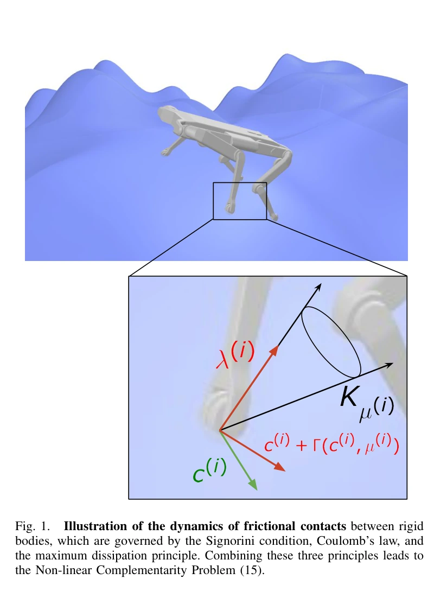

原文图 1；PDF 第 1 页。[查看原始来源](https://arxiv.org/pdf/2304.06372#page=1)

**核心贡献。** 从单边接触、Coulomb 摩擦和最大耗散原理出发，对照 LCP、CCP、RaiSim 类模型和完整非线性互补问题（NCP）；用统一 C++ 框架 ContactBench 重实现求解器，分别检查物理残差、步长一致性、耗时和四足 MPC 行为。[原文第 II–IV 节](https://arxiv.org/abs/2304.06372)

**核心结论。** 模型可因松弛而稳定收敛到不同物理规律，较完整模型也可因数值迭代失败而给出错误轨迹。平坦高摩擦场景可能掩盖差异，崎岖低摩擦场景会放大差异。没有一个被测方案同时在准确性、鲁棒性与效率上全面占优。

**证据范围与版本。** 完整复核 arXiv:2304.06372v3，2024-07-21，17 页。实验比较的是固定动力学／碰撞检测下的算法重实现；其中 RaiSim 非原版闭源引擎，Drake 重实现用 Armijo 回溯而非原算法的线搜索。结果不能直接作为当前完整仿真器的排行榜。

## 物理结构：接触冲量怎样改变速度

### 从自由运动到接触空间

在一个时间步中，令 $q$ 为广义位置，$v_f$ 为没有接触冲量时的下一步自由速度，$M$ 为惯性矩阵，$J$ 为接触雅可比，$\lambda$ 为接触冲量，则：

$$
Mv^+=Mv_f+J^\top\lambda,
\qquad c=Jv^+=G\lambda+g,
\qquad G=JM^{-1}J^\top,\quad g=Jv_f.
$$

$v^+$ 为接触修正后的速度，$c$ 为接触点相对速度，$G$ 是 Delassus 矩阵，体现一个接触冲量如何影响所有接触点。非对角块代表接触之间的动力学耦合；冗余接触可使问题欠定。[第 II 节，式（1）–（9）]

以下为已经接触、无反弹和稳定化偏置时的简化形式。一般实现还需参考速度 $c^\star$、恢复系数和穿透稳定化；论文比较中将这些影响与接触模型区分。

### 三条物理条件缺一不可

对每个接触点，$N$ 表示法向，$T$ 表示二维切向，$\mu$ 是摩擦系数：

$$
0\le\lambda_N\perp c_N\ge0,
\qquad\|\lambda_T\|_2\le\mu\lambda_N.
$$

第一式是 Signorini 条件：接触只推不拉，分离速度与法向冲量不能同时为正；第二式是圆形 Coulomb 摩擦锥。仅满足摩擦锥仍没有确定摩擦方向，因此还需最大耗散原理：

$$
\lambda_T\in\arg\min_{\|\gamma_T\|_2\le\mu\lambda_N}\gamma_T^\top c_T.
$$

滑动且 $c_T\ne0$ 时，得到 $\lambda_T=-\mu\lambda_Nc_T/\|c_T\|_2$；静止时力位于摩擦圆盘中，由整体动力学决定。第 II 节式（10）–（15）通过 de Saxcé 修正 $\Gamma(c,\mu)=(0,0,\mu\|c_T\|_2)$，把这三条写成锥上的 NCP：

$$
K_\mu\ni\lambda\perp c+\Gamma(c,\mu)\in K_\mu^\star.
$$

$K_\mu$ 是摩擦锥，$K_\mu^\star$ 为其对偶锥。完整 NCP 不等于一个普通凸二次规划；非光滑、非凸与解不唯一是其求解困难来源。这里的物理参照仍建立在刚体、点接触和干摩擦等假设上，不是完整材料接触真值。

## 各模型到底松弛了什么

| 模型 | 主要改变 | 论文展示的代价 |
| --- | --- | --- |
| LCP | 将圆形摩擦锥离散为多面体锥，典型为四面摩擦棱锥 | 摩擦方向失去旋转对称性，向棱锥角点偏置；滑块可发生横向漂移 |
| CCP | 去掉 NCP 的 de Saxcé 修正，使问题可写为凸优化 | 保留圆锥与最大耗散，但滑动时松弛法向互补；可能允许分离速度与法向力同时存在 |
| RaiSim 类模型 | 对滑动接触额外施加零法向速度，利用接触模式启发式与二分求解 | 恢复该法向条件，却不完全满足最大耗散；模式判断与逐点迭代也可能失败 |
| NCP | 保留三条条件 | 问题更难，选用完整模型本身不保证有限迭代能解准 |

以上是原文表 II、III 和第 III 节对所讨论算法的分类，不应直接给每个软件品牌贴上永久不变的标签。

CCP 的关键区别可从公式看出：若 $\lambda\perp c$ 且滑动摩擦满足最大耗散，便有：

$$
\lambda_N\bigl(c_N-\mu\|c_T\|_2\bigr)=0.
$$

只要 $\lambda_N>0$，就可能出现 $c_N=\mu\|c_T\|_2>0$，不同于刚性 Signorini 的 $c_N=0$。第 III-B 节给出对应间距量级 $\Delta t\,\mu\|c_T\|_2$，其中 $\Delta t$ 为步长；因此减小步长或滑动速度可减轻该误差。不是所有接触都会“凭空弹跳”，触发条件是这种松弛下的滑动接触。

## 数值求解：模型相同也可能行为不同

**逐点 PGS。** 投影 Gauss–Seidel 依次更新一个接触的法向／切向冲量并投影到约束集合。单轮便宜，但每次把其他接触的当前值视为给定；强耦合或病态 $G$ 会让误差传播缓慢，有限预算下可能停在较大残差。欠定问题中还可能选出含相互抵消内部力的解。[第 III-A、III-D 节，算法 1、2、6]

**全局凸求解。** CCP 可写为：

$$
\min_{\lambda\in K_\mu}\frac12\lambda^\top G\lambda+g^\top\lambda.
$$

ADMM 通过全局线性求解、锥投影和对偶更新处理接触耦合；近端参数与热启动改善实际效率。带柔顺性 $R$ 的原始速度形式可用 Newton 法；加入 $R$ 相当于把 $G$ 替换为 $G+R$，既改变条件数，也改变模型。**物理材料柔顺性与为数值便利加入的正则化需要分别解释。** 原文对 MuJoCo／Drake 的评论来自其讨论版本与建模方式，并非当前软件每一配置的完整描述。[第 III-B、III-E 节]

**交错投影。** 把法向与切向子问题交替求解，外层求不动点；能利用稳健的内层优化器，但仍无一般收敛保证，成本通常较高。作者观察到近端／全局方法较少引入人为内部力，同时明确指出“为何选到这种解”尚缺完整理论证明，不能将此经验性质升级为定理。[第 III-D 节与第 IV-A 节]

## 把比较读成一个受控实验

论文的重要设计是固定 Pinocchio 动力学与 HPP-FCL 碰撞输入，再改变接触表述和求解策略。这样图 3–16 的差异更容易归因于接触模型、数值算法与任务条件，而不是不同引擎同时改变碰撞形状、积分器与接触参数。[第 IV 节，ContactBench 实验设置]

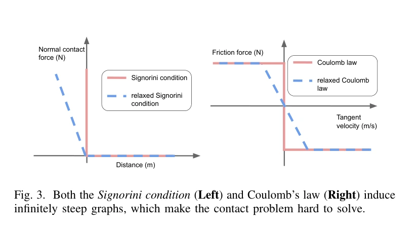

原文图 3；PDF 第 4 页。[查看原始来源](https://arxiv.org/pdf/2304.06372#page=4)

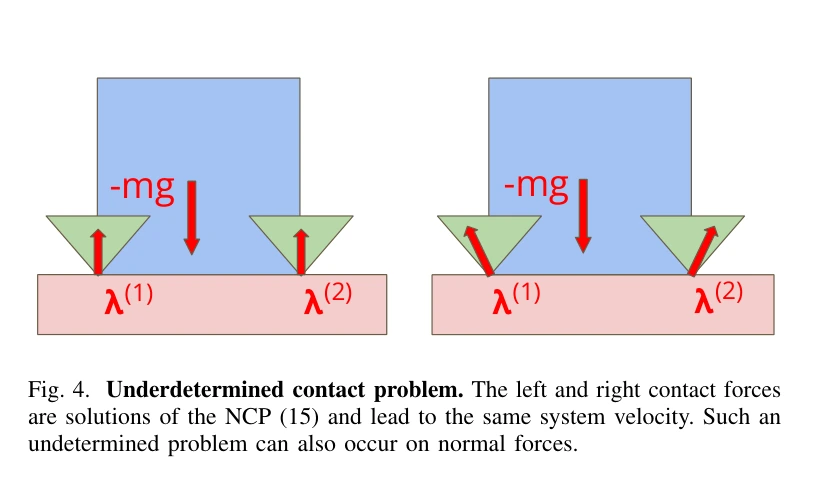

原文图 4；PDF 第 5 页。[查看原始来源](https://arxiv.org/pdf/2304.06372#page=5)

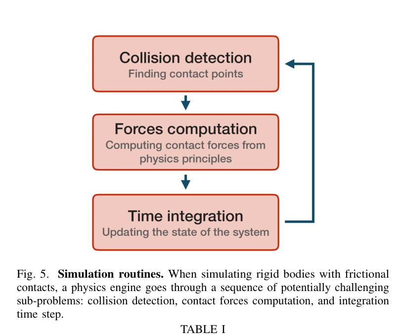

原文图 5；PDF 第 6 页。[查看原始来源](https://arxiv.org/pdf/2304.06372#page=6)

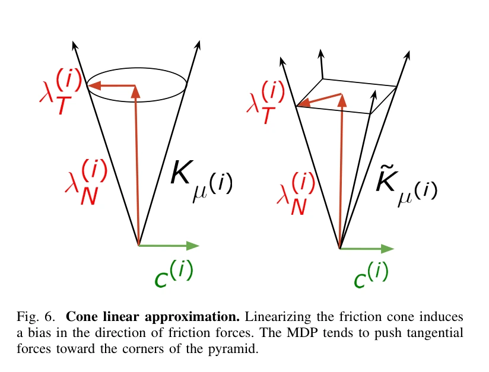

原文图 6；PDF 第 7 页。[查看原始来源](https://arxiv.org/pdf/2304.06372#page=7)

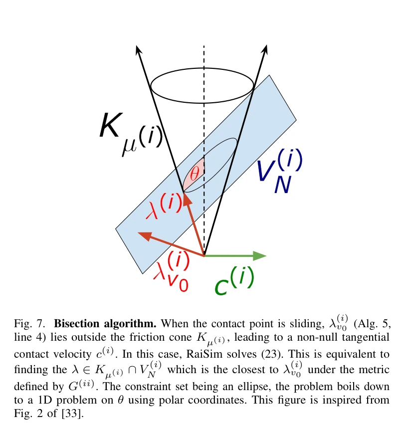

原文图 7；PDF 第 9 页。[查看原始来源](https://arxiv.org/pdf/2304.06372#page=9)

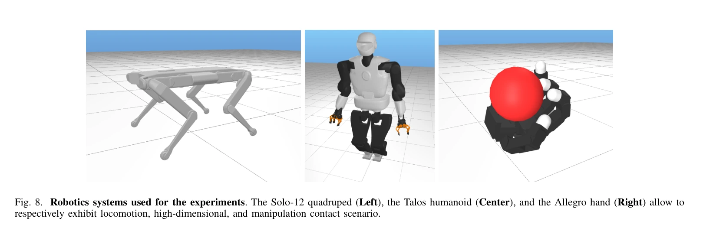

原文图 8；PDF 第 11 页。[查看原始来源](https://arxiv.org/pdf/2304.06372#page=11)

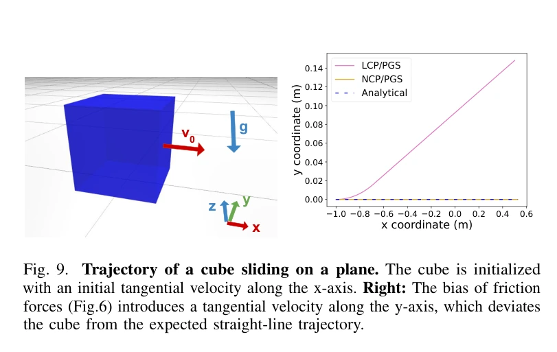

原文图 9；PDF 第 12 页。[查看原始来源](https://arxiv.org/pdf/2304.06372#page=12)

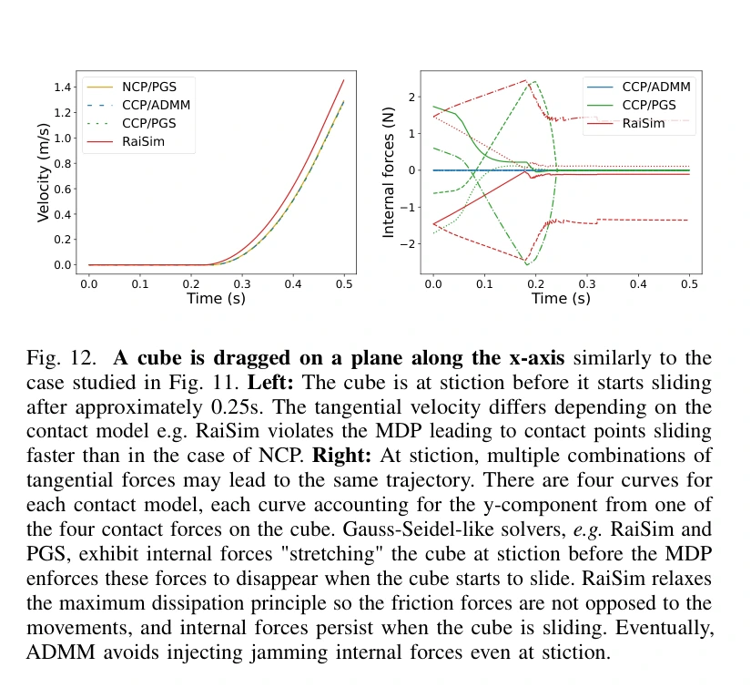

原文图 12；PDF 第 12 页。[查看原始来源](https://arxiv.org/pdf/2304.06372#page=12)

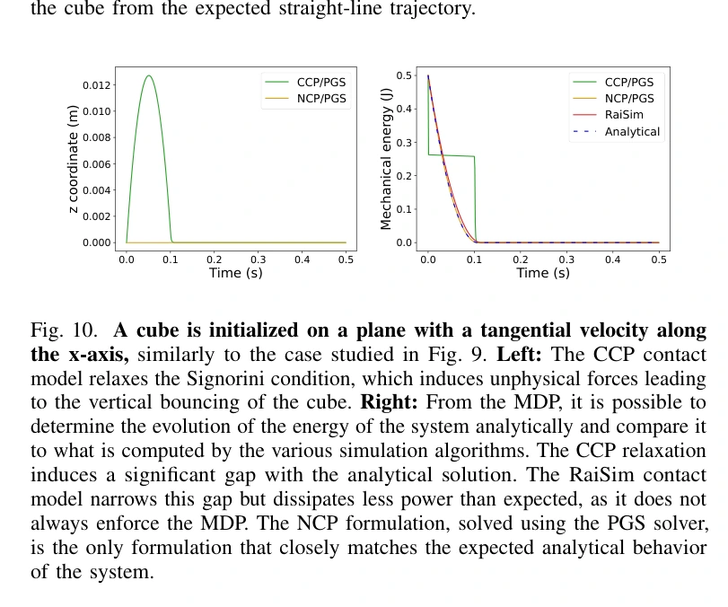

原文图 10；PDF 第 12 页。[查看原始来源](https://arxiv.org/pdf/2304.06372#page=12)

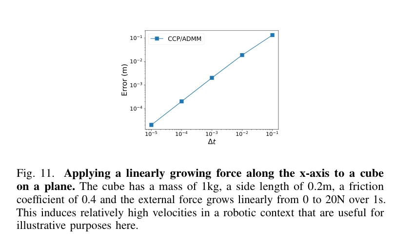

原文图 11；PDF 第 12 页。[查看原始来源](https://arxiv.org/pdf/2304.06372#page=12)

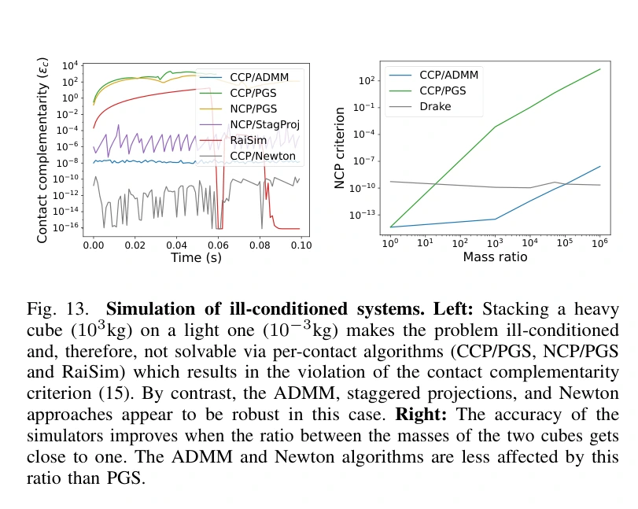

原文图 13；PDF 第 13 页。[查看原始来源](https://arxiv.org/pdf/2304.06372#page=13)

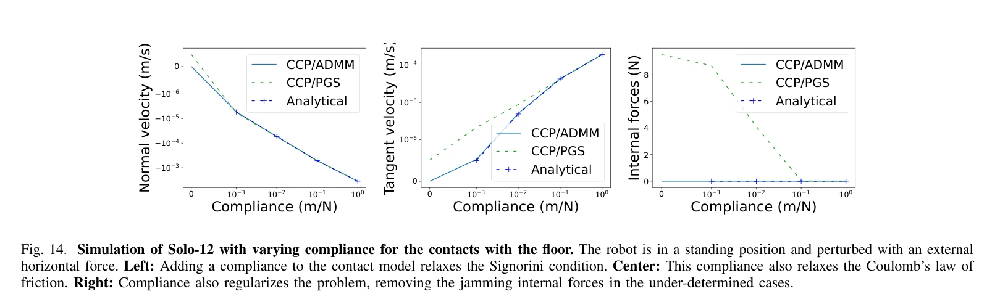

原文图 14；PDF 第 14 页。[查看原始来源](https://arxiv.org/pdf/2304.06372#page=14)

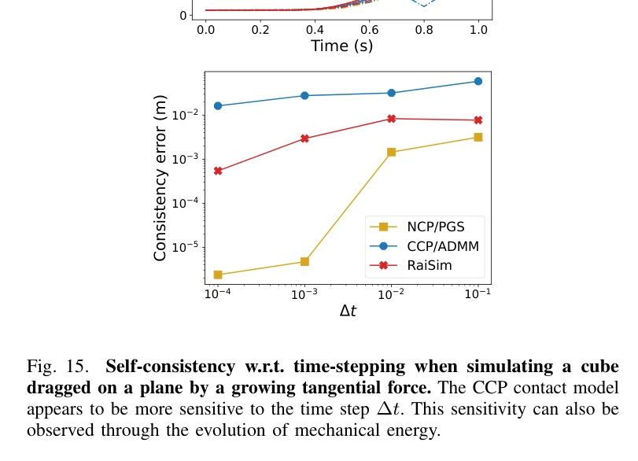

原文图 15；PDF 第 14 页。[查看原始来源](https://arxiv.org/pdf/2304.06372#page=14)

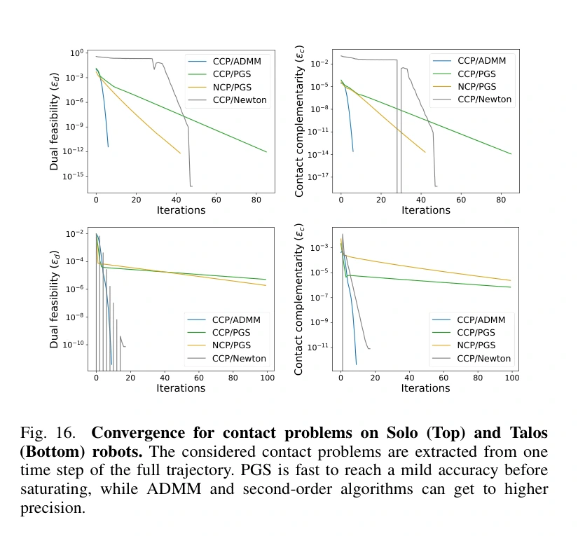

原文图 16；PDF 第 14 页。[查看原始来源](https://arxiv.org/pdf/2304.06372#page=14)

下图按上述机制重画，用于说明信息流：

**教学例：为什么收紧容差修不好模型松弛。** 对 CCP 的滑动支撑，若 $\mu=0.4$、切向速度为 $1\,\mathrm{m/s}$，其松弛条件允许 $c_n=0.4\,\mathrm{m/s}$；步长 $1\,\mathrm{ms}$ 对应这一时间步 $0.4\,\mathrm{mm}$ 的法向位移尺度。数字只是把第 III-B 节式（16）–（19）后的 $\Delta t\mu\|c_T\|$ 关系具体化，不是新增测量。把同一个 CCP 解求到更小残差，仍可能保留这种分离伴随支撑的关系，因为这来自所求方程本身。相反，固定参考模型后因迭代不足留下的误差，才属于求解收敛问题。

## 实验如何区分误差来源

ContactBench 固定 Pinocchio 刚体动力学和 HPP-FCL 碰撞检测。默认步长 1 毫秒、绝对精度 $10^{-6}$、最多 $10^4$ 轮；时间性能比较还可能按停滞条件提前结束。论文在实现中将冲量换成等效力以减少残差对步长的直接缩放依赖。主要物理指标是摩擦锥可行性、对偶可行性和互补残差，取各接触的最大值形成绝对残差。[第 II 节、第 IV 节]

| 位置 | 控制实验 | 主要证据 |
| --- | --- | --- |
| 图 9 | 给平面上方块初始切向速度 | LCP 棱锥摩擦带来横向偏移，NCP 更接近解析直线行为 |
| 图 10–11 | 方块滑动／被逐渐增加的外力拖动 | CCP 的法向松弛改变高度与能量耗散；RaiSim 类模型减小部分偏差，但不等同完整最大耗散 |
| 图 12 | 从粘着到滑动的四点接触方块 | 多组接触力可对应相同轨迹；PGS 类方法出现相互抵消的内部力，ADMM 在该实验较少出现 |
| 图 13 | $10^3$ 千克方块压在 $10^{-3}$ 千克方块上，并扫描质量比 | 强耦合／病态使逐点方法在迭代预算内难以满足残差；全局方法更稳健 |
| 图 14–15 | 扫描柔顺性与步长；与自身小步长轨迹比较 | 柔顺性改善数值条件也改变接触；CCP 在所示滑动例中对步长更敏感 |
| 图 16–17 | Solo、Talos、Allegro 手动态接触；冷启动／热启动 | PGS 较快到达中等精度但可能停滞；全局方法单轮更贵，热启动明显缩小耗时差距 |
| 图 18–19 | Solo-12 MPC：平坦 $\mu=0.9$；崎岖粗糙度 0.1 米、$\mu=0.3$ | 前者主要粘着，控制速度接近；后者滑动与求解困难使高层速度明显分化，NCP/PGS 也偶有未收敛 |

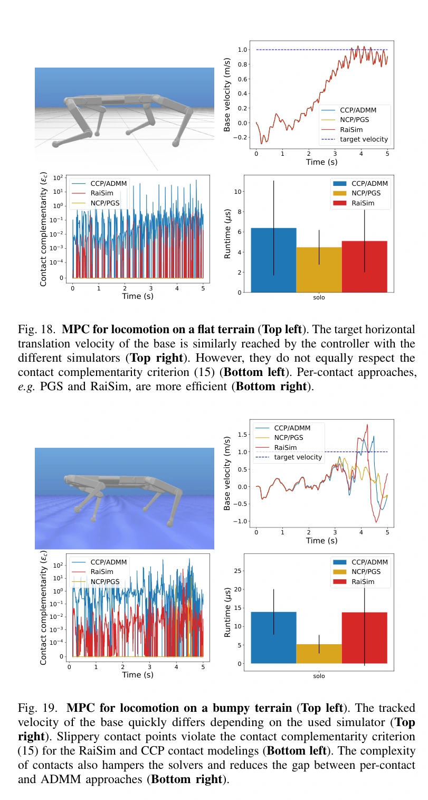

原文图 18、19；PDF 第 15 页。[查看原始来源](https://arxiv.org/pdf/2304.06372#page=15)

图 17 的停止判据对应各自模型，且可能提前停止，所以该图只展示该协议的计算成本，**不能独自证明谁以相同物理精度更快**。MPC 场景也没有与真实硬件轨迹逐一对齐；它支持仿真选择会改变控制行为，不直接量化真实迁移成功率。

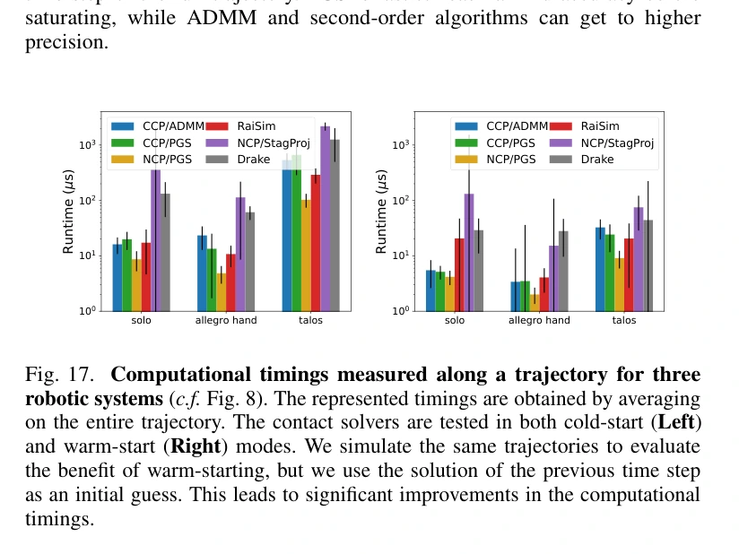

原文图 17；PDF 第 14 页。[查看原始来源](https://arxiv.org/pdf/2304.06372#page=14)

## 局限与我们的解释

**作者的范围。** 研究集中在时间步进、刚体点接触与摩擦模型；积分、碰撞检测及许多引擎级优化被固定或简化。RaiSim 和 Drake 的算法重实现与原产品不完全等价。可微仿真中内部力如何系统性污染导数，主要作为风险与后续研究提出，本文未做完整梯度误差基准。

**我们的解释。** 应先问“想逼近哪种物理模型”，再问“在预算内解到什么精度”。提高迭代数不能消除模型松弛本身的差异，换成 NCP 也不能代替收敛检查。精度、速度与稳定性之外，还需要任务对误差的容忍程度：平稳站立与滑动操作对同一种松弛的敏感性不同。

共享机制分别见 [[ContactModelsInRobotics|机器人接触模型]]、[[ContactComplementarity|接触互补]]、[[ContactSolvers|接触求解器]]；与 [[SimulationRealityGap|仿真—现实差距]]、[[DifferentiablePhysics|可微物理]] 关联时须保留上述实验边界。[[MuJoCo|MuJoCo]] 是相关引擎入口。ContactBench 与文中 RaiSim 类算法说明保留在本论文页，避免把该文重实现与产品状态混为一谈；作者代码入口为 [ContactBench](https://github.com/Simple-Robotics/contactbench)。

## 研究归属

[[topics/physics-simulation|物理仿真]] · [[topics/contact-modeling|接触模型与求解怎样改变运动]]。
