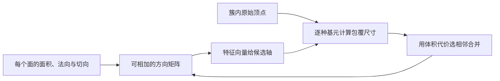

# 凸基元分解：按碰撞成本拟合可编辑的几何

## 一屏概览

**研究问题。** 自动碰撞体为什么一定要是一组任意凸包？盒体、球体、胶囊体等参数基元更容易编辑，也可能得到引擎的专用加速；困难在于如何自动紧贴复杂输入。

**核心贡献。** 将每个面初始化为被凸基元包住的区域，利用可相加的法向矩阵估计方向，再以合并后新增体积为代价，自底向上合并为少量参数基元。支持盒体、球体、胶囊体、圆柱体、截锥体和等腰梯形棱柱。[原文第 3 节](https://arxiv.org/abs/2602.07369)

**关键证据。** 在 60 多个主要来自 Sketchfab 的模型上，平均单向 Hausdorff／Chamfer 距离和估算存储字节数优于所比较的 CoACD、V-HACD 设置；24 个模型的 Rapier 落球实验展示相当或更低帧耗时。数量少不是唯一解释：很多输出的基元数反而多于基线凸包数。

**版本与纠错。** 完整复核 24 页归档 PDF，含附录算法、逐模型表格与图：arXiv:2602.07369v1，2026-02-07；首页为 Computer Graphics Forum 45(2)、Eurographics 2026。旧来源链接 `https://arxiv.org/abs/2602.03865` 与 PDF 不符，已更正。

## 方法：方向、包覆与合并代价

### 面法向矩阵确定候选方向

对面 $f$，令 $A_f$ 为面积，$n_f$ 为单位法向，$t_f$ 为切向信息，使用：

$$
Q_f=A_f(n_fn_f^\top+\varepsilon t_ft_f^\top),
\qquad Q_C=\sum_{f\in C}Q_f.
$$

$C$ 是当前合并的面集合，$\varepsilon$ 控制切向项；原文也使用不加切向项的设置。对称矩阵 $Q_C$ 的特征向量提供三个正交方向。平面区域的大特征值方向接近共同法向；圆柱侧面的小特征值方向可接近柱轴。合并两簇只需相加 $3\times3$ 矩阵，方向估计不必重复处理全部法向。[第 3.1、3.4 节，算法 1]

位置和尺寸仍由该簇顶点计算。先沿候选轴求最大／最小投影得到定向包围盒；再以该中心与各轴尝试其他基元，逐点扩张参数以包住簇中顶点。凸性保证一个面的全部顶点被包住时，该面也被包住。因此算法按**面**初始化而非只按顶点：只包住每个顶点的小球会在面内部留下缺口，图 12 展示这种失败。

### 怎样读懂这个 $3\times3$ 矩阵

以下是对第 3.1 节公式的教学展开。对任意单位方向 $u$，忽略切向修正时：

$$
u^\top Q_Cu=\sum_{f\in C}A_f(n_f^\top u)^2.
$$

它统计面法向沿 $u$ 的面积加权投影能量。因此最大特征向量寻找“最多表面朝向的方向”，最小特征向量寻找“最少法向指向的方向”。若全部面平行于 $xy$ 平面，$Q_C=\operatorname{diag}(0,0,\sum_fA_f)$，最大特征向量就是 $z$ 轴；但平面内的两轴无法仅靠它区分。圆柱侧面法向绕轴分布，却很少沿轴，最小特征向量于是可以揭示柱轴。切向项用于缓解部分平面内歧义，但也会改变方向偏好，论文第 3.4 节与图 10 对此做了讨论。

还可看出 $(-n)(-n)^\top=nn^\top$：这个方向统计不区分法向正负。它保留的是朝向分布，既没有保存顶点位置，也没有编码“这里是物体内部”。所以必须再用原始顶点求中心、尺寸与覆盖范围，不能把 $Q_C$ 直接当作一个完整碰撞体。

下图按上述机制重画，用于说明信息流：

### 参数基元怎样包住输入

以圆柱为例，$a$ 是单位轴，$c$ 是轴上一点，$P_C$ 为簇内顶点集合：

$$
r=\max_{p\in P_C}\|(I-aa^\top)(p-c)\|_2,
\qquad
h=\max_{p\in P_C}a^\top(p-c)-\min_{p\in P_C}a^\top(p-c).
$$

$r$ 与 $h$ 分别决定半径和高度；球体取到中心的最大距离，盒体取三个方向的投影范围。胶囊体考虑球形端部；截锥体和梯形棱柱逐步调整两端尺寸，附录算法 2–3 给出过程。每个形状只需支持体积计算、给定方向初始化和逐点扩大包覆，因而可扩展形状族。**这里选择的是有限候选轴上的包覆近似，不是全方向最小体积基元的精确优化。** [第 3.2 节、图 2]

### 为什么用新增体积排序

对两个相邻基元 $p_0,p_1$，拟合共同包覆基元 $p_\star$，使用合并代价：

$$
\Delta V=V(p_\star)-V(p_0)-V(p_1).
$$

$V$ 表示基元体积。优先队列每次选择代价最低的相邻合并，直到达到目标数量、没有可合并边，或用户设置的单步体积增量上限阻止继续。随后删除完全冗余的内部基元。若网格有断连组件，可加入两两候选以继续合并；这也可能带来二次方数量的连接开销。[第 3.3–3.4 节]

式（4）没有加回 $V(p_0\cap p_1)$，所以重叠区域被重复减掉；式（5）给出包含交集的更精确代价，但计算更贵。它比较的是已有**基元**体积，不需要封闭输入网格的体积，因而能处理非水密、非流形输入。输出允许基元重叠，不属于保证凸包之间内部无交叠的平面分割。

引擎成本通过 $V'(p)=k(p)V(p)$ 引入。论文默认盒体、胶囊体、球体权重 1.0，圆柱体 1.05，梯形棱柱 1.4，截锥体 2.1，以偏好更廉价的形状。权重是用户选择的成本代理，不是对所有引擎成立的真实耗时模型。

## 实验和消融

第 4 节的主要仿真协议是在 AMD Ryzen 7800X3D CPU 上用 Rapier，向每个碰撞体落下 5,000 个球，记录前 1,000 帧耗时；24 个模型参与性能实验。Rapier 支持圆柱体，梯形棱柱和截锥体需转换成凸包。图中用于视觉展示的部分 Blender 落球使用 500 个球，应与性能实验区分。

| 位置与度量 | 本文方法 | CoACD | V-HACD |
| --- | --- | --- | --- |
| 表 2，平均单向 Hausdorff 距离 | 0.0445 | 0.0514 | 0.0710 |
| 表 2，平均单向 Chamfer 距离 | 0.00695 | 0.00991 | 0.00882 |
| 第 4.2 节，平均估算字节数 | 22,523.7 | 93,809.3 | 68,934.1 |
| 表 2，取得最低 Hausdorff 的模型数 | 44 | 20 | 4 |
| 表 2，取得最低 Chamfer 的模型数 | 43 | 3 | 22 |

距离方向是“生成碰撞体表面 → 输入表面”，并按输入包围盒对角线归一化；它惩罚填孔或向外突出，不能独自描述全部接触行为。字节量按照参数、凸包顶点和索引估算，不是物理引擎进程的实测内存。表 4–5 明确存在本文方法不占优的个例，“平均更好”不能改写成逐模型全面胜出。

| 消融位置 | 观察 | 可复用结论 |
| --- | --- | --- |
| 图 10 | 为共面区域加入切向项后，误用圆柱体的现象减少 | 法向矩阵退化时，方向约束影响拟合 |
| 图 11–12 | 去重顶点改变邻接；只合并顶点会留下表面孔洞 | 拓扑与按面包覆是实质设计，不只是实现细节 |
| 图 13 | 同为 70 个基元／凸包，基元方式帧耗时更低 | 组件数量不能直接代表窄阶段成本 |
| 图 14 | 均匀权重产生更多梯形棱柱；只用廉价基元更快但较粗 | 形状质量与目标引擎成本需共同调节 |
| 图 16，交集代价 | 原代价 1.29 秒；密集交集采样 523.53 秒，稀疏采样 34.045 秒，几何差异很小 | 更精确的局部体积估计在该案例不值得其成本；正文“至少 30 倍”不完全对应图中稀疏配置的约 26 倍，宜保留原始数字 |
| 图 7、9 | 更粗目标需更多合并；实测时间随面数近似线性，但最坏情况可达二次复杂度 | 细分输出生成更快并不矛盾；经验扩展性不是线性复杂度证明 |

**比较限制。** 作者逐模型手动选择基元目标数量，并在部分形状调整权重或切向项；基线也存在个别参数调整。仿真相似性主要靠人工观察，帧耗时同时受碰撞算法成本和落球行为变化影响。论文提供有用工程证据，但不是统一精度、统一输出预算、跨引擎的严格排名。[第 4–5 节]

## 局限与我们的解释

**作者列出的失败情形。** 内部面会污染方向估计，导致外层立方体未恢复为紧包围盒（图 17）；共面区域会退化或过度合并；小拓扑变化能改变输出；有机曲面需更多基元才能表达高频细节。附录图 22 还对一个复杂场景额外删除极薄盒体，因此“始终包住所有输入表面”的构造性质不能无条件套到该后处理之后。

**我们的解释。** 这篇论文支持把“输出形状种类 × 引擎支持 × 接触行为”一起评估。对精细机器人抓握、插入或滚动接触，落球与视觉检查不足以证明法向、间隙和任务动力学正确；这些用途仍需任务级证据。它与 [[coacd-approximate-convex-decomposition|CoACD]] 的比较应保留输入要求差异：前者可直接覆盖开放表面，后者主体假设实体流形并强调功能性凹陷。

相关基础：[[CollisionGeometryForRobotSimulation|机器人仿真的碰撞几何]]、[[ApproximateConvexDecomposition|近似凸分解]]；对照方法入口：[[VHACD|V-HACD]]、[[CoACD|CoACD]]。

## 研究归属

[[topics/physics-simulation|物理仿真]] · [[topics/collision-geometry|碰撞几何如何兼顾精度与计算]]。
