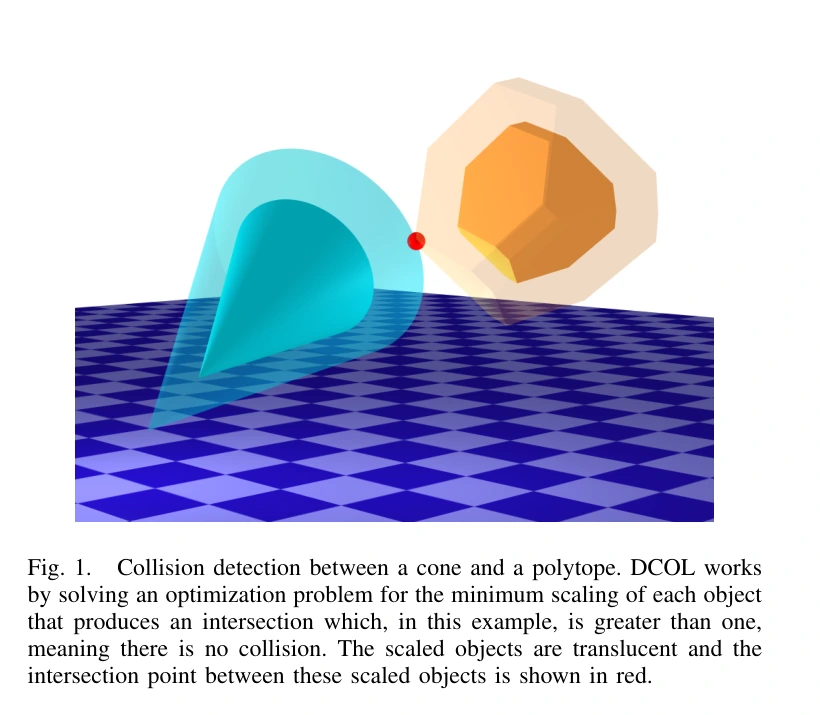
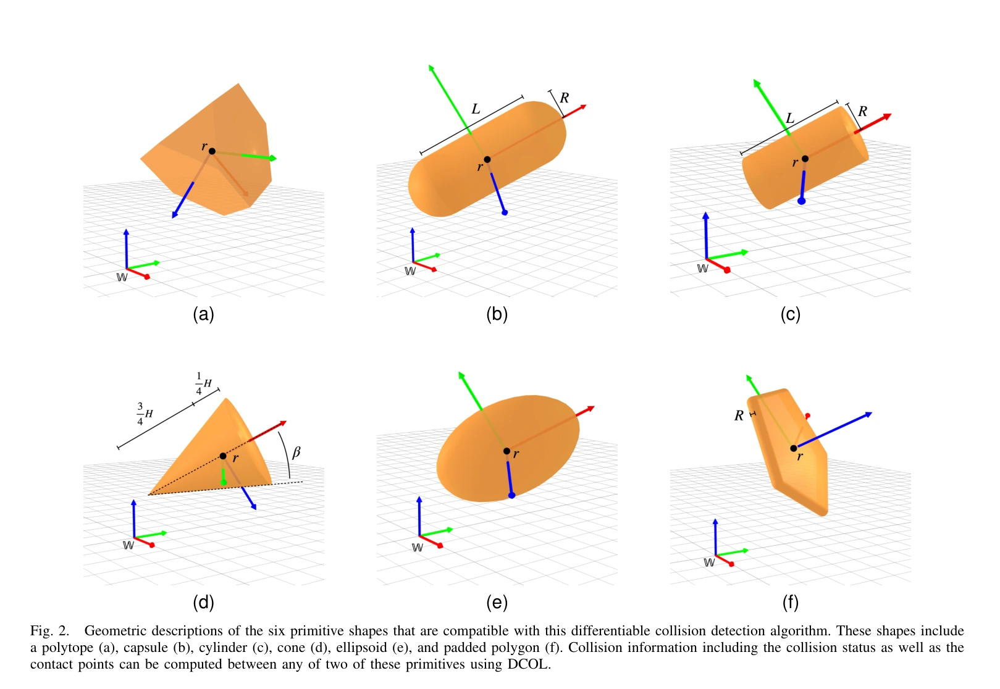
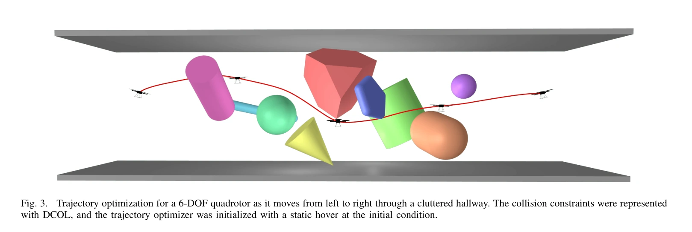
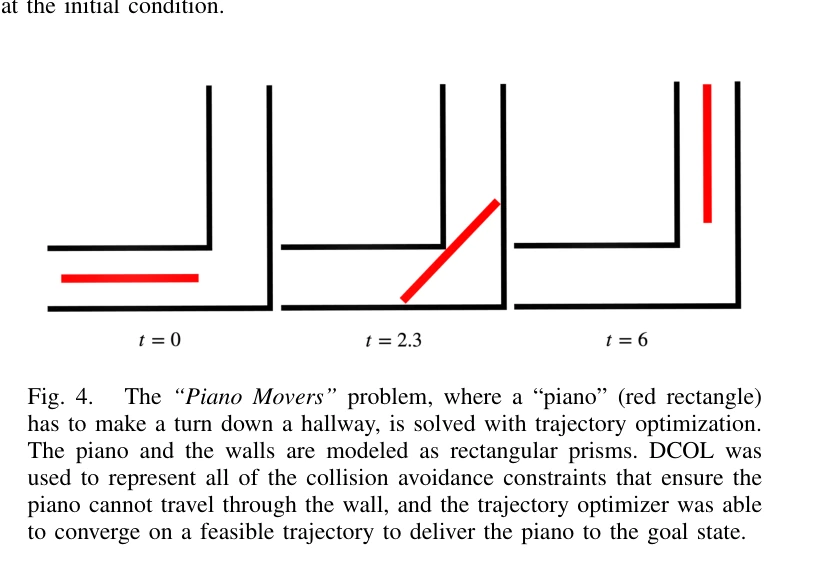
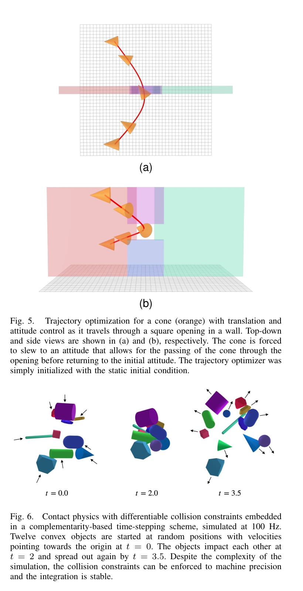

# DCOL：以最小均匀缩放构造可微碰撞约束

## 一屏概览

**研究问题。** 两个凸物体已经穿透时，怎样仍提供可用于梯度优化的碰撞指标，并统一处理多种凸基元？

原文图 1；PDF 第 1 页。[查看原始来源](https://arxiv.org/pdf/2207.00669#page=1)

**核心贡献。** 同时围绕各自参考点缩放两个形状，求两者刚好相交时的最小尺度 $\alpha^\star$。将六类凸基元的成员约束写成线性约束与二阶锥约束，用定制内点法求解，并对最优值或最优解求导。[原文第 II–III 节](https://arxiv.org/abs/2207.00669)

**主要证据。** 表 I 报告单次求值平均约 5.0–9.4 微秒、额外求导约 1.3–1.7 微秒；第 IV 节展示三类轨迹优化和十二基元接触仿真。它证明一组优化与仿真示例可行，没有建立所有引擎、形状或退化配置下的普遍速度与光滑性保证。

**版本。** 本页复核 arXiv:2207.00669v3，2023-05-18，8 页。正式标题不含“DCOL:”前缀；DCOL 是方法名。`year` 采用本次归档稿年份，初始 arXiv 编号对应 2022 年。

## 方法：先求尺度，再求敏感性

### 为什么尺度可以判碰撞

令 $S_i(\alpha)$ 表示物体 $i$ 围绕自身参考点 $r_i$ 均匀缩放 $\alpha$ 后的集合；$x\in\mathbb R^3$ 是两个缩放物体的公共点。核心问题为：

$$
\alpha^\star=\min_{x,\alpha}\alpha,
\qquad x\in S_1(\alpha),\quad x\in S_2(\alpha),\quad\alpha\ge0.
$$

这就是第 III-A 节式（10）。对论文规定的正尺寸凸基元和缩放中心，$\alpha^\star>1$ 表示需要放大才相交，$\alpha^\star=1$ 表示刚好接触，$\alpha^\star<1$ 表示原形状已经相交。轨迹优化可对每个物体配对 $j$ 和时间节点 $t$ 施加 $\alpha_j(q_t)\ge1$，其中 $q_t$ 是物体或机器人配置。

尺度无量纲，取决于物体尺寸和缩放中心；**它不是欧氏距离或以米表示的穿透深度**。判定相交准确与距离度量相同，是两件不同的事。

### 两个球的解析例子

将椭球特化为半径 $R_1,R_2>0$ 的球，中心距离为 $D=\|r_1-r_2\|_2$。共同缩放后两球首次相切恰好满足 $D=\alpha(R_1+R_2)$，所以：

$$
\alpha^\star=\frac{D}{R_1+R_2},\qquad
\frac{\partial\alpha^\star}{\partial r_1}
=\frac{r_1-r_2}{(R_1+R_2)D}\quad(D>0).
$$

这是式（10）的教学特例。半径和为 $0.3\,\mathrm m$、中心距 $0.45\,\mathrm m$ 时，$\alpha^\star=1.5$，实际表面间隙为 $0.15\,\mathrm m$；半径和变为 $3\,\mathrm m$ 时，同样的尺度值对应 $1.5\,\mathrm m$ 间隙。对球可写 $d=(\alpha^\star-1)(R_1+R_2)$，一般旋转凸体没有这个换算式。该例也暴露了一个条件：$D=0$ 时范数梯度不能按上式计算，因而不能把凸规划表述误解为处处经典光滑。

### 六类形状为什么能共用锥规划

原文图 2 和第 III-B 节支持凸多面体、胶囊体、圆柱体、圆锥体、椭球体及带厚度凸多边形。设 $Q$ 为物体坐标到世界坐标的旋转矩阵，$r$ 为位置，以下三个例子足以看清构造：

原文图 2；PDF 第 3 页。[查看原始来源](https://arxiv.org/pdf/2207.00669#page=3)

| 基元 | 缩放后的成员约束 | 约束类型 |
| --- | --- | --- |
| 多面体 $Aw\le b$ | $AQ^\top(x-r)\le\alpha b$ | 线性不等式 |
| 椭球体 $w^\top Pw\le1$，$P=U^\top U\succ0$ | $\|UQ^\top(x-r)\|_2\le\alpha$ | 二阶锥 |
| 胶囊体，中心线长 $L$、半径 $R$、轴向单位向量 $\widehat b_x$ | $\|x-(r+\gamma\widehat b_x)\|_2\le\alpha R$，$-\alpha L/2\le\gamma\le\alpha L/2$ | 二阶锥与线性约束 |

$\gamma$ 是胶囊体中心线上的辅助坐标。圆柱体在相近构造上增加平端面的约束；圆锥体与带厚度多边形也分别用轴向／平面线性条件和二阶锥描述。所有配对最终统一为 $\min c^\top z$、$h-Gz\in K$，其中 $z$ 汇总尺度、公共点和辅助变量，$K$ 是非负正交锥与二阶锥的笛卡尔积。实现针对这些小问题做栈内存分配，采用原始—对偶内点法。[式（11）–（29）及第 II-A 节](https://arxiv.org/abs/2207.00669)

### 最优值导数与接触点导数不同

若只需要 $\alpha^\star$ 的梯度，第 II-B 节利用最优点处拉格朗日函数对参数的偏导；若需要完整最优解（例如公共点）的敏感性，则将最优性条件写成 $g(y^\star,\theta)=0$，其中 $y$ 包括原始与对偶解，$\theta$ 是位姿等参数，使用：

$$
\frac{\partial y^\star}{\partial\theta}
=-\left(\frac{\partial g}{\partial y}\right)^{-1}\frac{\partial g}{\partial\theta}.
$$

内点法已有的分解可以复用，解释了求导增量为何小于重新求解。该公式仍以相关线性化系统可解为前提。[式（6）–（9）](https://arxiv.org/abs/2207.00669)

第 III-C 节还将公共点 $x^\star$ 映射回未缩放物体：

$$
p_i=r_i+\frac{x^\star-r_i}{\alpha^\star}.
$$

这是**按缩放构造恢复的表面对应点**。论文将随后计算的 $\|p_1-p_2\|$ 称作最小距离，但式（30）–（31）本身只给出这些对应点的间距，并未证明它们对任意不等尺度或旋转凸体都是欧氏最近点；本页不将其等同于通用最近点查询。$\alpha^\star=0$ 时该恢复式还有除零问题，不能把最优尺度的可定义性直接延伸成接触点恢复的全局保证。以上是对公式适用条件的审阅说明。

## 实验与证据强度

| 位置 | 设置或结果 | 结论边界 |
| --- | --- | --- |
| 表 I | 六类形状平均求值：多面体 5.9、胶囊体 8.5、圆柱体 8.4、圆锥体 5.0、椭球体 6.8、多边形 9.4 微秒；额外求导 1.3–1.7 微秒 | 表格没有完整硬件、样本分布和误差条说明；不是跨机器可复用的性能保证 |
| 第 IV-A.1 节、图 4 | “搬钢琴”绕过宽 1 米的直角走廊，长 2.6 米；从静止初始猜测优化 | 展示紧约束位姿避碰；正文与图注对钢琴基元类型描述不完全一致，故不据此锁定唯一实现 |
| 第 IV-A.2 节、图 3 | 六自由度四旋翼穿过含 12 个障碍的走廊，几何采用外包球 | 支持简化几何下的规划集成，未验证真实旋翼轮廓间隙 |
| 第 IV-A.3 节、图 5 | 全平移与姿态控制的圆锥体穿过方孔 | 展示姿态梯度能帮助找到狭窄通行解 |
| 第 IV-B 节、图 6 | 12 个随机位姿凸基元相撞，互补时间步进，100 Hz 仿真；作者报告约束满足至机器精度 | 这是所示仿真步进频率，不等于整套仿真实时吞吐量；没有复杂机器人摩擦基准 |

原文图 3；PDF 第 5 页。[查看原始来源](https://arxiv.org/pdf/2207.00669#page=5)

原文图 4；PDF 第 5 页。[查看原始来源](https://arxiv.org/pdf/2207.00669#page=5)

原文图 5、6；PDF 第 6 页。[查看原始来源](https://arxiv.org/pdf/2207.00669#page=6)

论文没有单独的系统消融表；“穿透时仍返回指标”“求导便宜”主要由构造与微基准支持，规划性能由案例展示。

## 局限与我们的解释

**原文范围。** 方法面向给定的凸基元表示；复杂网格的凸分解以及现有物理引擎集成列为后续工作。外层轨迹优化仍是非凸问题，内层碰撞查询为凸问题并不保证全局无碰撞轨迹一定能找到。

**我们的解释。** 论文使用“完全可微”的表述，但非唯一公共点、对称形状或退化活动约束会使最优解敏感性需要额外条件。例如两个球的尺度解与中心间距成正比，中心重合处的范数没有唯一梯度；因此不将作者表述扩大成所有位姿上的经典光滑性定理。优化中的尺度余量也应与所需物理间隙分别核验。

与 [[diffpills-differentiable-collision-detection-for-capsules-and-padded-polygons|DiffPills]] 相比，核心区别是“最小共同缩放”与“中心几何距离减厚度”；与 [[contact-models-in-robotics-a-comparative-analysis|接触模型比较]] 相比，DCOL 处理几何约束，后者处理接触冲量、摩擦和数值求解。相关基础：[[DifferentiableCollisionDetection|Differentiable Collision Detection]]、[[CollisionGeometryForRobotSimulation|碰撞几何]]、[[DifferentiablePhysics|Differentiable Physics]]。论文实现链接为 [DifferentiableCollisions.jl](https://github.com/kevin-tracy/DifferentiableCollisions.jl)，未在本轮复核当前代码。

## 研究归属

[[topics/physics-simulation|物理仿真]] · [[topics/collision-geometry|Collision Geometry]]。
