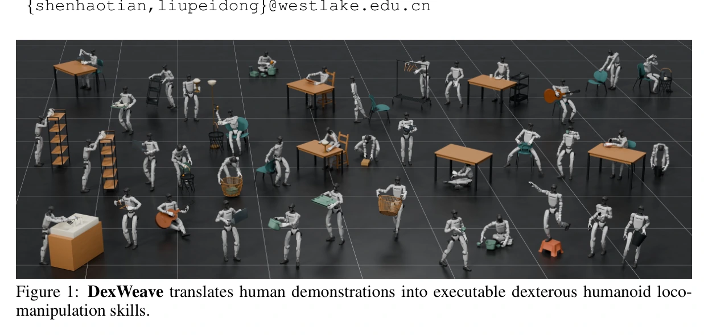
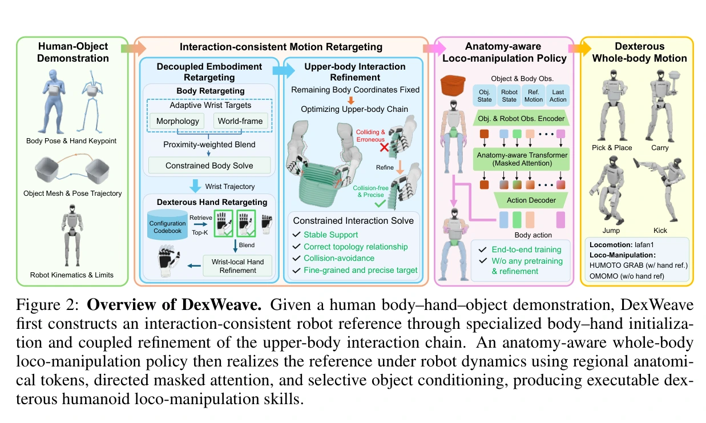
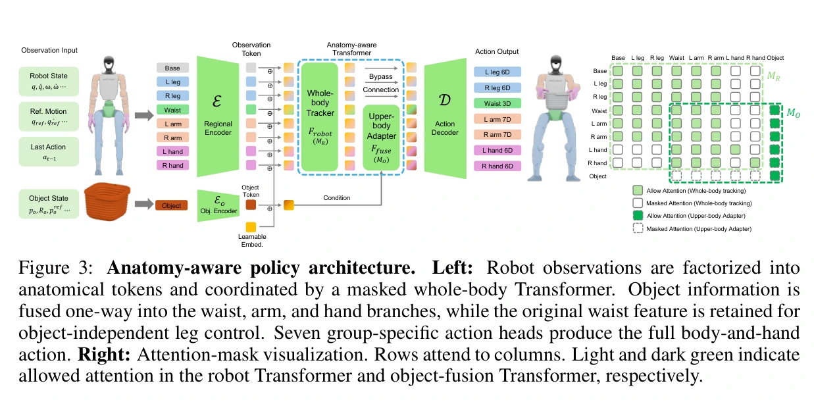
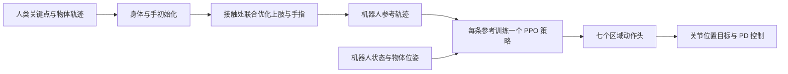

## 一屏概览

**问题：** 人的身体比例、手指关节和机器人不同。身体与手分别重定向，可能各自接近示范，却使指尖错过物体；普通整向量策略又没有显式表达躯干、手臂、手指之间的信息关系。（§1–3）

原文图 1；PDF 第 1 页。[查看原始来源](https://arxiv.org/pdf/2609.34724v1#page=1)

原文图 2；PDF 第 4 页。[查看原始来源](https://arxiv.org/pdf/2609.34724v1#page=4)

原文图 3；PDF 第 6 页。[查看原始来源](https://arxiv.org/pdf/2609.34724v1#page=6)

**方法：** 先分别初始化身体与手，再联合调整上肢和手指，保住指尖与物体的接触关系。用按身体区域分词、限制注意力方向的 Transformer，通过 PPO 学习跟踪重定向参考。**每条参考单独训练策略**，不是能按语言执行新任务的通用人形机器人模型。（§3、附录 B–D）

**结果：** Isaac Lab 训练、MuJoCo 评测，操作参考的完成率为97.5%，对照物体条件 MLP 为85%；G1＋Inspire 手的真机展示是定性证据，不能把97.5%当成硬件成功率。（表3、§4.3）

**阅读建议：读，实现与部署条件继续关注。** 最值得借鉴的是接触激活的重定向目标，以及限制物体条件向下肢传播的策略结构。本页完整阅读 [v1 论文及附录](https://arxiv.org/pdf/2609.34724v1) 共26页，视觉复核结果和消融表；未核查代码仓库或运行复现，不据此判断当前代码是否已经发布。

## 输入、输出与设计动机

输入是随时间变化的人体／手部关键点和刚性物体位姿，输出先是机器人参考关节与根部运动，再是执行这一参考的控制策略。它依赖参考轨迹和当前物体位姿，不是从任意现场图像直接生成抓取策略。基础接口可对照 [[PolicyDeploymentContract|策略部署约定]] 与 [[RobotCoordinateFrames|坐标系和位姿]]。（§3）

预处理统一到50 Hz、共同朝向和地面。默认场景缩放为1；示范不可达时，允许围绕共同地面锚点一起缩放人体、物体运动和网格。后续优化保持**预处理后的**物体轨迹不变，不能据此说整个方法从不改变原始场景几何。（附录 B）

核心困难是两个坐标要求会冲突：手臂适配机器人的身体比例，指尖却要在世界坐标中接近原物体。如果先固定错误的腕位置，手指自由度再多也无法补偿。因此它保留阶段式初始化，但在接触处重新开放上肢与手指的联合优化。（§3.1）

## 重定向：从独立初始化到接触耦合

### 第一阶段：身体逆运动学与手部码本

身体逆运动学优化浮动基座和非手指关节，包含关键点误差、时间正则、关节限制与碰撞约束。对源示范的支撑阶段，加入脚趾水平位置等式约束；脚高和朝向另行处理，不能把所有足部目标概括为一个硬约束。（§3.1、附录 B）

腕部目标在形态适配与场景位置之间插值：

$$
\hat p_w=(1-\alpha)p_{\mathrm{morph}}+\alpha p_{\mathrm{scene}}.
$$

这里 $p_{\mathrm{morph}}$ 适配身体比例，$p_{\mathrm{scene}}$ 保留场景中的腕位置，$\alpha\in[0,1]$ 表示接触激活程度。接近物体时提高场景约束，离开物体时让身体形态主导。近接触使用5 cm 阈值和持续窗口；文中 $4/30$ 秒窗口在50 Hz 离散化为7帧，GRAB／HUMOTO 的手指接触标签也参与激活。腕方向经坐标映射后保留。（附录 B）

每只手有6个独立驱动量，其余关节通过从动关系耦合。对每个驱动量取3个值，建立 $3^6=729$ 个姿态的码本，选距离最近的12个条目，以 $\exp(-D/0.06)$ 加权得到初始化和软先验，再连续优化；这不是把最终手势量化到729种。没有手部参考时使用中性姿态。（附录 B）

### 第二阶段：让腕和指尖一起让步

固定根部、腿与腰，开放14个手臂／腕部自由度和12个手部驱动量，共26维。拇指、食指的权重各为2，其余指尖为0.2；接触越强，越放松腕位置锚定，但保留掌面方向目标。这样腕部能为关键指尖让位，而不是要求手指独自消化形态差异。（§3.1、附录 B）

指尖目标的关键结构可写为：

$$
L_{\mathrm{tip}}=\sum_j\frac{\omega_j}{\ell^2}\left[\alpha_j^2\|p_j-y_j\|^2+(1-\alpha_j)^2\|u_j-v_j\|^2\right].
$$

$p_j,y_j$ 是机器人与目标的世界坐标指尖，$u_j,v_j$ 是相应的腕部局部坐标；$\omega_j$ 是指尖权重，$\ell$ 是长度归一化量。接触时优化世界位置，非接触时偏向保留局部手形。二者平方加权，不是只切换一个离散“抓住／松开”状态。（附录 B）

联合求解仍有关节、从动关系、肘部和自身／地面约束；物体间隙是软目标。因此几何优化改善接触并不等于保证物理稳定抓握，也不等于完全消除穿透。是否能动态执行还要经过后面的策略学习。（附录 B、§4.1）

## 策略：用身体结构限制信息流

演员输入238维，其中机器人相关211维、物体相关27维。机器人输入被分成基座、双腿、腰、双臂、双手共8个区域，每个映射成128维令牌；机器人模块有两层、四头注意力。它不只是“把 MLP 换成 Transformer”，关键是可见性掩码。（§3.2、附录 C）

- 身体组包含基座、腿、腰和手臂，组内双向通信，不能读取手部令牌。
- 每只手读取腰、双臂和自身，不直接读取另一只手。
- 随后加入物体令牌，只融合腰、双臂和双手五个上身区域；各区域读取自身和物体，物体只读取自身。
- 双腿绕过物体融合，并保留融合前的腰部信息，避免通过腰间接接入这一轮物体条件。

物体的27维由当前位姿9维、参考位姿9维及两者坐标表示之差9维组成，在躯干坐标中表达；该差值不应误读为严格的 SE(3) 相对变换。掩码排除的是直接条件通路，腿仍会通过本体感知受到物体载荷和上身动作的物理影响。（附录 C）

图中参考不是只在训练时提供一次的标签：演员还依赖参考条件和物体目标，部署必须明确如何获得对应信息。七个动作头输出41维位置指令：腿12、腰3、手臂14、手部12；手部经从动关系展开为24个手指关节，仿真共53个关节。位置目标为 $q^{\mathrm{cmd}}=q^{\mathrm{default}}+s\odot a$，身体缩放采用 $0.25\tau_{\max}/k_p$，手部为0.25，再交给关节 PD；输出不是直接关节力矩。（附录 C–D）

演员省略手指速度，用覆盖120 ms 的7个锚点位置历史补充信息；评论家有463维特权观测，可见更完整、未加演员噪声的状态。故训练和部署观测不能混写，也不能把真实物体位姿自动替换成未经评测的视觉估计器。（附录 C）

## 训练、迁移与“成功”的定义

PPO 使用4096个环境、每轮24步，即98304个样本；物理200 Hz、控制50 Hz。身体跟踪训练8000轮，操作训练12000轮。最后1000轮每100轮保存检查点，每个检查点在 MuJoCo 用5个评测种子测试后汇总；这不等同于报告5次独立训练的统计区间。（附录 D–E）

随机化包含质量0.9–1.1倍、电机0.8–1.2倍、位置增益0.85–1.15倍，以及摩擦与0–10 ms 动作延迟。物体观测按30 Hz 更新，加入20–60 ms 延迟、1 cm 位置和0.035 rad 旋转噪声。这说明作者针对物体测量误差训练，但不能外推到任意遮挡和估计失锁。（附录 D）

训练重置一半从起点、一半从抽样相位开始；后者结合均匀采样与失败自适应采样。片段最长10秒。完成率指抵达参考末尾或时间上限而没有提前终止：躯干／末端高度误差、躯干位置／朝向、物体位置／旋转越界会触发终止。物体阈值为0.30 m 和2 rad，明显宽于高精度装配要求。因此97.5%是该跟踪协议的完成率，不是通用语义任务成功率。（附录 D–E）

## 实验读数及其可比范围

| 实验与定位 | 作者报告 | 解释与限制 |
| --- | --- | --- |
| MuJoCo 操作评测，表3 | DexWeave 97.50%，物体条件 MLP 85%，InterMimic 57.74% | MLP 使用同一 G1、参数量相近；InterMimic 使用 SMPL-X 人体骨架，不能当成完全匹配的机器人基线 |
| 操作误差，表3 | 身体4.93 vs 5.69 cm，物体3.43 vs 3.84 cm | 相比 MLP 有改善，但物体角度6.83° vs 6.16°更差，优势并非逐项成立 |
| 身体跟踪，表2 | 与 BeyondMimic 都完成100%；身体误差2.62 vs 2.82 cm | 完成率饱和时，仍需比较误差，不能只说同样成功 |
| OMOMO 重定向，表1 | 接触保留0.999 vs GMR 0.879；接触距离2.944 vs 7.677 cm | 接触保留采用任一手有效部位的判定，不保证保持原来的那只手和物体部位 |
| GRAB／HUMOTO，表1与附录 | 拇指／食指误差4.342／7.198 mm，最强 IK 对照14.925／29.999 mm | 次要手指并非所有指标最佳；几何误差不能替代动力学成功 |
| G1＋Inspire 手，§4.3 | 定性硬件展示 | 未给出可对应97.5%的真机试验计数 |

重定向穿透持续时间使用地面／自身1 cm、物体2 cm 阈值，而不是“任何负间隙”；滑脚指标检测源支撑期间超过0.30 m/s 的运动。评测阈值与优化器自身的较小几何容差也不同。（附录 E）

**联合优化的代价，表12。** GRAB 主指尖误差从36.033降到4.342 mm，物体穿透比例从0.157降到0.001，但掌面方向误差从0.189°增至3.652°；HUMOTO 相应从32.703降到7.198 mm、穿透比例0.204降到0.007，掌面方向0.159°增至4.439°。HUMOTO 的条件穿透深度却从2.568增至2.854 cm：该均值只对仍发生穿透的帧计算，不能与穿透比例下降简单相抵或混成“全面消除碰撞”。

**掩码消融，表13。** 两条参考上，完整结构完成100%，密集机器人注意力91.30%，双向物体注意力99.71%。但密集机器人注意力的物体位置／旋转误差3.62 cm／8.23°优于完整结构3.81 cm／8.47°。它支持所测任务下结构化信息流提高完成率，尚不足以证明该掩码对所有任务和所有指标最优。

## 局限、我们的解释与最小验证

论文证据支持“更好的接触参考＋带身体结构的策略”这一组合；尚未证明多参考共享策略、陌生物体泛化、语言指令执行或视觉端到端迁移。一个参考一个策略的计算与维护成本必须计入部署判断。（§5、附录 D）

我们的解释是：它把问题拆在两个合适的位置——重定向负责几何接触一致性，控制学习负责动态可执行性；同时也使上游参考质量、物体位姿和动作接口成为明显依赖。与 [[kpi-promptable-kernel-physical-interaction|KPI]] 对比，前者主要学习位置目标，后者显式调节交互力与顺应行为；二者能否组合仍是待验证设计，不是论文结果。

**建议的小实验，未执行：** 实现可用后，固定两条操作参考、训练预算和观测噪声，对比完整掩码与密集机器人注意力；同时记录完成率、物体位姿误差、接触丢失和过大接触力。若仅完成率提高、接触载荷恶化，就不能将结构优势直接解释为硬件更可靠。先核查物体状态接口，再进行 [[topics/simulation-transfer|跨仿真器和真机迁移]]。
