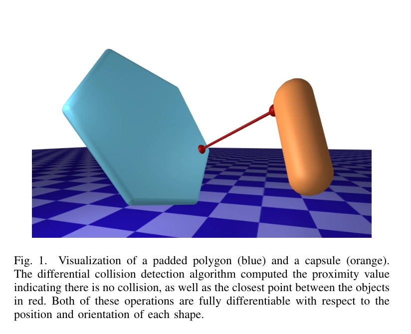
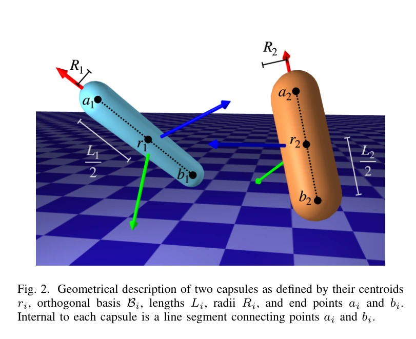
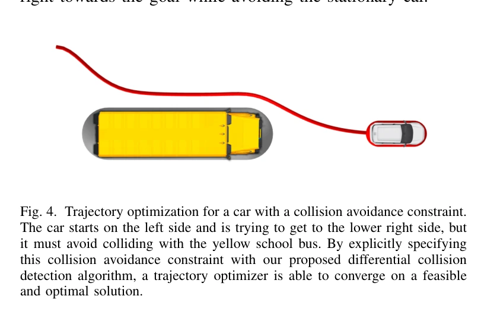

# DiffPills：把碰撞约束交给梯度优化

## 一屏概览

**研究问题。** 机器人用胶囊体或带厚度多边形近似后，怎样同时得到碰撞状态及其对位置、姿态的导数，供轨迹优化使用？

原文图 1；PDF 第 1 页。[查看原始来源](https://arxiv.org/pdf/2207.00202#page=1)

原文图 2；PDF 第 3 页。[查看原始来源](https://arxiv.org/pdf/2207.00202#page=3)

**核心贡献。** 先求两条中心线段、两个二维凸多边形，或线段与多边形之间的最近点；这些问题都可化为小规模凸二次规划（QP）。再减去两个形状的厚度，得到有符号的邻近指标。导数通过最优性条件求出，而不是逐条对几何判断分支求导。[原文第 II–IV 节](https://arxiv.org/abs/2207.00202)

**证据范围。** 第 V 节展示 ALTRO 优化胶囊体车辆避让静止车辆的轨迹；论文没有大规模速度基准、与其他方法的定量排名或完整摩擦接触仿真实验。状态估计和强化学习是作者提出的用途，不能写成已验证成果。

**版本。** 本页完整复核归档的 arXiv:2207.00202v1，2022-07-01，6 页，包含附录 A–B。此前链接误写为 `https://arxiv.org/abs/2207.00670`，按 PDF 首页更正；原始文件保持不变。

## 方法：从中心几何到有厚度的碰撞体

### 胶囊体之间的最近点

胶囊体 $i$ 由线段端点 $a_i,b_i\in\mathbb R^3$ 和半径 $R_i>0$ 定义。线段上的点可写成 $p_i=\theta_i a_i+(1-\theta_i)b_i$，其中 $0\le\theta_i\le1$；胶囊体是离该线段不超过 $R_i$ 的全部点。求解：

$$
\min_{\theta_1,\theta_2\in[0,1]}\frac12\|p_1-p_2\|_2^2.
$$

代入 $p_i$ 后，只有两个优化变量，目标为凸二次函数，约束为盒约束。令 $F=[a_1-b_1,\ b_2-a_2]$，则二次项矩阵为 $F^\top F$，线性项为 $F^\top(b_1-b_2)$。第 III 节式（19）、（25）–（26）给出相同求解形式；这里加入 $1/2$ 不改变最优点。

从最优中心点 $p_1^\star,p_2^\star$ 定义：

$$
\phi=\|p_1^\star-p_2^\star\|_2^2-(R_1+R_2)^2.
$$

$\phi>0$ 表示分离，$\phi=0$ 表示接触，$\phi<0$ 表示相交。它的量纲是长度平方，**不是以米表示的有符号距离**。因此同样的 $\phi$ 数值在不同半径、尺度下不能直接当成相同安全间隙。前半句来自式（20）；安全间隙解释是本页依据公式作出的推论。

中心点不重合时，胶囊体表面的对应点沿两中心点的连线恢复：

$$
\widetilde p_1=p_1^\star+R_1\frac{p_2^\star-p_1^\star}{\|p_2^\star-p_1^\star\|_2},\qquad
\widetilde p_2=p_2^\star+R_2\frac{p_1^\star-p_2^\star}{\|p_1^\star-p_2^\star\|_2}.
$$

这是原文式（21）–（22）。中心线相交导致分母为零时，不能直接套用该恢复公式；此时碰撞指标的定义仍有意义，接触方向却需另外处理。

### 最近点变量与安全间隙怎样对应

把两条线段上的点相减，得到 $p_1-p_2=F\theta+c$，其中 $\theta=(\theta_1,\theta_2)^\top$，$c=b_1-b_2$。展开平方：

$$
\tfrac12\|F\theta+c\|^2
=\tfrac12\theta^\top F^\top F\theta+(F^\top c)^\top\theta+\tfrac12c^\top c.
$$

最后一项对 $\theta$ 恒定，不改变最近点求解；$z^\top F^\top Fz=\|Fz\|^2\ge0$ 解释了凸性。盒约束则区分最近点位于线段内部、端点还是两端点：附录 A 的九候选方法正是一个内部候选、四条边和四个角点，而不是任意几何枚举。这些是第 III 节与附录 A 的代数展开。

**教学数值例。** 两胶囊半径均为 $0.1\,\mathrm m$，中心线最近距离 $d=0.25\,\mathrm m$ 时，$\phi=0.25^2-0.2^2=0.0225\,\mathrm m^2$，实际间隙是 $0.05\,\mathrm m$。若希望额外安全间隙 $s\ge0$，应写 $d\ge R_1+R_2+s$；等价的原指标约束为：

$$
\phi\ge 2(R_1+R_2)s+s^2.
$$

这个推导以精确中心距离与正半径为前提，说明为何不能直接把“留 5 厘米”写成 $\phi\ge0.05$。它是由指标定义得到的使用解释，不是论文报告的新实验。

下图按上述机制重画，用于说明信息流：

### 带厚度的多边形与混合配对

令二维凸多边形为 $C_i y_i\le d_i$，其世界坐标为 $p_i=r_i+\widetilde Q_i y_i$；$r_i$ 是位置，$\widetilde Q_i\in\mathbb R^{3\times2}$ 是姿态旋转矩阵的前两列。带厚度形状是离该多边形不超过 $R_i$ 的点集。原文式（29）描述的是多边形中心面；实际带厚度形状还需要这个距离条件，不能只复制式（29）当成整个三维实体的定义。

多边形—多边形查询最小化 $\|p_1-p_2\|^2$，同时满足各自的二维线性约束；胶囊体—多边形查询则将其中一个点换成线段参数化。消去 $p_i$ 后分别得到四变量或三变量 QP，再使用同一个 $\phi$ 公式。由此，方法扩展的关键是中心几何的凸约束，而不是枚举所有面—边组合。[第 IV 节，式（30）–（37）](https://arxiv.org/abs/2207.00202)

### 导数来自最优性条件

对标准 QP，令 $x$ 为优化变量，$\lambda$ 为不等式乘子，$\rho$ 为物体配置及其决定的 QP 参数。将驻点与互补条件写成 $g(y^\star,\rho)=0$，其中 $y=(x,\lambda)$。当对应雅可比可逆时：

$$
\frac{\partial y^\star}{\partial\rho}
=-\left(\frac{\partial g}{\partial y}\right)^{-1}\frac{\partial g}{\partial\rho}.
$$

第 II-C 节式（10）–（17）说明可复用内点法的矩阵分解来计算反向导数。胶囊体的二维盒约束还可用附录 A 的九候选活动集算法求解；附录 B 给出内点法线性系统的 Cholesky 求解。**“可微优化”有局部正则性条件**，不是对任意退化配置都自动获得唯一最近点与连续梯度的承诺；这是原文可逆条件和点恢复公式共同限定的阅读结论。

## 实验实际证明了什么

| 证据位置 | 设置与观察 | 能支持的判断 |
| --- | --- | --- |
| 第 V 节、图 4 | 一辆受加速度和转向角速度控制的车辆避让静止大型车辆；碰撞体为胶囊体；ALTRO 使用 $\phi\ge0$ 约束 | 该碰撞指标及导数可以接入需要梯度的车辆轨迹优化 |
| 附录 A、算法 4–5 | 两变量盒约束枚举内部点、边和角点，并恢复对偶变量 | 给出了小问题专用求解方法；没有配套定量速度消融 |
| 第 II-C 节、附录 B | 复用求解时的线性系统分解 | 给出低额外求导成本的算法依据；不能据此写成对 GJK 的实测速度优势 |

原文图 4；PDF 第 5 页。[查看原始来源](https://arxiv.org/pdf/2207.00202#page=5)

## 局限与我们的解释

**原文范围。** 几何族限于胶囊体和带厚度凸多边形；复杂非凸形状需先近似为基元集合。汽车示例验证避碰，不验证碰撞后的接触冲量、摩擦和能量演化。

**我们的解释。** 若中心几何已经相交，平方距离可在一段配置范围内保持零，$\phi$ 随之保持负常数；因此“负值能判碰撞”不保证“负值梯度总能指向脱离穿透的方向”。这可直接从式（20）推得，但不是论文给出的失效统计。[[dcol-differentiable-collision-detection-for-a-set-of-convex-primitives|DCOL]] 改用最小均匀缩放，适合与此比较；两篇原始稿都出现在 2022 年 7 月，不能仅依据编号把它们描述为相隔很久的技术代际。

相关基础：[[DifferentiableCollisionDetection|可微碰撞检测]]、[[CollisionGeometryForRobotSimulation|机器人仿真的碰撞几何]]、[[DifferentiablePhysics|可微物理]]。论文公开实现为 [DiffPills.jl](https://github.com/kevin-tracy/DiffPills.jl)，本页未复核其当前代码状态。

## 研究归属

[[topics/physics-simulation|物理仿真]] · [[topics/collision-geometry|碰撞几何如何兼顾精度与计算]]。
