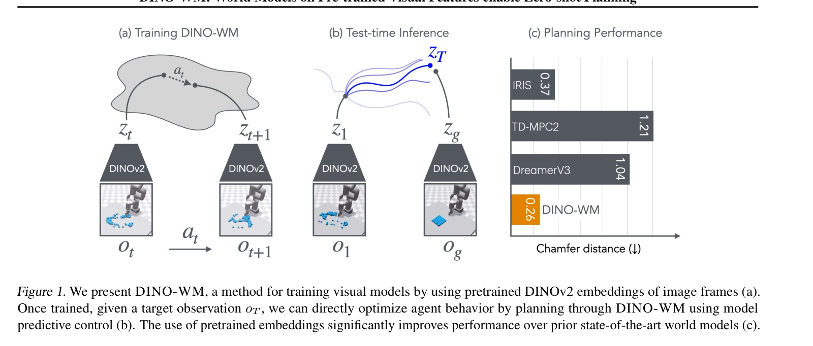
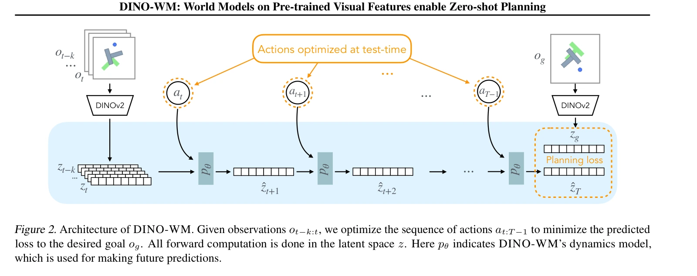

# DINO-WM：用预训练视觉特征进行目标规划

## 一屏概览

**研究问题。** 在只有预先收集的图像—动作轨迹、没有任务奖励时，能否学到可复用于新目标的世界模型，测试时再通过搜索得到行为？

原文图 1；PDF 第 3 页。[查看原始来源](https://proceedings.mlr.press/v267/zhou25t.html#page=3)

原文图 2；PDF 第 4 页。[查看原始来源](https://proceedings.mlr.press/v267/zhou25t.html#page=4)

**方法贡献。** Gaoyue Zhou、Hengkai Pan、Yann LeCun、Lerrel Pinto 冻结 DINOv2 的空间图像块特征，训练动作条件化的 Transformer 预测下一帧特征，再让预测终态接近目标图像的特征。解码器仅用于可视化，任务执行不必生成视频，也不需要预学逆动力学或目标专用策略。

**证据范围。** [ICML 2025 正式论文](https://proceedings.mlr.press/v267/zhou25t.html)在六类仿真环境和三组配置泛化实验中验证视觉目标规划。这里的「零样本」指学好环境动力学后为新目标直接规划，**不是零训练数据、无动作数据或全新现实世界的零适配控制**。

## 方法：把目标图像变成可优化的终态距离

令 $o_t$ 为图像、$a_t$ 为动作、$E$ 为冻结 DINOv2 编码器。$z_t=E(o_t)\in\mathbb R^{N\times d}$ 是 $N$ 个空间图像块的 $d$ 维特征，保留二维位置结构。长度为 $h$ 的历史通过动作编码器 $\varphi$ 与转移预测器 $F_\theta$ 得到

$$
\hat z_{t+1}=F_\theta(z_{t-h+1:t},\varphi(a_{t-h+1:t})),\qquad
\mathcal L_{\rm pred}=\sum_t\|\hat z_{t+1}-E(o_{t+1})\|_2^2.
$$

这是对 §3.1、式 1 的统一下标写法。动作先由 MLP 映射后拼到每个图像块；可用本体信息也按类似方式接入。模型在训练时接收真实中间帧，即教师强制训练；推演未来时则把自己的预测继续作为输入。特征编码器始终冻结，损失只训练转移与动作编码等新增组件。

### 从一帧张量到一段未来

动作编码为 $\varphi(a_t)\in\mathbb R^k$ 后，广播到 $N$ 个图像块，与每块 $z_t^{(i)}\in\mathbb R^d$ 拼接，形成 $N\times(d+k)$ 的输入；若有本体信息，同样接入。这使每个位置都能知道同一条动作命令，而不是只给网络一个无法对应到空间位置的外部标量（§3.1.2）。

预测器处理最近若干帧的块序列，输出下一整帧的特征。它按**时间帧**自回归，不是在一幅图内部先生成左上块、再逐块生成剩余位置；原文以此与 IRIS 的逐标记预测作区分。长度为 $h$ 的真实历史在部署中会逐渐被预测历史替换，因此接下来的掩码和训练输入方式直接决定规划是否可用。

**教学示意。**训练要预测 $z_2$ 时可看 $z_0,z_1$ 与已知动作，不能看同一训练片段里的真实 $z_2$；规划时预测出 $\hat z_2$，再将它加入历史以预测 $\hat z_3$。若没有因果限制，训练的中间输出可能借未来真值完成任务，部署时这条信息路径消失，解释了表8中训练看似可行但控制崩溃的风险。

### 为什么是图像块，而不是一个全局向量

全局向量可能保留「有机械臂和物体」，却损失精细位置和接触关系；图像块让不同空间位置保留单独特征。表 2 的 DINO 图像块、DINO 全局 CLS、R3M 与 ResNet 对照，以及表 3 的状态线性探测支持这种表示在所测任务中的价值。作者对「空间细节为何更适合控制」的解释具有合理性，但这些结果没有证明所有图像块编码器都优于所有全局表示：表 3 中 MAE 同样采用图像块，却表现较弱。

Transformer 使用帧级因果掩码：预测某帧时不能读取未来真实帧；同帧空间块共同参与预测。掩码不仅是架构偏好，也是防止教师强制序列训练泄漏未来信息的条件（§3.1.2，附录 A.4.1）。

### 解码可选，目标距离不可省

可视化解码器 $D_\psi$ 独立学习 $\|D_\psi(E(o_t))-o_t\|_2^2$，解码损失不回传转移预测器。规划时给定当前观测 $o_0$ 和目标图像 $o_g$，对候选动作序列滚动预测，最小化

$$
a^*_{0:T-1}\approx\arg\min_{a_{0:T-1}}\|\hat z_T-E(o_g)\|_2^2,
\qquad \hat z_{t+1}=F_\theta(\text{最近历史},a_t).
$$

这里 $T$ 是规划时域，$\hat z_0=E(o_0)$。[[CrossEntropyMethod|CEM]] 从高斯动作分布采样，保留目标距离最小的候选并重拟合，执行前一段动作后根据新观测重规划（§3.2、附录 A.5）。**没有任务奖励模型不等于没有目标函数**：目标特征距离本身就是人为选定的优化准则。基础机制见 [[VisualGoalPlanning|视觉目标规划]]、[[ModelPredictiveControl|模型预测控制]]。

模型可微，因此也能对动作求梯度；然而可微不保证目标曲面好优化。附录 A.5 显示 CEM 优于其直接梯度下降设置，闭环再规划又能改善开环结果。本文通过搜索动作后果实现控制，不必另训 [[InverseDynamicsModels|逆动力学模型]]。

### 冻结表示与独立解码器怎样改变优化目标

若把像素重建损失经解码器回传到转移模型，转移不仅要预测预训练特征，还要帮助还原纹理等像素细节；独立解码器切断这项额外要求。**我们的机制解释：**冻结 $E$ 又固定了目标空间，预测器不能通过同步移动编码目标来降低误差，而必须逼近既定视觉表示。这能解释设计动机，但是否更利于控制要看附录 A.4.2 的实际消融，不能仅从“冻结”推断所有任务都受益。

因此训练、规划和展示有三条分工：图像经 $E$ 产生固定监督；$F_\theta$ 学动作后果并供 CEM 评分；$D_\psi$ 把特征变成可看的图像。论文特有贡献是这三条路径的拆分，共享的目标距离与闭环搜索机制见 [[VisualGoalPlanning|视觉目标规划]]。

## 实验与消融

### 主结果与比较协议

前四个环境各评测 50 对初态—目标，绳索和颗粒各 10 个实例。前四列为成功率（越高越好）；后两列是 Chamfer 距离（越低越好），不是成功率（§4.3、表 1）。

| 模型 | Maze | Wall | Reach | PushT | Rope 距离 | Granular 距离 |
|---|---:|---:|---:|---:|---:|---:|
| IRIS | 0.74 | 0.04 | 0.18 | 0.32 | 1.11 | 0.37 |
| DreamerV3 | 1.00 | 1.00 | 0.64 | 0.30 | 2.49 | 1.05 |
| TD-MPC2 | 0.00 | 0.00 | 0.00 | 0.00 | 2.52 | 1.21 |
| DINO-WM | 0.98 | 0.96 | 0.92 | 0.90 | 0.41 | 0.26 |

这里所有基线均在离线轨迹上**去掉奖励和任务信息**训练，再统一接 MPC；Dreamer 使用第三方 PyTorch 实现（§4.2、附录 A.7）。因此尤其不能用 TD-MPC2 的零成功率证明它在原始有奖励在线学习中无效。原论文自身的条件见 [[td-mpc2-scalable-robust-world-models|TD-MPC2]]。

PushT 要求推手与 T 形物体同时达到随机可行目标，而非仅对齐通常的固定绿色区域；Reach 要求整条双关节手臂匹配目标姿态，而非只看末端。这些任务定义会改变与常见同名基准的可比性（附录 A.1）。

### 哪些实验支撑机制判断

| 问题 | 原文定位 | 观察与限定 |
|---|---|---|
| 保留图像块是否有帮助 | 表 2 | PushT 成功率：DINO 图像块 0.90，DINO CLS 0.44，R3M 0.42，ResNet 0.20；是此表示—模型—规划组合的结果 |
| 因果掩码是否避免泄漏 | 附录 A.4.1、表 8 | 历史 3 帧时，有掩码 0.92，无掩码 0.08；无掩码训练可偷看未来，执行时却不可得 |
| 重建损失是否必要 | 附录 A.4.2、表 9 | 独立训练预测器 0.92，增加解码器回传损失 0.80；不是所有重建式模型都无效的证明 |
| 搜索与反馈各有什么用 | 附录 A.5.3、表 10 | PushT 开环 CEM 0.86、开环梯度下降 0.28、CEM 闭环 MPC 0.90 |
| 新场景配置 | §4.5、表 4 | WallRandom 0.82、未见形状 PushObj 0.34、GranularRandom 距离 0.63；未知形状仍很困难 |
| 数据量增加 | §4.8、表 7 | PushT 从 200 条轨迹的 0.08 升到 18,500 条的 0.92；主表为 0.90，不应擅自合并两组数字 |
| 计算成本 | 附录 A.6、表 11 | A6000 单步推断、批量 32 为 0.014 秒；100 候选 × 10 轮 CEM 规划为 15.89 秒；单步推断速度不等于控制周期 |

### 训练数据和复现细节不能被摘要省略

**训练数据包含专家来源。** 摘要强调无需专家示范，但附录 A.1 明确写 PushT 的 18,500 条数据由已发布专家轨迹加不同程度噪声重放而来；其他环境大量采用随机动作。准确表述是「方法训练不要求给出目标专用专家策略或奖励」，不能写成「所有实验完全没有专家数据」。

**原文内部有配置差异。** §4.1 与表 13 写图像 224，附录 A.7 又写编码前缩到 196、输出 $14\times14$ 个 384 维块；附录 A.1 的绳索／颗粒轨迹为 20 步，表 12 则列 5 步。这些文本尚不足以唯一确定复现配置，本页保留差异而不擅自统一。本文没有独立复现代码来解决这两处问题。

## 局限与我们的解释

**来源支持的局限。** 需要覆盖足够状态和动作的离线数据，以及真实动作记录；不能直接把大量无动作互联网视频当作同等训练输入。未见物体的接触参数难以从有限形状训练推断，PushObj 的 0.34 说明问题仍未解决（§4.5、§5）。全部实验为仿真，不是实际机器人部署验证。

**我们的解释。** 此工作的强项是把预训练感知与环境动作动力学分开，让同一动力学服务不同图像目标。可迁移性仍有三层条件：编码器须保留控制相关信息，数据须覆盖拟采取的动作后果，特征距离须与目标完成一致。LPIPS／SSIM 改善能帮助诊断预测，但不能单独替代闭环成功率或 [[WorldModelEvaluation|动作执行评测]]。与 [[v-jepa-2-understanding-prediction-planning|V-JEPA 2-AC]] 对照时，应区分图像表征规划、视频预训练和真机动作后训练各自提供的证据。

## 作者示例：预测与执行是否一致

[作者官方项目页](https://dino-wm.github.io/)的 PushT 视频上排为仿真执行观测，下排为模型想象，右侧为目标。可追踪接触后的物体位置与朝向；这是作者选择的示例，不能替代整组统计或独立复现。

<video controls preload="none" playsinline aria-label="DINO-WM 作者提供的 PushT 预测与执行对照">
  <source src="https://dino-wm.github.io/mfiles/env/media/exp1_all5envs/pusht_ours.mp4" type="video/mp4">
  浏览器无法播放时，可打开作者项目页查看示例。
</video>

资料版本与归档

完整阅读 PMLR 267 的正式会议 PDF（79115–79135）；会议为 2025-07-13 至 2025-07-19，页面未明确单篇发表日，所以 `source_date` 保留 `unknown`。PDF：<https://raw.githubusercontent.com/mlresearch/v267/main/assets/zhou25t/zhou25t.pdf>。获取日期：2026-10-02；SHA-256：`f054a2c03888aa9a50b7747fb99a168f2979cb7fa216b075011b089d45b628db`。

视频出处的官方页面另存 `raw/dino-wm-project-20261002.html`，缓存 `graph/extracts/dino-wm-project-20261002.md`，同日获取，SHA-256：`6de45e515776483ea319744cd2ca6a0b45ddda613f6e9bd24cd7816637e6433b`；它与论文属于同一方法的补充资料，不计为独立实验来源。媒体仅远程嵌入，不自动播放或下载。

## 研究归属

[[topics/world-models-and-representations|世界模型与表征]] · [[topics/planning-and-control|规划与控制]] · [[topics/evaluation-and-transfer|评测与现实迁移]] · [[topics/world-model-decision|世界模型如何用于决策]] · [[topics/world-model-evaluation|如何验证世界模型的动作后果]]。
