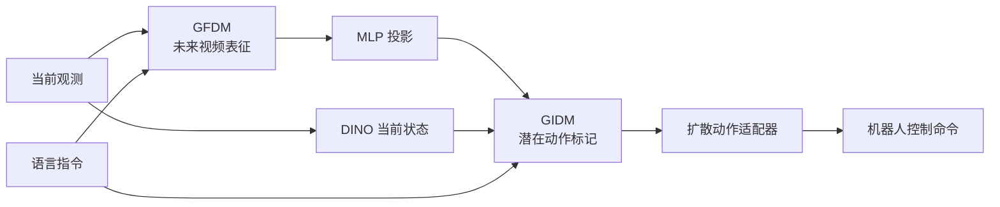

## 摘要

这篇 ICLR 2026 论文提出 DeFI：先分别预训练正向动力学与 [[InverseDynamicsModels|逆动力学模型]]，再在机器人任务上耦合微调。它强调，从视频预测未来与从状态变化推断动作，都值得进行规模化预训练；逆动力学不能只被视为轻量动作解码器。

阶段 I 中，GFDM（通用正向动力学模型）以 Stable Video Diffusion 和 CLIP 文本编码器为基础，学习指令条件下的未来视频预测；GIDM（通用逆动力学模型）则用 DINOv2 当前/未来帧特征、T5 指令嵌入、时空 Transformer 和 VQ-VAE 码本，从无动作标签的视频状态变化中学习离散潜在动作。GIDM 预训练不使用机器人动作与本体感知状态，而以重建未来 DINO 特征为代理目标。

阶段 II 冻结 GFDM，通过单步去噪产生 16 帧未来表征，经 MLP 对齐后交给 GIDM 推断潜在动作，再由扩散动作适配器生成机器人命令。这样，无动作标注的人类和机器人视频也能服务于逆动力学表示预训练，下游控制仍由机器人动作数据完成适配。

来源网址: https://openreview.net/forum?id=DdrsHWobR1

PDF 网址: https://openreview.net/pdf?id=DdrsHWobR1

## 核心主张

- 论文认为，将 2D 未来视觉预测与 3D 动作预测直接耦合到一个 VLA 目标中，可能造成目标不匹配，也限制无动作标注的网络视频与人类视频的使用。DeFI 先分别学习 GFDM/GIDM，再用下游机器人数据耦合。
- GIDM 的样本为 $(o_t,o_{t+n},\ell)$：当前帧 $o_t$、约一秒后的未来帧 $o_{t+n}$ 和语言指令 $\ell$。模型提取 DINO 特征 $e_t,e_{t+n}$，再用可学习动作查询、因果时空 Transformer 和 VQ-VAE 码本形成离散潜在动作标记。
- 自监督代理目标是：用当前 DINO 状态和潜在动作标记重建未来 DINO 状态。论文将潜在动作视为概括状态变化中动作因素的表示，而非直接可执行的机器人控制命令。
- 数据分工明确：GFDM 使用 Fractal、Bridge、CALVIN-ABC、Something-Something-v2 和 Ego4D；GIDM 使用 Open X-Embodiment 中的单臂末端执行器控制子集和 Ego4D，并在预训练时排除动作与本体感知标签。
- CALVIN ABC-D 多视角设置中，DeFI 平均连续任务长度为 4.51，对照为 VPP 4.33、Seer 4.28、UP-VLA 4.08 和 OpenVLA 3.27；第三人称视角设置中为 4.05，对照 UniVLA 为 3.80。
- SimplerEnv-Fractal 的 Google 机器人评估中，视觉匹配与变体汇总设置的平均成功率分别为 51.2% 和 45.4%。Open/Close Drawer 等任务仍受到 GFDM 现实世界预训练域与仿真域不匹配的影响，预测错误会传给 GIDM。
- Franka Panda 现实世界实验包含 8 个任务、1600 条轨迹；DeFI 平均成功率为 81.3%，对照为扩散策略 48.2%、Octo-Base 34.4% 和 OpenVLA 43.8%。
- 预训练消融中，未预训练 GFDM 时平均任务长度为 3.28，未预训练 GIDM 时为 4.16，完整解耦预训练为 4.51。逆模型结构消融中，MLP 为 3.42、普通 Transformer 为 4.22、GIDM 为 4.51。
- VQ-VAE 既离散化动作表示，也构成信息瓶颈。论文认为，这限制了未来状态信息泄漏和低层视觉捷径，促使模型将状态变化压缩为有意义的潜在动作表示。
- CALVIN 的 200 个失败样本中，62% 属于正向动力学失败，常见于复杂接触或杂乱场景中的错误想象、物理上不合理的未来预测；38% 属于逆动力学失败，即未来预测较准确，但推断出的动作仍有错误。

## 模型结构

GFDM 提供指令条件下的未来视觉表征；MLP 将其投影到 GIDM 的输入空间，与当前 DINO 状态一起支持潜在动作推断。扩散 Transformer 动作适配器再将这些潜在动作转为 7 维机器人控制命令。

预训练让两个动力学分支分别学习；耦合阶段固定正向分支，适配逆动力学和动作输出。GFDM 的预测误差与 GIDM 的动作推断误差仍是两种独立的失败来源。

## 关键引文

- "accurate action inference is as important"

## 关联

- [[InverseDynamicsModels|逆动力学模型]] - GIDM 如何从无动作标签的视频状态变化中学习潜在动作。
- [[LatentDynamicsActionModels|潜在动力学动作模型]] - 与 LDA-1B 对照动作表示和动力学预训练的扩展路线。
- [[VisionLanguageActionModels|视觉—语言—动作模型]] - 将未来预测与动作预测先分别预训练、再耦合的方法。
- [[WorldModelsForEmbodiedAI|具身智能世界模型]] - GFDM 为动作决策提供未来预测；正向预测仍需配合可靠的逆动力学推断。
- [[SimulationRealityGap|仿真—现实差距]] - SimplerEnv 中的域不匹配，以及复杂接触预测错误向动作分支传播的证据。

## 开放问题

- 来源页面显示代码与 HuggingFace 入口，但提取缓存未保留具体链接；代码、检查点、许可证和独立复现状态仍需核验。
- GIDM 预训练不使用动作和本体感知标签，但最终策略仍依赖下游机器人动作数据训练适配器。可迁移的潜在动作表示不等于完全无动作标注的策略学习。
- 重建未来 DINO 特征能否充分约束接触力、触觉滑移、抓取稳定性与可变形物体状态？论文失败分析已经显示，复杂接触和杂乱场景是正向预测的重要瓶颈。
- 不同机器人形态、控制频率和动作空间能否共享 VQ 码本中的动作标记语义，仍需要跨机器人形态验证。
- GFDM 冻结有助于维持稳定表征，但部署域不匹配时，误差仍会传给 GIDM。如何进行域适配而不导致表征漂移，是待验证的问题。
