# EmbodiedGen：从生成三维内容到可导入仿真的资产

## 一屏概览

**研究问题。** 图像或文本生成的三维模型通常只有外观，缺少公制尺度、物理参数、可靠几何和机器人描述文件。EmbodiedGen 把这些缺口作为一个资产制作系统处理，输出可导入仿真的物体、关节物体、纹理和背景。

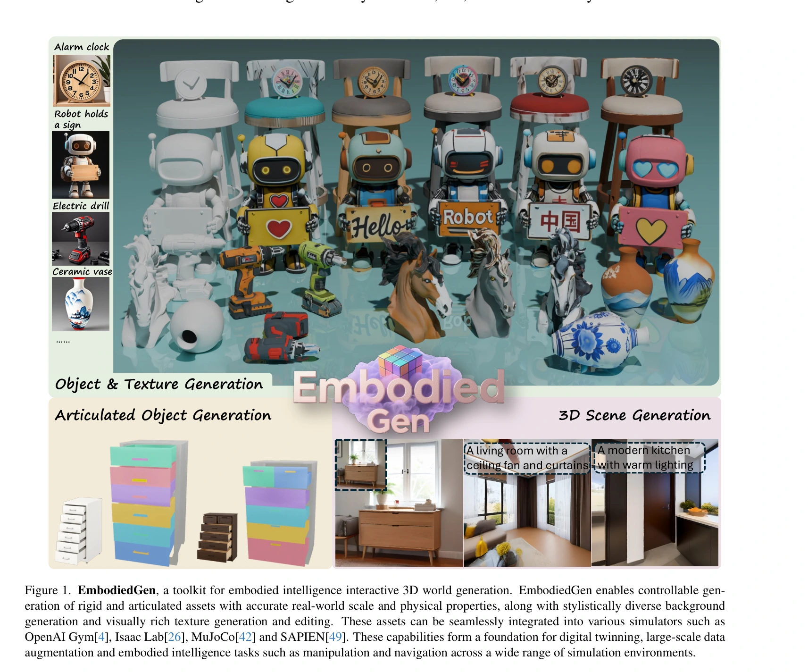

原文图 1；PDF 第 1 页。[查看原始来源](https://arxiv.org/pdf/2506.10600#page=1)

**核心贡献。** 系统复用 TRELLIS 等生成模型，在外围增加分阶段质量检查、失败重试、视觉语言模型估计的尺度与物理属性、纹理反投影和 URDF 导出；GeoLifter 则为二维扩散模型加入跨视角几何条件。贡献主要是模块组合与资产后处理，不是一个从文本直接学出真实动力学的端到端模型。[论文 §3、图2–3](https://arxiv.org/pdf/2506.10600v2#page=3)

**结论范围。** 论文展示多种生成结果和仿真接入；明确的质量检查定量实验是 150 个杯子，检查器识别“不可用资产”的精确率为 68.7%、召回率为 76.7%。视觉示例和能导入仿真不能证明质量、摩擦或接触响应与真实物体一致。

本页复核本地 `raw/embodiedgen.pdf`，对应 arXiv:2506.10600v2，PDF 标注 2025-06-16；元数据 `source_date` 保留原登记日期 2025-06-12。完整阅读 16 页，含参考文献。项目归入 [[EmbodiedGen|EmbodiedGen]]。

## 方法：每一阶段解决什么

### 从条件输入到带物理元数据的资产

图像先分割前景，再由 TRELLIS 生成网格与三维高斯表示。文本路径先用 Kolors 生成候选图像，再复用同一图像转三维服务：这样可以在昂贵的三维生成前发现图文不符或前景缺失。后端模型可替换，数据检查与导出接口继续复用。[§3.1–3.2、图3、图9](https://arxiv.org/pdf/2506.10600v2#page=4)

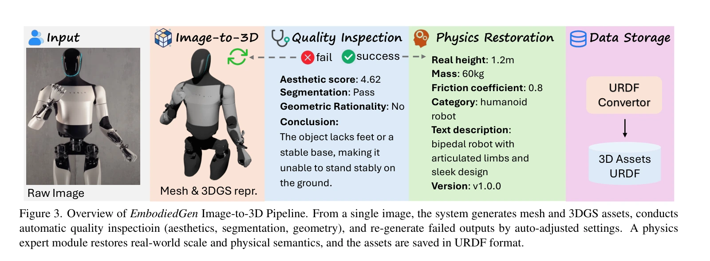

原文图 3；PDF 第 4 页。[查看原始来源](https://arxiv.org/pdf/2506.10600#page=4)

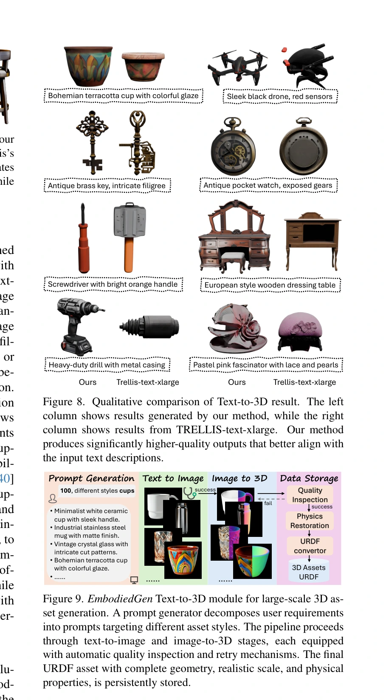

原文图 8、9；PDF 第 6 页。[查看原始来源](https://arxiv.org/pdf/2506.10600#page=6)

质量检查分为三个不同问题：AestheticChecker 给视觉细节打分；ImageSegChecker 判断前景是否被截断，失败时切换 SAM、REMBG 或 RMBG14；MeshGeoChecker 从四个正交视图判断几何完整性与合理性。失败资产回到对应阶段调整设置与种子重试。它们不是碰撞求解器测试，也没有直接测量现实物理参数。

物理属性模块使用 GPT-4o、Qwen 等模型，根据渲染视图和语义提示估计高度、质量、摩擦及类别。高度决定统一缩放比例，网格与三维高斯同时缩放；“老虎玩具”和“真实老虎”需要语义区分。**这些是语义先验估计，不是经真实交互辨识得到的测量值。** 论文称其为物理属性恢复，但本版本没有给出尺度、质量与摩擦的误差表。[§3.1](https://arxiv.org/pdf/2506.10600v2#page=4)

### 纹理反投影与 GeoLifter

为避免把高光、阴影烘焙进材质，算法1先对多视角图像去光照，再逐视角做四倍超分辨率，最后根据表面法线、可见性、深度边缘与视角置信度加权融合到 UV 纹理。默认剔除视角与法线夹角超过 $70^\circ$ 的样本；输出纹理可达 $2048\times2048$。这是外观处理，不能改变接触几何。[§3.1、算法1、图7](https://arxiv.org/pdf/2506.10600v2#page=5)

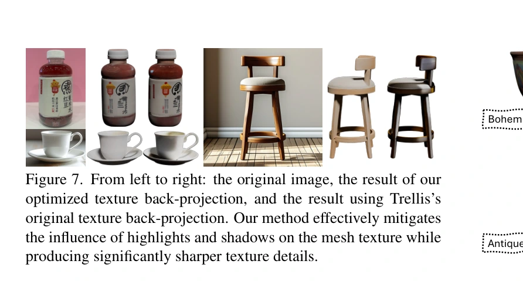

原文图 7；PDF 第 6 页。[查看原始来源](https://arxiv.org/pdf/2506.10600#page=6)

GeoLifter 冻结基础二维扩散模型，训练轻量几何条件模块。六个视角的法线、物体坐标与二值遮罩组成七通道条件，通过交叉注意力注入去噪过程；同一三维点投影到不同视图后，对应潜在特征应一致。原文式(1)–(3)的目标为：

$$
\mathcal L=\mathcal L_{\mathrm{LDM}}+0.02\mathcal L_{\mathrm{spatial}},\qquad
\mathcal L_{\mathrm{LDM}}=\mathbb E_{x,\epsilon,t}\|\epsilon-\epsilon_\theta(z_t,t,c)\|_2^2.
$$

这里 $x$ 是训练图像，$z_t$ 是时刻 $t$ 的带噪潜变量，$\epsilon$ 是加入的噪声，$c$ 是条件；$\mathcal L_{\mathrm{spatial}}$ 对同一三维点的跨视图特征使用 Smooth L1 损失。几何损失约束“不同视图描述同一表面”，扩散损失维持图像生成能力；只有存在有效对应点的样本参与几何项。[§3.4、图11–12、式(1)–(3)](https://arxiv.org/pdf/2506.10600v2#page=8)

### 把 GeoLifter 的训练和生成分开看

普通二维模型可以把正面生成成红色、背面生成成蓝色：每幅图单独合理，却不能映射成一致材质。GeoLifter 的条件不是只告诉模型“有个物体”，而是为每个可见像素提供表面法线、物体局部三维位置和是否属于物体的遮罩。前三维描述朝向，后三维定位同一表面，最后一维排除背景；六视图按空间布局拼接，再沿通道形成七维条件。它训练的是接到既有二维模型上的几何模块，而非重训整套图像生成器。[§3.4、图11](https://arxiv.org/pdf/2506.10600v2#page=8)

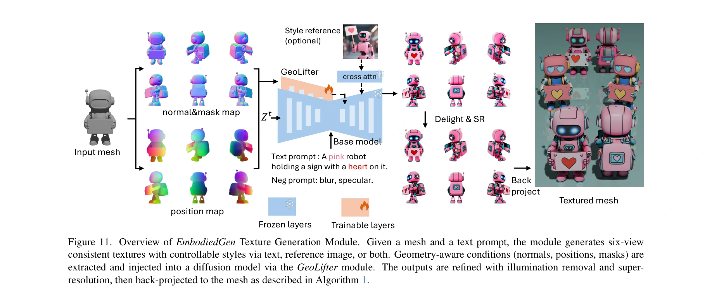

原文图 11；PDF 第 8 页。[查看原始来源](https://arxiv.org/pdf/2506.10600#page=8)

原文式(2)将对应点损失写为：

$$
\mathcal L_{\mathrm{spatial}}=\frac1B\sum_{b=1}^{B}
\mathbf1_{\{|r_b|>0\land|s_b|>0\}}
\operatorname{SmoothL1}\bigl(f_b(r_b),f_b(s_b)\bigr).
$$

$B$ 是训练批量，$r_b,s_b$ 是同一表面点在参考／搜索视图中的对应像素集合，$f_b$ 取出对应位置的潜在特征。几何映射先确定“谁应该相同”，损失再惩罚这些特征的差异；无有效对应时跳过该样本。它不要求所有视角的全部像素相同，而只约束确实对应的表面位置。[图12、式(2)](https://arxiv.org/pdf/2506.10600v2#page=8)

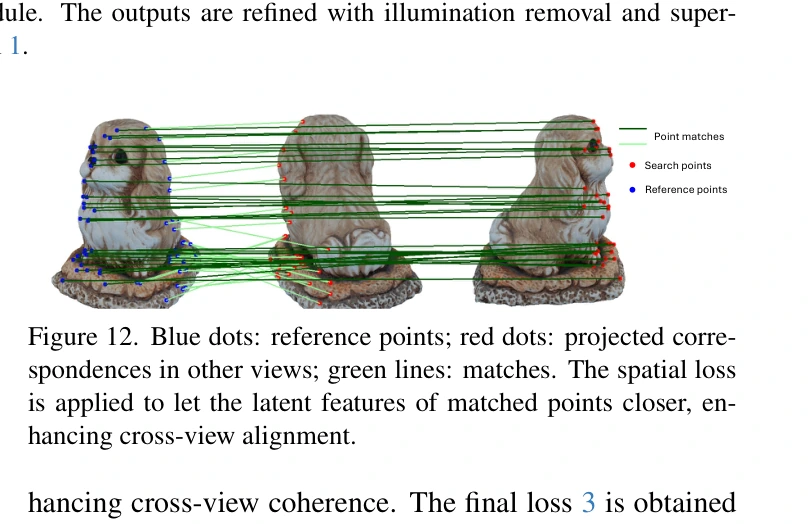

原文图 12；PDF 第 8 页。[查看原始来源](https://arxiv.org/pdf/2506.10600#page=8)

**教学例子：** 机器人胸前同一颗心形图案同时出现在正面与斜视图中。位置图把两个像素连回同一表面点，空间项鼓励其特征一致；侧面遮住该图案时，没有可用对应点就不强行配对。去噪项仍负责“生成像图片的内容”，空间项负责“同一表面跨视图别互相矛盾”。该例解释图11–12，不是额外实验。

生成时输入已有网格、文字或风格参考，计算几何条件后执行去噪，得到多视图图像；无需为每个物体重新训练。随后去光照、超分和反投影把视图变成一张 UV 材质。图11因此是一条“条件生成→纹理加工”的路径，训练损失不会在每次导出 URDF 时重新优化。资产和碰撞表示的共享基础见 [[SimulationReady3DWorldGeneration|可仿真资产表示]]。

### 关节物体、背景与场景组合

关节物体模块采用 DIPO：输入静止和关节运动后的双状态图像，以减少单张图像无法确定关节运动方式的歧义；扩散 Transformer 注入双状态条件，图推理器给出部件连通关系作为注意力先验。自动数据扩充通过语言描述、网格空间推理和已有部件检索构造 PM-X，含 600 个关节物体。这里的 DIPO 是被系统采用的方法，不能把其全部贡献重新归给 EmbodiedGen。[§3.3、图10](https://arxiv.org/pdf/2506.10600v2#page=7)

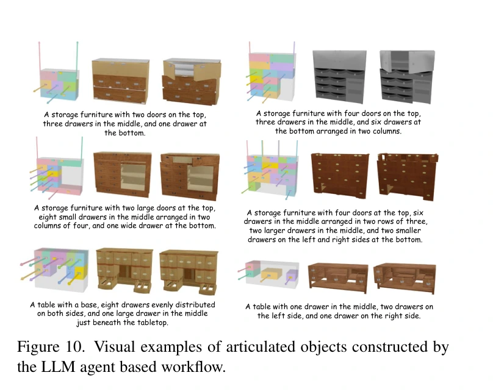

原文图 10；PDF 第 7 页。[查看原始来源](https://arxiv.org/pdf/2506.10600#page=7)

背景由全景图生成、质量筛选、Pano2Room 网格重建、补洞与三维高斯细化构成，最后估计尺度并对齐地面坐标。图2的场景设计器把任务分解为背景与可交互物体再组合；本版本没有给出 V2 那种明确的可达性、支撑与碰撞联合布局约束。RoboSplatter 用三维高斯负责显示，MuJoCo 等仿真器负责物理更新，两种表示承担不同职责。[§3.5–4、图14–23](https://arxiv.org/pdf/2506.10600v2#page=10)

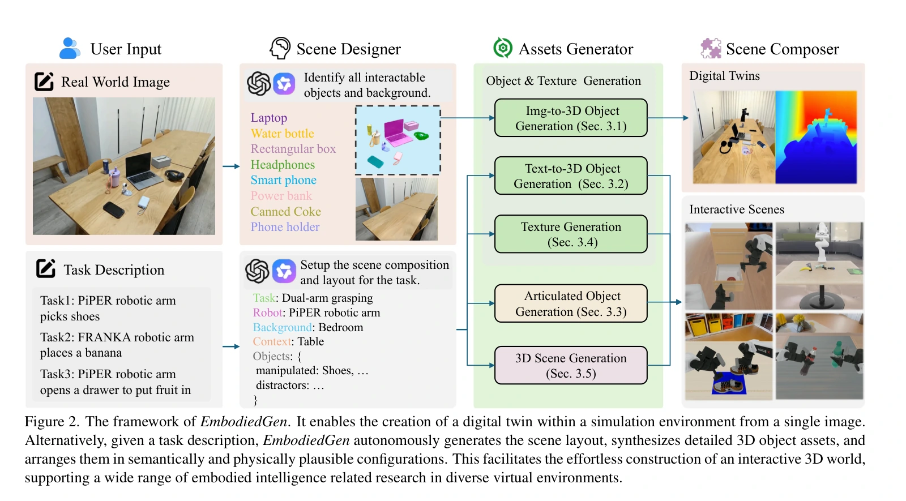

原文图 2；PDF 第 3 页。[查看原始来源](https://arxiv.org/pdf/2506.10600#page=3)

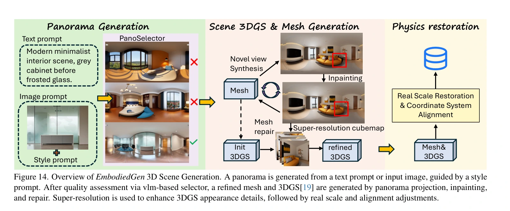

原文图 14；PDF 第 10 页。[查看原始来源](https://arxiv.org/pdf/2506.10600#page=10)

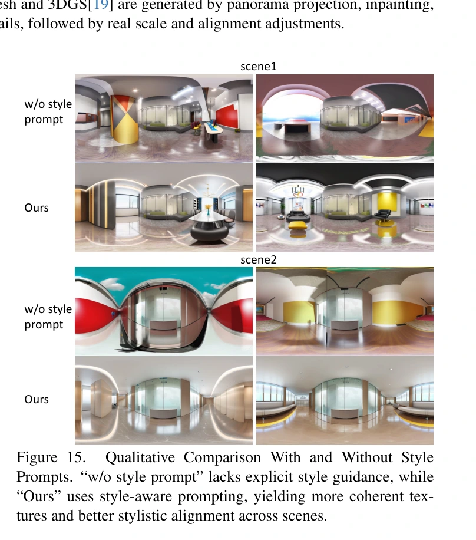

原文图 15；PDF 第 10 页。[查看原始来源](https://arxiv.org/pdf/2506.10600#page=10)

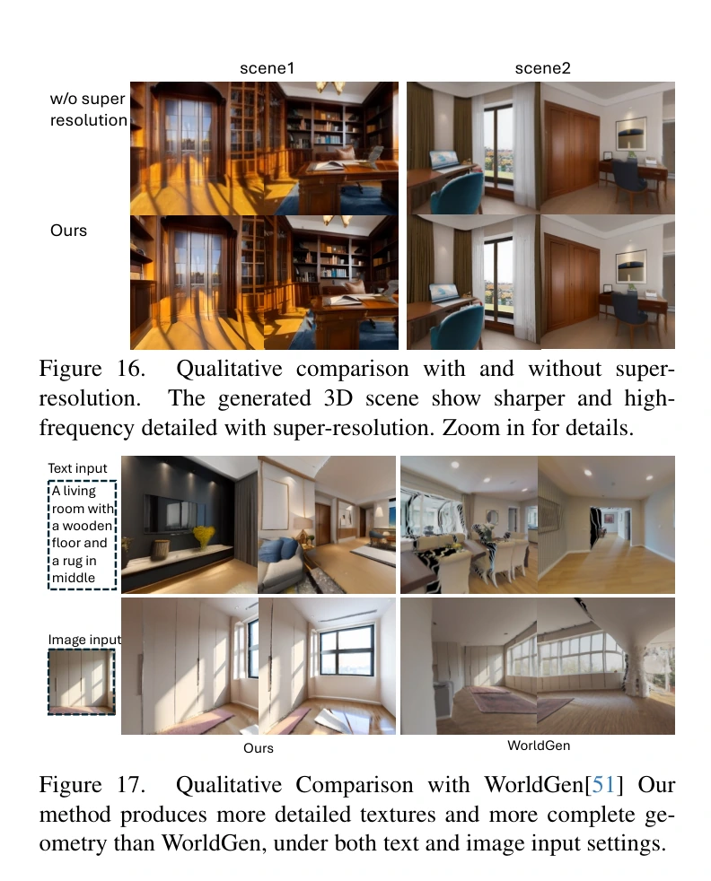

原文图 16、17；PDF 第 11 页。[查看原始来源](https://arxiv.org/pdf/2506.10600#page=11)

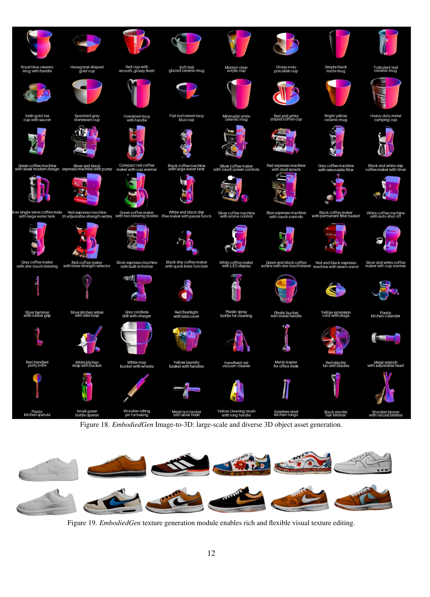

原文图 18、19；PDF 第 12 页。[查看原始来源](https://arxiv.org/pdf/2506.10600#page=12)

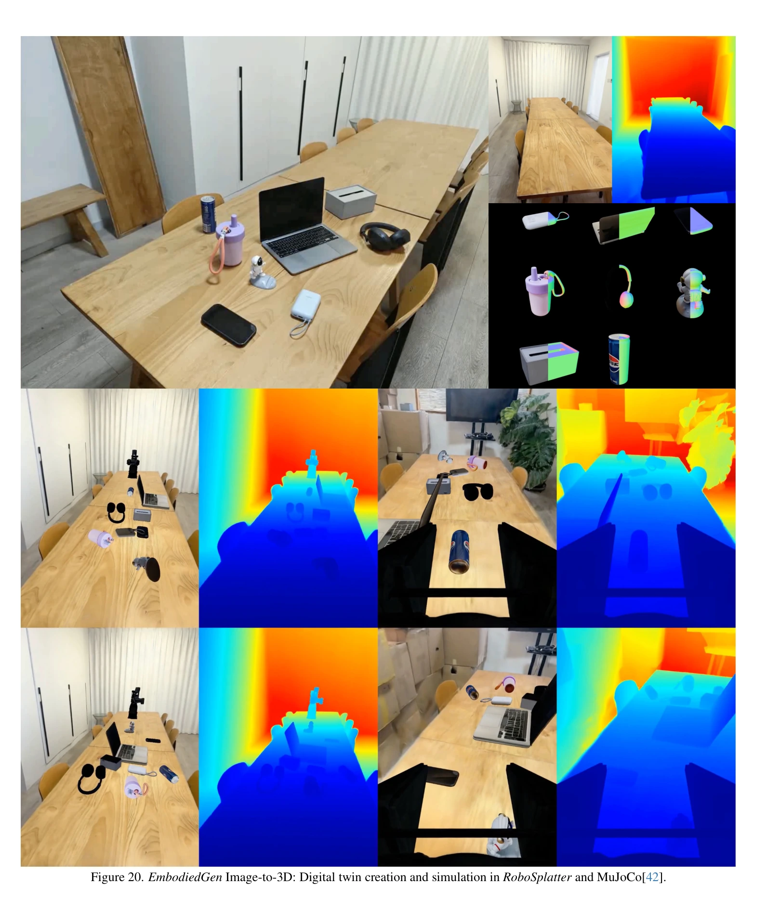

原文图 20；PDF 第 13 页。[查看原始来源](https://arxiv.org/pdf/2506.10600#page=13)

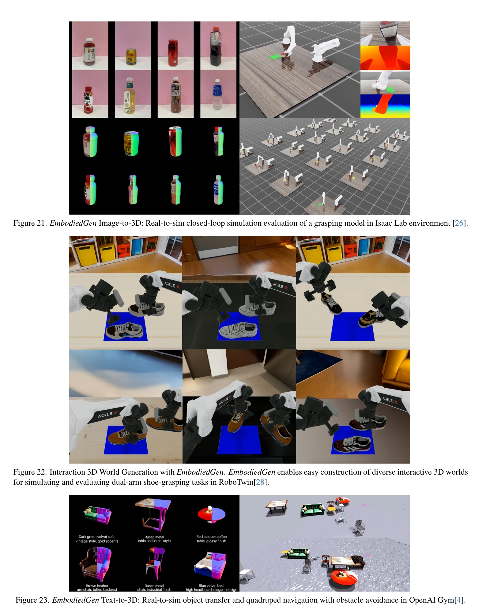

原文图 21、22、23；PDF 第 14 页。[查看原始来源](https://arxiv.org/pdf/2506.10600#page=14)

## 实验依据与证据强度

| 评估问题 | 论文证据 | 能支持的结论与限制 |
| --- | --- | --- |
| 能否发现不可用资产 | §3.2：150 个杯子，人工标记107个可用、43个不可用；精确率68.7%、召回率76.7% | “不可用”为正类；不是资产生成成功率，也不是68.7%的资产可用于仿真 |
| 纹理与文本控制是否改善 | 图7、8、13与多种方法的定性比较 | 支持所示例子的视觉比较；缺少统一大样本指标、用户盲评与方差 |
| 背景细节是否改善 | 图15–17：风格提示、超分辨率、WorldGen 对照 | 主要是图像示例，没有通用三维几何或导航指标 |
| 是否接入机器人仿真 | §4、图20–23：MuJoCo、Isaac Lab、RoboTwin 等示例 | 说明有资产导入与交互演示；未报告独立策略学习收益或现实动力学误差 |

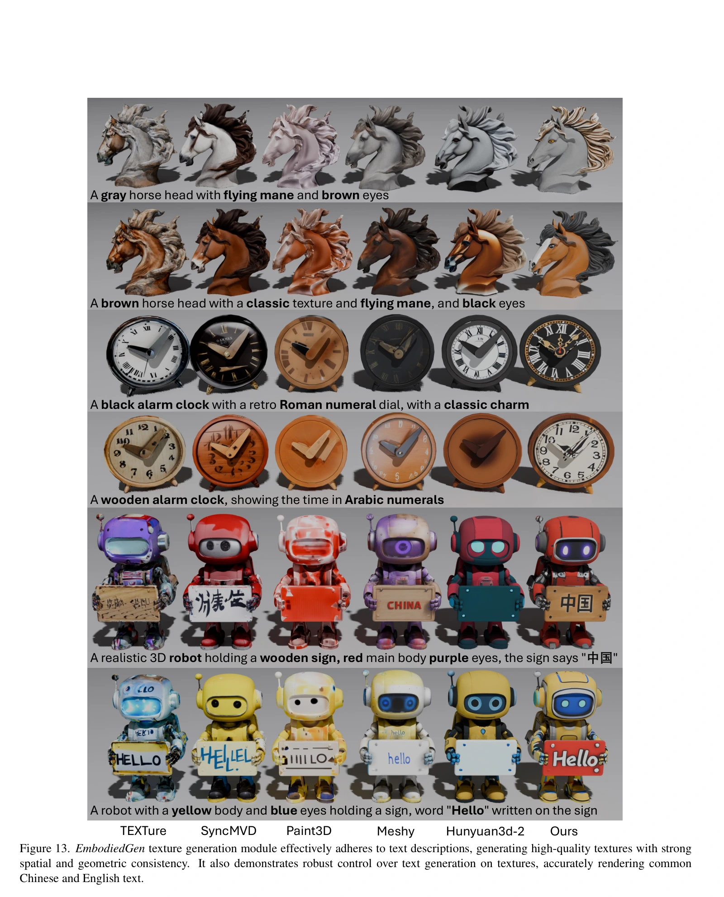

原文图 13；PDF 第 9 页。[查看原始来源](https://arxiv.org/pdf/2506.10600#page=9)

## 局限与我们的解释

**作者证据中的限制。** 质量检查未达到高精确率、高召回率，几何完整性和分割错误需要重试；正文的“物理准确”和“最先进质量”表述比本版本的定量证据更强。论文没有完整质量门消融、跨引擎动力学一致性实验或大规模真机对照。

**我们的解释。** 最可复用的思想是把三维生成产物当作候选资产，并显式检查外观、几何、尺度、描述文件与仿真行为。视觉语言模型估计的参数适合作为后续随机化或标定起点；把这些参数写进 URDF，仅建立了可执行描述，不会自动缩小 [[SimulationRealityGap|仿真—现实差距]]。

机制基础见 [[SimulationReady3DWorldGeneration|可用于仿真的三维世界生成]]、[[CollisionGeometryForRobotSimulation|机器人仿真的碰撞几何]]、[[RoboticsSimulationInfrastructure|机器人仿真基础设施]]。后续版本见 [[embodiedgen-v2-an-agentic-simulation-ready-3d-world-engine-for-embodied-ai|EmbodiedGen V2]]；两代对照见 [[embodiedgen-v1-v2-learning-map|EmbodiedGen 学习地图]]。

## 研究归属

[[topics/assets-and-world-generation|三维资产与场景生成]] · [[topics/simulation-ready-worlds|生成世界何时成为可执行环境]]。
