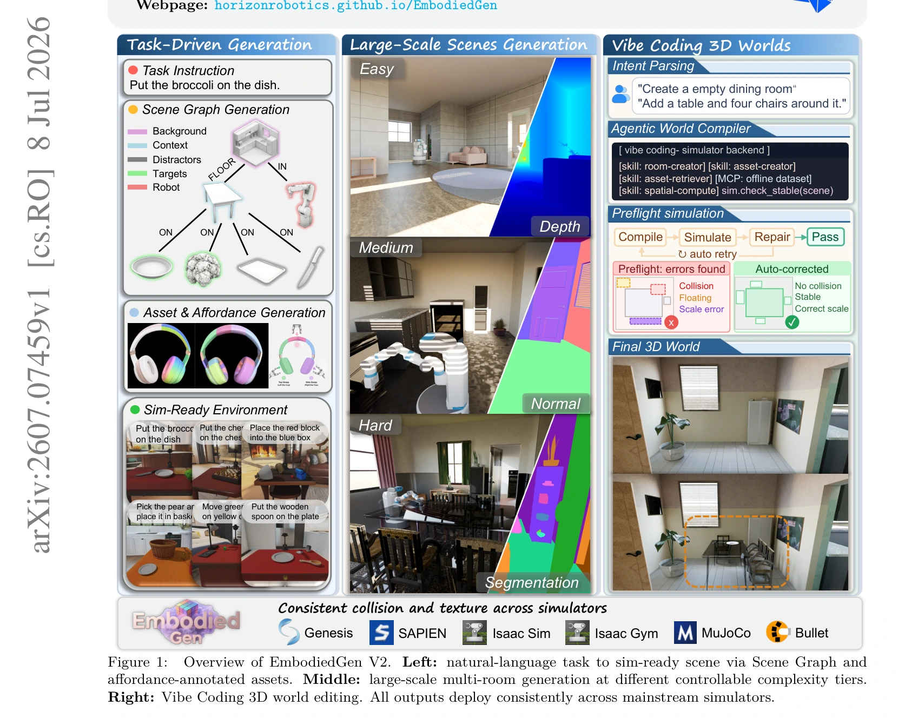
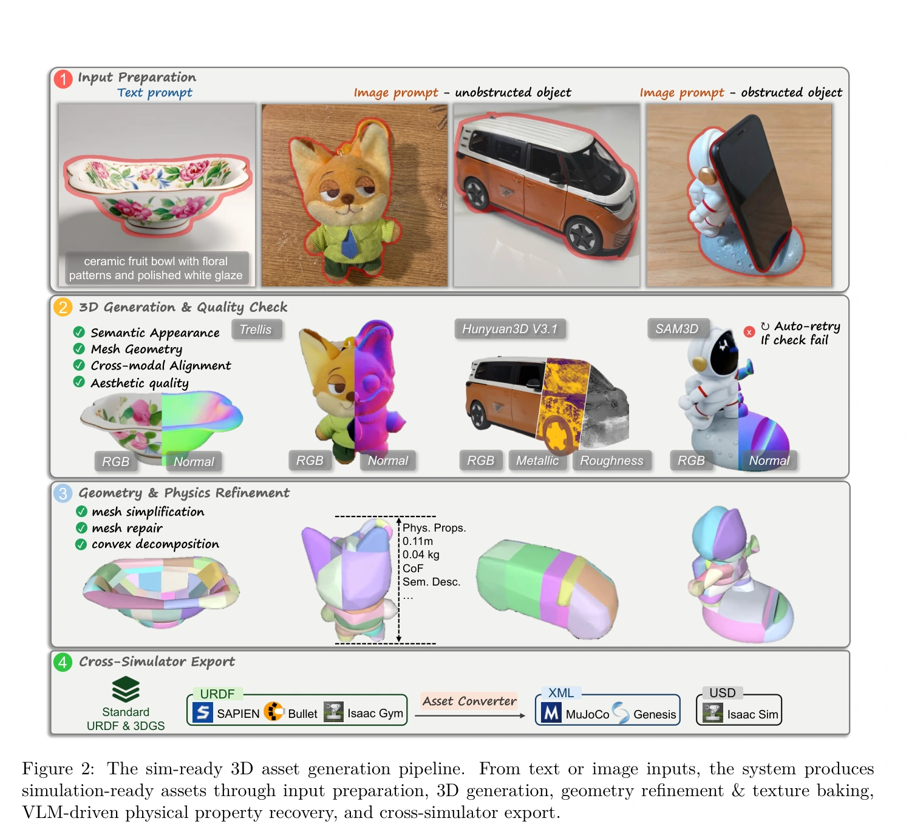
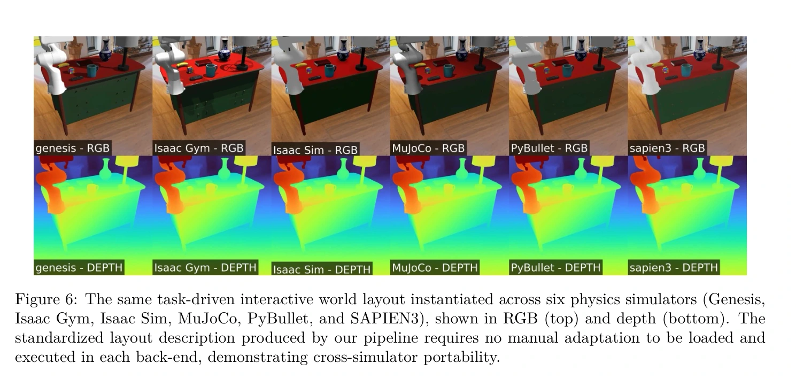
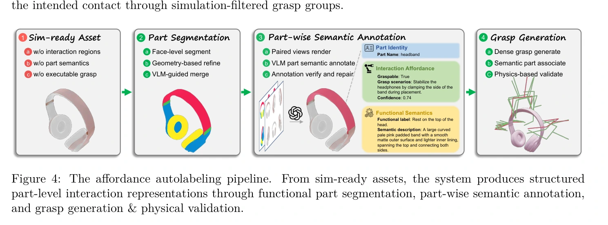
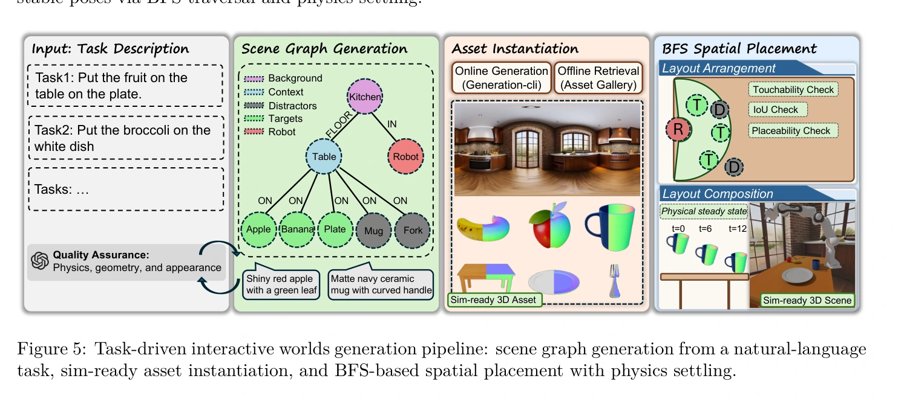
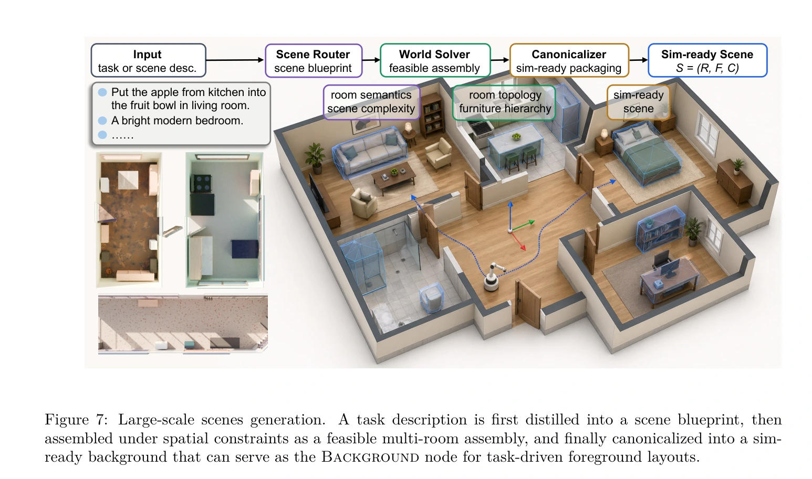
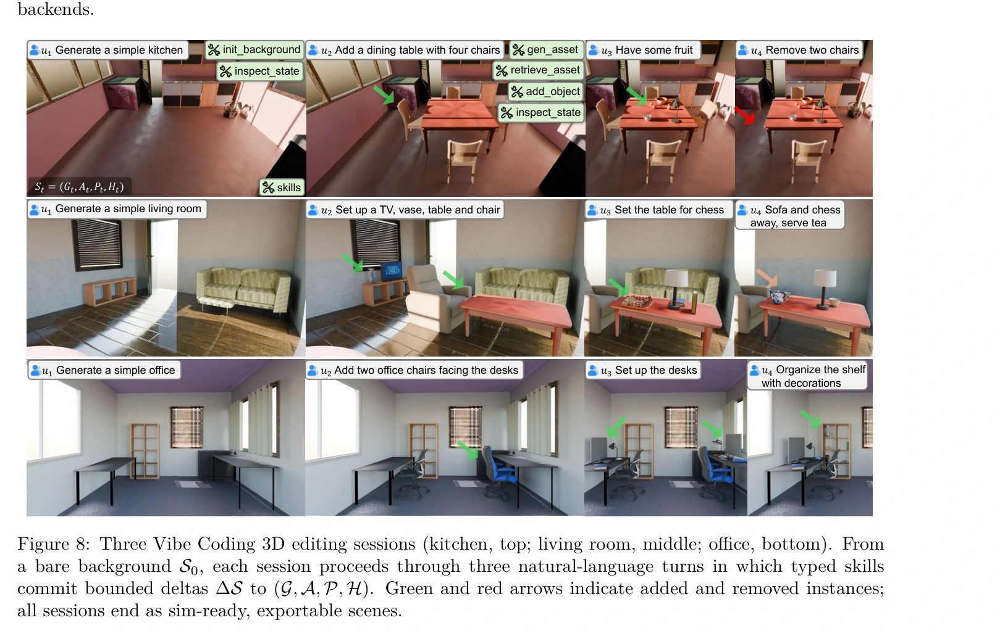
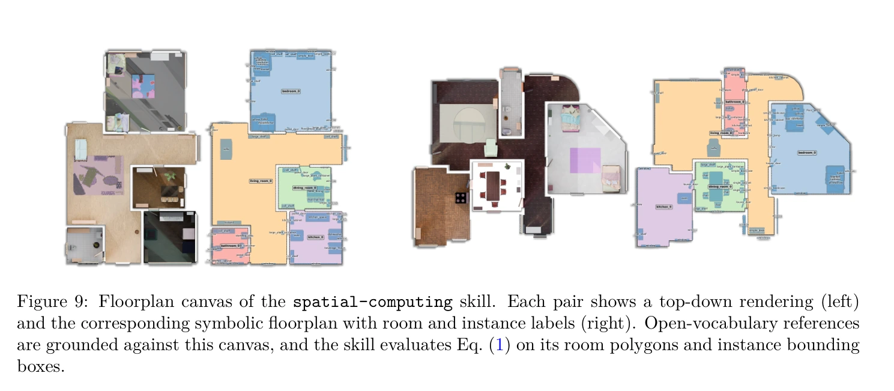
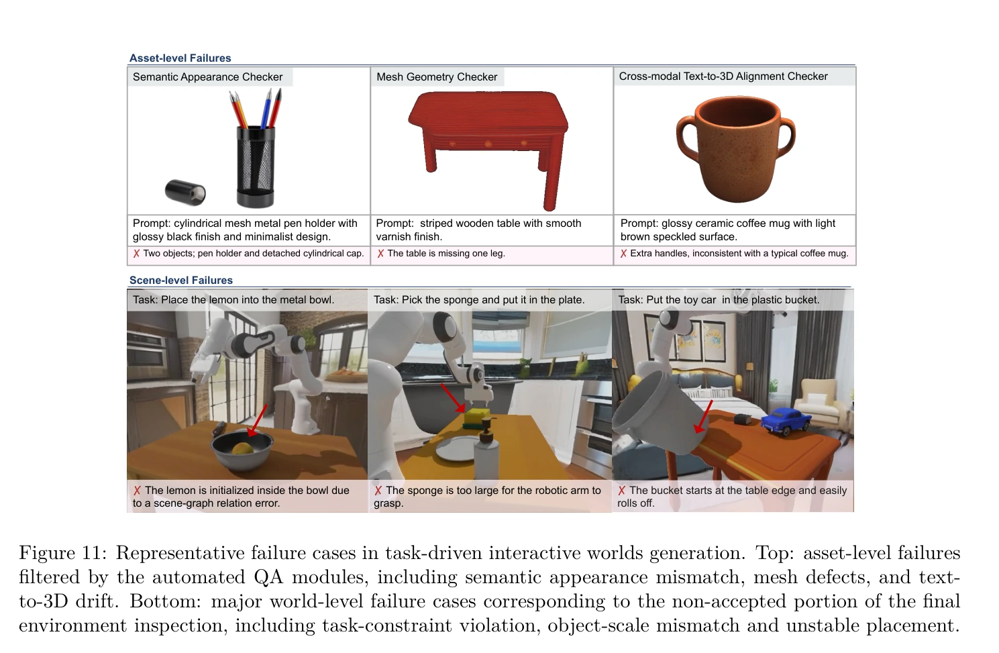
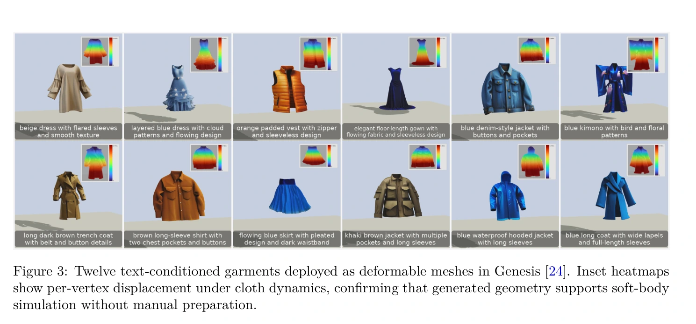

# EmbodiedGen V2：把生成资产组成可执行、可编辑的任务世界

## 一屏概览

**研究问题。** 有可导入仿真的单个物体，仍不等于有能训练策略的任务环境。对象需要可交互部位，布局要满足支撑、可达性与稳定性，多轮修改还必须保留世界状态。

**核心贡献。** EmbodiedGen V2 在 [[embodiedgen-towards-a-generative-3d-world-engine-for-embodied-intelligence|V1]] 之上统一资产表示、可供性标注、任务场景图、多房间场景和有状态编辑：语言模型提出语义选择，几何与仿真后端负责约束检查。[论文 §2、图1](https://arxiv.org/pdf/2607.07459v1#page=1)

原文图 1；PDF 第 1 页。[查看原始来源](https://arxiv.org/pdf/2607.07459#page=1)

**结论范围。** 200 个资产上的人工接受率为96.5%，脚本抓取抬升成功率为98.6%；另一个200资产评估的可供性端到端合格率为50.0%；150个任务世界中83.3%通过人工可用性检查。三者测量单位与判据不同，不能合成一个“物理正确率”。真机21.7%→75.0%是本篇转述的下游研究结果，未在本页当作第二份独立实验。

本页依据 `raw/embodiedgen-v2.pdf`，arXiv:2607.07459v1，2026-07-08，完整阅读24页含参考文献。[[EmbodiedGen|EmbodiedGen]] 是项目枢纽；本页的能力和数据限定于这一论文快照。

## 统一表示与方法机制

### 资产层：视觉、碰撞、参数与交互语义

资产包含纹理网格、碰撞几何、物理参数和可供性。图像或文本先转为前景图像，再接 TRELLIS、SAM3D 或 Hunyuan3D 等可替换后端；网格修复与简化、纹理烘焙、CoACD 凸分解及质量门把生成结果加工成仿真描述。分解失败时回退原网格，意味着“流程结束”不保证获得理想的凸碰撞代理。[§2.2、图2](https://arxiv.org/pdf/2607.07459v1#page=3)

原文图 2；PDF 第 4 页。[查看原始来源](https://arxiv.org/pdf/2607.07459#page=4)

视觉语言模型根据视图与类别估计尺度、质量和摩擦范围，统一缩放视觉、碰撞与高斯表示；URDF 是标准中间表示，再转换为 MJCF/XML 或 USD。论文展示六个仿真器加载同一布局，但没有报告相同输入下接触力、轨迹或能量的跨引擎误差。因此跨格式可复用有示例支持，“动力学一致”仍需单独检验。[§2.2、图6](https://arxiv.org/pdf/2607.07459v1#page=5)

原文图 6；PDF 第 8 页。[查看原始来源](https://arxiv.org/pdf/2607.07459#page=8)

### 可供性层：从部位语义到验证过的抓取

P3-SAM 给网格面分配部件标签；几何后处理合并平滑连通区域并清理碎片，视觉语言模型再合并被过度拆分的同一功能部位。对齐的 RGB 和部件遮罩视图用于生成部件名称、可抓取性、抓取情境、功能及外观描述。GraspGen 生成六自由度候选抓取，映射到接触部位后，在 SAPIEN 中闭合、抬升、扰动、下降；相对夹爪滑移超过5厘米或30度即丢弃。[§2.3、图4、§3.2](https://arxiv.org/pdf/2607.07459v1#page=6)

原文图 4；PDF 第 6 页。[查看原始来源](https://arxiv.org/pdf/2607.07459#page=6)

这里有两层可信度：部件“应该怎样使用”来自模型语义判断；特定夹爪在特定仿真参数下“能否稳定抓住”来自执行测试。后者不能反向保证前者理解了任务功能，也不能推广到其他夹爪或真实摩擦条件。

### 场景层：先语义图，再求几何位置

任务被分解为机器人、背景、支撑家具、操作对象、干扰物五类。浅层有根树描述 ON、INSIDE、FLOOR、IN 等关系；资产可在线生成或离线检索。广度优先放置保证先有父节点支撑，再放子物体；同层按占地面积排序。[§2.4、图5、式(1)](https://arxiv.org/pdf/2607.07459v1#page=7)

原文图 5；PDF 第 7 页。[查看原始来源](https://arxiv.org/pdf/2607.07459#page=7)

设 $H_p$ 为父节点支撑区域，$p_c$ 为子物体候选位置，$B_c(p_c)$ 为其投影占地，$\mathcal P_p$ 为已放置兄弟节点，论文约束可写为：

$$
p_c\in H_p,\quad \operatorname{Support}(B_c(p_c),H_p)=1,\quad
\operatorname{IoU}\!\left(B_c(p_c),\bigcup_{j\in\mathcal P_p}B_j\right)=0.
$$

操作物体还需位于机器人前方的可达区域；找不到位置就重采样或回退。最终在 SAPIEN 中受重力沉降，导出稳定后的六自由度位姿。**我们的解释：** 平面占地检查和沉降适合过滤常见穿透、漂浮与支撑错误，但不是证明整个任务存在无碰撞、满足接触约束的控制轨迹。

多房间场景输出 $S=(R,F,C)$：$R$ 为含门窗连接的房间拓扑，$F$ 为各房间可单独寻址的家具实例，$C$ 为统一坐标系。语言模型只选房间范围与复杂度；基于 Infinigen 的层次约束求解器依次放大型家具、中型物品和杂物，并检查连接和可通行开口。它取代 V1 的全景反投影单网格背景，使家具可替换、房间可连接。[§2.5、图7](https://arxiv.org/pdf/2607.07459v1#page=9)

原文图 7；PDF 第 9 页。[查看原始来源](https://arxiv.org/pdf/2607.07459#page=9)

### 一条任务描述怎样成为初始世界

下面是依据§2.4的**教学执行例子**，不是论文另一次评测。输入“让机器人把桌上的苹果放进碗里”时，首先把机器人、厨房背景、桌子、苹果和碗绑定到不同角色；再建立背景为根、桌子与机器人为子节点、操作对象依附桌子的浅树。节点描述负责获取什么资产，边关系负责放在哪里。这里构造的是任务初态，苹果不应一开始就在碗内。

广度优先顺序先放桌子，再在已知桌面区域中放碗和苹果；同层先处理占地大的对象，为较小对象留下空间。对于苹果的候选位置，求解器依次问：是否处于支撑域、占地是否得到支撑、是否与已放对象重叠、是否落在机器人前方可达区域。通过几何检查后才交给物理沉降，取稳定后的位姿输出。图结构、布局和导出资产由此具有可追踪的对应关系。[§2.4、图5、式(1)](https://arxiv.org/pdf/2607.07459v1#page=7)

这解释了为什么既要图也要几何：树只规定依赖和语义，不给出唯一坐标；几何求解器只知道约束，不能自行决定任务到底要苹果还是干扰物。V2 的主体流程在使用预训练生成／分割／语言模型和程序化检查，论文没有给出一个把整个世界生成链联合训练的端到端损失。资产测试、布局验收和下游策略学习分别发生在不同阶段。

### 有状态编辑：验证通过才提交

式(2)定义 $S_t=(G_t,A_t,P_t,H_t)$，分别保存场景图、资产、位姿和对话/技能历史。每条指令经过解析、对象指代落地、技能执行、状态提交；失败返回诊断而不改世界。新增、移动或删除只提交受约束的局部变化，避免每次对话重建整个场景。图8–9给出厨房、客厅、办公室编辑示例；算法1规定失败不提交的控制流。[§2.6、表1、算法1](https://arxiv.org/pdf/2607.07459v1#page=10)

原文图 8；PDF 第 11 页。[查看原始来源](https://arxiv.org/pdf/2607.07459#page=11)

原文图 9；PDF 第 13 页。[查看原始来源](https://arxiv.org/pdf/2607.07459#page=13)

**沿用上述例子理解编辑。** 下一轮“把刚才的苹果移到碗旁边”需要历史 $H_t$ 确定“刚才的苹果”，图 $G_t$ 确定父对象和房间，资产 $A_t$ 给出尺寸，位姿 $P_t$ 给出当前占地。模型完成实例绑定，空间技能再求可行位置；若桌面无空间，返回诊断并保留原布局。成功时图关系、位姿和编辑历史一起更新。这个例子由知识库根据算法1重构；坐标变换本身见 [[RobotCoordinateFrames|坐标系]]，跨系统编辑模式见 [[AgenticSceneTaskGeneration|场景与任务生成]]。

## 实验：逐项看分母与判据

| 实验与位置 | 设置 | 结果及解释 |
| --- | --- | --- |
| 资产消融，§3.1表2 | 200个留出资产；SAM3D；单 RTX 4090；每资产4个不同偏航角的 Franka 俯抓抬升试验 | 完整流程人工接受96.5%、抬升成功98.6%、每资产2.6±0.4分钟；“Collision Success”实际是此脚本任务成功率 |
| 去掉质量检查，表2 | 其余组件不变 | 人工接受降至91.0%，抬升98.1%；主要影响语义与外观筛选 |
| 去掉网格修复，表2 | 其余组件不变 | 时间21.3±22.8分钟，视觉网格51.63MB，对照为1.43MB；部署成本显著增加 |
| 去掉凸分解，表2 | 视觉网格直接作碰撞网格 | 抬升96.5%，碰撞网格由0.29MB 增至1.45MB；结果限定于 SAPIEN 脚本抓取 |
| 可供性消融，§3.2表3 | 200资产，后阶段仅评估前阶段通过者 | 端到端合格率从31.0%经几何后处理升至41.0%，加模型合并达50.0%；不是99.3%的资产都完成有效标注 |
| 任务世界，§3.3表4、图11 | 150任务，778物体实例、128类别；单 RTX 4090全在线串行生成 | 人工接受83.3%，每世界47.7±5.4分钟，其中背景25.5±3.5分钟；失败包含初始即达目标、尺寸不适合抓取、边缘摆放不稳定 |

原文图 11；PDF 第 17 页。[查看原始来源](https://arxiv.org/pdf/2607.07459#page=17)

可供性表3的三个条件率为69.5%、99.3%、72.5%，乘积约50.0%。最后一项只要求对象至少有一个经仿真验证的抓取；本来不适合平行夹爪抬升的大型电器可获豁免。因此它不表示每个部件、每个功能都能执行。

§3.4与表5明确**汇总另一项下游研究**：生成世界上的在线强化学习把仿真成功率从9.7%提高至79.8%；训练场景从1增至50时，分布外成功率53.2%→77.9%；加域随机化后，12个真实场景、240次试验的成功率21.7%→75.0%。同节另引 RankQ 的堆块结果43.1%→88.9%。本轮未独立归档、复核这两篇被引研究，故这里只记录“V2 如何援引它们”，不把这些数字当作已独立审计的证据。[§3.4、表5及参考文献6–7](https://arxiv.org/pdf/2607.07459v1#page=17)

## 局限与我们的解释

**已有证据的范围。** 物理参数仍来自模型推断；衣物在 Genesis 中变形的图3是几何可执行示例，没有材料辨识实验。有状态编辑和多房间生成展示了系统设计与案例，没有与完整替代系统统一比较的成功率、时延或人工节省消融。

原文图 3；PDF 第 5 页。[查看原始来源](https://arxiv.org/pdf/2607.07459#page=5)

**我们的解释。** V2 最有研究价值的是将“可仿真”拆成可以分别检查的条件：可加载、几何稳定、局部交互可执行、任务约束正确、可用于学习。论文自己给出的50%可供性合格率和83.3%世界接受率，恰好说明这些条件不会由视觉质量自动推出。资产质量、生成效率和策略学习增益应分别比较。

相关机制：[[SimulationReady3DWorldGeneration|可用于仿真的三维世界生成]]、[[AgenticSceneTaskGeneration|智能体式场景与任务生成]]、[[CollisionGeometryForRobotSimulation|碰撞几何]]、[[OpenUSDSceneComposition|OpenUSD 场景组合]]、[[RoboticsSimulationInfrastructure|仿真基础设施]]、[[SimulationRealityGap|仿真—现实差距]]。版本比较见 [[embodiedgen-v1-v2-learning-map|两代学习地图]]。

## 研究归属

[[topics/assets-and-world-generation|三维资产与场景生成]] · [[topics/simulation-ready-worlds|生成世界何时成为可执行环境]]。
