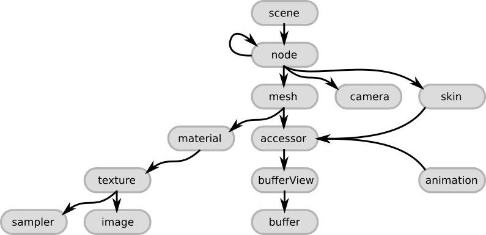
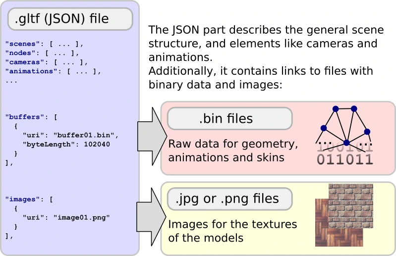

## 摘要

Khronos 官方教程说明 glTF 的 JSON 场景结构与二进制数据怎样协作：节点连接场景、网格、相机和蒙皮，访问器描述二进制数据的读取方式，材质连接纹理与图像。

glTF 对象之间的关系。[查看原始来源](https://github.khronos.org/glTF-Tutorials/gltfTutorial/images/gltfJsonStructure.png)

## 核心主张

- 顶层对象存储在数组中，以索引建立引用；`scene` 指向场景根节点，节点可持有变换和子节点。
- 网格引用几何访问器与材质；动画描述节点变换随时间的变化，蒙皮描述骨骼姿态对几何的变形。
- `accessor` 描述如何解释数据，`bufferView` 选择缓冲区片段，`buffer` 保存原始二进制数据。
- 图像和缓冲区可以通过 URI 引用外部资源，也可以使用数据 URI 嵌入。JSON 可解析不代表所有外部资源已加载。

glTF 的 JSON、二进制缓冲和纹理文件。[查看原始来源](https://github.khronos.org/glTF-Tutorials/gltfTutorial/images/gltfStructure.png)

## 关键引文

> “The core of glTF is a JSON file.”

JSON 组织关系，几何和图像数据还需要沿引用读取。

## 关联

机制解释见 [[GLTFSceneStructure|glTF 场景与数据结构]]；格式比较见 [[3d-model-formats-learning-map|三维模型格式学习地图]]；仿真物理分层见 [[IsaacSimAssetStructure|Isaac Sim 资产结构 3.0]]。

## 开放问题

本章不覆盖 GLB 容器细节、完整 PBR 规则或机器人动力学扩展，不能把场景可渲染性当成物理可执行性。

## 研究归属

[[topics/assets-and-world-generation|三维资产与场景生成]] · [[topics/asset-representation|资产格式怎样保留仿真语义]]。
