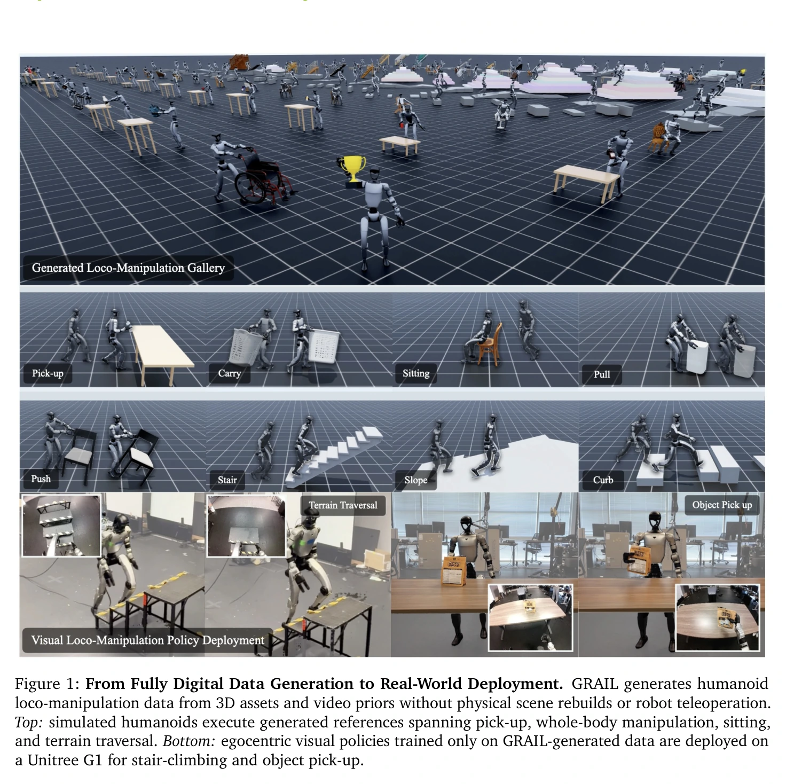
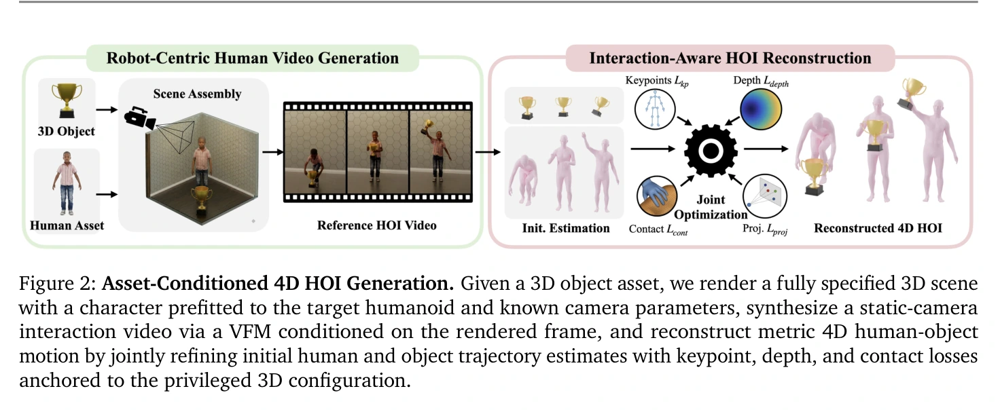
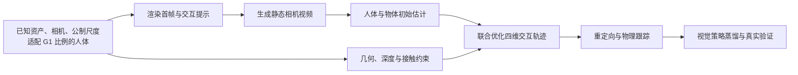
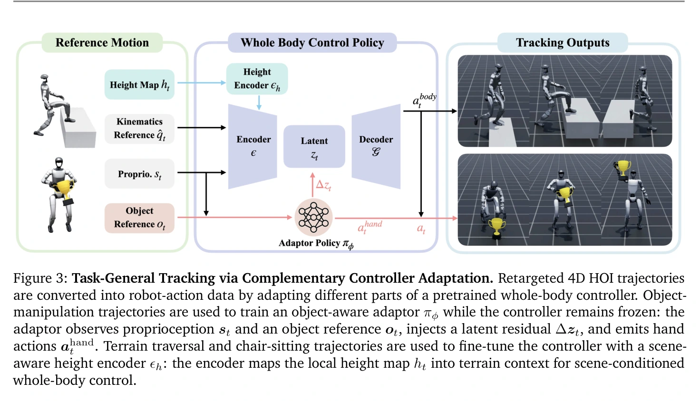
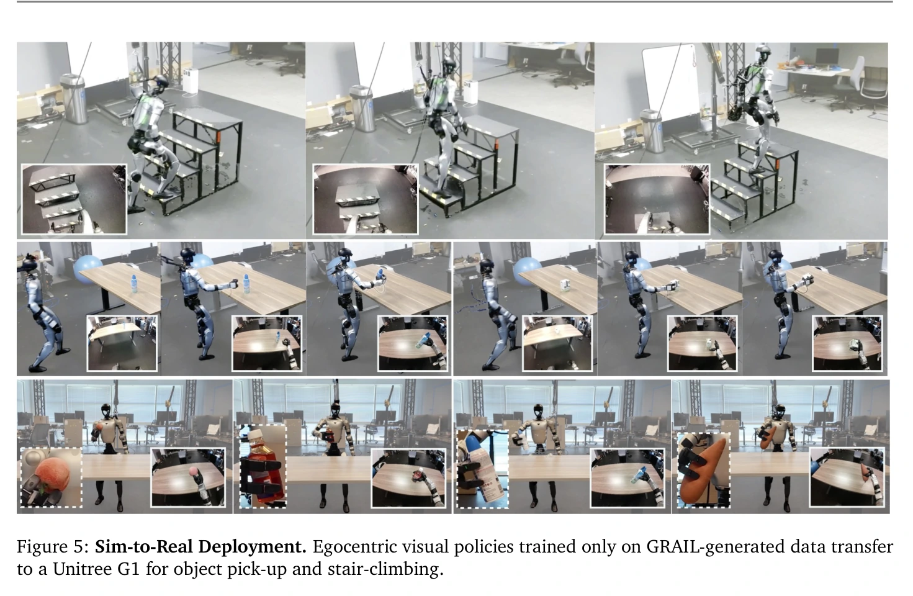

## 一屏概览

**研究问题：** 怎样从生成视频取得机器人能执行的移动操作示范，又避免从自然视频同时猜测相机、几何、尺度与人物形态？Xie 等提出 GRAIL：先规定三维资产和场景，让视频基础模型提供交互先验，再把视频重建约束回已知的公制世界。

原文图 1；PDF 第 1 页。[查看原始来源](https://arxiv.org/pdf/2606.05160#page=1)

原文图 2；PDF 第 4 页。[查看原始来源](https://arxiv.org/pdf/2606.05160#page=4)

**主要贡献：** 资产条件化的人物—物体交互（HOI）生成与重建，以及两类基于 SONIC 的跟踪器：物体操作用冻结控制器上的潜在残差，地形与坐下任务用高度图条件化微调。生成数据超过 20,000 条序列，再蒸馏为第一视角视觉策略。

**结论范围：** G1 真实抓取中，五种已见物体平均成功率为 **84%**，五种未见物体为 **80%**，每物体测试 10 次；爬楼报告 90%，但正文未给对应试验次数。视频质量、仿真跟踪与真实任务各有不同指标，不能混成一个成功率。依据为 [原论文](https://arxiv.org/abs/2606.05160) 第 3–4 节、表 1–3 与附录；本页完整复核归档 v1 的 24 页，未将项目网站或代码状态视为独立证据。

## 方法：已知三维世界约束生成视频

### 先控制可以控制的歧义

系统用 Infinigen 场景和物体资产构建首帧，物理模拟让物体稳定放置，人体形态预先适配 G1 的比例。Blender 渲染时相机内外参、物体初始位姿、环境深度和尺度已知；视觉语言模型选择地面或桌面放置并生成交互提示，视频模型在静态相机条件下续写动作。之所以生成“人”的视频，是作者认为视频模型的人类交互先验和人体重建工具更成熟。（第 3.1 节、附录 A.1）

GENMO 估计人体姿态，但保持预先设定的人体形状；WiLoR 细化手部，缺失帧插值后平滑。FoundationPose 在深度通道置零的合成数据上微调，利用已知几何、纹理、相机及首帧位姿跟踪物体。这些初始结果分别合理仍可能出现手物脱离、穿透和深度漂移，所以还要联合优化。（第 3.2.1 节）

### 联合优化：图像对齐与公制接触分工

设 $\hat\Theta_t^H,\hat\Theta_t^O$ 是第 $t$ 帧初始人体和物体位姿，分别优化残差 $\Delta\Theta_t^H,\Delta\Theta_t^O$ 得到修正轨迹。手部姿态在这一步固定，旋转采用连续六维表示。原文式 1 的目标为

$$
L=\lambda_{\mathrm{kp}}L_{\mathrm{kp}}+\lambda_{\mathrm{proj}}L_{\mathrm{proj}}+\lambda_{\mathrm{depth}}L_{\mathrm{depth}}+\lambda_{\mathrm{cont}}L_{\mathrm{cont}}+\lambda_{\mathrm{reg}}L_{\mathrm{reg}},
$$

各 $\lambda$ 为权重。五项分别约束不同的不确定性：（第 3.2.2 节、式 1–5）

| 项 | 约束内容 | 为什么需要 |
|---|---|---|
| 关键点 $L_{\mathrm{kp}}$ | 人体与手部三维关键点投影对齐二维检测 | 保留视频中的身体布局 |
| 物体投影 $L_{\mathrm{proj}}$ | 修正后的物体顶点投影接近初始跟踪结果 | 避免为改善三维接触破坏图像中的物体位置 |
| 深度 $L_{\mathrm{depth}}$ | 人体和物体可见顶点与分割点云做双向 Chamfer 对齐 | 用公制深度约束投影无法辨别的前后距离 |
| 接触 $L_{\mathrm{cont}}$ | 接触帧内，对图像投影相邻的手部与物体顶点，只惩罚视线方向距离 | 在保持图像对齐的同时修正悬空接触 |
| 正则 $L_{\mathrm{reg}}$ | 接触脚滑、骨盆速度偏离、顶点一阶与二阶时间差分 | 减少脚滑、深度漂移与时间抖动 |

深度不是生成模型直接输出的真值：先用 MoGe-2 估计，再与已知背景的渲染深度对齐，恢复尺度。接触帧标签由视觉语言模型预测；纯地形序列不启用手物接触项。几何接触更一致，也不等于真实接触力和摩擦已被辨识。

附录 A.3 用 SAM2 物体掩码与预测位姿渲染轮廓的不一致程度过滤跟踪失败，阈值为 0.2。原文式 10 的求和、归一化形式与紧随文字的“未覆盖掩码比例”并不完全对应，本页不把它改写为一个未经代码核查的通用 IoU 指标；原文也没有给出整体丢弃比例。

### 为什么二维对齐后还要约束深度

下面是对重建损失分工的教学解释。针孔投影的一个坐标为 $u=fX/Z$，其中 $f$ 是焦距，$X,Z$ 是相机坐标中的横向位置与深度。把 $X,Z$ 同时乘同一尺度，$u$ 不变；因此图像中的手和杯子重合，仍可能在三维中前后分离。已知资产尺寸、相机和背景深度先提供公制锚点；投影损失约束图像平面，接触项再沿视线方向合拢候选手物点。若所有方向都只靠接触距离拉近，可能以破坏视频中的姿态为代价降低距离。

这也解释了先选接触帧和投影邻近点的原因：松手阶段不应被强迫粘住，画面中远离物体的手指也不应被任意吸向最近三维顶点。最终输出是修正后的人体与物体轨迹，还不是机器人力矩；接下来必须经过重定向和物理跟踪。（依据第 3.2.2 节的设计，投影公式为本页教学重述。）

## 从运动参考到可执行动作

GMR 把修正人体动作重定向为 G1 关节参考，重建物体轨迹保留为物体目标。跟踪器用 PPO 在任务族共享数据池内训练，而不是每条轨迹单独训练一个控制器。（第 3.3 节）

### 物体操作：冻结 SONIC，学习潜在残差与手部基元

设 $s_t$ 为本体状态，$o_t$ 为物体参考及相对信息，$z_t$ 为控制器的运动潜在表示。适配器 $\pi_\varphi$ 产生残差和左右手开合基元：

$$
(\Delta z_t,a_t^{\mathrm{hand}})=\pi_\varphi(s_t,o_t),\qquad
a_t^{\mathrm{body}}=\mathcal G(z_t+\lambda\Delta z_t),\quad\lambda=0.1.
$$

这是原文式 6 的简写；附录 B.1 明确残差加在**有限标量量化之前**的编码器输出，再经过冻结量化器和解码器 $\mathcal G$。适配器输出 64 维残差和两维二值开合信号，每只手映射为预定义的七个手指关节目标；并非自由生成每个手指的连续动作。

$o_t$ 包含机器人坐标系内物体位姿、手物变换、手指接触力、BPS 形状编码，尤其是“未来参考物体位姿相对当前仿真物体”的差值。潜在残差另加 $L_2$ 惩罚，鼓励保留 SONIC 的原有运动先验。（第 3.3 节、图 3、附录 B.1）

原文图 3；PDF 第 7 页。[查看原始来源](https://arxiv.org/pdf/2606.05160#page=7)

**适配器具体补了什么？** 仅跟踪身体参考时，手臂可以接近示范姿态而错过物体。适配器看见“实际物体落后未来参考多少”，便可用潜在残差修正全身动作，同时选择抓紧或松开；物体跟踪奖励让这类修正有训练信号。冻结 SONIC 保留已有运动表示，$\lambda=0.1$ 和残差惩罚约束改动规模；冻结本身不保证接触成功，有限标量量化也不保证任意小残差都产生连续动作变化。表 2 的无适配器结果正说明身体轨迹接近与操作完成是两个目标。这段是对论文模块接口的解释，不是单独测得的因果贡献。

### 地形与坐下：微调控制器并加入局部场景

这类任务不使用上述冻结控制器适配器，而是加入局部高度图编码器，微调控制器，同时混入原始平地数据。辅助运动学解码器重建输入运动目标，使潜在表示不偏离参考。附录 B.2 采用 $11\times11$ 的局部射线采样网格；正文强调用地形信息调整全身运动。（第 3.3 节、附录 B.2）

两类跟踪器共享运动奖励。若 $\tilde x_{i,t}$ 和 $x_{i,t}$ 分别为参考与仿真中的第 $i$ 类状态，$w_i$ 是权重、$\sigma_i$ 是容差，则

$$
R_t^{\mathrm{motion}}=\sum_i w_i\exp\left(-\frac{\|\tilde x_{i,t}-x_{i,t}\|^2}{\sigma_i^2}\right).
$$

奖励覆盖根部位姿、身体位置和方向、线速度与角速度；操作另加物体跟踪和抓取奖励。抓取项考虑接触数量、拇指与食指的相对方向、指尖到接触中心距离；附录表 6 还规定接触门控，不能把所有阶段都理解为持续奖励抓紧。地形跟踪仅保留运动跟踪与正则项。（式 7–9、附录表 6）

### 视觉部署与计算成本

最终分别蒸馏为抓取与爬楼视觉策略，以头部 RGB 等输入预测 SONIC 潜在标记，并使用域随机化与相机对齐。真实 G1 将视觉和本体信息传给配 RTX 5090 的桌面机，再接收动作；视觉推理为 10 Hz。（第 3.4 节）

数据规模是 1,000 个物体资产、1,000 个程序生成地形配置和超过 20,000 条序列。单条 5 秒视频的四维重建约 14 分钟，其中联合优化约 8 分钟，测于单张 A100；跟踪器完整训练用 64 张 L40、每张 1,024 个环境，30,000 轮约 30 小时。所谓每动作 0.5–0.9 分钟是把整轮训练分摊到 2,000–4,000 条动作，不能当作单 GPU 成本，也不包含上游视频生成成本。（第 4.2 节、附录 A.2 表 4、B.3）

## 实验：三层成功率不能互换

| 层次与定位 | 设置、指标和结果 | 能支持的结论 |
|---|---|---|
| 四维生成质量，第 4.1 节、表 1 | 20 个共同对象；InterMimic 的 SMPL-X 仿真中，人体和物体误差按对象最大尺寸归一化后均小于 0.25 的**帧比例**；GRAIL 88.9%，DAViD 24.0%，HOIDiff 15.8%，CHOIS 10.5% | 重建参考更容易被物理人体跟踪；此处不做机器人重定向，不是 G1 真实成功率 |
| G1 操作跟踪，第 4.2 节、表 2 | 124 条动作、43 个对象；回合平均物体位置误差小于 20 cm 为成功；GRAIL 81.4%，HDMI 48.5%，ResMimic 49.2% | 支持此基准的物体交互跟踪；基线不驱动逐指自由度且按任务训练，比较包含系统差异 |
| 真实抓取，第 4.3 节、表 3 | 已见五类物体平均 84%，未见五类平均 80%；每类 10 次 | 支持有限对象集合的视觉迁移；不是全体 1,000 个资产上的真实测试 |
| 真实爬楼，第 4.3 节、图 5 | 报告 90%，未给测试次数和细分环境分布 | 支持作者的部署演示，但不能据此计算置信区间或比较不同楼梯条件 |

原文图 5；PDF 第 12 页。[查看原始来源](https://arxiv.org/pdf/2606.05160#page=12)

真实已见对象为方块、苹果、茶盒、胡萝卜和湿巾；训练每对象 200 条接近并抓起序列。未见对象为喷雾罐、粘毛器、桃子、手电和药瓶，分别为 100%、50%、90%、80%、80%。已见平均 84% 与未见平均 80% 需分别报告，不能把摘要里的 84% 当作全部对象的总平均。

### 消融揭示的是交互能力，而不只是动作相似

| 消融与原文定位 | 操作跟踪成功率 | 与完整模型 81.4% 的对照 |
|---|---|---|
| 去掉 SONIC，表 2 | 45.0% | 从头学身体运动明显更难 |
| 去掉潜在适配器，表 2 | 39.7% | 身体局部关节误差反而最低，但物体操作最差；动作模仿准确不等于交互成功 |
| 相对物体观测换为绝对观测，表 2 | 57.9% | 参考物体与当前物体的相对信息很重要 |
| 去掉物体投影损失，附录表 8 | 41.6% | 上游投影一致性误差会传播到跟踪 |
| 去掉深度损失，附录表 8 | 42.6% | 仅图像对齐不足以约束可执行公制运动 |
| 去掉接触损失，附录表 8 | 53.3% | 手物接触对齐有助于后续交互 |

表 8 的完整模型并未使每个重建代理指标都最好，却有最高下游成功率。例如去掉接触项的穿透比例更低，但操作跟踪更差，不能只凭穿透或平滑指标给生成质量排序。

附录的 30 人主观实验中，GRAIL 的可供性与物理合理性选择率为 74.7%、70.9%；每次只展示四种方法中的随机三种，选择率的理论上限为 75%。这类偏好评价补充物理跟踪证据，不能替代它。（附录 C.1、表 7）

## 局限与我们的解释

**作者明确的局限：** 需要可用三维资产、可仿真场景以及遵循提示的视频模型；严重遮挡、快动作和物体外观不一致会降低重建质量，并导致非少量序列被过滤。任务族变化很大时仍需重新训练或微调。（第 6 节）

**原文尚不明确处：** 附录 A.1 指定 Kling 2.5 Turbo Pro，但参考文献条目标为 2.1；表 5 对高度图输入维数的摘要与附录 B.2 的三通道坐标描述不同。这些不一致保留为复现限制，不能在未核查代码时擅自选定一个实现版本。

**我们的解释：** GRAIL 把一部分难以从视频推断的量变成生成前的受控输入，降低了重建歧义；剩余误差再由几何优化与物理跟踪共同处理。最有力的证据是下游消融，而不只是视频看起来逼真。它降低的是数据与重建环节的负担，并未自动消除真实相机、执行器和接触差距，也没有证明生成数据能全面替代遥操作。

## 关联与材料

本页已包含 [[AssetConditionedHOIGeneration|资产条件化人物—物体交互生成]] 的专属机制。跨论文机制见 [[VisualSimToReal|Visual Sim-to-Real]]、[[SimulationRealityGap|Sim-to-Real Gap]]、[[TaskGeneralistPolicyEvaluation|通用任务策略评估]]；[[viral-visual-sim-to-real-at-scale-for-humanoid-loco-manipulation|VIRAL]] 是本文视觉迁移环节引用的相关路线，[[agile-a-comprehensive-workflow-for-humanoid-loco-manipulation-learning|AGILE]] 提供另一种训练—评估—部署组织方式，不能从两篇论文并列推断它们已被联合验证。

[项目主页](https://research.nvidia.com/labs/dair/grail/) 位于 NVIDIA 研究网站；本次不对代码、数据许可证或独立复现情况作已核实的判断。

## 研究归属

[[topics/evaluation-and-transfer|评测与 Sim-to-Real]] · [[topics/simulation-transfer|Sim-to-Real]]。
