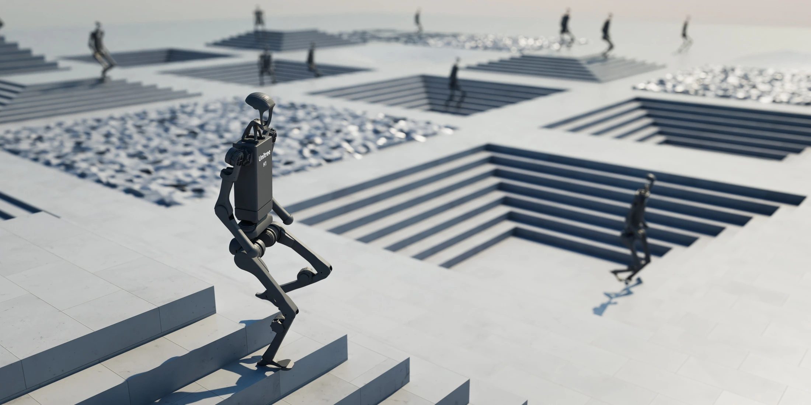
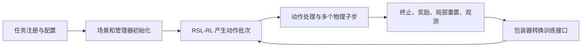

## 定位与阅读范围

Isaac Lab 在 [[sources/isaac-sim-asset-structure|Isaac Sim]] 上组织机器人任务、物理与传感器仿真，并接入强化学习训练器。本页沿固定提交的一条状态输入 Cartpole 训练路径解释配置怎样变成采样数据；README 的机器人种类、视觉任务与其他训练器能力没有因此全部得到实现核查。下面是官方源码的静态阅读，没有启动 Isaac Sim、训练策略或测量吞吐。

官方仓库配图。[查看原始来源](https://raw.githubusercontent.com/isaac-sim/IsaacLab/492751759af72a5d3f7e0e42768b95fd9f1ac6df/docs/source/_static/isaaclab.jpg)

## 从任务名到一次训练

以 `Isaac-Cartpole-v0` 为例，注册文件把 Gym 任务名绑定到 `ManagerBasedRLEnv`、`CartpoleEnvCfg` 与 RSL-RL 配置入口。`train.py` 先启动 `AppLauncher`，然后才导入依赖仿真应用的模块；Hydra 根据任务取得环境与训练器配置，命令行可覆盖环境数量、种子、设备及训练轮数。多进程时按本地进程设置 CUDA 设备和种子。创建 Gym 环境后，脚本套上可选录像包装器和 `RslRlVecEnvWrapper`，构造 `OnPolicyRunner` 或 `DistillationRunner`，保存配置，再调用 `learn()`。（训练入口第 114–220 行）

这是依据代码重画的控制流。环境负责产生转移数据，外部 RSL-RL 负责策略更新；本次没有继续读取 RSL-RL 内部 PPO 实现。

## 一个具体环境由哪些定义组成

`CartpoleEnvCfg` 把场景、动作、观测、重置、奖励和终止拆成配置对象，再交给相应管理器解释。这样改变奖励项不必同时重写物理循环，但同名任务也必须连同配置一起记录。

| 接口 | 当前提交的状态 Cartpole 配置 |
|---|---|
| 场景 | 默认 4,096 个环境，环境间距 4 m |
| 动作 | 对 `slider_to_cart` 施加关节力，动作缩放为 100 |
| 观测 | 相对关节位置、相对关节速度拼接，关闭观测噪声 |
| 初始分布 | 小车位置 ±1 m、速度 ±0.5；摆角与角速度分别在 ±π/4 范围采样 |
| 奖励项权重 | 存活 +1、终止 −2、摆角平方 −1、小车速度绝对值 −0.01、摆角速度绝对值 −0.005 |
| 时间与终止 | 物理步长 1/120 s、每动作 2 个子步，即控制间隔 1/60 s；回合上限 5 s，小车位置越过 ±3 m 也终止 |

这里列的是配置中的权重与时间尺度；逐项奖励函数和奖励管理器的全部实现未在本次展开。仿真步与控制步的区别见 [[SimulationTimeStepping|仿真步长与控制频率]]。

## 一次 `step()` 的数据如何流动

`ManagerBasedRLEnv.step()` 第 153 行开始接收形状为“环境数 × 动作数”的动作。动作管理器先处理动作，随后在每个物理子步应用动作、将场景状态写入仿真器、执行 `sim.step()`，并更新场景数据。子步结束后更新回合计数，计算终止标志和奖励；仅重置结束的环境，重新计算指令、周期事件和观测，最后返回观测、奖励、终止、截断与额外信息。

**返回值属于两个时间片：** 奖励与结束标志对应刚结束的转移，结束环境的返回观测已经来自重置后的新回合。`RslRlVecEnvWrapper` 将终止和截断合并为整数 `dones`，对非有限时域配置另传 `time_outs`，并以 `TensorDict` 组织观测。训练器若把重置观测误当成终止状态，会影响价值自举；这些语义属于 [[PolicyDeploymentContract|策略与环境的执行接口]]，不能仅凭张量形状判断一致。（环境第 153–249、349–394 行；包装器第 128–186 行）

## 如何使用这个证据

本次代码支持“任务配置 → 管理器环境 → RSL-RL 适配 → 训练入口”这条链路；不能据此证明所有传感器零拷贝、所有任务可复现或真实迁移成功。README 的版本表还要求 Isaac Lab 与 Isaac Sim 配套。若与 [[mjlab-repository|mjlab]] 或 [[mujoco-playground-repository|MuJoCo Playground]] 比较，必须对齐奖励、动作、时间与结束语义；三个仓库都叫 Cartpole，并不代表同一个 MDP。框架层关系见 [[RoboticsSimulationInfrastructure|机器人仿真基础设施]]。

## 固定版本与已读代码

原 README、提交快照与来源日期保留在页首。以下文件均完整阅读并另存不可变原文，未执行第三方脚本。正文行号均指此提交；本地清单同时登记 SHA-256。

| 官方文件（固定提交） | 本地原文快照 |
|---|---|
| [scripts/reinforcement_learning/rsl_rl/train.py](https://github.com/isaac-sim/IsaacLab/blob/492751759af72a5d3f7e0e42768b95fd9f1ac6df/scripts/reinforcement_learning/rsl_rl/train.py)，1–232 行 | `raw/code-isaac-scripts-reinforcement-learning-rsl-rl-train-py-2026-10-04-9d5242bfc27e.py` |
| [source/isaaclab/isaaclab/envs/manager_based_rl_env.py](https://github.com/isaac-sim/IsaacLab/blob/492751759af72a5d3f7e0e42768b95fd9f1ac6df/source/isaaclab/isaaclab/envs/manager_based_rl_env.py)，1–394 行 | `raw/code-isaac-source-isaaclab-isaaclab-envs-manager-based-rl-env-py-2026-10-04-974977825dbb.py` |
| [source/isaaclab_tasks/isaaclab_tasks/manager_based/classic/cartpole/cartpole_env_cfg.py](https://github.com/isaac-sim/IsaacLab/blob/492751759af72a5d3f7e0e42768b95fd9f1ac6df/source/isaaclab_tasks/isaaclab_tasks/manager_based/classic/cartpole/cartpole_env_cfg.py)，1–181 行 | `raw/code-isaac-source-isaaclab-tasks-isaaclab-tasks-manager-based-classic-cartpole-cartpole-env-cfg-py-2026-10-04-a75db6d3c805.py` |
| [source/isaaclab_tasks/isaaclab_tasks/manager_based/classic/cartpole/__init__.py](https://github.com/isaac-sim/IsaacLab/blob/492751759af72a5d3f7e0e42768b95fd9f1ac6df/source/isaaclab_tasks/isaaclab_tasks/manager_based/classic/cartpole/__init__.py)，1–70 行 | `raw/code-isaac-source-isaaclab-tasks-isaaclab-tasks-manager-based-classic-cartpole-init-py-2026-10-04-650bbc7bae68.py` |
| [source/isaaclab_rl/isaaclab_rl/rsl_rl/vecenv_wrapper.py](https://github.com/isaac-sim/IsaacLab/blob/492751759af72a5d3f7e0e42768b95fd9f1ac6df/source/isaaclab_rl/isaaclab_rl/rsl_rl/vecenv_wrapper.py)，1–186 行 | `raw/code-isaac-source-isaaclab-rl-isaaclab-rl-rsl-rl-vecenv-wrapper-py-2026-10-04-1d27c1a7ac75.py` |

## 研究归属

[[topics/robot-policy-learning|机器人策略学习]] · [[topics/physics-simulation|物理仿真]] · [[topics/robot-learning-systems|RL 训练系统]]。
