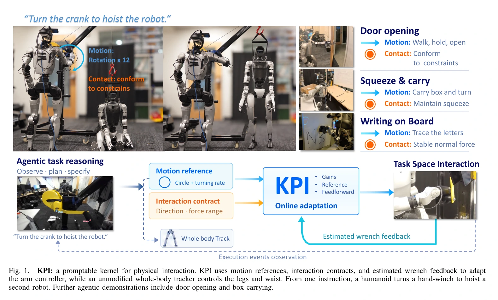
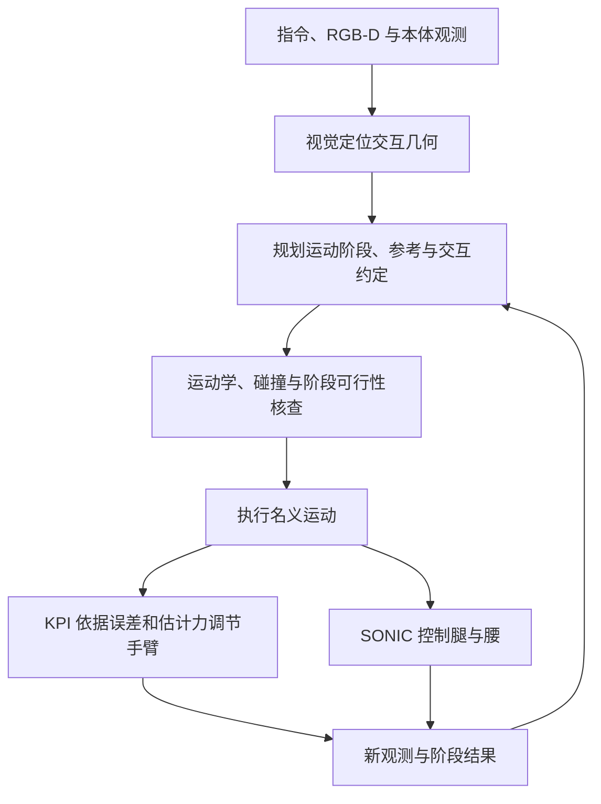
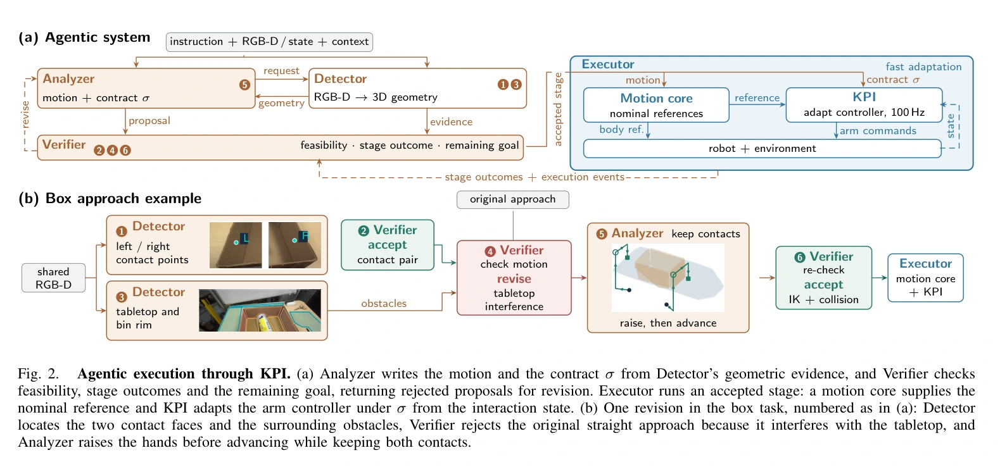
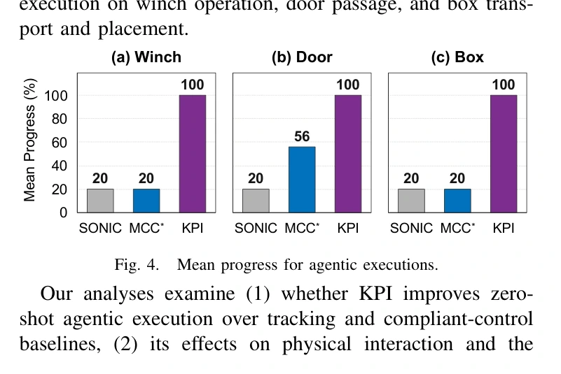
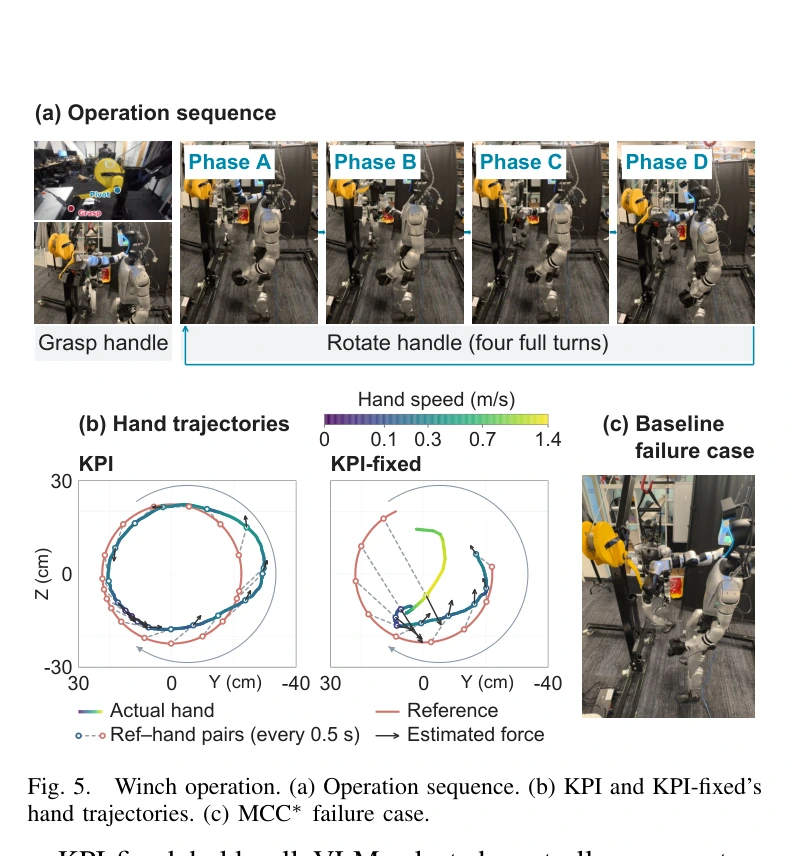
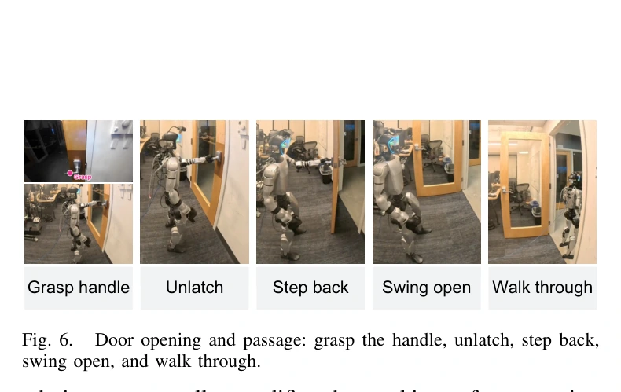
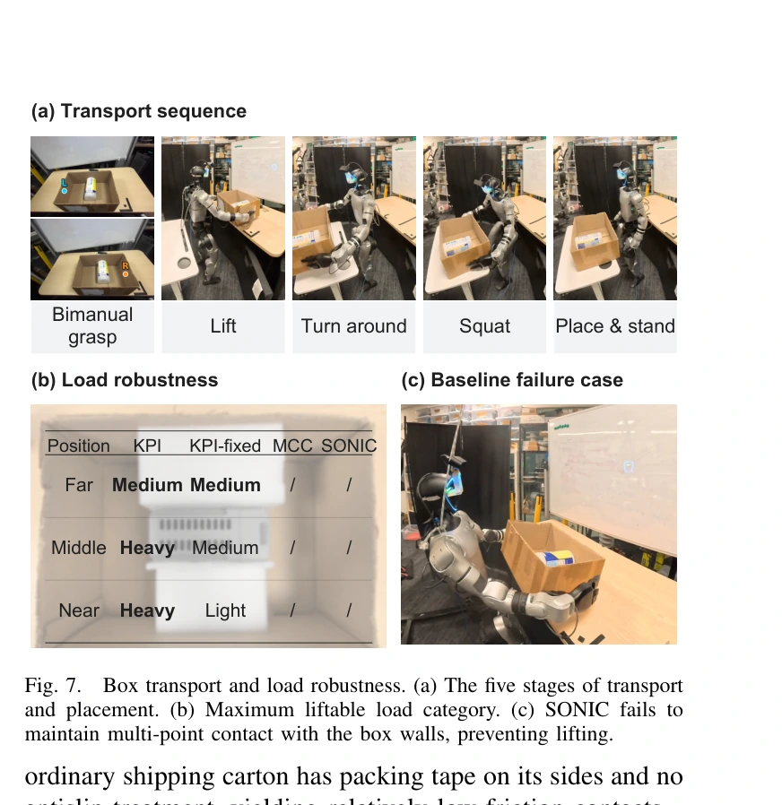
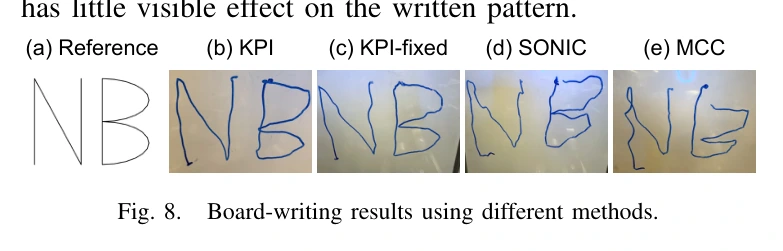

## 一屏概览

**问题：** 相同末端轨迹，在不同刚度、阻尼和接触阻力下会产生不同作用力。只让高层规划轨迹、事先固定手臂控制增益，很难可靠转动阻力变化的绞盘、拉开几何不明的门或双手夹持箱子。（§I）

原文图 1；PDF 第 1 页。[查看原始来源](https://arxiv.org/pdf/2609.36151v1#page=1)

**方法：** 高层同时输出运动参考与交互约定（interaction contract）：每个方向选择跟踪、顺应或力范围约束，并声明允许改变增益、参考推进和前馈中的哪些通道。KPI 在100 Hz 回路里依据位姿误差与估计力／力矩修改手臂控制器，腿和腰仍由未改动的 SONIC 跟踪器控制。（§III）

**结果与范围：** G1＋Dex3 平台上，绞盘、开门通过、轻箱搬运各五次指令驱动试验，KPI 完成15/15，原生 SONIC 手臂控制为0/15，集成的 MCC* 为1/15。书写、负载和遥操作另有诊断或定性演示，不能都并入这15次成功率。（§IV、图4–8）

**阅读建议：读。** 值得借鉴的是“高层说要产生什么交互，底层高速调参实现”的接口。力约束基于估计与局部模型；原文明确允许不可达时退化为最小预测违约，不能把它称为真实接触力的硬安全保证。

本页完整阅读 [v1 正文、参考文献与补充材料](https://arxiv.org/pdf/2609.36151v1)，共10页；视觉复核补充材料公式。以下是论文报告与本页解释，未核查实现或复现硬件结果。

## 为什么轨迹之外还要描述交互

绞盘手柄沿圆运动，切向需要足够推力克服负载，径向却应避免与机构约束顶撞；这两个方向随手柄转动。手停止时若参考点继续前进，位置误差越来越大，作用力还可能偏离允许运动的切线。一个预设“顺应系数”不能同时表达不同方向、不同阶段的需求。（§I、§IV-A）

力范围比刚度更接近任务意图：刚度 $k$ 与位移误差 $e$ 共同决定弹性力 $ke$，同一刚度面对不同几何误差会给出不同载荷。高层可以表达“夹住且不要过载”，底层再选择当前状态下合适的参数；但目标是否合理仍由高层负责。（§I、§V）

## 交互约定与优化

每个配置项写成 $\sigma_i=(d_i,o_i,[f_i^{\min},f_i^{\max}],c_i)$：$d_i$ 是明确坐标系中的方向或子空间，$o_i$ 是交互要求，力上下限约束机器人对环境的作用，$c_i$ 是允许修改的通道。转动情形对应轴和力矩。子空间使用投影力的范数，单方向使用带符号分量。（§III-A，式4）

| 要求 | 目标函数的作用 | 力范围与可编辑通道 |
| --- | --- | --- |
| 跟踪 | 减小预测的名义参考误差和执行参考误差 | 仍可同时限制力；通道决定能否改增益、放慢参考或调前馈 |
| 顺应 | 偏向内核预设的低方向刚度 | 低刚度目标由内核给定，高层不必直接填增益 |
| 约束 | 不额外追求轨迹或低刚度 | 仅满足力区间；已满足时正则项偏向保留参数 |

令 $\theta=(K_p,K_d,\rho,F_{\mathrm{ff}})$，分别为刚度、阻尼、参考推进参数与前馈力／力矩；$s_t$ 包括名义参考、测得位姿速度与估计外力。每次更新求解

$$
\theta_{t+1}\in\arg\min_{\theta\in\Theta_\sigma(s_t)}\left[L_\sigma(\theta;s_t)+\lambda\|\theta-\theta_t\|_R^2\right],\qquad
f_i^{\min}\leq\widetilde f_i(\theta;s_t)\leq f_i^{\max}.
$$

$\Theta_\sigma$ 固定未授权通道并施加控制器上下界，$R\succ0$ 处理参数量纲，$\lambda>0$ 限制无必要的变化。跟踪项使用10毫秒预测；双臂参数共同进入问题，两个手掌可以有各自的力范围。小问题在可解析时用闭式解，否则做有界数值求解。（§III-A，式3–5）

### 局部力预测与短时运动预测不是同一个模型

补充材料 S1 把单方向参考记为 $r_i(\rho)$，测得位置速度为 $x_i,v_i$，当前误差 $e_{i,t}=r_i(\rho_t)-x_{i,t}$，刚度阻尼为 $k_i,b_i$，前馈为 $u_i$。固定测得位置和速度，参数变化引起的即时作用力增量近似为

$$
\delta w_i=e_{i,t}\Delta k_i+k_{i,t}\Delta r_i-v_{i,t}\Delta b_i+\Delta u_i,
\qquad \widetilde f_i=\widehat f_i+\delta w_i.
$$

$\widehat f_i$ 是估计力，作为预测锚点，不能被优化器任意修改；$\Delta r_i=(\partial r_i/\partial\rho)_t\Delta\rho$。增益通道中阻尼随刚度变化，求局部导数时必须保留这一耦合。（式 S1）

跟踪误差使用另一个阻尼主导近似：固定短时外载荷，参数扰动引起的增量运动 $z_i$ 满足 $b_{i,t}\dot z_i+k_{i,t}z_i=\delta w_i$、$z_i(0)=0$。取 $h=10\,\mathrm{ms}$，当 $k_i,b_i>0$ 时

$$
g_i(h)=\frac{1-\exp(-k_{i,t}h/b_{i,t})}{k_{i,t}},\qquad
\widetilde x_{i,t+h}=x_{i,t}+hv_{i,t}+g_i(h)\delta w_i.
$$

这不需要辨识环境刚度，但也不是完整接触动力学。原文假设预测期间接触缓慢变化，冲击和强惯性交互不在适用范围；即时力预测与短时位姿预测不能同时解释成精确未来状态。下一周期以新测量替代旧预测。（补充材料 S1，式 S2–S3）

### 一个方向只允许改增益时

若参考与前馈固定，令 $\Delta b_i=\beta_i\Delta k_i$、$a_i=e_{i,t}-v_{i,t}\beta_i$，则 $\widetilde f_i(k)=\widehat f_i+a_i(k-k_{i,t})$。只要求力范围时，最优选择是离当前刚度最近的可行刚度。对 $a_i\neq0$：

$$
f_{i,b}=\operatorname{clip}(\widehat f_i,f_i^{\min},f_i^{\max}),\qquad
k_{i,t+1}=\operatorname{clip}\left(k_{i,t}+\frac{f_{i,b}-\widehat f_i}{a_i},\underline k_i,\overline k_i\right).
$$

区间已满足就保留刚度；否则沿局部灵敏度走向最近力边界。若刚度上下界使该边界不可达，只能选预测违约最小的端点；$a_i=0$ 表示改增益没有局部力调节能力，此时保留刚度。这是原文式 S4 的有限能力退路，不是约束必满足定理。

## 如何接到机器人与智能体

手臂执行笛卡尔阻抗律

$$
\tau=J^\top(K_pe-K_dv+F_{\mathrm{ff}})+\tau_g+\tau_{\mathrm{null}}.
$$

$J$ 为手掌雅可比，$e$ 相对调节后的参考，$v=J\dot q$ 为手臂关节产生的手掌速度；$\tau_g$ 补偿重力，$\tau_{\mathrm{null}}$ 约束冗余姿态。默认平移刚度300 N/m、范围30–1000 N/m，顺应目标100 N/m，阻尼按临界阻尼关系随刚度变化。阻抗执行500 Hz、力估计200 Hz、参数适应100 Hz 是不同回路。（§III-B，式6）

**时延处理是实现贡献。** 将关节空间阻尼 $D=J^\top K_dJ$ 分成对角与非对角部分。对角项通过电机驱动器的本地阻尼增益执行，利用更及时的关节速度；跨关节项仍由主机计算。驱动器位置增益和速度参考设为零时，两路在零时延极限下合成原来的笛卡尔阻尼，实际残余时延仍限制稳定裕度。原文报告全阻抗经主机力矩通道实现时发生振荡。（§III-B，式7）

无腕部力传感器时，系统修正方向相关的传动力矩效率、扣除重力，再在准静态假设下经 $J^\top$ 的正则最小二乘反推力／力矩。“平均误差预期小于5 N”是作者说明，本篇没有给出覆盖全部步态和接触强度的标定误差表；不能把该数值视为硬上界。（§III-B、§V）

Detector 将图像定位配合深度变成三维几何；Analyzer 组合直线、圆弧等共享运动生成器，Verifier 核查并在执行后判断阶段结果。Analyzer 和 Verifier 是同一 VLM 的角色化调用，实验使用 GPT-6 Astra。高层只在阶段间修订，不能误读成 VLM 在100 Hz 生成控制。遥操作改用 SMPL／GMR 产生参考，由人给出交互约定。（§III-C、图2）

原文图 2；PDF 第 3 页。[查看原始来源](https://arxiv.org/pdf/2609.36151v1#page=3)

## 实验与对照

| 设置与定位 | 结果 | 不能据此推断什么 |
| --- | --- | --- |
| 绞盘，§IV-A、图4–5 | 五次均完成四圈；SONIC、MCC* 仅完成抓取，平均进度20% | 演示中吊起另一台 G1 和标准四圈评价要分别理解；不代表任意负载保证 |
| 开门通过，§IV-B、图4、图6 | KPI 5/5，SONIC 0/5，MCC* 1/5；完成要求两脚及躯干通过 | 同平台五次试验不足以证明跨门型可靠性 |
| 轻箱搬运，§IV-C、图4、图7 | 0.85 kg 箱子，KPI 5/5；两基线均无法抬起 | 1.85、3 kg 另做静态抬升，不是完整搬运序列全通过 |
| 负载诊断，§IV-C、图7 | 按远、中、近位置评估；KPI 中／近位置可抬3 kg，远位置1.85 kg | 摩擦、箱面胶带和负载位置影响结果，不是额定通用负载 |
| 白板书写，§IV-D、图8 | KPI 和固定参数版均形成可辨认字形；KPI 的平均估计力更接近目标 | 力改善没有显著字形收益；不应声称所有输出指标都提升 |
| 开抽屉及跑步、跪下、起身搬箱，§IV-E | 遥操作演示 | 不是上述智能体自主15次测试的一部分 |

原文图 4；PDF 第 5 页。[查看原始来源](https://arxiv.org/pdf/2609.36151v1#page=5)

原文图 5；PDF 第 6 页。[查看原始来源](https://arxiv.org/pdf/2609.36151v1#page=6)

原文图 6；PDF 第 7 页。[查看原始来源](https://arxiv.org/pdf/2609.36151v1#page=7)

原文图 7；PDF 第 7 页。[查看原始来源](https://arxiv.org/pdf/2609.36151v1#page=7)

原文图 8；PDF 第 8 页。[查看原始来源](https://arxiv.org/pdf/2609.36151v1#page=8)

共同底层为 SONIC；MCC* 是集成到该跟踪器的无力传感器导纳控制对照。对需施力接触，默认沿期望力方向把名义位置偏移10厘米。MCC* 让智能体给刚度，而 KPI 让它给约定，因而系统比较也包含高层接口差异。KPI-fixed 移除在线参数适应，用于绞盘、负载、书写的诊断，原文没有给它完整三任务15次成功率。（§IV）

## 局限与我们的解释

**来源明确的限制：** 目标由人或模型决定，未预见的卡死只能表现为阶段停滞；准静态力估计的误差随刚度和步态增加；补充模型排除冲击与强惯性。局部预测的可行性不等于真实全过程稳定性。（§V、补充材料 S1；最后一句为本页解释）

**我们的解释：** 方法把“希望产生什么交互”从具体增益中分离，是 [[PolicyDeploymentContract|策略部署契约]] 的一个力学接口实例。与 [[simex-simulation-integrated-robotics-autoresearch|SimEX]] 在试验之间修复代码不同，KPI 在接触期间调整低维控制参数；两者时间尺度和被修改对象不同，组合收益尚未验证。

**可选小实验，尚未执行：** 先在单自由度弹簧接触模型里实现式 S4，扫参考偏差、力估计偏置及刚度上界，记录真实力、预测力、不可行次数与参数变化。这样能检查“约定满足”何时只是预测满足；它只验证局部机制，不复现整个人形系统。硬件测试应等待实现、估计器与接口核验。

## 研究归属

[[topics/planning-and-control|规划与控制]] · [[topics/robot-policy-learning|机器人策略学习]] · [[topics/evaluation-and-transfer|评测与 Sim-to-Real]]。坐标与力矩映射基础见 [[RobotCoordinateFrames|机器人坐标系]]、[[RobotRigidBodyDynamics|刚体动力学]]。
