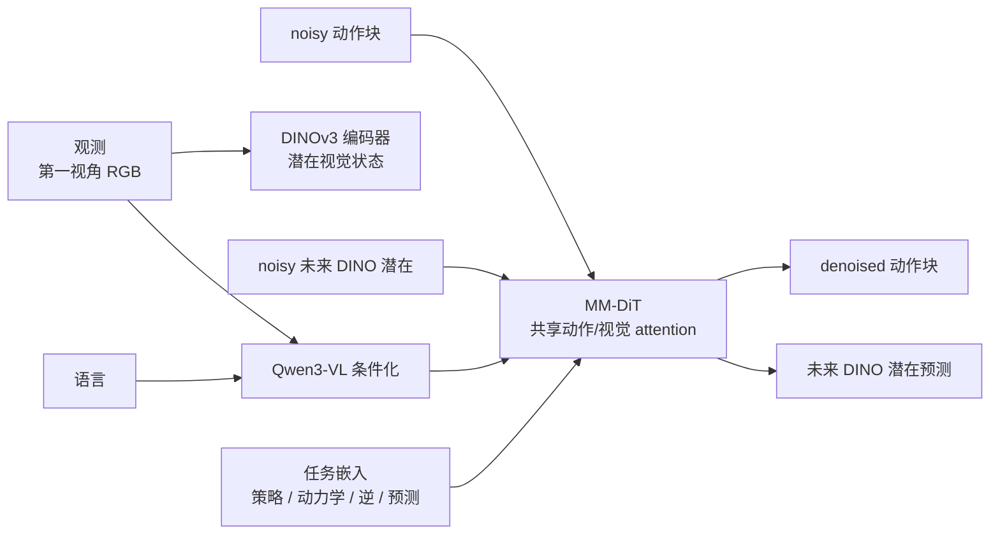

## 摘要

这篇 arXiv 论文提出 [[lda-1b-scaling-latent-dynamics-action-model|LDA-1B]]：一个把 [[WorldModelsForEmbodiedAI|世界模型]]、[[VisionLanguageActionModels|VLA 策略]] 和视觉预测放进同一潜在扩散训练 regime 的机器人基础模型。它的核心反对点是：大规模行为克隆只模仿专家动作，会丢掉混合质量机器人/人类交互数据中可迁移的动力学知识；而已有 UWM（统一的世界模型）方法直接在像素/VAE 空间预测未来状态，容易把外观噪声和动力学学习纠缠在一起。

LDA-1B 的 solution 是 [[LatentDynamicsActionModels|Latent 动力学动作模型]]：用冻结的 DINOv3 特征表示未来视觉状态，用 MM-DiT 同时 denoise 动作 chunks 和未来视觉 latents，并通过策略、正向动力学、逆动力学、视觉预测四个目标让不同质量的数据发挥不同作用。论文同时构建 [[lda-1b-scaling-latent-dynamics-action-model|EI-30K]]，一个超过 30k 小时的具身交互数据集，统一机器人/人类、真实/仿真、动作标注的/actionless 数据格式和手部中心化动作表示。

来源网址: https://arxiv.org/abs/2602.12215

项目主页: https://pku-epic.github.io/LDA/

## 核心主张

- LDA-1B 的核心不是单纯扩大 BC 数据，而是把异构具身数据分配到不同监督角色：高质量机器人/人类示范数据用于策略、动力学和预测；较低-质量轨迹主要用于动力学/视觉预测；actionless 第一视角人类视频用于指令条件化的未来状态预测。
- UWM 目标被组织成四个条件分布：策略 $p(a_{t+1:t+k}\mid o_t,\ell)$、正向动力学 $p(o_{t+1:t+k}\mid o_t,a_{t+1:t+k},\ell)$、逆动力学 $p(a_{t+1:t+k}\mid o_{t:t+k},\ell)$、视觉规划/预测 $p(o_{t+1:t+k}\mid o_t,\ell)$。LDA 把未来观测目标换成 DINO 潜在 $z_{t+1:t+k}$，减少像素外观建模。
- 架构使用 Qwen3-VL 作为视觉语言条件化编码器、DINOv3-ViT-s 作为视觉潜在编码器、MM-DiT 作为动作/视觉标记的共享 self-attention 主干网络。预训练时 VLM 与 DINO 编码器冻结的，只更新 MM-DiT 和动作编码器/解码器；finetuning 阶段再 unfreeze VLM。
- 论文把 LDA-1B 描述为 1.6B-参数机器人基础模型，同时表格 I 的 trainable 参数栏标成 1B，并说明该栏不计冻结的组件；因此更准确地说是 1B-规模 trainable core + 冻结的 VLM/DINO 组件。
- [[lda-1b-scaling-latent-dynamics-action-model|EI-30K]] 包含 8.03k 小时现实世界机器人数据、8.6k 小时仿真的机器人数据、7.2k 小时人类示范数据带有动作，以及 10k 小时 actionless 人类视频。所有数据转成 LeRobot 格式，并把动作对齐到手部中心化坐标帧。
- RoboCasa-GR1 仿真基准中，LDA-1B 平均成功为 55.4%，高于 GR00T-N1.6 的 47.6%、StarVLA 的 47.8%、reproduced GR00T-EI subset 的 51.3%、UWM-1B 的 19.3%。消融中，VAE 潜在 + MM-DiT 的 UWM 只有 20.0%，换成 DINO 潜在的 LDA-1B 达到 55.4%。
- 现实世界实验覆盖 [[lda-1b-scaling-latent-dynamics-action-model|Galbot]] G1 和 Unitree G1，包括 two-手指 gripper、22-DoF SharpaWave 手部、10-DoF BrainCo 手部。论文报告 LDA-1B 在接触丰富、灵巧、长时域任务上相对先验方法分别有 up 到 21%、48%、23% 增益。
- 混合质量 finetuning 是关键证据：在 Place the pen 为 the 盒体与 Bimanually remove the lid 两个任务中，加入约 30% 低质量轨迹让 LDA-1B 各提升 10%，而 π0.5 分别下降 20% 和 10%。
- 动力学分析用 DINO 特征 PCA 可视化和动作条件化的 attention 映射图说明模型关注接触 regions、力 application 点和 anticipated 运动轨迹，而不是背景 clutter。
- 论文承认局限：依赖固定 DINO 视觉特征，且主要使用第一视角相机 viewpoints；未来工作包括 jointly 学习视觉表征与潜在动力学、扩展到更丰富的 sensory modalities、自动优化数据角色。

## 关键引文

- "distinct yet complementary roles"
- "structured DINO latent space"
- "fixed DINO visual features"

### EI30K

EI-30K（具身交互数据集）是 [[lda-1b-scaling-latent-dynamics-action-model|LDA-1B]] 来源构建的三万小时以上具身交互数据集，用来支持 [[LatentDynamicsActionModels|潜在动力学动作模型]] 的通用具身数据归集。它把机器人/人类、真实/仿真、有动作标注/无动作的数据转成统一格式，并保留质量混合的轨迹，而不是只筛选专家示范。

#### 组成

| 类别 | Duration | 角色 in LDA 训练 |
| --- | ---: | --- |
| 真实世界机器人数据 | 8.03k hours | 动作标注的 interaction 数据, 策略 + 动力学监督 when 质量 allows |
| 仿真的机器人数据 | 8.6k hours | dense 与 cleaner 机器人监督, including 操作与 household 任务结构 |
| Ego 人类数据带有动作 | 7.2k hours | 人类意图, 手部运动, dexterity 先验, 动作/动力学监督 |
| Ego 人类数据不含动作 | 10k hours | 视觉预测, 时间结构, 可供性先验 |

#### 数据统一

EI-30K 的流程把原始数据集转成 LeRobot 2.1 格式，并统一保存观测、动作、语言、任务元数据、回合边界和 timestamps。动作表示被对齐到手部中心化坐标帧：机器人数据使用 6-DoF 末端执行器位姿加 gripper width 或灵巧手部关节；人类数据使用 6-DoF 腕部位姿和 MANO 手部参数。相机 extrinsics 被保留，用来 decouple 手部运动从第一视角输出头运动。

质量标注是这个数据集的关键：轨迹会按动作准确率和标注完整性标质量；idle/仅头部 segments 被移除；语言标注用 VLM 规范化。低质量轨迹没有被 aggressive 过滤删除，而是作为动力学/视觉预测监督被保留。

#### 实践含义

EI-30K 的主要价值不是“数据更多”，而是让数据角色可以被目标路由使用。对于机器人基础模型，这意味着数据采集流程应该记录质量、动作可用性、相机几何、手部/物体交互有效性和任务元数据；否则混合数据只能作为 noisy 模仿语料库，难以转成动力学监督。

### Galbot

Galbot 是 [[lda-1b-scaling-latent-dynamics-action-model|LDA-1B]] 来源中的作者机构之一，也是现实世界评估使用的机器人平台上下文。论文作者单位列出 Peking University、Galbot、CASIA、BAAI、Tsinghua University、Sun Yat-sen University 与 NVIDIA。

#### 来源背景

LDA-1B 的现实世界实验使用 Galbot G1 与 Unitree G1。Galbot G1 在来源中有两种末端执行器设置：standard two-手指并行 gripper，以及 22-DoF SharpaWave 灵巧手部。论文特别指出 Galbot G1 没有出现在 EI-30K 预训练数据集中，因此 Galbot 实验被用作少样本适配到新机器人形态的证据。

Galbot G1 夹爪任务覆盖 Pick Vegetable、Handover、Wipe Board、Flip Box、Water Flower、Knock Block with Hammer、Sweep 表格和 Throw Rubbish。灵巧手设置则参与高自由度的面包操作任务。这里保留英文任务名，因为它们是论文中的正式评测标签。

### LDA1B

LDA-1B 是 [[lda-1b-scaling-latent-dynamics-action-model|LDA-1B: Scaling Latent Dynamics Action Model via Universal Embodied Data Ingestion]] 提出的动力学中心化机器人基础模型。它把策略学习、正向动力学、逆动力学和视觉预测统一进一个 [[LatentDynamicsActionModels|Latent 动力学动作模型]]，目标是在异构具身数据上学习可迁移的交互动力学，而不是只做专家行为克隆。

#### 模型结构

LDA-1B 的输入包含当前观测、语言指令、任务/目标嵌入和扩散时间步。观测/语言由 Qwen3-VL 编成条件化标记；未来视觉状态用 DINOv3-ViT-s 特征 grid 表示；动作 chunk 和未来 DINO latents 一起进入 MM-DiT（多-Modal 扩散 Transformer）做 denoising。模型保留动作/视觉 modality-特定的 projections 与 FFN，同时共享 self-attention，让动作标记和视觉标记可以交换动力学信息。

论文有两个参数口径：Fig. 1 把 LDA-1B 称为 1.6B-参数模型；表格 I 的 trainable 参数栏写 1B，并说明不计冻结的组件。预训练时 Qwen3-VL 和 DINO 编码器冻结的，MM-DiT 与动作编码器/解码器被训练；finetuning 时 VLM 可以 unfreeze 做目标任务 adaptation。

#### 来源证据

在 RoboCasa-GR1 基准上，LDA-1B 平均成功为 55.4%，高于 GR00T-N1.6 47.6%、StarVLA 47.8%、reproduced GR00T-EI subset 51.3% 和 UWM-1B 19.3%。消融强调 DINO 潜在是关键：VAE 潜在 + MM-DiT 的 UWM 为 20.0%，LDA-1B 为 55.4%。

现实世界实验使用 [[lda-1b-scaling-latent-dynamics-action-model|Galbot]] G1 与 Unitree G1。论文报告在简单 pick-与-place 上 LDA-1B 达到 80%-90% 成功；在 Clean the Rubbish 这种长时域任务上 LDA-1B 为 35%，GR00T 和 π0.5 为 0%；在 Flip Bread 高-DoF 灵巧任务上 LDA-1B 为 90%，π0.5 为 10%。

## 关联

- [[lda-1b-scaling-latent-dynamics-action-model|LDA1B]] - 本来源的核心模型/实体。
- [[lda-1b-scaling-latent-dynamics-action-model|EI30K]] - 本来源构建的具身交互数据集。
- [[LatentDynamicsActionModels]] - 机制页：UWM 目标、DINO 潜在目标、MM-DiT、角色感知数据收录。
- [[WorldModelsForEmbodiedAI]] - LDA-1B 是决策-耦合的潜在世界模型：预测不直接追求 pixels，而是用动力学感知潜在状态改善动作策略。
- [[VisionLanguageActionModels]] - LDA-1B 与 π0.5/GR00T 属于机器人基础策略比较集合，但它把动作策略和动力学目标 cotrain。
- [[RobotContextConditioning]] - LDA-1B 与 π0.7 都处理异构数据，但 LDA 主要靠任务嵌入、质量感知目标路由和潜在动力学，而不是运行时元数据/子目标 prompting。
- [[lda-1b-scaling-latent-dynamics-action-model|Galbot]] - 作者单位之一，也是现实世界 Galbot G1 评估平台。

## 开放问题

- 表格 III 的 caption 说 LDA-1B 在未见的物体、backgrounds 和 OOD 位置上都维持 60.0% 成功，但表格本身给出的 OOD 位置是 40.0%；这应作为来源内部不一致处理。
- LDA-1B 的 DINO 潜在优势函数很强，但也带来表示 lock-in：如果冻结的 DINO 特征漏掉力、tactile、小工具接触或 transparent/reflective 物体，潜在动力学可能无法恢复这些状态变量。
- 混合质量数据的路由依赖质量标签与目标选择。论文说明了高/低/actionless 角色，但自动估计数据角色仍列为未来工作。
- 论文报告的是 team-owned 数据集、训练技术栈和机器人设置；论文指向代码 & 数据 URL，但来源本身不足以证明独立可复现性。
- 与 [[pi07-steerable-generalist-robotic-foundation-model|π0.7]] 相比，LDA-1B 强调潜在动力学预训练，而 π0.7 强调上下文/子目标转向；两者是否可以组合成“潜在动力学 + 运行时子目标/上下文”系统仍是值得跟进的问题。
