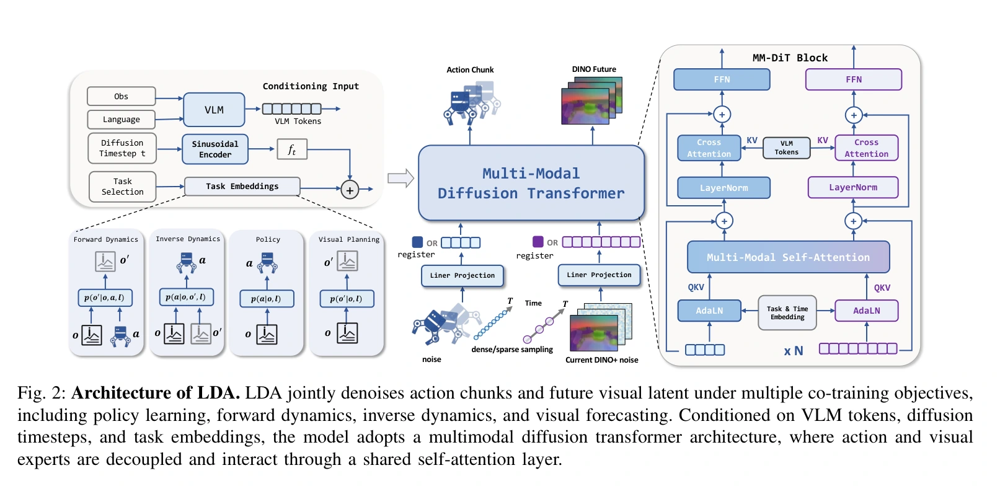
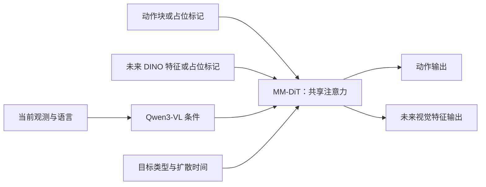
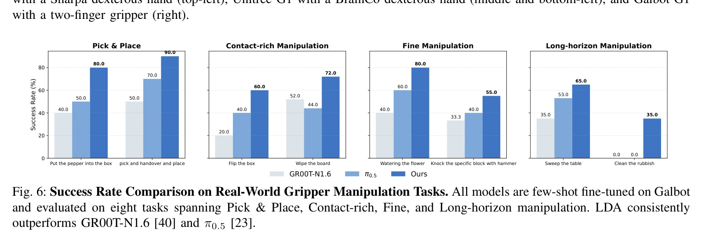
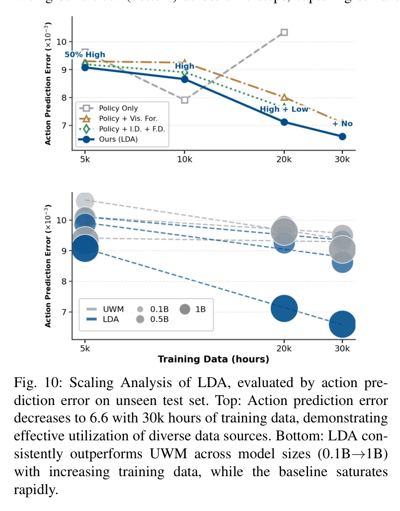
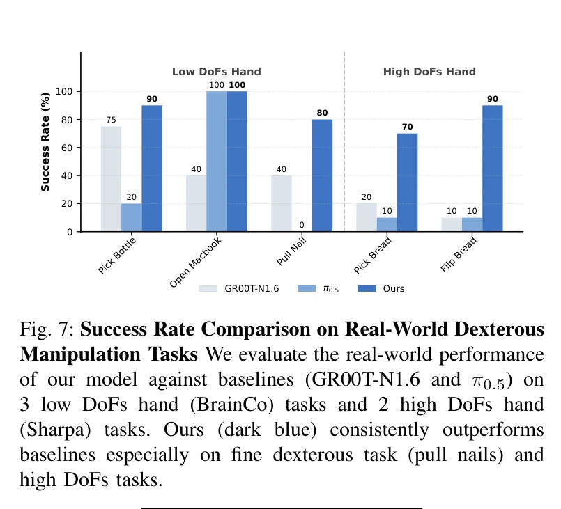
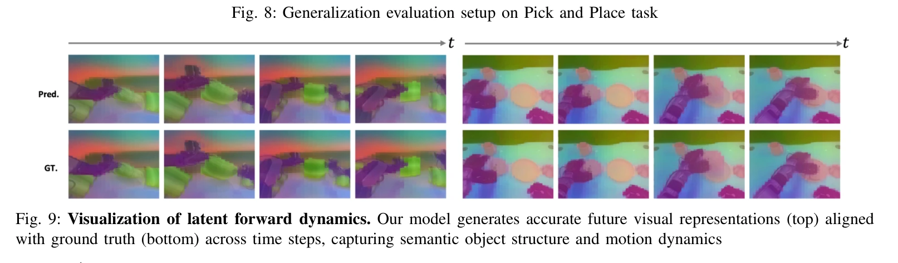
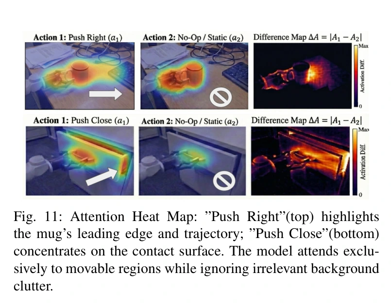
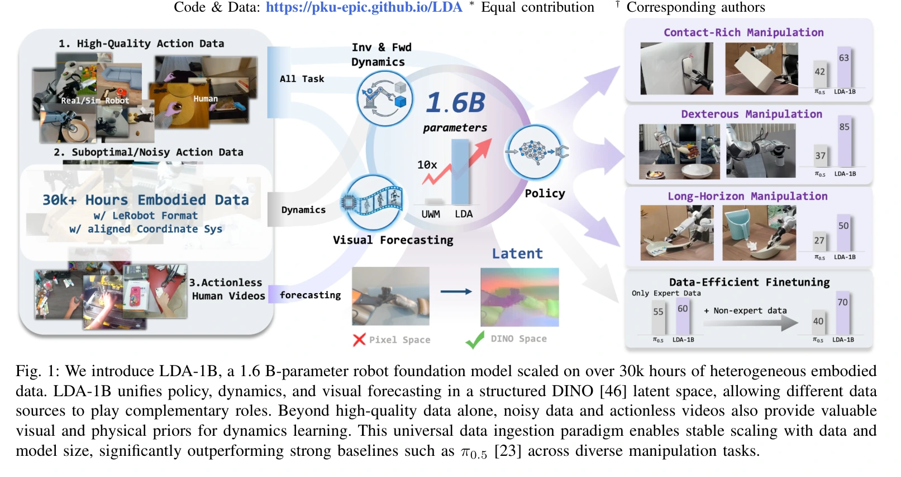

# LDA-1B：按监督条件利用异构交互数据

## 一屏概览

**研究问题。** 非专家轨迹仍记录动作后果，无动作标签视频仍记录状态变化。如果只做专家行为克隆，这些信息怎样进入机器人策略？

**方法贡献。** LDA 在 DINO 视觉特征空间共同学习策略、正向动力学、逆动力学和未来预测，用数据质量与标签可用性决定训练目标；MM-DiT 让视觉与动作两种时序交换信息。配套 EI-30K 将机器人、人类、真实和仿真数据统一到可共同训练的表示。（§III–IV）

**证据结论。** RoboCasa-GR1 的 24 项任务平均成功率为 55.4%，采用 VAE 表征的 MM-DiT 对照为 20.0%；两项混合质量微调实验各提高 10 个百分点。真机结果混用整任务成功率、物体完成比例和部分分数，不能把所有柱状图数字读成完整任务成功率。（表 II、IV，附录表 VII–VIII）

原文：[arXiv:2602.12215](https://arxiv.org/abs/2602.12215) · [项目主页](https://pku-epic.github.io/LDA/)。本页依据归档 **v1，2026-02-12** 的全文及附录；归档未标明会议录用信息。

## 方法：统一目标不等于统一模仿所有数据

令 $o_t$ 为当前观测，$\ell$ 为指令，$A=a_{t+1:t+k}$ 为未来动作块，$Z$ 为 DINO 编码的未来视觉状态。按 §III-A–C 将原文观测分布改写到其实际使用的特征空间：

| 目标 | 条件分布 | 监督所需信息 |
| --- | --- | --- |
| 策略 | $p(A\mid o_t,\ell)$ | 可作为模仿目标的高质量动作 |
| 正向动力学 | $p(Z\mid o_t,A,\ell)$ | 对齐的动作与后续状态，动作不必最优 |
| 逆动力学 | $p(A\mid o_t,Z,\ell)$ | 状态变化与对应动作 |
| 未来视觉预测 | $p(Z\mid o_t,\ell)$ | 时序视觉与指令，可以没有动作标签 |

高质量人类／机器人示范参与全部目标；低质量轨迹用于动力学与视觉预测；无动作标签视频只参与视觉预测。作者将最后一项称为 Visual Planning，但该条件分布本身没有搜索动作或计算控制代价，不能仅凭名称认定执行时做在线规划。（§III-B）

### 多任务流匹配怎样实现

模型为四种目标分别学习任务嵌入，缺少的动作或未来视觉模态由可学习占位标记代替。例如策略任务输入含噪动作和未来视觉占位标记；视觉预测任务输入含噪未来特征和动作占位标记。按目标启用对应输出损失。（§III-B，图 2）

原文图 2；PDF 第 3 页。[查看原始来源](https://arxiv.org/pdf/2602.12215#page=3)

若 $x$ 是动作或未来特征，$\epsilon$ 是同形状高斯噪声，$v_\theta$ 是模型预测的去噪向量场，则原文式 1 的核心监督为：

$$
\mathcal L_x=\mathbb E\|v_\theta-(\epsilon-x)\|_2^2,
\qquad
\mathcal L=\mathbb 1_{A}\mathcal L_A+\mathbb 1_Z\mathcal L_Z.
$$

$\mathbb 1_A,\mathbb 1_Z$ 表示当前目标启用哪些损失，是对原文选择性训练的解释性记号；不是为缺失标签填零。模型接受不同模态的扩散时间条件，动作和视觉可以按不同频率采样。（§III-B–D）

为什么速度标签是 $\epsilon-x$？若用 $x_\tau=(1-\tau)x+\tau\epsilon$ 解释数据到噪声的直线路径，其导数正好是 $\epsilon-x$。这是与本文式 1 一致的教学重构；流匹配的条件均值推导、反向积分及时间方向约定见 [[FlowMatching|流匹配]]。这里的重要设计不是换一个损失名称，而是**同一个模型的哪些模态作为条件、哪些作为待生成变量、哪些没有监督**。

| 调用模式 | 提供的实际条件 | 要生成的量 | 不应偷用的信息 |
| --- | --- | --- | --- |
| 策略 | 当前观测、语言、策略任务嵌入 | 动作块 | 未来视觉用占位标记，不用真实未来 |
| 正向动力学 | 当前观测、语言、给定动作 | 未来 DINO 特征 | 给定动作是条件，不代表动作一定优质 |
| 逆动力学 | 当前观测、语言、给定未来特征 | 动作块 | 测试时未来须来自实际目标或其他可用提供者 |
| 视觉预测 | 当前观测、语言 | 未来 DINO 特征 | 动作用占位标记，不能解释成指定动作的后果 |

按 §III-B 整理。普通策略评测没有规定先调用视觉预测再调用逆动力学；共享四种能力不等于部署总要串行执行四遍。

**教学例子。** 一段机器人推杯轨迹中，动作绕了远路但确实把杯子向右推，若它被标为低质量，就不让策略模仿绕路动作，却仍用“该动作使杯子怎样移动”训练正向动力学。同一场景的无动作标签人类视频只能监督视觉预测。这个例子说明目标路由如何避免把所有视频强行变成专家示范，并非论文单独报告的实验。

### 为什么改用 DINO 与 MM-DiT

未来视觉目标来自冻结 DINOv3-ViT-s 的 $14\times14\times384$ 特征网格，避免把全部建模能力用于像素外观。Qwen3-VL 编码当前图像和语言。MM-DiT 的动作、视觉分支保留各自的投影及前馈网络，用共享自注意力交换信息，并通过交叉注意力读取视觉语言条件。（§III-C–D、附录 A）

```mermaid
flowchart LR
  O["当前观测与语言"] --> V["Qwen3-VL 条件"]
  A["动作块或占位标记"] --> M["MM-DiT：共享注意力"]
  Z["未来 DINO 特征或占位标记"] --> M
  V --> M
  T["目标类型与扩散时间"] --> M
  M --> AO["动作输出"]
  M --> ZO["未来视觉特征输出"]
```

动作以末端增量位姿与手指状态统一；图像约 3 Hz、动作 10 Hz，附录动作块长度 16，并给模型两步历史。预训练冻结视觉语言模型与 DINO，仅更新 MM-DiT 和动作编解码；微调时解冻视觉语言模型。（§III-C、E、附录 A）

**我们的解释。** DINO 减少外观重建负担是合理设计动机，表 II 的对照支持其在本文设置下的收益；但它没有证明潜变量分离了全部物理因素，更不保证力、接触或透明物体状态得到充分表达。

## EI-30K：统一数据需要哪些工作

正文 §IV 报告真实机器人 8.03k 小时、仿真机器人 8.6k 小时、有动作的人类数据 7.2k 小时、无动作人类视频 10k 小时，合计约 33.83k 小时，故“30k+”是规模级别而非精确总和。附录表 IX 的逐来源时长与正文四类汇总也不完全一致，本页不把它们混算成精确清洗后样本数。

附录 D 说明用 LeRobot 2.1 保存末端位姿、手部状态、相机参数、任务标识、回合边界与时间戳；统一重采样到 10 Hz 后再按模型需求取样。人工检查各数据集坐标偏移，将手部动作转到共同末端坐标；移动相机记录通过外参区分头部运动与手部运动。语言标注规范化，丢弃闲置、只有头部运动或无效手部标注片段，再按动作准确性与标注完整性记录质量。**保留低质量动作并不等于完全不清洗数据。**

## 实验与消融

| 验证问题 | 结果 | 位置与边界 |
| --- | --- | --- |
| 仿真策略效果 | LDA-1B 55.4%；GR00T-N1.6 47.6%、StarVLA 47.8%、作者增强 GR00T 对照 51.3% | 表 II、VI；24 项 RoboCasa-GR1，每任务微调 1,000 条示范、评估 51 次；增强对照只用高质量子集 |
| 表征、结构、规模 | VAE＋MM-DiT 20.0%；DINO＋普通 DiT 48.9%；LDA-0.5B 50.7%；LDA-1B 55.4% | 表 II；支持该训练设置中的组件收益，不等于所有 VAE 模型劣于所有 DINO 模型 |
| 未见机器人适配 | Galbot G1 不在预训练集中，后续每任务采集 100 条轨迹微调；基本抓取放置指标 80%–90% | §V-B、图 6；这是有下游数据适配，不是零样本迁移 |
| 混合质量数据 | 放笔：63 条高质量时 70%，加入 37 条低质量后 80%；取盖：66 条高质量时 50%，加入 34 条后 60% | 表 IV；两任务分别增加 10 个百分点；π0.5 对应下降 20／10 个百分点，不能推出通用最优低质量比例 |
| 视觉／空间变化 | 新物体 60%、新背景 60%、分布外位置 40% | 表 III；图注称三项均为 60%，与表格不符，应保留冲突而采用逐格值描述 |
| 数据与模型扩展 | 在留出的 Agibot World 子集上，扩大数据、目标与参数降低动作 L1 误差 | §V-C、图 10；主要纵轴是离线动作误差，不能写成等量的闭环成功率改善 |

原文图 6；PDF 第 6 页。[查看原始来源](https://arxiv.org/pdf/2602.12215#page=6)

原文图 10；PDF 第 8 页。[查看原始来源](https://arxiv.org/pdf/2602.12215#page=8)

真机使用 Galbot G1 夹爪／22 自由度 SharpaWave 手，以及 Unitree G1 的 10 自由度 BrainCo 手。策略主要使用头部第一视角 RGB。主要对照在过滤后的专家子集微调，LDA 使用全部混合质量轨迹，因此系统比较同时改变了数据使用方式；它支持整套方案收益，不能单独证明网络结构造成全部差距。（§V-B、附录 C）

### 真机图表的指标必须逐任务解释

| 图中结果 | 实际计分方式 | 原文定位 |
| --- | --- | --- |
| Clean the Rubbish 35%，两基线 0% | 10 次试验中成功倒入垃圾桶的纸球比例；不是 35% 的整任务二值成功率 | 图 6、表 VII |
| Wipe Board 72% | 10 次试验，清洁完成度按 0–5 计分后归一化 | 图 6、表 VII |
| Sweep Table 65% | 收入簸箕的钉子比例 | 图 6、表 VII |
| Pull Nail 80%，π0.5 为 0% | 10 次试验，定位／单爪移除／完整移除分别计 0.25／0.5／1 | 图 7、表 VIII |
| Flip Bread 90%，两基线 10% | 10 次试验，首次翻成功计 1，第二次计 0.5，否则 0 | 图 7、表 VIII |

原文图 7；PDF 第 7 页。[查看原始来源](https://arxiv.org/pdf/2602.12215#page=7)

夹爪任务大多只有 10 次试验，敲击任务 60 次；灵巧手瓶子和笔记本任务 20 次，其余 10 次。表 VII 规定 200 秒超时。图上的同一“Success Rate”标题掩盖了不同分母和部分完成规则，跨任务均值需要谨慎解释。

## 局限与原文口径问题

作者在 §VI 承认固定 DINO 特征、主要第一视角输入与人工数据分工的局限。图 9／16 的特征可视化和图 11 的动作条件注意力差值是定性分析，不能验证因果模型正确性或物理约束满足度；附录中“动力学建模是可靠控制必要条件”的措辞也超出了有限基线对照能证明的范围。

原文图 9；PDF 第 8 页。[查看原始来源](https://arxiv.org/pdf/2602.12215#page=8)

原文图 11；PDF 第 9 页。[查看原始来源](https://arxiv.org/pdf/2602.12215#page=9)

参数口径尚不完全透明：图 1 写 1.6B，表 I 写排除冻结组件后的可训练 1B，附录 A 指定 Qwen3-VL-4B-Instruct 并在微调时解冻。因此不能简单将 1.6B 写为包含所有组件的部署总参数，也不能把预训练的 1B 可训练参数套到微调阶段。表 II 的增强对照名为 GR00T-EI30k，正文／附录名为 GR00T-EI10k；共同描述是 EI-30K 的高质量子集。本页按这一共同定义引用，保留命名差异。

原文图 1；PDF 第 1 页。[查看原始来源](https://arxiv.org/pdf/2602.12215#page=1)

## 我们的解释与关联

**我们的解释。** 本文最值得迁移的研究设计是把“能模仿的动作”与“有信息的动作后果”分开使用，而不是假设所有数据都应提供策略监督。下一步比较其他路线时，应同时控制表示、动作接口、数据质量与下游适配预算，不能仅按模型名称排名。

机制基础见 [[LatentDynamicsActionModels|潜在动力学动作模型]]、[[WorldModelsForEmbodiedAI|具身世界模型]]、[[VisionLanguageActionModels|视觉—语言—动作模型]]。与 [[RobotContextConditioning|机器人上下文条件化]] 及 [[pi07-steerable-generalist-robotic-foundation-model|π0.7]] 对照时，LDA 的核心在训练目标分配，后者的核心在条件化区分数据与执行意图；两者可否组合仍是研究假设。

## 研究归属

[[topics/robot-policy-learning|机器人策略学习]] · [[topics/world-models-and-representations|世界模型与表征]] · [[topics/evaluation-and-transfer|评测与现实迁移]] · [[topics/future-conditioned-action|未来预测怎样帮助动作学习]] · [[topics/policy-evaluation|数据与评测怎样支撑泛化判断]]。
