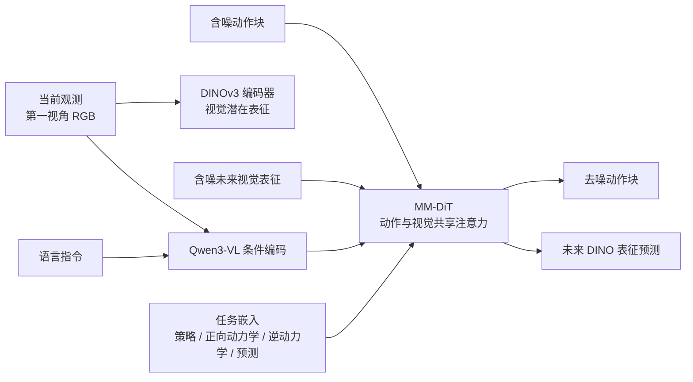

## 摘要

LDA-1B 把 [[WorldModelsForEmbodiedAI|世界模型]]、[[VisionLanguageActionModels|VLA 策略]] 和视觉预测统一到潜在扩散训练中。论文认为，只模仿专家动作的行为克隆难以利用混合质量数据中的动力学知识；直接在像素或 VAE 空间预测未来，又容易把外观噪声和交互动力学纠缠在一起。

它采用 [[LatentDynamicsActionModels|潜在动力学动作模型]]：用冻结的 DINOv3 特征表示未来视觉状态，MM-DiT 同时对动作块和未来视觉表征去噪，再通过策略、正向动力学、逆动力学和视觉预测四种目标使用不同质量的数据。配套的 EI-30K 数据集超过三万小时，统一机器人与人类、真实与仿真、有动作标注与无动作标注的数据格式及手部中心坐标系。

来源网址: https://arxiv.org/abs/2602.12215

项目主页: https://pku-epic.github.io/LDA/

## 核心主张

- 数据按监督能力分工：高质量示范同时支持策略、动力学和视觉预测；低质量轨迹主要支持动力学与视觉预测；无动作标注的第一视角人类视频支持指令条件下的未来状态预测。
- UWM 的四个目标对应策略 $p(a_{t+1:t+k}\mid o_t,\ell)$、正向动力学 $p(o_{t+1:t+k}\mid o_t,a_{t+1:t+k},\ell)$、逆动力学 $p(a_{t+1:t+k}\mid o_{t:t+k},\ell)$ 和视觉规划/预测 $p(o_{t+1:t+k}\mid o_t,\ell)$。其中 $o_t$ 是当前观测，$a$ 是动作序列，$\ell$ 是语言指令。LDA 将未来观测目标换成 DINO 潜在表征 $z_{t+1:t+k}$，降低对像素外观的建模负担。
- 参数口径需要区分：论文图 1 称模型有 1.6B 参数，表 I 的可训练参数栏为 1B，并明确排除冻结组件。预训练冻结 Qwen3-VL 和 DINO 编码器，只训练 MM-DiT 与动作编码器/解码器；微调时再解冻 VLM。
- RoboCasa-GR1 仿真基准中，LDA-1B 平均成功率为 55.4%，对照为 GR00T-N1.6 的 47.6%、StarVLA 的 47.8%、作者复现的 GR00T-EI 子集版本的 51.3%，以及 UWM-1B 的 19.3%。消融中，采用 VAE 潜在表征和 MM-DiT 的 UWM 为 20.0%，换成 DINO 潜在表征的 LDA-1B 为 55.4%。
- 现实世界评估使用 Galbot G1 与 Unitree G1，覆盖双指夹爪、22 自由度 SharpaWave 灵巧手和 10 自由度 BrainCo 灵巧手。论文报告，在接触丰富、灵巧和长时域任务上，相比既有方法分别提升最多 21%、48% 和 23%。
- 具体任务中，简单抓取放置的成功率为 80%–90%；Clean the Rubbish 中 LDA-1B 为 35%，GR00T 和 π0.5 为 0%；高自由度的 Flip Bread 中 LDA-1B 为 90%，π0.5 为 10%。这些结果来自论文指定的机器人平台和微调设置。
- 混合质量微调实验中，在 Place the pen into the box 和 Bimanually remove the lid 两项任务里，加入约 30% 低质量轨迹让 LDA-1B 分别提升 10%，而 π0.5 分别下降 20% 和 10%。
- DINO 特征的 PCA 可视化和动作条件注意力图显示，模型重点关注接触区域、施力点与预期运动轨迹，而非杂乱背景。论文将其作为潜在动力学表征的分析证据。
- 作者承认模型依赖固定 DINO 视觉特征，且主要使用第一视角相机。未来方向包括联合学习视觉表征与潜在动力学、扩展传感模态，以及自动优化数据分工。

## 模型结构

Qwen3-VL 将当前观测和语言指令编码为条件标记；DINOv3-ViT-s 将未来视觉状态编码为特征网格。动作块、未来 DINO 表征、任务嵌入和扩散时间步共同进入 MM-DiT（多模态扩散 Transformer）。动作与视觉分支保留各自的投影层和前馈网络，共享自注意力以交换动力学信息。

```mermaid
flowchart LR
  O["当前观测<br/>第一视角 RGB"] --> V["Qwen3-VL 条件编码"]
  L["语言指令"] --> V
  O --> D["DINOv3 编码器<br/>视觉潜在表征"]
  A["含噪动作块"] --> M["MM-DiT<br/>动作与视觉共享注意力"]
  Z["含噪未来视觉表征"] --> M
  V --> M
  T["任务嵌入<br/>策略 / 正向动力学 / 逆动力学 / 预测"] --> M
  M --> AO["去噪动作块"]
  M --> ZO["未来 DINO 表征预测"]
```

## EI-30K 数据集

### 组成与监督角色

| 类别 | 时长 | 在 LDA 训练中的作用 |
| --- | ---: | --- |
| 真实世界机器人数据 | 8.03k 小时 | 根据质量提供策略与动力学监督 |
| 仿真机器人数据 | 8.6k 小时 | 提供较密集、较干净的机器人动作与动力学监督 |
| 有动作标注的第一视角人类数据 | 7.2k 小时 | 提供手部运动、灵巧操作和交互动力学监督 |
| 无动作标注的第一视角人类视频 | 10k 小时 | 支持视觉预测，提供时间结构和可供性先验 |

### 数据统一

EI-30K 使用 LeRobot 2.1 格式，保存观测、动作、语言、任务元数据、回合边界和时间戳。机器人动作采用 6 自由度末端执行器位姿，加上夹爪宽度或灵巧手关节；人类动作采用 6 自由度腕部位姿和 MANO 手部参数。动作对齐到手部中心坐标系，保留相机外参以区分手部运动和第一视角相机的头部运动。

轨迹质量根据动作准确性和标注完整性评定；空闲或仅有头部运动的片段会被移除，语言标注用 VLM 规范化。低质量轨迹仍被保留，供动力学与视觉预测目标使用。对数据采集的实践启示是：质量、动作标注是否可用、相机几何和任务元数据，决定了混合数据可以服务哪些训练目标。

## 评估范围

Galbot 是作者机构之一，Galbot G1 也是现实世界评估平台。该平台未出现在 EI-30K 预训练数据中，因此论文将这些实验用于支持向新机器人形态进行少样本适配的判断。Galbot G1 使用双指并行夹爪或 22 自由度 SharpaWave 灵巧手，任务包含抓取、递交、擦拭、翻转盒子、使用工具、Sweep Table 和灵巧手面包操作；Unitree G1 使用 10 自由度 BrainCo 灵巧手。

## 关键引文

- "distinct yet complementary roles"
- "structured DINO latent space"
- "fixed DINO visual features"

## 关联

- [[LatentDynamicsActionModels|潜在动力学动作模型]] - 统一训练目标、DINO 潜在表征、MM-DiT 与按监督能力分配数据的机制。
- [[WorldModelsForEmbodiedAI|具身智能世界模型]] - LDA-1B 用动力学相关的潜在状态改善动作策略。
- [[VisionLanguageActionModels|视觉—语言—动作模型]] - LDA-1B 与 π0.5/GR00T 的策略比较，以及动作与动力学的联合训练。
- [[RobotContextConditioning|机器人上下文条件化]] - 与 π0.7 处理异构数据的方法对照：LDA 侧重训练目标分工，π0.7 侧重运行时元数据和子目标提示。

## 开放问题

- 表 III 的图注声称未见物体、背景和分布外位置均有 60.0% 成功率，但表格给出的分布外位置成功率为 40.0%。这是来源内部不一致，不能用图注替代表格结果。
- 固定 DINO 表征是否遗漏力、触觉、细小接触以及透明或反光物体的信息？如果这些状态无法被编码，潜在动力学是否还能恢复它们？
- 混合质量数据分工依赖质量标签和目标选择；自动判断数据应服务哪些目标仍是论文的未来工作。
- 结果基于作者团队的数据集、训练系统和机器人设置。论文给出代码与数据入口，但这不足以证明已完成独立复现。
- 能否将 LDA-1B 的潜在动力学与 [[pi07-steerable-generalist-robotic-foundation-model|π0.7]] 的运行时子目标和上下文结合，仍待验证。
