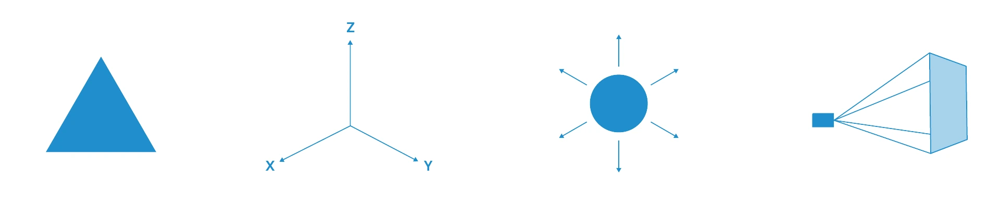
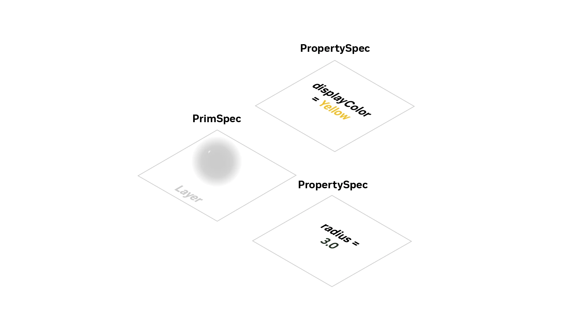
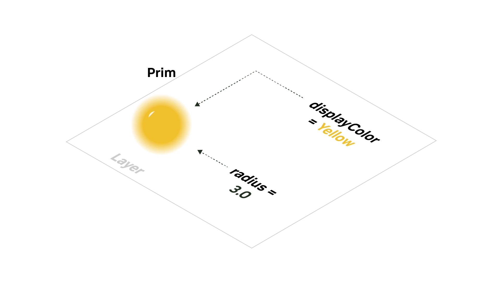
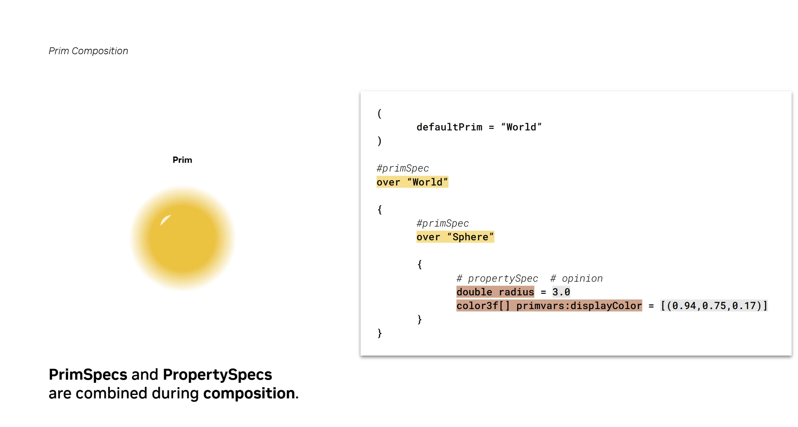
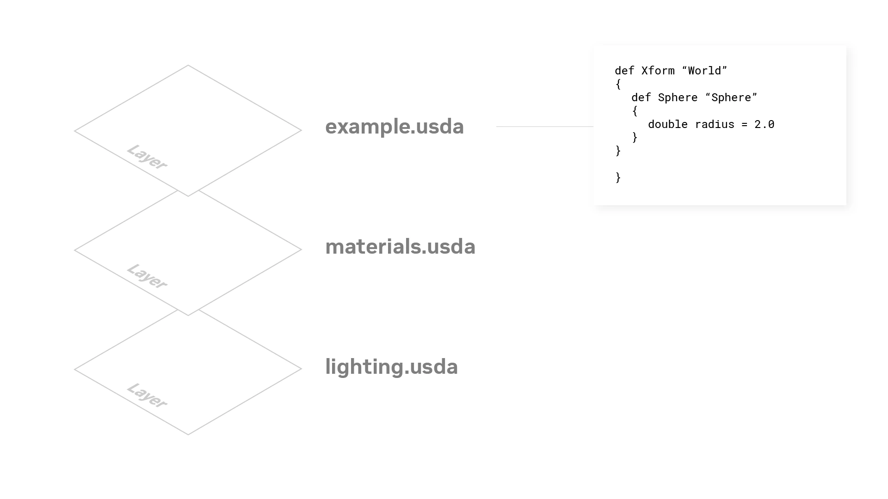

# What Is Prim Composition? - Learn OpenUSD

## 摘要

NVIDIA Learn OpenUSD 将层内编写的图元／属性规范连接到最终组合图元。规范包含某一层的意见；组合汇集多个层的贡献，形成场景中的对象。

图元类型示意。[查看原始来源](https://docs.nvidia.com/learn-openusd/latest/_images/image93.png)

## 核心主张

- 图元是 USD 的主要容器，可以组织子图元并持有数据。
- 图元与属性以规范形式编写到层中，规范包含对最终结果的值意见。
- 属性分为数值属性（`Attribute`）与关系（`Relationship`）；可用 `Sdf` API 操作规范。
- 层是 USD 可解析的文档，可以为文件或托管资源；它可以只稀疏描述部分图元和属性。
- 独立工作流分别编写层，再以非破坏方式组合为项目，支持协作。

不同层中的属性意见。[查看原始来源](https://docs.nvidia.com/learn-openusd/latest/_images/image24.png)

意见组合为最终图元。[查看原始来源](https://docs.nvidia.com/learn-openusd/latest/_images/image581.png)

图元与属性规范的组合。[查看原始来源](https://docs.nvidia.com/learn-openusd/latest/_images/image86.png)

稀疏层与图元规范。[查看原始来源](https://docs.nvidia.com/learn-openusd/latest/_images/image98.png)

## 关键引文

> “sparsely defined”

一个层不需要完整重复所有场景内容。

## 关联

[[USDAFileSyntax|USDA 文件语法]] 展示规范的文本语法；[[OpenUSDSceneComposition|OpenUSD Composition]] 解释组合；[[openusd-glossary|OpenUSD 术语与概念]] 提供精确术语。

## 开放问题

这里只给出图元组合入口。完整组合弧、LIVERPS 强度顺序、列表编辑与属性求值仍需对应教程与 API 参考。

## 研究归属

[[topics/assets-and-world-generation|3D 资产与场景]] · [[topics/asset-representation|3D 资产格式]]。
