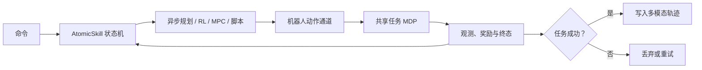

## 摘要

Haoran Lu 等提出 [[MagicSim]]：一套构建在 Isaac Sim / PhysX / RTX 之上的可执行具身交互基础设施。它的核心不是新的物理引擎、规划算法或策略模型，而是把异构世界构建、确定性批处理运行时、多机器人控制、规划器在线调用、任务 MDP、自动轨迹采集、标注与智能体接口组织在同一个回合生命周期中。论文用“一套运行时、一个 MDP、三种驱动器”概括设计：同一任务可以被 RL 策略直接执行、被 AutoCollect 的命令—技能—规划器层执行，或通过计划中的推理 / 重放驱动器执行。

来源对知识库的主要新增价值是把 [[RoboticsSimulationInfrastructure|机器人仿真基础设施]] 的分析单位从环境步骤或渲染帧推进到“可重放的回合”。一个回合同时保存初始状态、任务状态、技能与规划历史、动作、观测、语言和成功判定；只有经过执行并通过任务成功门控的轨迹才写入数据集。论文据此把基准、数据生成和智能体交互视为同一运行时的三种消费方式，而不是三套分离流程。

来源网址：https://arxiv.org/abs/2606.17511

## 核心主张

- MagicSim 是物理引擎之上的中间件，不是 PhysX / Isaac Sim 的替代品。它把场景、布局、物理对象、机器人、规划器、相机、采集、语言和记录器拆成拥有各自状态的管理器，并用固定调用顺序组织局部重置与步骤执行。
- 一个批处理模拟器进程承载多个子环境。物理时间在一次 `sim_step()` 上同步，命令、技能阶段、规划请求、重试、成功状态和记录缓冲区则按环境异步推进。
- 确定性被定义为运行时契约：全局种子派生出按环境、按管理器隔离的随机流；`reset_idx(env_ids)` 只重置选中环境；`get_state` / `reset_to` 恢复管理器持有的快照。P1 / P2 / P3 生命周期分别处理可动态导入且可删除、可导入但不可删除、阶段锁定后既不可导入也不可删除的后端对象。
- 用户面对的实体写为 $e=(n,c,i)$：$n$ 是环境编号，$c$ 是逻辑类别，$i$ 是实例编号；模拟族映射 $f(e)\in\mathcal{F}$ 决定求解表示。当前实现列出 15 个模拟族，但论文明确区分“同场共执行”与“跨求解器双向物理耦合”，火焰、流动视觉效果和动画人物并不普遍产生双向反作用力。
- 机器人被归一化为 `base`、`arm`、`eef` 三类可选动作通道；约 33 个注册机器人覆盖 7 类形态。控制栈由底层闭环控制器、中层导航 / IK / 运动生成、高层目标供给组成。
- 修改后的 cuRobo 支持多工具坐标系、逐环境准则、联合候选选择、逐坐标系目标集、种子锚定和跨形态重定向。规划请求以 future 返回，经异步微批求解服务聚合，避免单个慢规划阻塞整个物理批次。
- AtomicSkill 是固定的物理接触接口。上层选择命令或技能，下层执行器负责任务目标编译、规划器调用、重试、超时、接触 / 稳定性检查和类型化结果。约 22 个技能、8 个规划基元构成约 30 类命令；几何技能使用运动生成，高自由度灵巧技能可使用冻结的 RL 策略，连续富接触技能可使用逐环境 MPC。
- 资产标注分两步：视觉—语言模型提出部件、关键点与功能先验，物理验证将它们编译为按技能组织的候选库。运行时再记录实际选中的末端路径、目标物体框与可供性目标。论文报告 17,005 个资产；审计的资产—技能对平均从 2,315 个原始候选筛到 538 个保留候选，对应 26.6% 的物理验证通过率和 23.2% 的最终保留率。
- 任务层注册 8 个任务族、40 多个具体任务。每个任务实现观测、奖励、终止、成功与命令分布，动作空间由机器人形态提供；成功、截断与失败状态同时服务于基准指标和数据写入门控。
- MagicSim 的数据价值来自对齐：动作、采集状态、环境信息、相机 / Omni 标注、MagicSim 原生执行标注和 L1/L2/L3 语言都来自同一个实际执行回合，而不是后处理生成的“看起来成功”的视频。

## 数学与机制索引

可执行回合可以抽象为：

$$
\tau = (s_0, \xi, \{o_t,a_t,r_t,z_t\}_{t=0}^{T}, y),
$$

其中 $s_0$ 是可重放初始状态，$\xi$ 是按环境与管理器隔离的随机化状态，$o_t$、$a_t$、$r_t$ 分别是观测、机器人动作与奖励，$z_t$ 是命令 / 技能 / 规划器 / 标注阶段，$y\in\{\text{success},\text{truncated},\text{failed}\}$ 是统一终态。记录器只在 $y=\text{success}$ 时提交完整轨迹；这使保存分布成为条件分布 $p(\tau\mid y=\text{success})$，而不是所有尝试的无偏分布。

更完整的机制推导见 [[ExecutableEmbodiedInteractionInfrastructure|可执行具身交互基础设施]]。

## 关键引文

- “one deterministic batched runtime”
- “one MDP, three drivers”
- “episodes, not frames”
- “determinism is a runtime contract”

## 证据边界

- 论文主要提供架构说明、能力清单和可视化示例，不提供完整的逐任务成功率、训练曲线、吞吐量 / 延迟曲线或与邻近系统的统一硬件定量比较。能力对照表由作者按 2026 年 6 月公开资料判断，不能替代第三方复现。
- 论文明确把“RL-ready”限定为接口性质，而不是策略训练结果。低层 RL 通过 `rsl_rl` 接口被使用；高层规划器闭环 RL 仍是计划用途。
- 三种驱动器的成熟度不相同：RL 直接驱动和 AutoCollect 当前可用；`InferenceRunner` / replay 是计划中能力。外部智能体直接调用 Command—Skill—Planner 层的服务接口也仍是集成点。
- 15 个模拟族的存在不表示它们都有同等物理精度或任意两族都双向耦合。论文承认跨求解器接触可能穿透或依赖求解器，薄壳、多材料、稠密接触、可变形体、流体和颗粒介质仍需资产级调参。
- 成功门控提高保存示范的可用性，但会系统性移除失败和截断轨迹；保存的数据不能被解释为所有执行尝试的无偏样本。
- 固定 AtomicSkill 词表把物理语义与恢复逻辑集中到可审查层，但只能覆盖已经工程实现、训练或显式提供后端的行为；滚动、滑动、顺应性、变形历史、力调节和长链部分可观测效应仍是薄弱环节。
- 论文没有报告真实机器人部署结果，因此不能据此声称系统缩小了仿真—现实差距或生成的策略能可靠迁移到硬件。

## 关联

- [[MagicSim]] - 本来源对应的系统实体。
- [[ExecutableEmbodiedInteractionInfrastructure]] - “回合而非帧”、共享 MDP、异步语义状态与成功门控数据的机制页。
- [[RoboticsSimulationInfrastructure]] - MagicSim 是构建在 Isaac Sim 之上的管理器化中间件案例。
- [[AgenticSceneTaskGeneration]] - VLM 可以提出布局或选择高层命令，但必须经过布局验证和物理执行接口。
- [[TaskGeneralistPolicyEvaluation]] - MagicSim 提供统一任务契约与协议字段，但当前来源没有给出 RoboLab 风格的策略敏感性实验。
- [[SimulationReady3DWorldGeneration]] - MagicSim 从另一端补充“仿真就绪”：资产不仅要能导入，还要能被布局、执行、标注、重放和成功判定。
- [[HeterogeneousRobotRLTraining]] - 两者都强调批次内异步语义进度；MagicSim 关注单个 Isaac Sim 进程内的多环境执行，UniLab 关注 CPU 采集器与 GPU 学习器的系统放置。
- [[ContactModelsInRobotics]]、[[SimulationRealityGap]] - 论文承认跨求解器接触、材料参数与成功门控数据偏差是重要边界。

## 开放问题

- 需要收录项目主页、代码仓库、配置示例和版本锁定信息，核对论文中的当前 / 计划能力与可复现安装边界。
- 需要在统一硬件上报告环境数量—物理步频、渲染吞吐量、规划请求延迟、微批利用率、轨迹成功率和写入开销曲线。
- 需要区分“从相同快照恢复”与“跨 GPU / 驱动 / Isaac Sim 版本逐位确定”；粒子、GPU 求解器和 RTX 渲染的确定性边界尚不清楚。
- 需要公开失败尝试或至少报告按类型统计的失败率，评估成功门控语料的选择偏差与恢复策略覆盖面。
- 需要用外部高层 agent / VLM 做闭环实验，验证固定 AtomicSkill 接口是否真的支持组合泛化，而不只是脚本化长时域执行。
- 需要真实机器人或独立 sim-to-sim 验证，判断多物理、接触、传感器与动作通道的接口统一是否掩盖后端语义差异。
