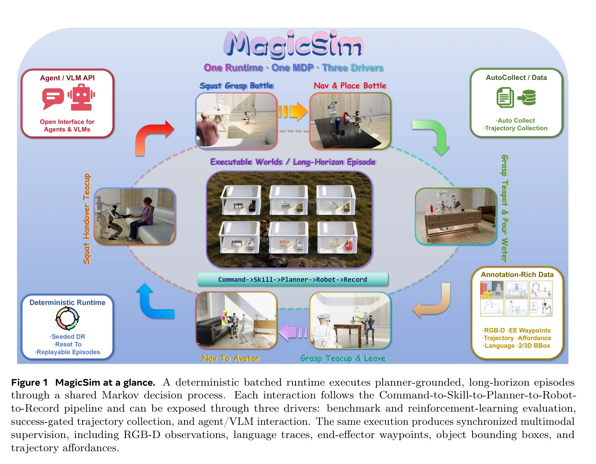
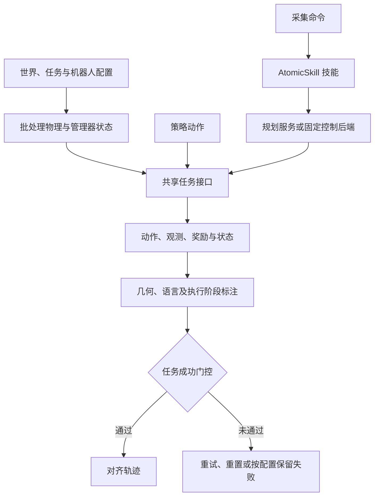
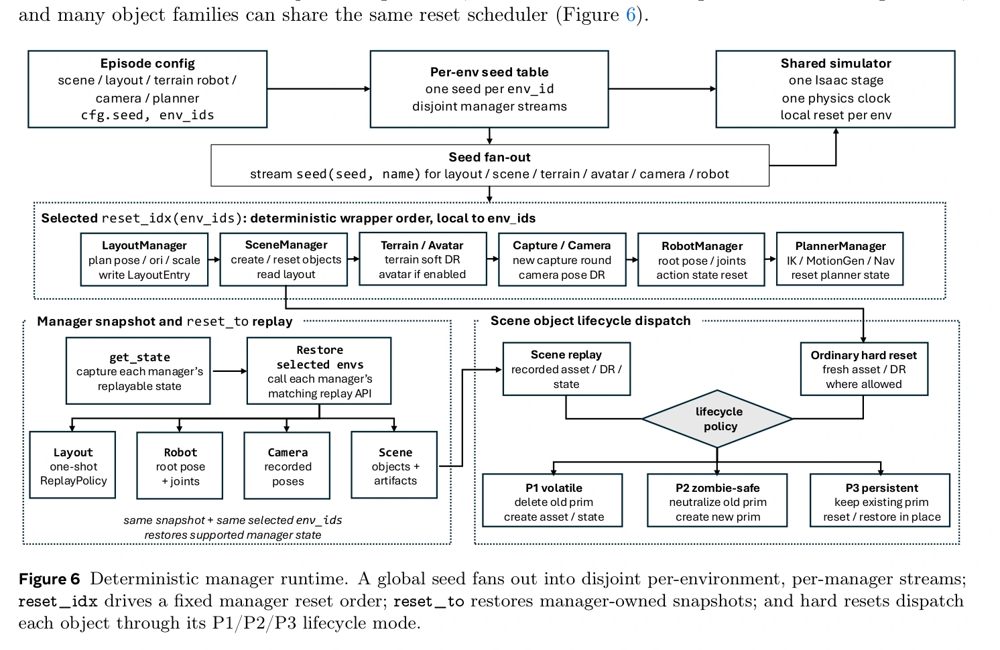
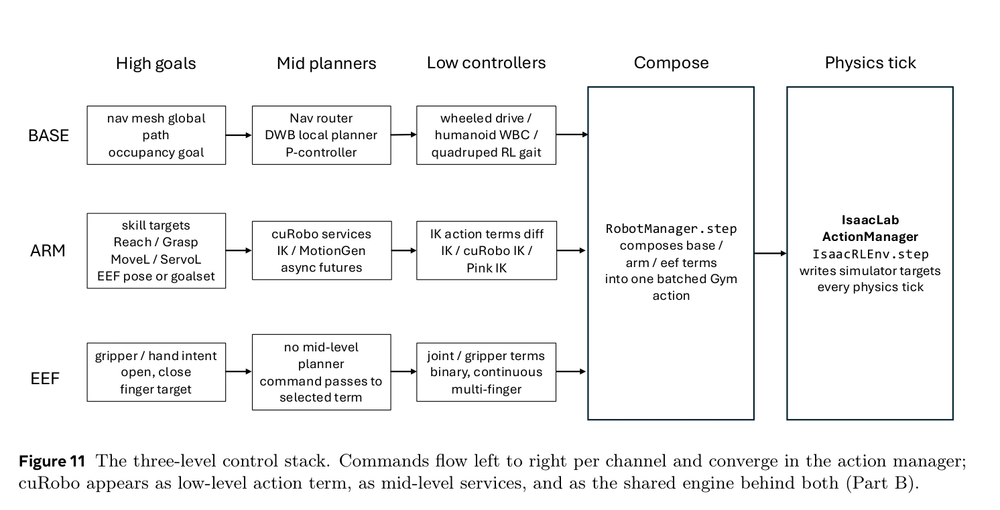
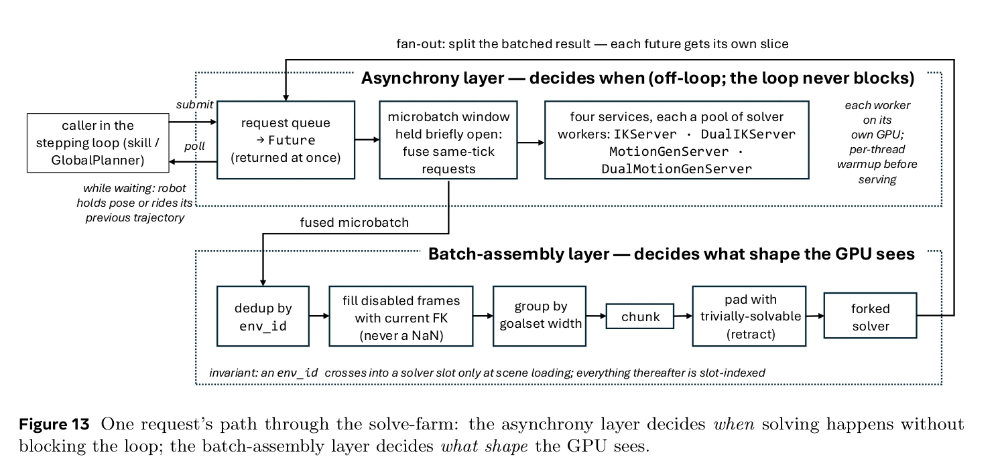
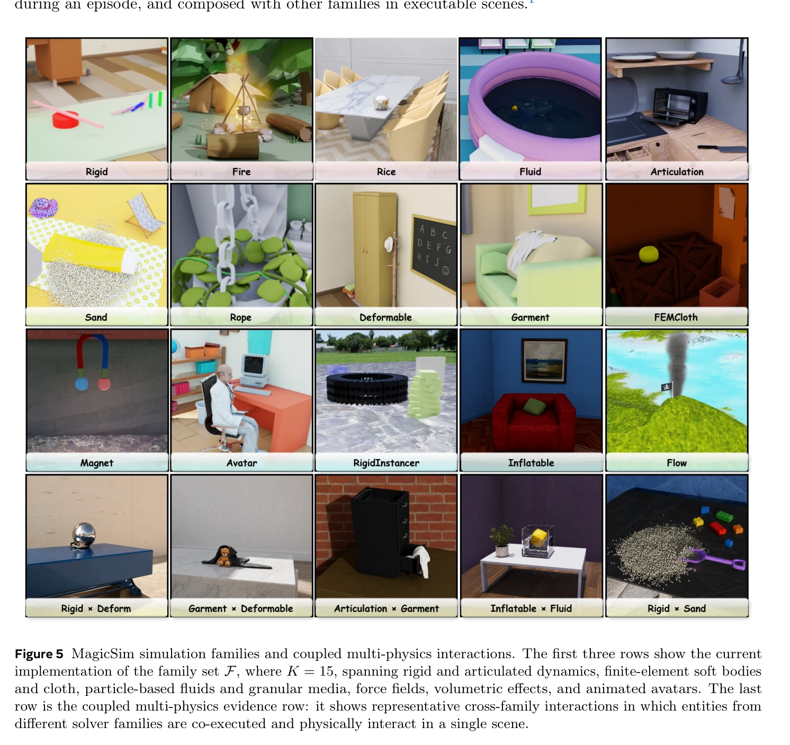

# MagicSim：让任务执行、规划、重放与数据记录共用一个回合

## 一屏概览

**研究问题。** 高层指令、低层控制、任务判定和合成数据往往分散在不同系统中。同一段机器人行为怎样既能执行，又能重放、评估，并留下对齐的动作、观察、技能和语言记录？

原文图 1；PDF 第 2 页。[查看原始来源](https://arxiv.org/pdf/2606.17511#page=2)

**核心贡献。** MagicSim 在 Isaac Sim/Isaac Lab 上构建管理器式批处理执行层：共享任务接口、局部重置与状态恢复、异步规划服务、AtomicSkill 技能、运行中标注和成功门控记录。它是系统基础设施，不是新物理求解器，也没有提出新的通用策略学习算法。[论文 §1–3](https://arxiv.org/pdf/2606.17511v1#page=1)

**结论范围。** 报告说明15种仿真族、约33种机器人、8个任务族及40多个具体任务的组织方式，展示多物理和长时域交互例子；没有给出本文统一协议下的逐任务成功率、异步吞吐消融或真机迁移成绩。低层强化学习接口与自动采集是当前路径，完整外部高层命令注入、InferenceRunner 和高层规划器闭环强化学习仍属计划/集成方向。[表3、§9.3、§12.3](https://arxiv.org/pdf/2606.17511v1#page=8)

本页依据 `raw/magicsim-a-unified-infrastructure-for-executable-embodied-interaction.pdf`，arXiv:2606.17511v1，2026-06-16，完整阅读60页含扩展相关工作及参考文献。以下接口与状态描述均限定于此报告版本。

## 系统主线：世界、任务与驱动器

底层 Env-Core 负责世界状态、机器人、传感器与物理步进；`TaskBaseEnv`封装`SyncRobotEnv`，定义策略观测、特权观测、奖励、终止、截断和成功条件。动作空间由`RobotManager`根据机器人构型组合。**同一个任务**可以由策略直接驱动，或由自动采集层通过技能驱动；**不同任务**仍然是不同 MDP，只共享接口契约。共享基础见 [[MarkovDecisionProcesses|马尔可夫决策过程]]。[§3.3–3.4、§9.1、表17](https://arxiv.org/pdf/2606.17511v1#page=7)

```mermaid
flowchart TD
    W[世界、任务与机器人配置] --> E[批处理物理与管理器状态]
    E --> T[共享任务接口]
    R[策略动作] --> T
    C[采集命令] --> S[AtomicSkill 技能]
    S --> P[规划服务或固定控制后端]
    P --> T
    T --> O[动作、观测、奖励与状态]
    O --> A[几何、语言及执行阶段标注]
    A --> G{任务成功门控}
    G -->|通过| D[对齐轨迹]
    G -->|未通过| F[重试、重置或按配置保留失败]
```

图表示论文当前策略与采集路径的关系；完整外部高层智能体接口另有开发状态限制。状态恢复不必经过技能层，计划中的推理/重放驱动器也将直接使用机器人动作空间。图中的失败保存是§13.1.2提到的可选机制，默认采集仍清除失败或截断缓冲。

## 可重放批处理怎样实现

### 管理器拥有状态，逻辑身份独立于后端路径

场景、布局、地形、机器人、规划器、相机等管理器各自拥有状态，并按固定顺序执行重置：先决定布局，再建立/恢复对象及其他组件。操作指定`env_ids`，允许一个子环境重置、其他环境继续运行。对象以“环境编号、逻辑类别、实例编号”寻址，USD 图元路径只是后端句柄；重新实例化不应改变任务与标注引用的对象身份。[§5.2–5.3、图6](https://arxiv.org/pdf/2606.17511v1#page=16)

原文图 6；PDF 第 16 页。[查看原始来源](https://arxiv.org/pdf/2606.17511#page=16)

全局种子分出各环境、各管理器的随机流；`get_state`与`reset_to`记录和恢复受支持的管理器初始状态。论文将确定性写成状态所有权、顺序和随机流隔离契约。**我们的解释：** 这比只存一个种子更可审计，但不等于已证明 GPU 求解、光线追踪和跨版本运行逐位一致；同一管理器内任意两个随机参数是否完全独立，也不能仅由“管理器流分离”推出。[§5.4](https://arxiv.org/pdf/2606.17511v1#page=19)

后端运行期间能否增删对象决定三种重置方式：

| 生命周期 | 后端能力 | 重置行为及限制 |
| --- | --- | --- |
| P1 | 可动态导入、删除 | 删除旧图元，创建新对象，可以换资产 |
| P2 | 可导入、不可删除 | 旧图元关闭重力与碰撞、隐藏并移开，再建新路径；需要稳定逻辑身份 |
| P3 | 不可导入、不可删除 | 启动前创建，随后原位恢复；不能靠重放替换成另一资产 |

地形作为锁定载体，重置主要改变可变外观，不是第四种硬重置模式。[§5.5](https://arxiv.org/pdf/2606.17511v1#page=19)

### 物理步同步，技能进度异步

所有子环境共用一次物理步进，但分别处于等待规划、执行动作、重试、成功记录或重置阶段。若按技能阶段设全批次屏障，每阶段耗时受最慢环境支配；MagicSim 让每环境独立推进状态，仅在物理步处同步。这是结构上的效率理由，报告没有提供该设计的定量加速消融。[§3.5、§11.1–11.2](https://arxiv.org/pdf/2606.17511v1#page=8)

## 控制、技能与规划如何接上物理

### 机器人通道与规划层次

不同机器人组合`base`、`arm`、`eef`三类动作通道。底盘通道可由轮式运动学或学习步态实现；机械臂可用微分 IK、cuRobo IK、Pink IK 等；末端执行器可为二值夹爪或多指关节目标。逆运动学（IK）根据末端目标反求满足机器人几何关系的关节配置；它与决定下一步任务目标是不同层的问题。相同通道名提供统一软件入口，不保证不同机器人的动力学、带宽或可达集相同。[§6.1–6.5、图11](https://arxiv.org/pdf/2606.17511v1#page=21)

原文图 11；PDF 第 23 页。[查看原始来源](https://arxiv.org/pdf/2606.17511#page=23)

规划要区分层次：低层 cuRobo 动作项检查自碰撞和关节限制；中层服务再读取每环境的场景障碍。导航使用全局导航网格给路线，运行时占据栅格提供局部障碍代价，动态窗口方法滚动候选速度并选择较合适动作。不能把低层 IK 求解成功直接称为全场景无碰撞。

### 异步微批规划服务

技能提交 IK 或轨迹规划请求，立即得到异步结果句柄（future）；等待期间机器人保持姿态或继续已有轨迹，物理批次不阻塞。工作线程在自己的 GPU 上下文预热，短暂收集同一时刻到达的请求，再批量求解。[§6.7、图13](https://arxiv.org/pdf/2606.17511v1#page=24)

原文图 13；PDF 第 25 页。[查看原始来源](https://arxiv.org/pdf/2606.17511#page=25)

异构请求还要转换为固定张量形状：按环境去重、用当前正运动学填充未启用工具帧、按候选目标数量分组、分块并填充简单可解项，最终把结果切回各 future。多工具帧配对选择让双臂目标作为一对共同验证，而非分别找到不可同时实现的解。论文表7明确这些能力来自其 cuRobo 分支，不能当作所有上游版本的默认行为。[§6.6–6.8](https://arxiv.org/pdf/2606.17511v1#page=23)

### AtomicSkill 固定哪些决策

高层选择命令或技能；技能执行器负责阶段、超时、重试、目标与状态传播。规划型技能从当前场景构造接触点、抓取姿态、候选集和成功判据，经`MoveL`、`ServoL`、`NavTo`等原语变成机器人动作。失败可依次尝试规划重试、替代候选、接触重采样和技能重试。物体成功状态必须来自真实步进后的任务谓词，不能靠瞬时编辑物体位姿冒充完成。[§10.1–10.5](https://arxiv.org/pdf/2606.17511v1#page=40)

所有技能不必共用算法：几何操作可用规划，灵巧手可用固定强化学习策略，接触推动可用 [[ModelPredictiveControl|模型预测控制（MPC）]]，简单行为可用脚本。**跨环境批量运动求解只针对规划后端；论文明确 MPC 逐环境运行。** 连续长任务由同一世界中的命令序列构成，每个成功命令可独立保存，并保留回合—命令—技能—后端层次；因此保存一个成功段，不等于整条长任务最后成功。

### 沿一次“抓住并移动物体”理解模块分工

以下是对§8.4、§10–11的**教学串联**，不声称它是作者新增的成功率实验。高层命令提供目标物体和使用哪只手；规划型 AtomicSkill 从当前对象位姿及候选动作库构造多个抓取目标，交给 IK／运动规划服务选择当前机器人可行的一项。候选库给可能性，当前场景中的碰撞和机器人构型决定哪项能执行。

| 阶段 | 消费什么 | 产生什么 |
| --- | --- | --- |
| 命令实例化 | 任务目标、对象逻辑身份、机器人／手选择 | 一次技能调用及参数 |
| 技能编译 | 实时场景状态、抓取候选与阶段门限 | 目标集合、规划原语和成功／失败判据 |
| 异步规划 | 关节起点、目标集合、当前环境障碍 | future，完成后返回轨迹或失败类型 |
| 机器人执行 | 轨迹中的参考目标、夹爪／手动作 | 物理更新后的机器人和对象状态 |
| 技能复查 | 接触、保持、对象目标状态、超时 | 继续下一阶段、重试或终止 |
| 记录 | 同一回合的状态、动作、阶段和标注 | 可追溯的命令段，成功时按门控写出 |

如果环境0正在等规划、环境1已经得到动作，环境1可以继续走其技能状态，环境0则保持姿态或沿已有轨迹走；二者仍在同一个物理步屏障前汇合。规划服务另把同类请求收成微批。图13中“异步层”解决何时计算，“批量组装层”解决张量怎样拼齐；这两件事需要分别成立，单纯放进线程并不能处理不同目标数的请求。[§6.7、图13](https://arxiv.org/pdf/2606.17511v1#page=25)

若抓取不稳，执行器根据失败类型改目标或重试；后续放置命令读取的是抓取之后的真实世界状态。技能因此是在线构造目标与验证过程，不是复制一条固定示范，也不等于任意提示词都能发明新物理技能。训练／采集区别在于驱动来源：低层策略训练直接产生动作并更新参数，自动采集使用已经固定的规划、MPC、脚本或技能策略；学习策略作为技能后端和学习高层命令选择是两个不同层级。[§10.1–10.6](https://arxiv.org/pdf/2606.17511v1#page=40)

## 多物理与传感器的实际含义

15种仿真族包括刚体、关节、FEM 软体、布料、流体、颗粒、绳索、磁力、火焰/流动效果和动画人物等。必须区分同场运行与物理双向耦合：图5展示五类代表性接触组合，但火焰、流动效果和动画人物通常只是共同显示/执行的上下文，并非任意对象间都有准确反作用力。§14明确薄壳、复合材料、粒子与跨求解器接触仍可能穿透或依赖参数调节。[§4.3–4.5、表6、§14.1](https://arxiv.org/pdf/2606.17511v1#page=12)

原文图 5；PDF 第 13 页。[查看原始来源](https://arxiv.org/pdf/2606.17511#page=13)

触觉后端先回答采样点是否接触、深度和方向，再生成压力、形变或图像。平面传感器可用 SDF 查询；曲面指尖沿各触觉采样点自己的法线投射射线，避免把物体法线误当传感器压缩方向。正文将实时路径定位为几何接触加转导，没有宣称在主循环里完整求解弹性体 FEM。动画人物由动画图/IK 驱动，与受物理控制的人形机器人不同。[§6.10、§7.3–7.4](https://arxiv.org/pdf/2606.17511v1#page=26)

## 数据为什么不只是图像

离线资产标注保存部件、关键点、功能先验以及经物理测试的候选动作库；运行标注保存当前规划器选中了什么、机器人实际执行了什么。一个候选条目包含技能、对象、锚点、功能、目标、参数、可选轨迹、验证记录及多样性描述。技能先从库取多个候选，再按当前机器人和布局求解，候选可行性不会脱离当前场景自动成立。[§8.1–8.4、式(1)–(2)、表13](https://arxiv.org/pdf/2606.17511v1#page=31)

运行中标注包含相机数据、末端轨迹、技能目标框、规划目标接触点与姿态，以及三层语言：L1描述场景，L2描述实例化后的任务，L3描述技能/规划阶段变化。语言由管理器事实加模板生成，不在每步重新调用视觉语言模型猜图。**原生目标框和可供性投影不做遮挡测试**，属于执行目标标注，不能直接作为“可见目标检测真值”。[§8.5–8.8、表15–16](https://arxiv.org/pdf/2606.17511v1#page=34)

默认只有成功记录写入磁盘。用**我们的统计概括**，设 $\tau$ 为尝试轨迹、$Y$ 为成功状态，采集数据接近：

$$
p_D(\tau)=p(\tau\mid Y=\mathrm{success}).
$$

它是经过筛选的示范分布，不是所有尝试的分布。成功轨迹可以含重试恢复，§13.1.2还描述可选失败保存；报告未详细给出该选项的覆盖与统计。研究失败恢复时应区分成功段内的重试、最终失败、超时和被丢弃记录，不能从默认数据集推断总体成功率。[§3.6、§10.5、§13.1.2、§14.2](https://arxiv.org/pdf/2606.17511v1#page=9)

## 证据账：哪些是实现说明，哪些还不是实验结论

| 主张 | 原文证据 | 证据边界 |
| --- | --- | --- |
| 多物理、多机器人与任务覆盖 | 表5–6、图5、§6.1、表18：15仿真族、约33机器人、8任务族、40多任务 | 能力清单和示例；未证明所有组合稳定或准确 |
| 异步规划提高利用率 | §6.7图13、§11.2的等待分析 | 有机制说明；本版无吞吐、等待时间分布或同步对照消融 |
| 一任务多驱动 | 表3、§9.3、表20 | 当前低层策略与 AutoCollect 可用；InferenceRunner 仍计划中 |
| 大规模动作标注 | §8、表12：17005资产；平均2315原候选，经约束、可行性、物理过滤后538保留 | 引用配套 AnnotateAnything；保留率23.2%，物理验证率26.6%；不是 MagicSim 总体采集成功率 |
| 闭环高层智能体训练 | §12.3及§13.3 | 外部命令注入和高层强化学习仍集成方向；没有本文训练成绩 |
| 仿真或真机策略性能 | §9.4称成绩另行报告，§14讨论局限 | 本地完整60页未给统一任务成绩表或真机验证，不能补写排行榜 |

17005资产与约 $10^8$ 条标注是论文对配套工作的汇总；参考文献62写明配套论文尚在审稿、引用待更新。本轮未独立收录该配套来源，故这些数字只证明本篇的报告内容，不构成第二份独立验证。

## 我们的判断

MagicSim 最清楚的贡献是统一回合中的因果记录：初态、动作、技能阶段、规划结果、任务状态和数据提交相互对应。这对 [[RoboticsSimulationInfrastructure|机器人仿真基础设施]] 有借鉴价值，也说明为什么 [[SimulationReady3DWorldGeneration|世界生成]] 完成后仍需要执行、判定和记录层。

但软件接口统一解决的是系统组合，不自动解决 [[ContactModelsInRobotics|接触物理]] 的准确性、[[TaskGeneralistPolicyEvaluation|评测有效性]] 或 [[SimulationRealityGap|现实迁移]]。固定技能词表限制行为覆盖，成功筛选影响数据分布；共享状态与种子需要实际重放误差和失败统计来验证。与 [[HeterogeneousRobotRLTraining|异构 RL 训练]] 相比，这里的主要异步对象是单仿真批次中的技能与规划请求，不能直接等同于采集器和学习器之间的异步。

原 [[ExecutableEmbodiedInteractionInfrastructure|可执行具身交互基础设施]] 页中的论文专属机制已在本页完整解释；[[AgenticSceneTaskGeneration|Agentic Scene Generation]] 保留跨系统通用部分。

## 研究归属

[[topics/assets-and-world-generation|3D 资产与场景]] · [[topics/simulation-ready-worlds|Simulation-ready Worlds]]。
