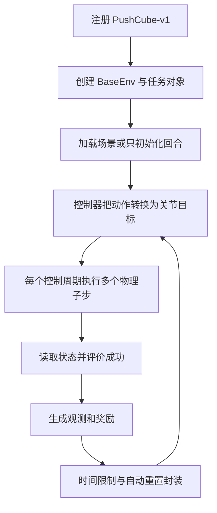

## 用途与本次核查范围

ManiSkill 是基于 SAPIEN 的机器人仿真与学习框架。本页沿固定提交 `ea2e7faf6b37742e0147147ad125b6d114722698` 的 **PushCube-v1 环境**追踪一次重置和动作执行：任务决定对象、目标与成功条件，基类负责仿真和观测，控制器解释动作，封装层处理时间限制与自动重置。

既有官方 README 的 GPU 仿真、并行渲染和学习基线是项目能力说明；其中 RTX 4090 上 30,000+ FPS 的数字未经本次复现，不能据此推断某个视觉任务的完整策略训练速度。本轮阅读官方 Python 实现，没有审计 PhysX 求解器或全部任务。

## 一条具体执行链

这是依据下列源码重绘的教学图。是否渲染、是否自动重置，均由所用观测模式和封装决定。

### 1. 任务注册与场景生命周期

`@register_env("PushCube-v1", max_episode_steps=50)` 同时加入 ManiSkill 注册表和 Gymnasium 注册。注册器附加自己的 `TimeLimitWrapper`，使截断标志仍是逐环境 Torch 张量。`BaseEnv` 的 `sim_backend=auto` 在单环境时选 CPU，多环境时选 CUDA；CPU 后端不接受同进程 `num_envs>1`，其报错提示另用多进程。这个分支不能概括成“所有模式都在 GPU 上”。（`registration.py`；`sapien_env.py:192–346`）

`_reconfigure` 重建场景、机器人、物体与传感器；普通 `reset` 主要清速度、重置回合状态与控制器，可以通过 `env_idx` 只初始化部分环境。部分重置期间，内部写入受 `scene._reset_mask` 限制，任务生成的张量首维是本次重置数。代码拒绝在只重置部分环境时重建整个场景；资产结构变化和回合位姿变化是两种不同生命周期。（`sapien_env.py:725–760、857–979`）

PushCube 加载桌面、动态方块和无碰撞目标标记。重置时将方块 $x,y$ 均匀放在 $[-0.1,0.1]$ m 范围内，目标在它前方 $0.1+\texttt{goal\_radius}=0.2$ m，目标半径为 0.1 m。目标标记是可视化几何，不参与接触。状态观测含目标位置和物体位姿；视觉模式不直接从 `_get_obs_extra` 暴露这些真值，而保留末端位姿等接口定义的量。（`push_cube.py:_load_scene/_initialize_episode/_get_obs_extra`）

### 2. 关节位置动作不是直接力矩

以已核查的 `PDJointPosController` 为例，动作预处理后形成目标关节位置 $q^*$。绝对位置模式直接采用动作；增量模式可相对当前 $q$，或相对上一次目标累加：

$$
q^*\leftarrow q+a\quad\text{或}\quad q^*\leftarrow q^*+a.
$$

这里 $a$ 指预处理后的物理量，不直接等同于外部归一化动作。控制器向关节设置刚度、阻尼和力上限，再把位置目标交给仿真驱动。若启用插值，一个控制周期的 $K$ 个物理子步使用 $q_j^*=q_0+(j/K)(q^*-q_0)$。本页仅核查这种关节位置控制器，不能据此断言 PushCube 所有控制模式都用它，更不能把末端位置动作当作同一接口。（`pd_joint_pos.py:set_action/before_simulation_step`）

**教学例子。** 若当前关节角为 0.2 rad、上一目标为 0.3 rad，预处理后的增量为 0.1 rad，则两种增量模式给出 0.3 和 0.4 rad。动作数值相同却有不同闭环含义，比较策略时必须固定控制模式。

### 3. 物理、观察和任务结果的顺序

`BaseEnv` 要求仿真频率可被控制频率整除。一次 `step` 先交动作给控制器，执行 $K=f_{\rm sim}/f_{\rm control}$ 次 `scene.step`，取回 GPU 状态后调用 `evaluate`，再生成观测和奖励。成功或失败产生 `terminated`；基类返回的 `truncated` 先全为假，由时间限制封装依据累计控制步数补上。（`sapien_env.py:1042–1168`；`registration.py:TimeLimitWrapper`）

视觉观测额外执行隐藏辅助物体、更新渲染场景、捕获相机与取出所需纹理。已读代码在 CUDA 渲染后显式同步，注释说明用于避免后续 PhysX 调度受影响。因此状态仿真、视觉采集和完整训练的计时范围必须区分。（`sapien_env.py:501–636`）

### 4. 成功条件与塑形奖励分开

PushCube 的成功布尔量要求方块与目标的水平距离小于 0.1 m，且方块中心高度小于 $0.02+0.005$ m。奖励还鼓励末端先到方块后侧，再推动方块接近目标。令 $d_r$ 为末端到理想推动位置的距离、$d_g$ 为方块到目标的水平距离、$d_z=|z-0.02|$，定义 $r_r=1-\tanh(5d_r)$、$r_g=1-\tanh(5d_g)$、$r_z=1-\tanh(5d_z)$，则非成功状态的实现为

$$
r=r_r+\mathbf1[d_r<0.01]r_g(1+r_z).
$$

这是把源码三项代数合并的教学写法。达到成功时直接覆盖为 **4**，归一化密集奖励再除以 4。邻近注释仍称最大值为 3，与实际赋值不一致；本页以该提交执行语句为准。高塑形奖励与满足成功条件不应混为同一指标。（`push_cube.py:evaluate/compute_dense_reward/compute_normalized_dense_reward`）

### 5. 自动重置后的观测属于哪个回合

`ManiSkillVectorEnv` 可在同一步自动重置结束的环境。它先复制结束时的观测和信息，重置对应子集，再将旧值放进 `final_observation`、`final_info`，用掩码标明有效行。返回主观测中的结束行已经是新回合初态，学习器若忽略末次观测，会把上一回合的转移错误连接到下一回合。

`ignore_terminations=True` 会清除成功／失败引起的终止，仍保留时间截断；记录器因此可以区分 `success_once` 与 `success_at_end`。前者是回合中曾经成功，后者是结束时仍成功，不能互换。（`vector/wrappers/gymnasium.py`）

## 证据边界与关联

本次静态阅读说明环境接口与数据流如何实现，不证明所有任务的正确性、真实迁移可靠性或特定速度。未执行安装、仿真或训练，未核查所有机器人控制器、物理引擎和渲染器内部。任务基准应同时记录观测、控制模式、奖励、终止封装、种子与资产版本。

与 [[HeterogeneousRobotRLTraining|异构训练]] 对照时，应比较包含观察与奖励的实际循环；基础设施层次见 [[RoboticsSimulationInfrastructure|机器人仿真基础设施]]。研究问题统一见所属专题。

## 固定版本证据

| 固定提交中的文件 | 本轮静态阅读范围 | 本地不可变快照 |
| --- | --- | --- |
| [`mani_skill/envs/sapien_env.py`](https://github.com/haosulab/ManiSkill/blob/ea2e7faf6b37742e0147147ad125b6d114722698/mani_skill/envs/sapien_env.py) | 192–346、501–636、648–760、857–979、1018–1168 | `raw/mani-mani-skill-envs-sapien-env-2026-10-04-459196c27576.py` |
| [`mani_skill/envs/tasks/tabletop/push_cube.py`](https://github.com/haosulab/ManiSkill/blob/ea2e7faf6b37742e0147147ad125b6d114722698/mani_skill/envs/tasks/tabletop/push_cube.py) | 全文 1–247 | `raw/mani-mani-skill-envs-tasks-tabletop-push-cube-2026-10-04-8ae1536c13fa.py` |
| [`mani_skill/agents/controllers/pd_joint_pos.py`](https://github.com/haosulab/ManiSkill/blob/ea2e7faf6b37742e0147147ad125b6d114722698/mani_skill/agents/controllers/pd_joint_pos.py) | 全文 1–259 | `raw/mani-mani-skill-agents-controllers-pd-joint-pos-2026-10-04-ce05feb05c43.py` |
| [`mani_skill/vector/wrappers/gymnasium.py`](https://github.com/haosulab/ManiSkill/blob/ea2e7faf6b37742e0147147ad125b6d114722698/mani_skill/vector/wrappers/gymnasium.py) | 全文 1–199 | `raw/mani-mani-skill-vector-wrappers-gymnasium-2026-10-04-66784e43ea5d.py` |
| [`mani_skill/utils/registration.py`](https://github.com/haosulab/ManiSkill/blob/ea2e7faf6b37742e0147147ad125b6d114722698/mani_skill/utils/registration.py) | 全文 1–261 | `raw/mani-mani-skill-utils-registration-2026-10-04-5e553c27ed82.py` |

## 研究归属

[[topics/robot-policy-learning|机器人策略学习]] · [[topics/physics-simulation|物理仿真]] · [[topics/robot-learning-systems|RL 训练系统]]。
