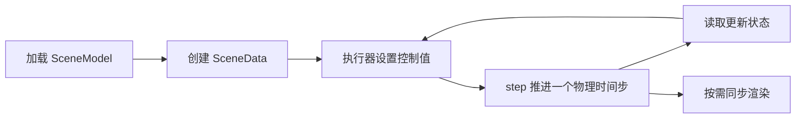

## 用途与证据范围

MotrixSim v0.2.0 官方文档把它定位为多体动力学与机器人仿真引擎，描述了 Rust CPU 实现、广义坐标模型及专有约束模型／求解器。本页补读快速入门、模型、动态数据和执行器四页，解释用户能操作的接口与调用顺序。**这是版本化官方文档解析，不是物理内核源码审计。** 文档仓库的公开示例和许可证也不能证明专有求解器内部已公开。

原首页快照仍保留，具体接口以本次另存的 v0.2.0 四页为依据。没有取得可审计的核心求解器实现，也不从“高性能”或“MJCF 兼容”推断特定接触算法、数值等价或基准胜负。

## 模型与状态为什么分开

`SceneModel` 描述几何、质量属性、关节连接、执行器和仿真设置；`SceneData` 保存随时间变化的关节位置、速度、物体位姿和传感器值。用户先用 `load_model` 读取 MJCF／URDF，或用 `load_mjcf_str` 从字符串建立模型，再由 `SceneData(model)` 创建状态实例。（官方 Model、Data 两页）

同一模型可创建多个独立状态：例如保留两份初态，在其上施加不同控制做对比。这是状态独立性接口，不自动证明这些实例采用多线程、SIMD 或批量并行求解。读取 `data.dof_pos_array` 或经 `model.get_joint(name)` 获得组件后访问状态，是两种访问方式；组件定义在模型中，当前数值取自传入的数据实例。

**文档中的时序提醒。** 直接改变状态后，需要相应运动学更新才能刷新派生量；Data 页的 `body.get_pose(data)` 示例注释还提示位姿可能滞后一帧。控制器不能未经检查就把所有不同访问方式的结果视为同一时刻。所读页面未完整给出所有派生状态的刷新契约。

## 一次控制步怎样执行

依据官方快速入门和执行器示例，可将流程概括为：

这是教学重绘。`model.get_actuator(name)` 按名称或索引取得执行器，`actuator.set_ctrl(data, value)` 把控制值写到选定状态，再由 `step(model, data)` 推进。文档列出 Motor、Position、Velocity、General 四种类型；同一个数值的意义由模型中所选执行器决定，不能一律当成关节力矩。General 的部分属性明确尚不支持。（官方 Actuators 页）

渲染使用 `RenderApp`：先 `launch(model)` 建立显示，再 `sync(data)` 同步物理状态。文档明确允许多个物理步对应一次渲染。快速入门中的 `time.sleep(model.options.timestep)` 只是示例对墙钟循环的节奏控制；由 `step` 调用次数和模型时间步决定推进的仿真时间，休眠本身不调用物理积分。

**教学例子。** 若模型时间步设为 0.002 s，连续做 10 次 `step` 对应 0.02 s 仿真时间；可以只同步一次画面。它不保证这段计算恰好花 0.02 s 墙钟时间，也没有规定 RL 策略必须每一物理步重新出动作。后两者由上层控制循环决定。

## 使用这些资料时要保留的限制

首页的 MJCF 高兼容性不是逐字段一致性证明；执行器页已经给出 General 属性的限制。迁移模型时需要针对所用元素与参数再读支持表，并做行为验证，不能只验证文件成功加载。本文尚未完整读取 MJCF 支持表，不补写“全部支持”的结论。

快速入门正文存在内部不一致：代码与路径使用 Spot、循环为 `while True`，解释段落却提 Go1 和 1000 次步进。本页只依据实际展示的调用序列，不把两段混成一份可复现程序。未安装 SDK 或运行示例，未检验状态数组所有权、线程安全、批量吞吐或接触精度。

[[unilab-repository|UniLab 实现]]将该引擎置于 CPU 仿真后端位置，但不因此揭示其专有求解器。调度机制见 [[HeterogeneousRobotRLTraining|异构机器人强化学习训练]]，物理真实性的独立问题见 [[SimulationRealityGap|仿真—现实差距]]。

## 已读版本化材料

| 官方页面 | 本轮读取范围 | 新增原始快照 |
| --- | --- | --- |
| [hello](https://motrixsim.readthedocs.io/en/v0.2.0/user_guide/getting_started/hello_motrixsim.html) | 正文与全部示例 | `raw/motrixsim-v020-hello-2026-10-04-05fca5e07c64.html` |
| [scene-model](https://motrixsim.readthedocs.io/en/v0.2.0/user_guide/main_function/scene_model.html) | 正文与全部示例 | `raw/motrixsim-v020-scene-model-2026-10-04-85c130e01e5a.html` |
| [scene-data](https://motrixsim.readthedocs.io/en/v0.2.0/user_guide/main_function/scene_data.html) | 正文与全部示例 | `raw/motrixsim-v020-scene-data-2026-10-04-9a5cb93890b4.html` |
| [actuator](https://motrixsim.readthedocs.io/en/v0.2.0/user_guide/kinematics/actuator.html) | 正文与全部示例 | `raw/motrixsim-v020-actuator-2026-10-04-83c0e020e1ef.html` |

四个 HTML 快照均有同名 `graph/extracts/*.md` 阅读缓存；归档日期为 2026-10-04，页面所属版本为 v0.2.0，具体发布日期未获证实。

## 研究归属

[[topics/robot-policy-learning|机器人策略学习]] · [[topics/physics-simulation|物理仿真]] · [[topics/robot-learning-systems|训练系统怎样提高有效学习效率]]。
