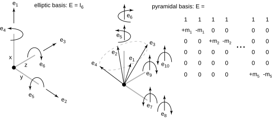
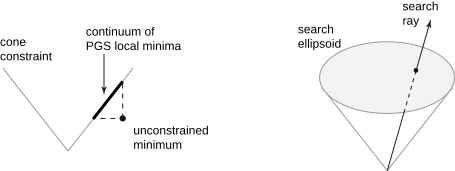
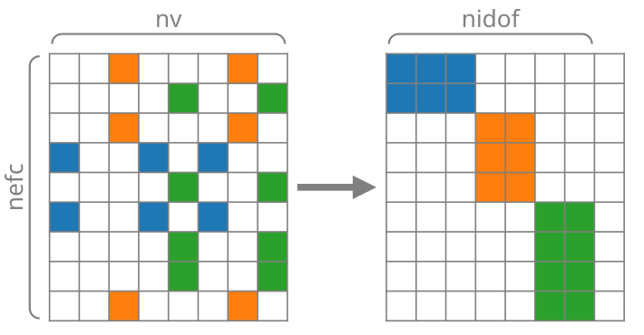
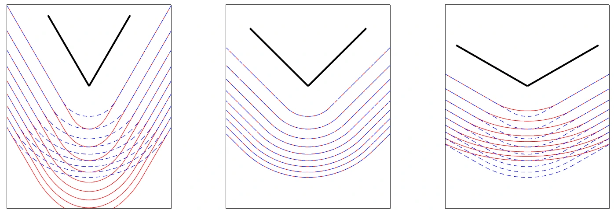
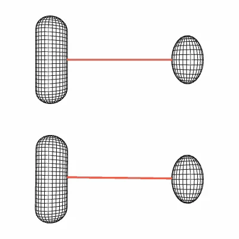

## 摘要

MuJoCo 官方计算章从 $M\dot v+c=\tau+J^Tf$ 连接执行器、连续动力学、柔性约束、接触求解、积分及仿真数据一致性。本轮完整阅读固定 3.8.0 文档，保留原来源页 ID；机制分别整理到 [[RobotRigidBodyDynamics|刚体动力学]]、[[SimulationTimeStepping|步长与控制频率]] 和 [[ContactSolvers|Contact Solvers]]。

接触坐标系与摩擦锥基底。[查看原始来源](https://mujoco.readthedocs.io/en/3.8.0/_images/contact_frame.svg)

## 核心主张

- 广义位置与速度可能不同维：球关节和自由关节以四元数表示姿态，而角速度只有三维；不能直接做普通数组差分与加法。
- 执行器包含传动、可选内部状态与力生成。`ctrl` 可能是力、位置目标或速度目标；经传动映射才成为广义力。
- 软接触通过正则化的凸优化产生约束力；放松严格互补有其模型语义。精确求解一个模型不意味着它完全复现真实接触。
- `Euler`、`implicit`、`implicitfast` 与 `RK4` 有不同稳定性和代价；步长是否合适依赖模型，不能用一种积分器或一个固定值概括所有机器人。
- 碰撞对由宽相、刚体内包围盒树及过滤规则筛选；普通非凸网格在碰撞中用凸包表示，通常应分解成多个凸几何体。
- 原生 GJK/EPA 与旧 libccd/MPR 的距离查询和多接触点行为不同；单次多接触生成仅支持相应几何与接触边距条件。
- `mj_step` 推进状态后，部分派生量仍对应先前状态。保存全部积分状态、版本和体系结构，才可讨论确定性重放。

投影 Gauss–Seidel 求解的几何示意。[查看原始来源](https://mujoco.readthedocs.io/en/3.8.0/_images/gPGS.svg)

约束岛与稀疏矩阵分块。[查看原始来源](https://mujoco.readthedocs.io/en/3.8.0/_images/island.svg)

柔性接触的势能形状。[查看原始来源](https://mujoco.readthedocs.io/en/3.8.0/_images/softcontact.png)

凸体碰撞检测示意（动图）。[查看原始来源](https://mujoco.readthedocs.io/en/3.8.0/_images/ccd_light.gif)

## 版本刷新记录

旧快照保留在 `raw/mujoco-computation-collision-detection.html`，旧缓存为 `graph/extracts/mujoco-computation-collision-detection.md`；当时记录的地址是移动的 `stable` 碰撞章节。原文件实际包含完整计算章，因此此次扩展覆盖使用同一来源页，避免把同一文档计成第二份独立证据。

本轮新快照采用固定版本 URL。旧快照文字将自由刚体中点积分限定于 `implicitfast`；3.8.0 文档说明 `implicit` 与 `implicitfast` 均对符合条件的自由刚体应用中点积分。正文条件和配置须随版本读取，不能反推旧快照所用运行时版本，也不能把版本间开环轨迹差异都判成实现错误。

## 阅读边界

这是一份实现语义文档，性能和稳定性建议以 MuJoCo 内部模型为条件。它不证明其它引擎使用同样约束模型，也不提供真实硬件迁移成功率。文档未明示这份页面的发布日期，故 `source_date` 保留 `unknown`。

## 关联

[[sources/mujoco-overview|MuJoCo]]、[[RobotCoordinateFrames|坐标与位姿]]、[[RobotRigidBodyDynamics|动力学]]、[[SimulationTimeStepping|数值积分]]、[[CollisionGeometryForRobotSimulation|碰撞几何]]、[[ApproximateConvexDecomposition|凸分解]]、[[ContactModelsInRobotics|接触模型]]、[[RoboticsSimulationLoop|仿真循环]]、[[SimulationRealityGap|现实差距]]。

## 归档记录

规范网址、版本与获取日期见页首；本次原始文件的 SHA-256 为 `d67c4888c7756d8e82e027faf4976216639272eb5b2322a3b5f2ca3897947b93`，归档登记在 `graph/acquisitions.jsonl`。

## 研究归属

[[topics/physics-simulation|物理仿真]] · [[topics/evaluation-and-transfer|评测与 Sim-to-Real]] · [[topics/contact-modeling|接触建模]] · [[topics/collision-geometry|Collision Geometry]] · [[topics/simulation-transfer|Sim-to-Real]]。
