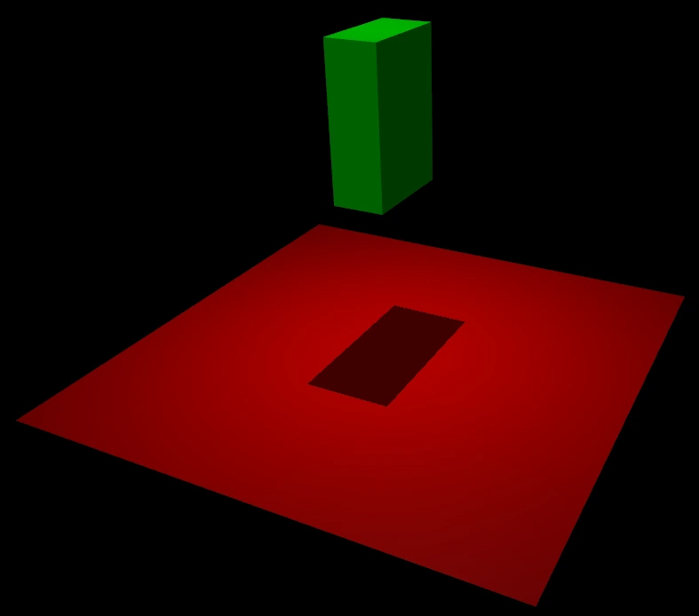
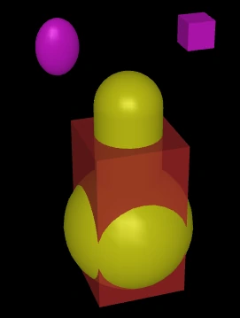

## 摘要

MuJoCo 官方总览把模型编译、运行状态、广义坐标、执行器、几何、传感器和接触放在同一计算框架中。此处归档的是 2026-09-30 获取的 `stable` 页面；具体行为应按文档与实际安装版本核对。

MuJoCo 最小场景。[查看原始来源](https://mujoco.readthedocs.io/en/stable/_images/hello.png)

## 核心主张

- `mjModel` 保存编译后的模型描述，`mjData` 保存时变状态与中间结果；`mj_step` 推进一个物理时间步。
- 关节位置与速度所在空间不同。自由关节使用 7 个位置数值与 6 个速度数值；关节数量不等于自由度数量。
- `body` 持有惯性和运动树关系，`geom` 描述外观与碰撞，`site` 标记传感器或机构上的参考位置。不能把三者互换。
- 执行器由传动、激活动力学与力生成组成；控制输入经执行器映射后才成为广义力。
- 接触采用软约束与凸优化表述。缓慢滑移可能来自模型柔顺性，而非摩擦系数不足或求解器未收敛。
- 仿真发散需要检查时间步、积分器和初始穿透；单位必须自洽，运行时角量使用弧度。

刚体、几何体与站点的关系。[查看原始来源](https://mujoco.readthedocs.io/en/stable/_images/bodygeomsite.png)

## 关键引文

> “Separation of model and data”

这条设计原则把静态模型与每个实例的动态状态分开。

## 关联

机制解释见 [[RoboticsSimulationLoop|机器人仿真循环]]。接触表述对照见 [[ContactComplementarity|接触互补]] 与 [[ContactSolvers|求解器]]；几何与惯性分工见 [[CollisionGeometryForRobotSimulation|碰撞几何]]。

## 开放问题

总览不替代计算章节、执行器参数参考或模型验证实验。当前后续重点是精确时间步语义、参数标定与引擎间动力学差异。

## 研究归属

[[topics/physics-simulation|物理仿真]] · [[topics/evaluation-and-transfer|评测与现实迁移]] · [[topics/contact-modeling|接触模型与求解怎样改变运动]] · [[topics/simulation-transfer|仿真策略怎样可靠迁移到现实]]。
