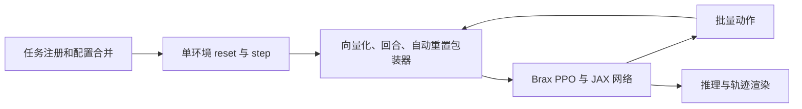

## 定位与阅读范围

MuJoCo Playground 提供以 MJX 为基础的机器人学习环境和训练入口，覆盖经典控制、移动、操作与视觉任务。固定提交支持 MJX 的 JAX 与 Warp 实现；`--impl warp` 选择物理执行实现，本页核查的训练入口仍然是 JAX/Brax PPO，并不会因此变成 PyTorch 训练。下面沿状态 Cartpole 的一次训练解释环境、包装器和训练器的分工；本次只做静态源码阅读，没有编译环境、训练或测量速度。

## 配置怎样进入训练

`train_jax_ppo.py` 先由任务注册模块加载环境配置，再选相应任务族的 PPO 配置，将用户明确设置的命令行参数覆盖进去；构造环境后，根据状态或视觉输入选择网络工厂，并将 `wrapper.wrap_for_brax_training` 传给外部 Brax 训练函数。训练完成后，入口构造推理函数，采样轨迹并可用 MuJoCo 渲染视频。（入口第 185–456 行）

配置优先级会影响复现。例如 Cartpole 类的默认物理实现为 `warp`，但这个训练入口的 `--impl` 默认值为 `jax`，会覆盖环境配置。PPO 时间步参数只在用户显式传入时覆盖，因此不能把命令行参数定义中的默认值直接当成有效训练预算；该提交状态 dm_control 配置给出 6,000 万训练步、2,048 个环境、每段展开 30 步、32 个小批次与每批 16 次更新。（入口第 220–290 行；`dm_control_suite_params.py` 第 1–82 行）

这是依据代码重画的流程；Brax 算法内部和具体设备性能未在本次核查。

## 显式状态如何推进

基础环境用结构化 `State` 保存物理数据、观测、奖励、结束标志、统计量与额外信息。一次 `step(state, action)` 返回新状态；`mjx_env.step()` 用 `lax.scan` 执行多个物理子步，每个子步将动作写入控制量，再调用 `mjx.step`。子步数由控制间隔除以物理步长后取整得到。（`mjx_env.py` 第 163–200、218–275 行）

状态 Cartpole 默认控制间隔和物理步长都是 0.01 s，回合配置长度为 1,000。观测为小车位置、摆角正余弦和两个速度；平衡初始化位于直立附近，摆起初始化位于下垂附近。密集奖励由直立、居中、小控制量和小摆角速度因子相乘。环境本体在状态分支主要检查 NaN，时间上限由外部回合包装器处理，因此单读 `cartpole.step()` 会漏掉完整的结束规则。（`cartpole.py` 第 32–213 行）

## 包装器不是可忽略的接口胶水

`wrap_for_brax_training()` 先向量化环境或构造带随机模型的向量化环境，再包回合长度与动作重复，最后包自动重置。自动重置默认 `full_reset=False`：首次 reset 缓存初始物理数据和观测，后续结束时把它们放回，而不是每次都重新调用随机初始化；一般 `info` 也不因此整体清空。启用完整重置时逻辑不同。训练数据的初始分布和记忆状态管理都受此选择影响。（`wrapper.py` 第 86–208 行）

域随机化包装器在构造时生成批量模型及其向量化轴，再对 reset/step 做 `vmap`；这段代码没有在每次回合重置时重新采样模型。任务注册器对 dm_control 任务返回的随机化函数为 `None`，不能因为套件支持随机化就把所有 Cartpole 实验描述为随机动力学训练。（包装器第 209–248 行；注册模块第 51–71 行）

## 视觉模式改变的不只是输入维度

Cartpole 视觉分支使用批量渲染得到 RGB，再转为灰度、平移像素范围并堆叠帧；代码还分别配置视觉奖励和位置／角度结束条件。因此视觉版和状态版并非只替换观测编码器的同一个任务。训练时批量图像渲染也不同于训练入口结束后用 MuJoCo 对轨迹渲染视频；后者不能证明前者的训练吞吐。（`cartpole.py` 第 69–139、194–348 行；`mjx_env.py` 第 320–413 行）

本页未继续核查批量渲染器内部、各机器人迁移配置与真机控制链路。与 [[mjlab-repository|mjlab]]、[[isaac-lab-repository|Isaac Lab]] 比较时，应先对齐动作时间、奖励、初始化与重置语义，再讨论 [[HeterogeneousRobotRLTraining|训练效率]]。README 的迁移能力主张需要另有任务和硬件实验证据。

## 固定版本与已读代码

原 README、提交快照与来源日期保留在页首。以下文件均完整阅读并另存不可变原文，未执行第三方脚本。正文行号均指此提交；本地清单同时登记 SHA-256。

| 官方文件（固定提交） | 本地原文快照 |
|---|---|
| [learning/train_jax_ppo.py](https://github.com/google-deepmind/mujoco_playground/blob/33f1b2843a7ec5537c4882177aa2a9f236e9b692/learning/train_jax_ppo.py)，1–568 行 | `raw/code-playground-learning-train-jax-ppo-py-2026-10-04-c082570f0e72.py` |
| [mujoco_playground/_src/mjx_env.py](https://github.com/google-deepmind/mujoco_playground/blob/33f1b2843a7ec5537c4882177aa2a9f236e9b692/mujoco_playground/_src/mjx_env.py)，1–413 行 | `raw/code-playground-mujoco-playground-src-mjx-env-py-2026-10-04-0f51d368c77e.py` |
| [mujoco_playground/_src/wrapper.py](https://github.com/google-deepmind/mujoco_playground/blob/33f1b2843a7ec5537c4882177aa2a9f236e9b692/mujoco_playground/_src/wrapper.py)，1–248 行 | `raw/code-playground-mujoco-playground-src-wrapper-py-2026-10-04-23c072737b98.py` |
| [mujoco_playground/_src/dm_control_suite/cartpole.py](https://github.com/google-deepmind/mujoco_playground/blob/33f1b2843a7ec5537c4882177aa2a9f236e9b692/mujoco_playground/_src/dm_control_suite/cartpole.py)，1–348 行 | `raw/code-playground-mujoco-playground-src-dm-control-suite-cartpole-py-2026-10-04-24983aeae334.py` |
| [mujoco_playground/_src/registry.py](https://github.com/google-deepmind/mujoco_playground/blob/33f1b2843a7ec5537c4882177aa2a9f236e9b692/mujoco_playground/_src/registry.py)，1–71 行 | `raw/code-playground-mujoco-playground-src-registry-py-2026-10-04-b23d5dd0d18d.py` |
| [mujoco_playground/config/dm_control_suite_params.py](https://github.com/google-deepmind/mujoco_playground/blob/33f1b2843a7ec5537c4882177aa2a9f236e9b692/mujoco_playground/config/dm_control_suite_params.py)，1–150 行 | `raw/code-playground-mujoco-playground-config-dm-control-suite-params-py-2026-10-04-ba246dffcc43.py` |

## 研究归属

[[topics/robot-policy-learning|机器人策略学习]] · [[topics/physics-simulation|物理仿真]] · [[topics/robot-learning-systems|训练系统怎样提高有效学习效率]]。
